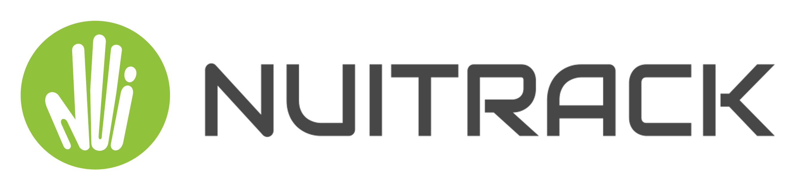

## What's New ?
- :white_check_mark: Oct'22 - 0.36.7 - [**Multisensor tracking**](/doc/Multiple_Depth_Sensors.md) :rocket:  
Nuitrack finally could work with [multiple depth sensors](/doc/Multiple_Depth_Sensors.md).  This opens up a huge opportunities like room-scale tracking with increased accuracy. Please stay tuned to get a firsthand experience of the coming **Nuitrack Holistic**.
- :white_check_mark: Sep'22 - 0.36.4 - **[Failure cases recorder](/doc/Failure_Case_Recorder.md)** :gear:  
Not satisfied with the tracking results? Nuitrack now helps to [report](/doc/Failure_Case_Recorder.md) failure cases to facilitate improvements of tracking engine. 
- :white_check_mark: Sep'22 - 0.36.2 - [**Nuitrack Daemon [Beta]**](/doc/Nuitrack_Daemon.md)  
Use Nuitrack in a language-agnostic way through REST API
- :white_check_mark: Aug'22 - 0.36.1 - [Person re-identification](/doc/Person_Reidentification.md)
- :white_check_mark: Jun'22 - 0.36.0 - Astra Pro+ supported
- :white_check_mark: May'22 - 0.35.15 - Official support for [Orbbec Astra+](https://youtu.be/NP5ayeqUr4I)
- :white_check_mark: Nov'21 - 0.35.12 - [Python API](/PythonNuitrack-beta)

*Coming soon*:
- :soon: Holistic skeletal tracking on multiple sensors
- :soon: Support for new Orbbec Persee+, Femto (W) devices
- :soon: TouchDesigner support (depth map and skeletons export)
- :soon: Major update on tracking accuracy

## What is Nuitrack™ SDK?

**Nuitrack™** is an ultimate 3D body tracking solution developed by **[3DiVi Inc](https://www.3divi.com/)**.

It enables skeletal tracking and body motion analytics applications for virtually any widespread:
- depth sensors (Orbbec Astra, Kinect v1/v2, [Kinect Azure](https://youtu.be/K7O-361UlfI), [Intel Realsense](https://youtu.be/gMPtV4NXtUo), Asus Xtion, LIPS, Structure Sensor, etc.)
- hardware platforms (x64, x86, ARMv7, ARMv8)
- OSes (Windows, Linux, Android, iOS)
- and development environments (C++, C#, [Python](/PythonNuitrack-beta), [Unity](/Unity3D), Unreal)

Inspired initially by Microsoft Kinect, **Nuitrack™**'s mission is to provide strong skeletal tracking baseline for the next generation of immersive and analytical applications beyond any specific platform or hardware. Think of it as a *"Kinect for anything"*.

With its performance and flexibility resulting from 10 years of development **Nuitrack™** is capable to support the wide range of applications:
- from a real-time gesture recognition on embedded platforms like [Raspberry Pi4](https://youtu.be/qyt4U7ZBj90)
- to a large-scale multisensor analytical systems (launched on 18-Cores workstation system)

Now it's all yours - try it, use it, challenge it!

## Key Features
After being launched with [any supported depth sensor](https://nuitrack.com/#sensors) Nuitrack is able to :
1. Interpret a depth map as [3D Point Cloud](https://youtu.be/nX7kLXv65kU)
2. Perform scene analysis, detect key elements like [Floor Plane](https://youtu.be/5ehEcfCIBAU) and [Background Objects](/doc/Nuitrack_AI.md#nuitrack-ai-object-detection)
3. Detect/track persons in the scene and provide [Pixel-perfect Masks](/doc/Unity_Segment.md) for each of them
4. Perform a highly-sophisticated [Full Body Skeletal Tracking (19 Joints)](https://youtu.be/-PSN1AWc5Ro) for each person. You can choose between two engines:
   - "classical" - fast, stable and lightweight, highly-optimized for embedded hardware and limited CPU usage
   - [AI](https://youtu.be/S8dkf2MEZeM) - new deep-learning based engine, which provides greater coverage for complex poses
5. Perform a basic [Facial Analysis](https://youtu.be/HOm0-7qL5hk) like age and emotion detection
6. Provide a [Hand Tracker](/doc/Unity_Gallery.md) and Gesture Recognition higher-level APIs for the development of gesture-based user interfaces

Essentially Nuitrack provides a **human-centric spatial understanding tool** for your applications to engage with a user in a natural and intelligent way.

## Application Areas
- Games and Training (Fitness, Dance Lessons)
- Medical Rehabilitation
- Smart Home
- Natural/Gesture-based User Interface (NUI)
- [Full Body Tracking for AR / VR](https://youtu.be/7JqtB6Dt_9c)
- Audience Analytics
- Robot Vision

## Try out Nuitrack with your sensor

It's as quick and simple as 1-2-3:
1. Download the **Nuitrack Runtime** package for your [Platform of choice](/Platforms)
2. Install it, in case of any issues please follow the [Installation Instructions](/doc/Install.md)
3. Just plug-in your sensor and launch Nuitrack executable from start menu
You will need [Trial or Commercial license](https://nuitrack.com/#pricing) that can be obtained from nuitrack.com

## Start development with Nuitrack

1. If you use Unity for development please download `Unity Package` and import it according to [this link](/Unity3D)

2. If you are C++/C#/Python developer - clone this repository to get a hands-on experience with a libraries and Nuitrack examples

If you have any questions, issues or feature ideas - feel free to engage with Nuitrack Team at our [Community Forum](https://community.nuitrack.com/).

## What’s included in the SDK:
| What | Description |
| --------- | ----------- | 
| **[Documentation](doc/readme.md)** | **Nuitrack** documentation ||
| **[Runtime Components](/Platforms)** | **Nuitrack Runtime** packages for all supported platforms ||
| **[C#/.NET and C++ API](https://download.3divi.com/Nuitrack/doc/annotated.html)** | It allows you to integrate **Nuitrack** with your **C#/C++** applications ||
| **[Python Wrapper [beta]](/PythonNuitrack-beta)** | **Nuitrack** supports **Python API** that allows you to integrate **Nuitrack** with your Python applications ||
| **[iOS [beta]](/iOS-beta)** | Get started developing for **iOS** with **Nuitrack** ||
| **[Code Samples](/Examples)** | These basic examples demonstrate how to use **Nuitrack SDK** |
| **[Unity Package](/doc/readme.md#unity-tutorials)** | This package allows you to easily integrate **Nuitrack SDK** into your Unity project |
| **[Unreal Engine Plugin](/doc/readme.md#unreal-engine-tutorials)** | This plugin allows you to develop applications with **UE 4.20** |
