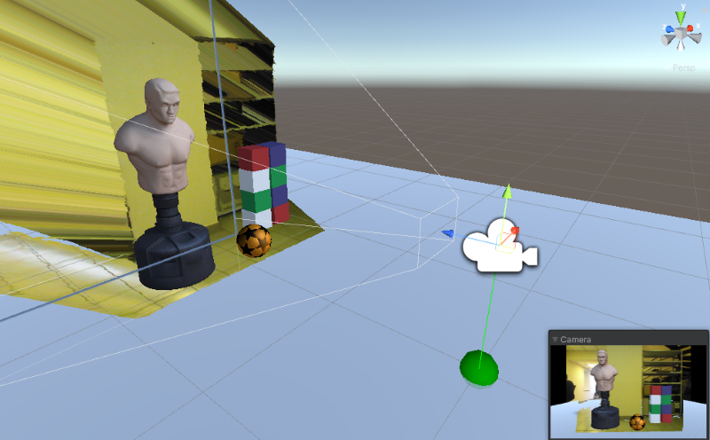

### Features

NuitrackSDK has a collection of components for development without writing additional code. These components can be used to solve such issues as the output of a color image from the sensor, the animation of your avatar and many more. The collection is to be supplemented and expanded in the future.

## NuitrackSDK Components

[TOC]

---

### Get started
To prepare the scene for using **Nuitrack**, click: **Main menu -> Nuitrack -> Prepare the scene**. As a result, the necessary components will be added to the scene. When you run the scene, **NuitrackScripts** will be automatically marked as **DontDestroyOnLoad**.

---

### Frame

Nuitrack provides access to 3 types of frames from the sensor: **color, depth** and **segment**.

#### FrameProvider

This component is used to get a **color image**, a **depth map**, or a **user segment** in the form of Unity textures.
The texture for further use can be obtained through the `onFrameUpdate` event handler.

 
<b>FrameProvider components with different FrameType</b> 

Frame types:
  * **Color** gets color image from the sensor   
  *  **Depth** gets a depth map from the sensor in the form of a texture. In additional settings you can set your own gradient for depth levels, otherwise the gradient is taken from _NuitrackScripts/FrameUtils/DepthToTexture_   
  * **Segment**  gets a user segment in the form of a texture. In the advanced settings you can specify whether you want to get segments of all or one user only, as well as to determine colors of the segments  

There are three types of textures available:
  * **RenderTexture** - The fastest for platforms with ComputeShader support. However, if you plan further image processing on the CPU, use `ToTexture2D` instead  
  * **Texture2D** -  The fastest for platforms without ComputeShader support. If you plan further image processing on the CPU, this method will be best suited  
  * **Texture** - You can choose the fastest method (**RenderTexture** or **Texture2D**) depending on the platform  

#### FrameMixer

A component designed for mixing two textures (the main texture and the mask) according to the selected algorithm.  
The texture for further use can be obtained through the `onFrameUpdate` event handler.

Mixing modes:
  * **Cut** cuts the image by mask, leaving only those pixels that are **not transparent** on the mask  
  * **ReverseCut** cuts the image by mask, leaving only those pixels that are **transparent** on the mask  
  * **Mul** multiplies the basic texture by the mask pixel by pixel  
  * **Mix** is an arithmetic mean of the colors of the main texture and mask pixel by pixel  

Input textures can be set either statically or via the `MainTexture(Texture texture)` and `MaskTexture(Texture texture)` methods. You can use this module in conjunction with **FrameProvider** by specifying these methods as handlers in the `onFrameUpdate` event, thereby forming an image processing pipeline.

 
<b>Example of using FrameMixer</b> 

#### UserCropper / FaceCropper

The component creates a BoundBox texture of the entire user / the user face from the input texture. The input texture can be the result from `FrameProvider` or any arbitrary texture passed to the `Crop Frame(Texture frame)` method.  

The target user can be obtained through **Current user tracker** or set by **ID**  

Output texture for further use can be obtained through the `onFrameUpdate` event handler.  
The aspect ratio of the output texture can be obtained using the `aspectRatioUpdate` event handler. This is convenient, for example, to control the **AspectRatioFitter** component.

#### NuitrackAspectRatioFitter

This is an analogue of **AspectRatioFitter**. The only difference is that the alignment of the aspect ratio of the **UI** element occurs according to the aspect ratio of the frame from the sensor (**rgb**, **depth** or **segment**).

---

### Sensor environment

To simplify the understanding of the transfer of the coordinate system of a real sensor to virtual ones, we recommend using **Transform**, which will act as the starting point of the sensor coordinate system.

#### SensorSpace

The component allows you to compare the space of a real sensor and a virtual (game camera object). 
The ratio of the field of view of the camera and its position relative to the floor is performed as with a real sensor. You can select the camera angle alignment and the floor alignment separately.
This means that virtual objects located at zero height in the space of the virtual sensor will lie in the same place where the real floor is located. 

 
<b>Example of alignment of the camera position on the real floor (the green sphere shows a point on the floor under the real sensor)</b> 

---

### Avatar

Avatars are game characters that repeat your movements, in 2D or 3D space.  

#### NuitrackAvatar

Avatar for 3D models. The component has the functions of auto-mapping the model and tools for editing the binding of joints to Transform, as well as the function of equalizing the length of bones, support for VR and safe grid scenarios. This component is suitable for most tasks, and is easy to configure.  

The target user can be obtained through **Current user tracker** or set by **ID**  

 
<b>Mapping example for UnityChan</b> 

If you want the avatar to use the specified **Transform** as the sensor coordinate system, you can set **[SensorSpace](#sensorspace)**. Then the zero point (the sensor position point) will be at the **Transform** position point. 

The auto-mapping function should work correctly for most models.  

>Note:  
Please note that due to the peculiarities of the Nuitrack skeleton, the **LeftCollar** and **RightCollar** are located at the same point and are practically one joint. For some models, you will need to manually add one **Collar** and assign shoulder and neck joints as children to it.

#### SkeletonAvatar

A component for displaying a 3D skeleton using primitives for joints and bones. 

#### UIAvatar

A component for displaying a 2D (UI) skeleton using primitives for joints and bones.  

---

### Poses

In this section you'll learn about poses and how to match a user's pose with a sample using NuitrackSDK, for example, in a yoga app.  

#### NuitrackPose

This is a pattern of the user's pose, described by the orientation of the joints and angles of tolerance. For each joint an orientation and an angle of tolerance are set, at which match is assumed to be achieved.  

To create a new pose, click: **Assets/Create/Nuitrack/Poses/Pose**  

Select the asset of the pose to view it through the viewer and customize it if necessary.  

 
<b>Example of setting up the shoulder joint in the viewer</b> 

The pose pattern is described by the joints of the arms, legs and lower back.  

You can enable or disable joints (disabled joints are not used in matching and are displayed in gray), set the orientation and tolerance angle directly from the editor.  

The pose can be:
* Absolute - the user must stand relative to the sensor as specified in the template.
* Relative - the orientation of the arms and legs is compared relative to the body, that is, the body can be rotated.

#### PoseDetector

The component is designed to call event handlers and check the correspondence of each user pose with each pose from the list.  

Match has a value from **0** - the pose does not completely correspond to the sample, to **1** - an exact correspondence with the specified tolerance angles.  

 
<b>Example of setting up the shoulder joint in the viewer</b> 

In the section for viewing the match of poses in the runtime mode, users who have achieved full match with the pose template are highlighted in green.  

The component has a wizard to create a pose template in runtime mode based on the pose of a real user. To create such pose template, just follow the wizard instructions.  

---

### Calibration

For some scenarios, you may need to ask the user to perform a calibration, for example by **T-pose**.
This can be useful if you want to align the pose of your game character with the skeleton or, for example, set the position of the game character at the starting point, regardless of where the user is relative to the sensor in the real world.

#### CalibrationHandler

CalibrationHandler is attached to the **[NuitrackScripts](#get-started)** prefab and resembles a simple version of **PoseDetector.** 
The user needs to stand in the target pose for a while to go through the calibration process.
This module checks that the user is in a given position (**[NuitrackPose](#nuitrackpose)**) and calls event handlers:
* onStart  
* onFail  
* onProgress(float progress) - value from 0 to 1
* onSuccess(Quaternion headRotation) - head rotation quaternion

You can set any pose for calibration, **T-Pose** is set by default.

#### NuitrackCalibrationRGB

For visual representation, use prefab **NuitrackSDK/NuitrackCalibrationRGB/CalibrationVisualization**.   

 
<b>Example of user calibration</b> 

For VR applications make it a child of the main camera and set **Position** and **Rotation** to **(0, 0, 0)**. The calibration window will be clearly visible to the user wherever he looks at. After calibration the window will be hidden until the next calibration starts.

---

### Safety

For any application it is necessary to ensure the user's safety. For example, for a VR application the user should realize when he leaves the game area, so as not to collide with objects in the real world.  

#### SafetyGrid

To display the sensor's field of view as a 3D grid, when the user approaches the edge of the field of vision, use the prefab **NuitrackSDK/SafetyGrid/Prefabs/SafetyGrid**.   

 
<b>Example of safety grid</b> 

Place the prefab on the scene and set the **Position** and **Rotation** to **(0, 0, 0)** in the sensor space.

For **[NuirtackAvatar](#nuitrackavatar)**, the option of automatically adding **SafetyGrid** is available when the **Need border grid** option is active.
