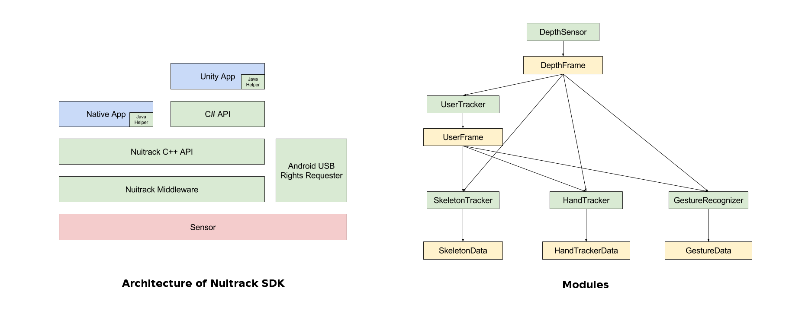

# Nuitrack SDK Architecture 

Nuitrack API is a native (C++) synchronous interface based on the
asynchronous middleware layer that conceals all the interactions with 3D
sensor and other devices, as well as with an operating system (Linux,
Android). As a result, the user only applies Nuitrack API for writing
cross-platform applications.

Nuitrack makes it possible to receive data from a 3D sensor to Android
without root rights required. The interaction with the Android OS occurs
through JNI.

The SDK contains a Nuitrack C\# wrapper, a plugin for Unity3D and a
plugin for Android devices.

