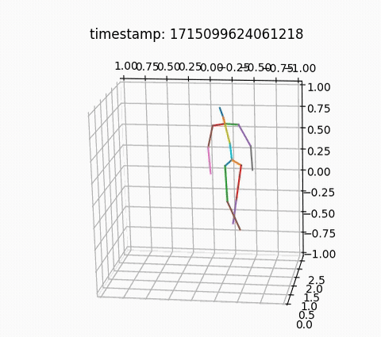

# CSV Recorder

Nuitrack provides a way to record skeleton spatial coordinates and store 
it in `.csv` file format.

In order to do so, tick the checkbox as shown on the picture below:

<p align="center">

</p>

> Note: this feature requires Nuitrack Online [license](https://nuitrack.com/) to work.

## Columns description

- The skeleton data is arranged according to the *Joint_Name*.{x, y, z, [rot]} format, where:
  - x, y, z - corresponding coordinates of a *Joint_Name*
  - rot - optional column for the angle between two adjacent joints of *Joint_Name*
- **Timestamp** is an internal sensor time representation in microseconds.
- **Serial** is the unique identifier of a sensor. 
- **Id** is the user identifier assigned by Nuitrack.

> The maximum number of users to be tracked is set in `$NUITRACK_HOME/data/nuitrack.config` by `Skeletonization.ActiveUsers` field

### Joint scheme:

<p align="center">

</p>

### Sample data:

|    |        timestamp | serial      |   id |   JOINT_WAIST.x |   JOINT_WAIST.y |   JOINT_WAIST.z |   JOINT_TORSO.x |   JOINT_TORSO.y |   JOINT_TORSO.z |   JOINT_TORSO.rot |   JOINT_NECK.x |   JOINT_NECK.y |   JOINT_NECK.z |   JOINT_NECK.rot |   JOINT_HEAD.x |   JOINT_HEAD.y |   JOINT_HEAD.z |   JOINT_RIGHT_COLLAR.x |   JOINT_RIGHT_COLLAR.y |   JOINT_RIGHT_COLLAR.z |   JOINT_LEFT_COLLAR.x |   JOINT_LEFT_COLLAR.y |   JOINT_LEFT_COLLAR.z |   JOINT_LEFT_SHOULDER.x |   JOINT_LEFT_SHOULDER.y |   JOINT_LEFT_SHOULDER.z |   JOINT_LEFT_SHOULDER.rot |   JOINT_LEFT_ELBOW.x |   JOINT_LEFT_ELBOW.y |   JOINT_LEFT_ELBOW.z |   JOINT_LEFT_ELBOW.rot |   JOINT_LEFT_WRIST.x |   JOINT_LEFT_WRIST.y |   JOINT_LEFT_WRIST.z |   JOINT_LEFT_HAND.x |   JOINT_LEFT_HAND.y |   JOINT_LEFT_HAND.z |   JOINT_RIGHT_SHOULDER.x |   JOINT_RIGHT_SHOULDER.y |   JOINT_RIGHT_SHOULDER.z |   JOINT_RIGHT_SHOULDER.rot |   JOINT_RIGHT_ELBOW.x |   JOINT_RIGHT_ELBOW.y |   JOINT_RIGHT_ELBOW.z |   JOINT_RIGHT_ELBOW.rot |   JOINT_RIGHT_WRIST.x |   JOINT_RIGHT_WRIST.y |   JOINT_RIGHT_WRIST.z |   JOINT_RIGHT_HAND.x |   JOINT_RIGHT_HAND.y |   JOINT_RIGHT_HAND.z |   JOINT_LEFT_HIP.x |   JOINT_LEFT_HIP.y |   JOINT_LEFT_HIP.z |   JOINT_LEFT_HIP.rot |   JOINT_LEFT_KNEE.x |   JOINT_LEFT_KNEE.y |   JOINT_LEFT_KNEE.z |   JOINT_LEFT_KNEE.rot |   JOINT_LEFT_ANKLE.x |   JOINT_LEFT_ANKLE.y |   JOINT_LEFT_ANKLE.z |   JOINT_RIGHT_HIP.x |   JOINT_RIGHT_HIP.y |   JOINT_RIGHT_HIP.z |   JOINT_RIGHT_HIP.rot |   JOINT_RIGHT_KNEE.x |   JOINT_RIGHT_KNEE.y |   JOINT_RIGHT_KNEE.z |   JOINT_RIGHT_KNEE.rot |   JOINT_RIGHT_ANKLE.x |   JOINT_RIGHT_ANKLE.y |   JOINT_RIGHT_ANKLE.z |
|---:|-----------------:|:------------|-----:|----------------:|----------------:|----------------:|----------------:|----------------:|----------------:|------------------:|---------------:|---------------:|---------------:|-----------------:|---------------:|---------------:|---------------:|-----------------------:|-----------------------:|-----------------------:|----------------------:|----------------------:|----------------------:|------------------------:|------------------------:|------------------------:|--------------------------:|---------------------:|---------------------:|---------------------:|-----------------------:|---------------------:|---------------------:|---------------------:|--------------------:|--------------------:|--------------------:|-------------------------:|-------------------------:|-------------------------:|---------------------------:|----------------------:|----------------------:|----------------------:|------------------------:|----------------------:|----------------------:|----------------------:|---------------------:|---------------------:|---------------------:|-------------------:|-------------------:|-------------------:|---------------------:|--------------------:|--------------------:|--------------------:|----------------------:|---------------------:|---------------------:|---------------------:|--------------------:|--------------------:|--------------------:|----------------------:|---------------------:|---------------------:|---------------------:|-----------------------:|----------------------:|----------------------:|----------------------:|
|  0 | 1715151474879921 | AS3M323001D |    1 |       -0.232471 |        0.264446 |         3.3839  |       -0.228279 |        0.457359 |         3.3795  |           178.678 |      -0.213409 |       0.789057 |        3.29207 |          172.789 |      -0.223263 |       0.910348 |        3.2771  |              -0.217052 |               0.707794 |                3.31349 |             -0.217052 |              0.707794 |               3.31349 |              -0.0546909 |                0.692625 |                 3.29895 |                   108.288 |           0.00303882 |             0.441589 |              3.36307 |                177.429 |            0.0491172 |             0.190038 |              3.2674  |           0.0583329 |            0.139727 |             3.24827 |                -0.377219 |                 0.707108 |                  3.32351 |                    107.311 |             -0.453348 |              0.459121 |               3.37982 |                 167.427 |             -0.474012 |              0.196173 |               3.30922 |            -0.478145 |             0.143583 |              3.2951  |          -0.12297  |           0.199781 |            3.41813 |              125.707 |          -0.0869092 |           -0.200844 |             3.31078 |               177.996 |           -0.0659775 |            -0.582455 |              3.42526 |           -0.345856 |            0.202048 |             3.41036 |               122.239 |            -0.370378 |            -0.209045 |              3.34932 |                177.541 |             -0.409574 |             -0.5901   |               3.46081 |
|  1 | 1715151474913237 | AS3M323001D |    1 |       -0.232401 |        0.263871 |         3.3835  |       -0.228442 |        0.456867 |         3.37949 |           179.01  |      -0.215883 |       0.788984 |        3.29144 |          173.488 |      -0.225114 |       0.910435 |        3.27718 |              -0.218956 |               0.707725 |                3.31298 |             -0.218956 |              0.707725 |               3.31298 |              -0.0563975 |                0.693803 |                 3.29766 |                   108.127 |           0.00281489 |             0.441991 |              3.36081 |                177.213 |            0.0493992 |             0.18931  |              3.26635 |           0.0587161 |            0.138774 |             3.24745 |                -0.379396 |                 0.706756 |                  3.32362 |                    109.127 |             -0.463053 |              0.460744 |               3.38179 |                 164.089 |             -0.476268 |              0.197155 |               3.30907 |            -0.478911 |             0.144437 |              3.29453 |          -0.122786 |           0.199299 |            3.4172  |              125.569 |          -0.0872016 |           -0.202037 |             3.31151 |               178.265 |           -0.0650325 |            -0.582863 |              3.42596 |           -0.345806 |            0.201763 |             3.40971 |               122.356 |            -0.372015 |            -0.209388 |              3.34826 |                178.038 |             -0.409375 |             -0.589794 |               3.46013 |
|  2 | 1715151474913237 | AS3M323001D |    1 |       -0.232401 |        0.263871 |         3.3835  |       -0.228442 |        0.456867 |         3.37949 |           179.01  |      -0.215883 |       0.788984 |        3.29144 |          173.488 |      -0.225114 |       0.910435 |        3.27718 |              -0.218956 |               0.707725 |                3.31298 |             -0.218956 |              0.707725 |               3.31298 |              -0.0563975 |                0.693803 |                 3.29766 |                   108.127 |           0.00281489 |             0.441991 |              3.36081 |                177.213 |            0.0493992 |             0.18931  |              3.26635 |           0.0587161 |            0.138774 |             3.24745 |                -0.379396 |                 0.706756 |                  3.32362 |                    109.127 |             -0.463053 |              0.460744 |               3.38179 |                 164.089 |             -0.476268 |              0.197155 |               3.30907 |            -0.478911 |             0.144437 |              3.29453 |          -0.122786 |           0.199299 |            3.4172  |              125.569 |          -0.0872016 |           -0.202037 |             3.31151 |               178.265 |           -0.0650325 |            -0.582863 |              3.42596 |           -0.345806 |            0.201763 |             3.40971 |               122.356 |            -0.372015 |            -0.209388 |              3.34826 |                178.038 |             -0.409375 |             -0.589794 |               3.46013 |
|  3 | 1715151474946595 | AS3M323001D |    1 |       -0.232392 |        0.263494 |         3.38308 |       -0.228697 |        0.456517 |         3.37942 |           179.599 |      -0.220009 |       0.788914 |        3.29064 |          175.195 |      -0.227042 |       0.910631 |        3.27723 |              -0.222133 |               0.707663 |                3.31234 |             -0.222133 |              0.707663 |               3.31234 |              -0.0596571 |                0.694581 |                 3.29623 |                   108.484 |           0.00261217 |             0.442607 |              3.35736 |                176.409 |            0.0488466 |             0.187955 |              3.26607 |           0.0580935 |            0.137024 |             3.24781 |                -0.3833   |                 0.70601  |                  3.32388 |                    108.184 |             -0.461983 |              0.457914 |               3.38188 |                 165.319 |             -0.475417 |              0.194095 |               3.30744 |            -0.478103 |             0.141332 |              3.29256 |          -0.122677 |           0.198701 |            3.41591 |              125.464 |          -0.088168  |           -0.203826 |             3.31374 |               178.677 |           -0.0643232 |            -0.585311 |              3.42346 |           -0.345828 |            0.201264 |             3.40837 |               122.612 |            -0.373596 |            -0.209911 |              3.34655 |                178.494 |             -0.4093   |             -0.589791 |               3.4586  |
|  4 | 1715151474946595 | AS3M323001D |    1 |       -0.232392 |        0.263494 |         3.38308 |       -0.228697 |        0.456517 |         3.37942 |           179.599 |      -0.220009 |       0.788914 |        3.29064 |          175.195 |      -0.227042 |       0.910631 |        3.27723 |              -0.222133 |               0.707663 |                3.31234 |             -0.222133 |              0.707663 |               3.31234 |              -0.0596571 |                0.694581 |                 3.29623 |                   108.484 |           0.00261217 |             0.442607 |              3.35736 |                176.409 |            0.0488466 |             0.187955 |              3.26607 |           0.0580935 |            0.137024 |             3.24781 |                -0.3833   |                 0.70601  |                  3.32388 |                    108.184 |             -0.461983 |              0.457914 |               3.38188 |                 165.319 |             -0.475417 |              0.194095 |               3.30744 |            -0.478103 |             0.141332 |              3.29256 |          -0.122677 |           0.198701 |            3.41591 |              125.464 |          -0.088168  |           -0.203826 |             3.31374 |               178.677 |           -0.0643232 |            -0.585311 |              3.42346 |           -0.345828 |            0.201264 |             3.40837 |               122.612 |            -0.373596 |            -0.209911 |              3.34655 |                178.494 |             -0.4093   |             -0.589791 |               3.4586  |

## Example of use in Python:  

```python
import pandas as pd
import matplotlib.pyplot as plt
import numpy as np
from matplotlib.animation import FuncAnimation
from matplotlib.animation import PillowWriter 

df = pd.read_csv('SkeletonData.csv')

max_z = np.nanmax(df.filter(regex='.*\.z$').max().to_numpy())

fig = plt.figure()
ax = plt.axes(projection='3d')

def get_joint_coords_by_idx(dataframe, idx, joint_name):
    coords = df.filter(regex=(f'{joint_name}\..$'))
    return coords.iloc[idx]

def draw_line(ax, origin, to):
    x = np.array([origin[0], to[0]])
    y = np.array([origin[1], to[1]])
    z = np.array([origin[2], to[2]])
    ax.plot3D(x, y, z)

def animate(i):
    ax.clear()
    ax.set_xlim3d(-1, 1)
    ax.set_ylim3d(-1, 1)
    ax.set_zlim3d(0, max_z)
    ax.set_title(f'timestamp: {df.iloc[i]["timestamp"]:.0f}')

    ax.view_init(elev=290, azim=120, roll=-30)

    head           = get_joint_coords_by_idx(df, i, 'JOINT_HEAD')
    neck           = get_joint_coords_by_idx(df, i, 'JOINT_NECK')
    collar         = get_joint_coords_by_idx(df, i, 'JOINT_LEFT_COLLAR')
    right_shoulder = get_joint_coords_by_idx(df, i, 'JOINT_RIGHT_SHOULDER')
    left_shoulder  = get_joint_coords_by_idx(df, i, 'JOINT_LEFT_SHOULDER')
    right_elbow    = get_joint_coords_by_idx(df, i, 'JOINT_RIGHT_ELBOW')
    left_elbow     = get_joint_coords_by_idx(df, i, 'JOINT_LEFT_ELBOW')
    left_wrist     = get_joint_coords_by_idx(df, i, 'JOINT_LEFT_WRIST')
    right_wrist    = get_joint_coords_by_idx(df, i, 'JOINT_RIGHT_WRIST')
    right_hand     = get_joint_coords_by_idx(df, i, 'JOINT_RIGHT_HAND')
    left_hand      = get_joint_coords_by_idx(df, i, 'JOINT_LEFT_HAND')
    torso          = get_joint_coords_by_idx(df, i, 'JOINT_TORSO')
    waist          = get_joint_coords_by_idx(df, i, 'JOINT_WAIST')
    right_hip      = get_joint_coords_by_idx(df, i, 'JOINT_RIGHT_HIP')
    left_hip       = get_joint_coords_by_idx(df, i, 'JOINT_LEFT_HIP')
    right_knee     = get_joint_coords_by_idx(df, i, 'JOINT_RIGHT_KNEE')
    left_knee      = get_joint_coords_by_idx(df, i, 'JOINT_LEFT_KNEE')
    right_ankle    = get_joint_coords_by_idx(df, i, 'JOINT_RIGHT_ANKLE')
    left_ankle     = get_joint_coords_by_idx(df, i, 'JOINT_LEFT_ANKLE')

    draw_line(ax, head, neck)
    draw_line(ax, neck, collar)
    draw_line(ax, collar, right_shoulder)
    draw_line(ax, collar, left_shoulder)
    draw_line(ax, right_shoulder, right_elbow)
    draw_line(ax, left_shoulder, left_elbow)
    draw_line(ax, left_elbow, left_hand)
    draw_line(ax, right_elbow, right_hand)
    draw_line(ax, collar, torso)
    draw_line(ax, torso, waist)
    draw_line(ax, waist, left_hip)
    draw_line(ax, waist, right_hip)
    draw_line(ax, left_hip, left_knee)
    draw_line(ax, right_hip, right_knee)
    draw_line(ax, right_knee, right_ankle)
    draw_line(ax, left_knee, left_ankle)

anim = FuncAnimation(fig, animate, frames=len(df.index), interval=15, repeat=True)

#  To save the animation using Pillow as a gif
#  writer = PillowWriter(fps=30,
#                                 metadata=dict(artist='Me'),
#                                 bitrate=1800)
#  anim.save('skeleton_animation.gif', writer=writer)

plt.show()
```

<p align="center">

</p>
