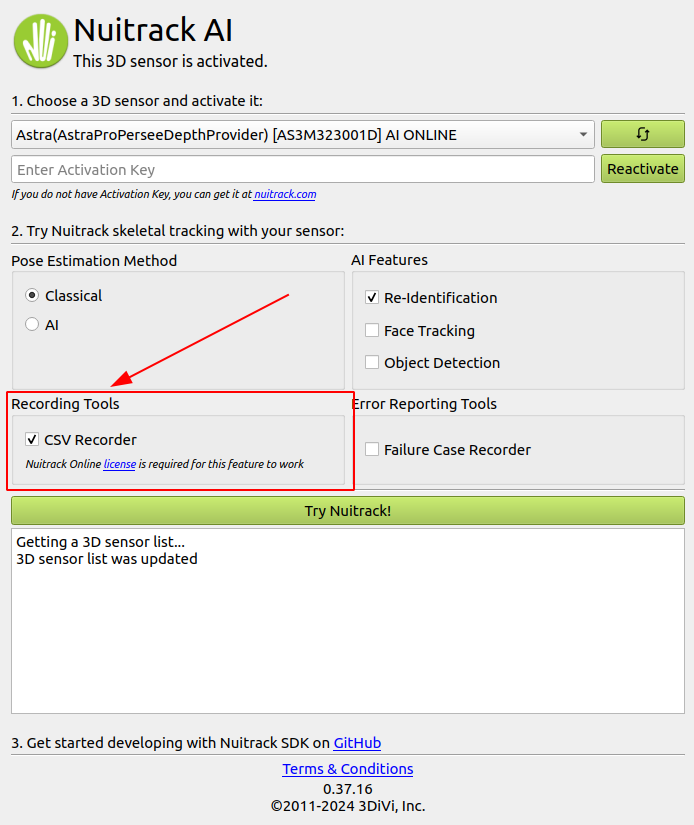

# CSV Recorder

Nuitrack provides a way to record skeleton spatial coordinates and store 
it in `.csv` file format.

In order to do so, tick the checkbox as shown on the picture below:

> Note: this feature requires Nuitrack Online [license](https://nuitrack.com/) to work.

### Columns description

The data is arranged according to the format: XXXX.{x, y, z, [rot]}, where x, y, z denotes corresponding coordinates of a joint XXXX, and optional rot column is added for the angle between two adjacent joints of joint XXXX.

**Timestamp** is an internal sensor time representation in microseconds.

**Serial** is the unique identifier of a sensor. 

**Id** is the user identifier assigned by Nuitrack.

> The maximum number of users to be tracked is set in `$NUITRACK_HOME/data/nuitrack.config` by `Skeletonization.ActiveUsers` field

Joint scheme:

Sample data:

|        timestamp | serial      |   id |   JOINT_WAIST.x |   JOINT_WAIST.y |   JOINT_WAIST.z |   JOINT_TORSO.x |   JOINT_TORSO.y |   JOINT_TORSO.z |   JOINT_TORSO.rot |   JOINT_NECK.x |   JOINT_NECK.y |   JOINT_NECK.z |   JOINT_NECK.rot |   JOINT_HEAD.x |   JOINT_HEAD.y |   JOINT_HEAD.z |   JOINT_LEFT_SHOULDER.x |   JOINT_LEFT_SHOULDER.y |   JOINT_LEFT_SHOULDER.z |   JOINT_LEFT_SHOULDER.rot |   JOINT_LEFT_ELBOW.x |   JOINT_LEFT_ELBOW.y |   JOINT_LEFT_ELBOW.z |   JOINT_LEFT_ELBOW.rot |   JOINT_LEFT_WRIST.x |   JOINT_LEFT_WRIST.y |   JOINT_LEFT_WRIST.z |   JOINT_LEFT_HAND.x |   JOINT_LEFT_HAND.y |   JOINT_LEFT_HAND.z |   JOINT_RIGHT_SHOULDER.x |   JOINT_RIGHT_SHOULDER.y |   JOINT_RIGHT_SHOULDER.z |   JOINT_RIGHT_SHOULDER.rot |   JOINT_RIGHT_ELBOW.x |   JOINT_RIGHT_ELBOW.y |   JOINT_RIGHT_ELBOW.z |   JOINT_RIGHT_ELBOW.rot |   JOINT_RIGHT_WRIST.x |   JOINT_RIGHT_WRIST.y |   JOINT_RIGHT_WRIST.z |   JOINT_RIGHT_HAND.x |   JOINT_RIGHT_HAND.y |   JOINT_RIGHT_HAND.z |   JOINT_LEFT_HIP.x |   JOINT_LEFT_HIP.y |   JOINT_LEFT_HIP.z |   JOINT_LEFT_HIP.rot |   JOINT_LEFT_KNEE.x |   JOINT_LEFT_KNEE.y |   JOINT_LEFT_KNEE.z |   JOINT_LEFT_KNEE.rot |   JOINT_LEFT_ANKLE.x |   JOINT_LEFT_ANKLE.y |   JOINT_LEFT_ANKLE.z |   JOINT_RIGHT_HIP.x |   JOINT_RIGHT_HIP.y |   JOINT_RIGHT_HIP.z |   JOINT_RIGHT_HIP.rot |   JOINT_RIGHT_KNEE.x |   JOINT_RIGHT_KNEE.y |   JOINT_RIGHT_KNEE.z |   JOINT_RIGHT_KNEE.rot |   JOINT_RIGHT_ANKLE.x |   JOINT_RIGHT_ANKLE.y |   JOINT_RIGHT_ANKLE.z |
|-----------------:|:------------|-----:|----------------:|----------------:|----------------:|----------------:|----------------:|----------------:|------------------:|---------------:|---------------:|---------------:|-----------------:|---------------:|---------------:|---------------:|------------------------:|------------------------:|------------------------:|--------------------------:|---------------------:|---------------------:|---------------------:|-----------------------:|---------------------:|---------------------:|---------------------:|--------------------:|--------------------:|--------------------:|-------------------------:|-------------------------:|-------------------------:|---------------------------:|----------------------:|----------------------:|----------------------:|------------------------:|----------------------:|----------------------:|----------------------:|---------------------:|---------------------:|---------------------:|-------------------:|-------------------:|-------------------:|---------------------:|--------------------:|--------------------:|--------------------:|----------------------:|---------------------:|---------------------:|---------------------:|--------------------:|--------------------:|--------------------:|----------------------:|---------------------:|---------------------:|---------------------:|-----------------------:|----------------------:|----------------------:|----------------------:|
| 1712730398224346 | AS3M323001D |    1 |      -0.0596059 |       0.0904388 |         1.66556 |      -0.0625793 |        0.254289 |         1.6912  |           176.938 |     -0.0840491 |       0.553666 |        1.68992 |          171.469 |      -0.107086 |       0.656453 |        1.68481 |               0.0635426 |                0.478003 |                 1.70572 |                   108.876 |             0.136072 |             0.247241 |              1.70966 |                155.328 |             0.114173 |            0.0744635 |              1.57668 |            0.109793 |           0.039908  |             1.55009 |                -0.227404 |                 0.469091 |                  1.68256 |                    107.648 |             -0.281166 |              0.233442 |               1.69289 |                 154.82  |             -0.246857 |             0.076457  |               1.54392 |            -0.239995 |            0.04506   |              1.51413 |          0.0365087 |          0.0300538 |            1.65845 |              128.491 |           0.0726928 |           -0.294995 |             1.51132 |               173.648 |            0.0726928 |            -0.632384 |              1.51132 |           -0.149449 |           0.017937  |             1.65841 |               124.998 |            -0.125668 |            -0.330502 |              1.57692 |                176.096 |             -0.125668 |             -0.667891 |               1.57692 |
| 1712730398258267 | AS3M323001D |    1 |      -0.059958  |       0.090279  |         1.66608 |      -0.0628547 |        0.253886 |         1.69177 |           176.782 |     -0.0850209 |       0.553391 |        1.68983 |          169.645 |      -0.111552 |       0.655337 |        1.6848  |               0.0628406 |                0.477542 |                 1.70603 |                   108.801 |             0.134621 |             0.246997 |              1.71239 |                156.075 |             0.114475 |            0.0737119 |              1.5798  |            0.110446 |           0.0390549 |             1.55328 |                -0.229783 |                 0.470496 |                  1.68269 |                    106.515 |             -0.281616 |              0.234769 |               1.69216 |                 155.365 |             -0.247223 |             0.0761425 |               1.54496 |            -0.240344 |            0.0444172 |              1.51551 |          0.0361623 |          0.0299944 |            1.65897 |              128.494 |           0.0725948 |           -0.294865 |             1.51145 |               173.601 |            0.0725948 |            -0.632253 |              1.51145 |           -0.149859 |           0.0179693 |             1.6584  |               124.837 |            -0.125646 |            -0.330609 |              1.5776  |                176.026 |             -0.125646 |             -0.667997 |               1.5776  |
| 1712730398287992 | AS3M323001D |    1 |      -0.0603659 |       0.0901476 |         1.66661 |      -0.0633536 |        0.253498 |         1.69242 |           176.685 |     -0.0862128 |       0.553123 |        1.68979 |          169.963 |      -0.112408 |       0.655152 |        1.68469 |               0.061695  |                0.476975 |                 1.70639 |                   108.947 |             0.133429 |             0.246851 |              1.7161  |                156.552 |             0.11488  |            0.0742847 |              1.58235 |            0.111171 |           0.0397714 |             1.55559 |                -0.23166  |                 0.470989 |                  1.68274 |                    106.008 |             -0.282607 |              0.235351 |               1.69145 |                 155.342 |             -0.24747  |             0.076299  |               1.54489 |            -0.240442 |            0.0444886 |              1.51557 |          0.0358012 |          0.0299897 |            1.65894 |              128.463 |           0.0724509 |           -0.294947 |             1.51163 |               173.565 |            0.0724509 |            -0.632335 |              1.51163 |           -0.150345 |           0.0180753 |             1.65837 |               124.641 |            -0.125645 |            -0.330475 |              1.57756 |                175.946 |             -0.125645 |             -0.667864 |               1.57756 |
| 1712730398322558 | AS3M323001D |    1 |      -0.06084   |       0.0900037 |         1.66719 |      -0.0642944 |        0.253119 |         1.69318 |           176.779 |     -0.0875342 |       0.552836 |        1.68976 |          170.875 |      -0.112229 |       0.655233 |        1.68455 |               0.0598649 |                0.475922 |                 1.70684 |                   109.852 |             0.133808 |             0.246972 |              1.72077 |                155.853 |             0.115139 |            0.0764598 |              1.58442 |            0.111406 |           0.0423573 |             1.55715 |                -0.233108 |                 0.471022 |                  1.68275 |                    105.957 |             -0.284301 |              0.235663 |               1.69081 |                 154.851 |             -0.247884 |             0.0763636 |               1.54482 |            -0.2406   |            0.0445037 |              1.51563 |          0.0354384 |          0.0299504 |            1.659   |              128.426 |           0.0723065 |           -0.295014 |             1.51179 |               173.527 |            0.0723065 |            -0.632402 |              1.51179 |           -0.150855 |           0.018179  |             1.65834 |               124.456 |            -0.125681 |            -0.33036  |              1.5776  |                175.869 |             -0.125681 |             -0.667749 |               1.5776  |
| 1712730398357463 | AS3M323001D |    1 |      -0.0615403 |       0.0898374 |         1.66776 |      -0.0667766 |        0.252728 |         1.694   |           177.579 |     -0.0891247 |       0.55256  |        1.68974 |          171.829 |      -0.1118   |       0.65541  |        1.68427 |               0.0576195 |                0.475063 |                 1.70727 |                   110.632 |             0.133637 |             0.247105 |              1.72284 |                155.38  |             0.11537  |            0.0783389 |              1.58429 |            0.111716 |           0.0445856 |             1.55657 |                -0.234502 |                 0.47093  |                  1.68275 |                    105.989 |             -0.286057 |              0.23583  |               1.69024 |                 154.37  |             -0.248377 |             0.0759515 |               1.54521 |            -0.240841 |            0.0439758 |              1.51621 |          0.03505   |          0.0298628 |            1.65903 |              128.36  |           0.0721997 |           -0.295034 |             1.51173 |               173.477 |            0.0721997 |            -0.632423 |              1.51173 |           -0.151419 |           0.0182981 |             1.6583  |               124.335 |            -0.125928 |            -0.330226 |              1.57758 |                175.817 |             -0.125928 |             -0.667615 |               1.57758 |
