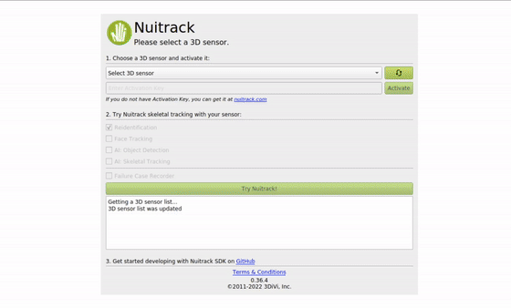

# Failure Case Recorder

Now you can record the last 15 seconds of sensor data from Nuitrack to report any Nuitrack algorithms (Skeleton Tracker, User Tracker, etc.) failures/inaccuracies that occur on this data.  
This function is designed to reproduce Nuitrack behavior with your data on our side and quick problem solving.  

**_Disclaimer:_**  
_Nuitrack saves only sensor settings, depth and rgb frames._

### Supported platforms
- Linux x64
- Windows x64/x86
- Android arm32/arm64

### To use Failure Case Recorder:
- launch the Nuitrack application
- make sure that the `Failure Case Recorder` checkbox is checked 
- press on `Try Nuitrack!` button
- reproduce your failure case and press `r` button on your keyboard
- you will see a message `Record Saving Started`
- the last 15 seconds of sensor data will be saved to your computer's hard drive
- wait until you see the message `Record Saving Ended`, after which you can close the application or record a new case
- compress recorded case (recorded case saves to `%NUITRACK_HOME%\data\NuitrackFrameDump\<your records>` on Desktop platforms and to `Android/data/com.tdv.nuitrack.sdk/files/nuitrack/NuitrackFrameDump` on Android) and send it to our support: support-nuitrack@3divi.com

### Hardware requirements:
The required amount of free Memory and Hard Drive space directly depends on the resolution and frame rate that you use for the sensor.  
For Color and Depth resolution of 640x480 at 30 FPS, required is 1 GB of free Memory and Hard Drive space.  

