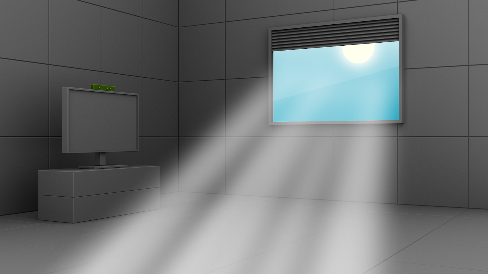
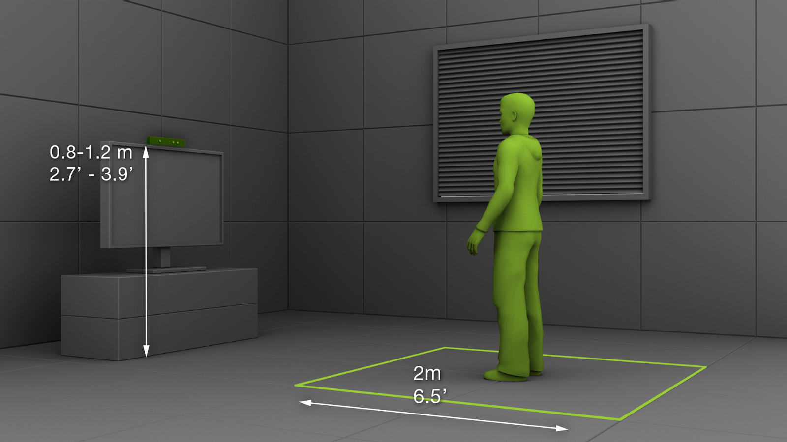
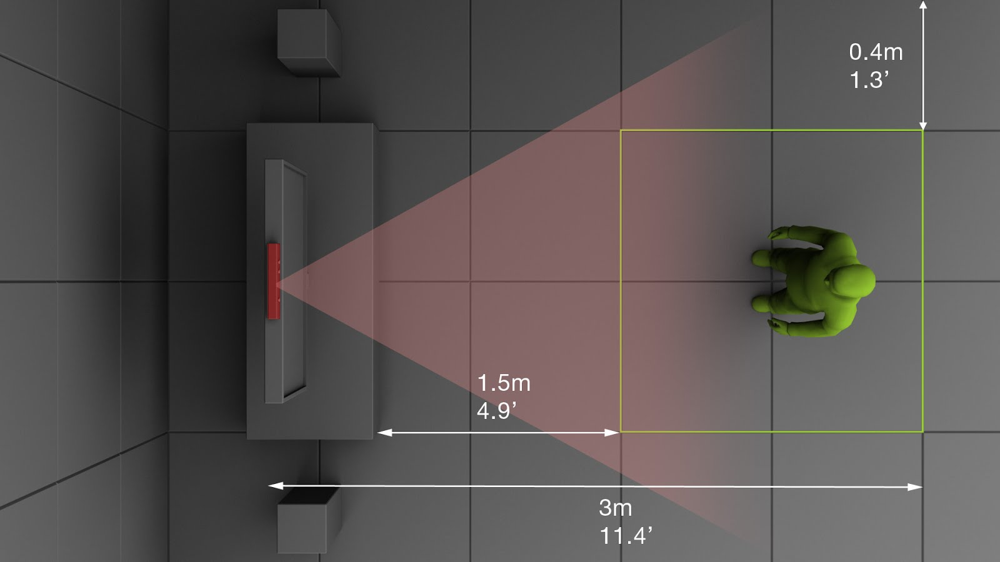
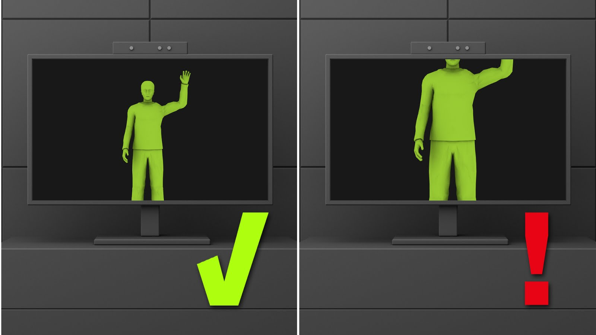
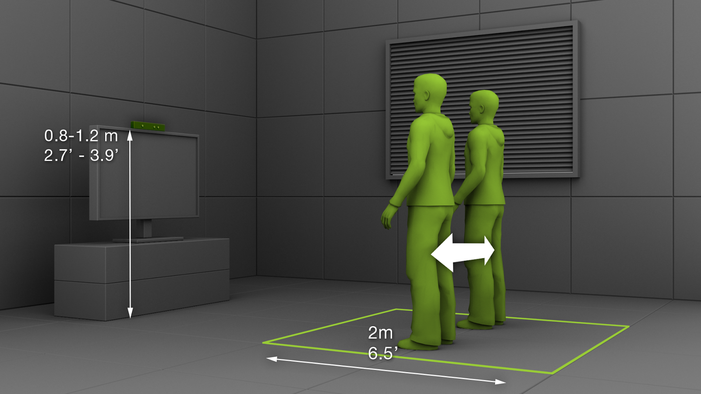
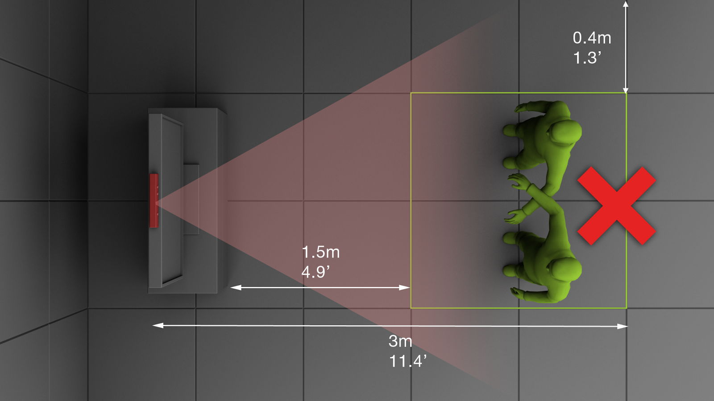
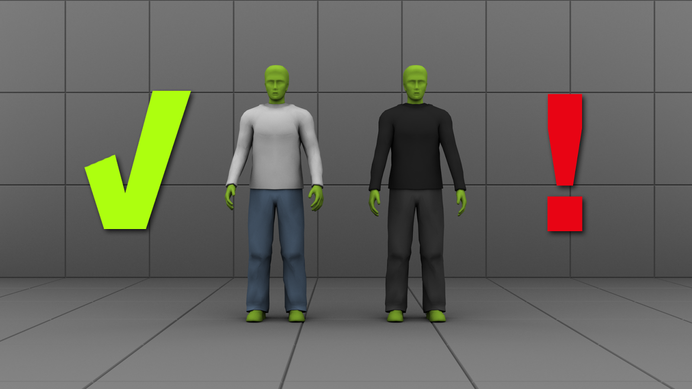

# General Preparations 

## Lighting conditions

It is recommended that the area does not have direct sunlight in the field of view of the sensor.

## Sensor placement

The optimal height for sensor placement is about 1.2m. It should be put facing straight forward and parallel to the floor as close to the
supporting edge as possible. The distance between the player and the sensor should be a minimum of 1.5 meters.

## Player environment

Make sure that the player has enough room to move about without touching the walls on the sides and on the back of the room. There should be at
least a distance of 40 centimetres from the walls and the ceiling.

## Player position within the frame

Make sure that the player's entire body is visible:
* When extending the arm to the front, sides and above the head, they are still visible in the frame.
* The whole head should be visible with room to spare above it.
* The knee area should be within the frame.

## If there is more than one player make sure there is enough space between them

## Make sure there is no overlapping. Occlusions can affect tracking

## Try to avoid dark clothing. This can affect tracking

