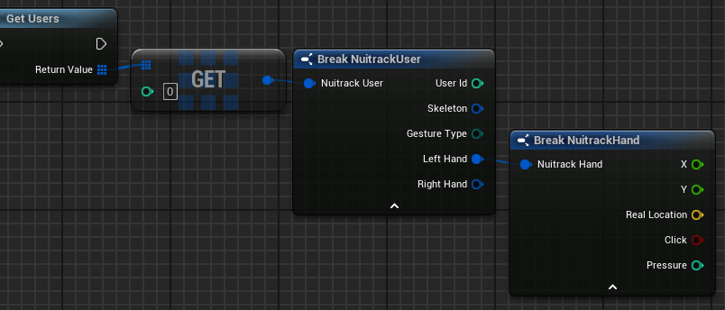

# Recommended approach to precisely track palms positions

In addition to the Skeletal Tracker, which is primarily designed for full-body cases, we provide access to a separate algorithm that is designed to more accurately detect the position of a person's palm (Hand Tracker).  
The purpose of the Nuitrack Hand Tracker module is to track user hands and to interpret the actions performed by hands.  
Currently, this module can determine projective coordinates (2D), real world coordinates (3d), the rate of hand clenching and detect the "click" event.  

### 2D positions

The normalized projective 2D coordinates of the hand (in range [0, 1]).  
Suitable for managing interfaces. The most common way to use it is to control the cursor with your hand.

<p align="center">

</p>

### 3D positions

Coordinates of the hand (the center of the palm) in the real world coordinate system

<p align="center">

</p>


## Getting Started

### Unity

```cs
void Update()
{
    UserData user = NuitrackManager.sensorsData[0].Users.Current;

    if (user != null)
    {
        //you can get user.LeftHand or user.RightHand data
        if (user.LeftHand != null)
        {
            Vector2 projCoords = user.LeftHand.Proj; // normalized 2d coordinates of the hand (the center of the palm) (X and Y values bitween 0 and 1)
            Vector3 realCoords = user.LeftHand.Position; // 3d coordinates of the hand (the center of the palm) in the world system (in meters)
            bool click = user.LeftHand.Click; // if the hand is squeezed enough, "true" is returned, "false" otherwise
            float pressure = user.LeftHand.Pressure; // percentage of hand squeezing
        }
    }
}
```

You can try 2D hand tracking in our Unity-package on these scenes:

- Gallery ([Tutorial](Unity_Gallery.md))
- UIExample
- AllModuleScene

### Unreal Engine

You can get data from the hand tracker using nodes.

- X,Y - normalized (bitween 0 and 1) 2d coordinates of the hand (the center of the palm)
- Real Location - 3d coordinates of the hand (the center of the palm) in the world system
- Click - if the hand is squeezed enough, "true" is returned, "false" otherwise
- Pressure - percentage of hand squeezing

<p align="center">

</p>

You can try 2D hand tracking in our UE-plugin on sample "NuitrackPlugin Content/Samples/HandTracker"

### C#

- [Usage Example](/Examples/nuitrack_csharp_sample/Program.cs)

### C++

- [Usage Example](/Examples/nuitrack_console_sample/src/main.cpp)
- [The Hands Data Structure](/Nuitrack/include/nuitrack/types/Hand.h)
