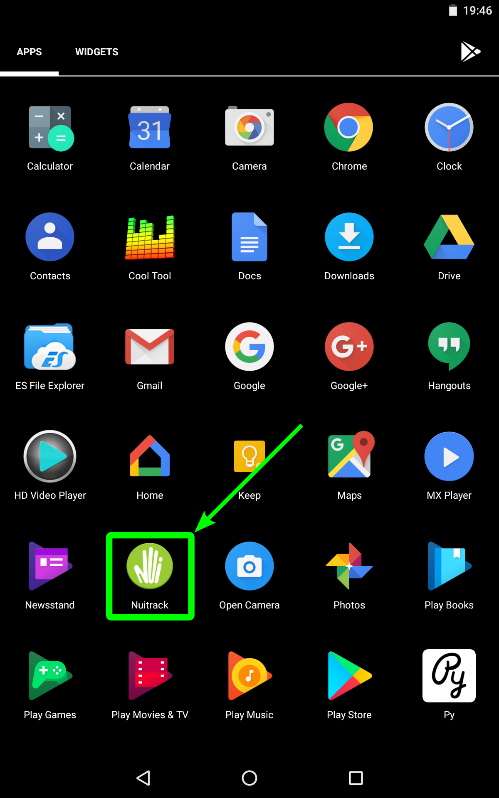
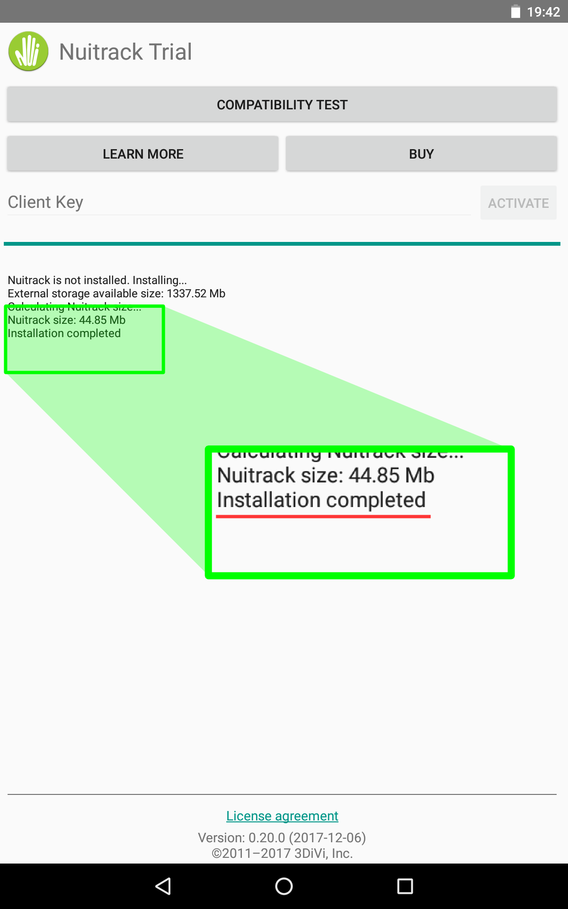

# Installation Instructions

## Hardware Requirements and Minimum System Specifications 

There are no strict requirements for hardware performance with Nuitrack. RAM usage is below 200MB.

* For desktop processors, support for the AVX instructions set is required
* RGBD sensor (see the [list of compatible sensors and platforms](https://nuitrack.com/#sensors))

## Windows

### Software Requirements 

* Windows 7 or above
* Installed Microsoft Visual C++ Redistributable:
  * [Visual C++ Redistributable (x86)](https://aka.ms/vs/16/release/vc_redist.x86.exe)
  * [Visual C++ Redistributable (x64)](https://aka.ms/vs/16/release/vc_redist.x64.exe)

### Nuitrack Installation  

Download and install Nuitrack for your platform:
* [Windows x64](/Platforms/nuitrack-windows-x64.exe)
* [Windows x86](/Platforms/nuitrack-windows-x86.exe)

## Linux 

### Software Requirements 

* Ubuntu 14.04 or above
* [For Ubuntu 18.04 or above] Installed the [libpng12-0](http://launchpadlibrarian.net/233197129/libpng12-0_1.2.54-1ubuntu1_amd64.deb) package
* [For Arm] Installed the _bluetooth_ and _freeglut_ packages: 
   ```
   sudo apt-get install bluetooth freeglut-dev
   ```

### Nuitrack Installation 

Download and install the Nuitrack Debian package for your platform:
* [Ubuntu x64](/Platforms/nuitrack-ubuntu-amd64.deb)
* [Ubuntu/Debian arm64](/Platforms/nuitrack-linux-arm64.deb)
* [Ubuntu/Debian arm32](/Platforms/nuitrack-linux-armhf.deb)

## Android

1. Allow your device to install applications from unknown sources. To do this, go to **Settings → Security and tick "Unknown sources"**.
2. Download and install the Nuitrack APK package for your platform (to install the APK package, locate it in a file manager, open and tap "INSTALL"):
   * [Android arm64](/Platforms/Nuitrack_arm64.apk)
   * [Android arm32](/Platforms/Nuitrack.apk)
   * [Android (TVico)](/Platforms/TVico.apk)
3. Launch the Nuitrack application. 
   <p align="center">
   
   </p> 
4. Wait for the Nuitrack installation. If the Nuitrack installation is successful, the message will be displayed as shown in the picture below:
   <p align="center">
   
   </p>

## License Activation

You can find the information about the Nuitrack licenses in the [Licensing](/doc/Licensing.md) section and [on our website](https://nuitrack.com/#pricing).

You can activate Nuitrack in one of two ways:
* [Using the Nuitrack application](#nuitrack-application)
* [Using API](#device-api)

### Nuitrack Application

The Nuitrack application can be used to check the sensor operation with Nuitrack and activate the Nuitrack license. 

#### Running the Licensing Tool 

* **Windows**:
  * Find the **Nuitrack** application in **Start Menu Windows** and run it. As an option, you can go to `%NUITRACK_HOME%\activation_tool` and run `Nuitrack.exe`.
* **Linux**:
  * Open a terminal and run the command: `nuitrack`
* **Android**:
  * Launch the **Nuitrack** app.

#### Activating the License 

1. Select a depth sensor from the drop-down list in the Nuitrack licensing tool.
2. \[optional\] Click the `Try Nuitrack!` button and wait for the compatibility test to complete. You can do this to make sure that your sensor works correctly with **Nuitrack**.
3. Enter your activation key and click `Activate` to activate the license (see more info about **Nuitrack Trial** and **Nuitrack Pro** in [Nuitrack Licensing](#nuitrack-licensing)).
4. Click the `Try Nuitrack!` button to view the Nuitrack demo

### Device API

You can activate **Nuitrack** from your application using [Device API](/doc/Device_API.md).

For **Windows** and **Linux**, `nuitrack_device_api_sample` is included into the **Nuitrack Runtime** installation package. To run `nuitrack_device_api_sample`, open a terminal and run the command `nuitrack_device_api_sample`.

## Troubleshooting

In the [Troubleshooting](/doc/Troubleshooting.md) section, you can find the information about the most common errors related to Nuitrack installation and usage and possible solutions. If you cannot find your problem there, please take a look at the [Knowledge Base](https://community.nuitrack.com/t/nuitrack-knowledge-base/807) in the [Nuitrack community](https://community.nuitrack.com/) or contact support-nuitrack@3divi.com
