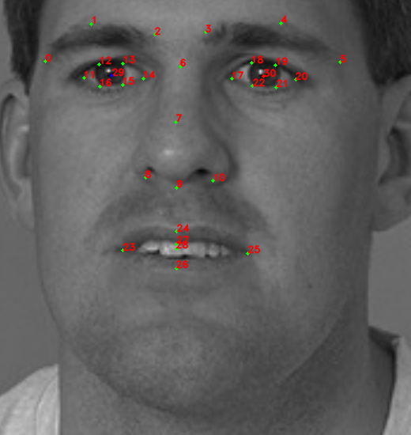

# Nuitrack Instance-based API [Beta]

Instance-based API allows you to get information about faces of users with detected skeletons and also about [detected objects](Nuitrack_AI.md#ai-object-detection).

Currently supported platforms:
* Face detection: 
	* Ubuntu amd64
	* Windows x86/x86_64
* Object detection:
	* Ubuntu amd64
	* Windows x86_64

_**Note**: Face modules are by default disabled. To enable face modules, open *nuitrack.config* file and set ```Faces.ToUse``` and ```DepthProvider.Depth2ColorRegistration``` to `true`._

## Getting Information about Instances

Nuitrack allows to get information about faces of people standing in front of the camera and objects in JSON format. To get the information, call the [`tdv::nuitrack::Nuitrack::getInstancesJson`](https://download.3divi.com/Nuitrack/doc/classtdv_1_1nuitrack_1_1Nuitrack.html#ab987411f5642ad2b2b692b5e9a19e076) (C++) or [`nuitrack.Nuitrack.GetInstancesJson`](https://download.3divi.com/Nuitrack/doc/classnuitrack_1_1Nuitrack.html#ad38063e4159f04fed58ec5be1e6c2ba6) (C#) function. The result will be returned in the form of a JSON string.
The JSON string includes the following properties:

* **Timestamp** - frame timestamp in microseconds;
* **Instances** - array with instances detected by Nuitrack:  
  <details>
  <Summary>Faces</Summary>

  * **id** - identifier of an instance, corresponds to user segment id;
  * **class** - class of an instance;
  * **face** - characteristics of a detected person’s face:  
    * **rectangle** - normalized screen coordinates of a face rectangle in the image:  
      * **left** - X coordinate of the upper-left corner of the rectangle;  
      * **top** - Y coordinate of the upper-left corner of the rectangle;  
      * **width** - rectangle width;  
      * **height** - rectangle height;  
    * **landmark** - facial landmarks. The *singlelbf* set of anthropometric points is used (31 points). Normalized coordinates of each point from the set are returned.     
    * **left_eye** - normalized coordinates of the center of a person’s left eye;
    * **right_eye** - normalized coordinates of the center of a person’s right eye;
    * **angles** - face orientation angles in degrees:
      * **yaw** - yaw angle;
      * **pitch** - pitch angle;
      * **roll** - roll angle;
    * **emotions** - emotion scores for a person’s face. Confidence degree for each emotion is returned as a positive real number in the range of [0; 1]. *Values*: `neutral | angry | happy | surprise`
    * **age** - estimated age of a person:
      * **type** - age group of a person depending on his/her age. <i>Values</i>: `kid | young | adult | senior`
      * **years** - estimated age of a person, returned as a real positive number.
    * **gender** - estimated gender of a person. <i>Values</i>: `male | female`
    
    <p align="center">
    <br>
    <b>Singlelbf set of points</b><br>
    </p>
  
  </details>

  <details>
  <Summary>AI Objects</Summary>

  * **id** - identifier of an instance, corresponds to object ID;
  * **class** - class of an object (values: `bottle | cigarette | phone | laptop | bag | book`);
  * **score** - confidence score of an object;
  * **bbox** - coordinates of an object bounding box (a positive real number in the range of [0; 1]):
    * **left** - X coordinate of the upper-left corner of the rectangle;
    * **top** - Y coordinate of the upper-left corner of the rectangle;
    * **width** - rectangle width;
    * **height** - rectangle height

  </details>

Here is an example of output JSON data (information about a detected face and a "phone" object):

<details>
<Summary>JSON</Summary>

```
{
    "Timestamp": "1598855990348343",
    "Instances":
    [
        {
            "id": "1",
            "class": "human",
            "face":
            {
                "rectangle":
                {
                    "left": "0.328125",
                    "top": "0.008333334",
                    "width": "0.31875",
                    "height": "0.4208333333333333"
                },
                "landmark":
                [
                    {
                        "x": "0.4263304",
                        "y": "0.1120703"
                    },
                    ...
                    {
                        "x": "0.4574016",
                        "y": "0.1485224"
                    },
                    {
                        "x": "0.5318047",
                        "y": "0.1858454"
                    }
                ],
                "left_eye":
                {
                    "x": "0.4574016",
                    "y": "0.1485224"
                },
                "right_eye":
                {
                    "x": "0.5318047",
                    "y": "0.1858454"
                },
                "angles":
                {
                    "yaw": "10.45415",
                    "pitch": "-15.17794",
                    "roll": "21.27661"
                },
                "emotions":
                {
                    "angry": "0.5808502",
                    "neutral": "0.3572008",
                    "surprise": "0.05123258",
                    "happy": "0.01071637"
                },
                "age":
                {
                    "type": "young",
                    "years": "26.7231330871582"
                },
                "gender": "male"
            }
        },
        {
            "id": "101",
            "class": "phone",
            "score": "0.999768794",
            "bbox":
            {
                "left": "0.7082358",
                "top": "0.199744061",
                "width": "0.131423324",
                "height": "0.297339976"
            }
        }
    ]
}
```

</details>
