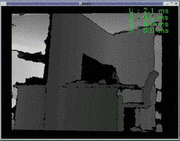

# Moving Sensor

Support for moving sensors was added in **`Nuitrack v0.33.0`**. 

Supported platforms:
  * Windows x86_64
  * Ubuntu amd64
  * iOS

Hardware requirements:
  * RGBD sensor (RGB is required for processing)  

    

To turn on moving sensor mode: 
  * open the `nuitrack.config` file from `/usr/etc/nuitrack/data`
  * set the `"MovingSensor.ToUse"` parameter to `true`
  * set the `"Depth2ColorRegistration"` parameter to `true`

To test Nuitrack with a moving sensor, run `/usr/bin/nuitrack_sample`.
