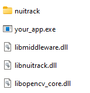
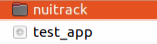
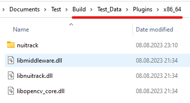

# Nuitrack Integration

- Integration:
    - [Windows/Linux](#integration-for-windowslinux)
    - [Unity](#unity)
- [License Activation](#license-activation)

If you would like to reduce the number of steps to deploy your application, we suggest you to integrate Nuitrack into your application.  

What is the difference between the default installation and integration?
- Default installation
  - Use the Nuitrack app to activate the license
  - One instance of Nuitrack for all your applications. If you have several applications using Nuitrack, you can install it once for all of them. This will significantly reduce the total size of your applications. 

- Integrating Nuitrack into your application.
  - Nuitrack files are contained in your application.
  - There is no need to restart the computer to set the Nuitrack environment variables.
  - Simplified deployment: You don’t need to install Nuitrack on your client’s computer. Installation issues or library conflicts are minimized.
  - You need to install additional drivers for some sensors yourself.


## Software Requirements

### Windows

- Windows 10 or above
- For sensors Astra / Astra PRO / Astra PRO+ you have to download [Orbbec Camera Driver](https://dl.orbbec3d.com/dist/drivers/win32/astra-win32-driver-4.3.0.20.zip) and add their installation to your application installer.

### Linux

- Ubuntu 14.04 or above

## Integration for Windows/Linux

1. Download and install Nuitrack for your platform:  

    - [nuitrack-windows-x64.exe](/Platforms/nuitrack-windows-x64.exe)
    - [nuitrack-windows-x86.exe](/Platforms/nuitrack-windows-x86.exe)  
    - [nuitrack-ubuntu-amd64.deb](/Platforms/nuitrack-ubuntu-amd64.deb)

    _**Note**_  
    _If you faced an issue during installation, please take a look at [troubleshooting](https://bit.ly/NuitrackTroubleshooting)._

2. Build your app
    - <details>
        <summary>For Linux</summary>

        Add the following commands from your application's cmake. This code snippet adds an [rpath](https://cmake.org/cmake/help/latest/prop_tgt/BUILD_RPATH.html#prop_tgt:BUILD_RPATH) to help your application find Nuitrack libraries at runtime:
        ```
            set(CMAKE_EXE_LINKER_FLAGS "${CMAKE_EXE_LINKER_FLAGS} -Wl,--disable-new-dtags")
            set(CMAKE_SHARED_LINKER_FLAGS "${CMAKE_SHARED_LINKER_FLAGS} -Wl,--disable-new-dtags")
            set(CMAKE_INSTALL_RPATH "$ORIGIN")
            ...
            install(TARGETS ${PROJECT_NAME} DESTINATION  <path>)
        ```
        You may also require *.rules files for Asus, Azure (k4a), Kinect v1/v2 (primesense), Realsense, and Orbbec sensors. You can find these rule files in the following directory: `/usr/etc/nuitrack/`.

      </details>

3. When you need to package your app for customers, run the `make_embedded` script and specify the destination path where you want to create the embedded package.  
The script will copy the Nuitrack libraries and files to the designated location. Please do not alter the file structure.  
  
    <details>  

    <summary>The <code>make_embedded</code> script location:</summary>

    - Windows x64: `C:\Program Files\Nuitrack\make_embedded.bat`
    - Windows x86: `C:\Program Files (x86)\Nuitrack\make_embedded.bat`
    - Linux: `/usr/etc/nuitrack/data/make_embedded.sh`  
  
    </details>
  
    For example:
    - <details>
        <summary>Windows</summary>
        
        - Open PowerShell
        - Go to the directory `cd C:\Program Files\Nuitrack\` 
        - Execute `make_embedded.bat C:\Users\<user name>\Desktop\test`

      </details>
    - <details>
        <summary>Linux</summary>

        - Open Terminal  
        - Go to to nuitrack home directory `cd /usr/etc/nuitrack/`
        - Execute `make_embedded.sh /home/<user name>/Documents/test`

      </details>
    _**Note**_  
    _The structure of your application after copying files should look like this:_

    <details>
        <summary>Windows</summary>
        <p align="center"></p>
    </details>
    <details>
        <summary>Linux</summary>
        <p align="center"></p>
    </details>

    After that, you only need to package your application in the installer or archive and deploy it to your customers.  
    In this case, there is no need to install Nuitrack, set `Path/LD_LIBRARY_PATH` and `NUITRACK_HOME` and restart the customer PC.

4. For *C#* also you need copy `nuitrack.net.dll` to you application directory (*.exe file) from [Nuitrack/lib/csharp](/Nuitrack/lib/csharp).

5. Run your app to make sure that it works correctly

## Unity
1. Download and install nuitrack.
    - [nuitrack-windows-x64.exe](/Platforms/nuitrack-windows-x64.exe)
    - [nuitrack-windows-x86.exe](/Platforms/nuitrack-windows-x86.exe)  
    - [nuitrack-ubuntu-amd64.deb](/Platforms/nuitrack-ubuntu-amd64.deb)

    _**Note**_  
    _If you faced any issue, please take a look at [troubleshooting](https://bit.ly/NuitrackTroubleshooting)._  

2. When do you need to pack your app for customers run the `make_embedded` script with path `<full path to your build folder>/<build name>_Data/Plugins/x86_64/`
    <details>  

    <summary>The <code>make_embedded</code> script location:</summary>

    - Windows x64: `C:\Program Files\Nuitrack\make_embedded.bat`
    - Windows x86: `C:\Program Files (x86)\Nuitrack\make_embedded.bat`
    - Linux: `/usr/etc/nuitrack/data/make_embedded.sh`  
  
    </details>
3. You should get the following structure:
    <details>
        <p align="center"></p>
    </details>
4. Run your app to make sure that it is working correctly  
    _**Note**_  
    _If you faced a problem, please let us know at [community.nuitrack.com](https://community.nuitrack.com/)  

## License Activation

When integrating Nuitrack into your application, please note that an *activation application is not available*. You can send license keys to your customers for manual activation or fully automate activation process.

A list of all Nuitrack licenses can be found in the licensing dashboard at [cognitive.3divi.com](https://cognitive.3divi.com/app/nuitrack/dashboard/).

To integrate Nuitrack activation into your application, use the [Device API](/doc/Device_API.md).
You can see relevant samples for [C++](Examples/nuitrack_device_api_sample) and [C#](Examples/nuitrack_csharp_device_api_sample).  
Below are the steps you have to follow to use Device API for activation:

_**Note**_    
_To activate, you need an internet connection with access to the site: https://cognitive.3divi.com/._  

1. After `Nuitrack::init()`, you could get a list of connected sensors
```
Nuitrack::init();
std::vector<NuitrackDevice::Ptr> devices = Nuitrack::getDeviceList();
```
2. Now, if you have more than one sensor connected, you have to select the desired sensor from the list.  
```
// Optional: print device info
for(const auto& device : devices)
{
    // get the device name and serial number. 
    std::cout << "Device Name/Serial Number: " << device->getInfo(DeviceInfoType::DEVICE_NAME) << "/"
                                                << device->getInfo(DeviceInfoType::SERIAL_NUMBER) << std::endl;
}
```
3. Activate selected sensor
```
// If only one sensor is connected <device index> = 0 
devices[<device index>]->activate(<activationKey>);
```
4. _(Optional)_ If you need to check the status of the activated license
```
auto status = devices[<device index>]->getActivationStatus();
switch (status)
{
    case ActivationStatus::NONE: std::cout << "None" << std::endl; break;
    case ActivationStatus::TRIAL: std::cout << "Trial" << std::endl; break;
    case ActivationStatus::PRO: std::cout << "Pro" << std::endl; break;
    case ActivationStatus::AI: std::cout << "AI" << std::endl; break;
    default: std::cout << "Unknown type" << std::endl;
}
```
