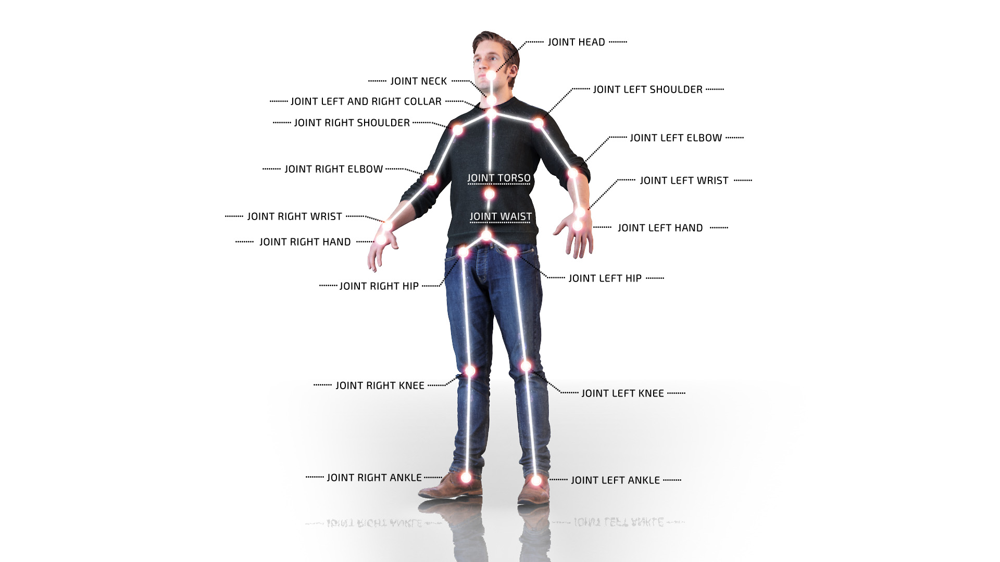

# What is Nuitrack™SDK?

Nuitrack™ is a 3D tracking middleware developed by 3DiVi Inc. This is a solution for skeleton tracking and gesture recognition, which enables capabilities of Natural User Interface (NUI) on Android, Windows, and Linux.

Nuitrack™ framework is multi-language and cross-platform. Nuitrack™ APIs include the set of interfaces for developing applications, which utilize Natural Interaction. The main purpose of Nuitrack™ is to establish an API for communication with 3D sensors.

The Nuitrack™ module is optimized for ARM based processors, which means that you can use it with Android devices and embedded platforms.

Features:

* Full Body Skeletal Tracking (19 Joints)
* 3D Point Cloud
* User Masks
* Gesture Recognition
* Cross-platform SDK for Android, Windows and Linux
* 3D Sensor independent - supports Kinect v1, Asus Xtion, Orbbec Astra, Orbbec Persee, Intel RealSense
* Unity and Unreal Engine Plugins
* OpenNI 1.5 compatible - OpenNI module allows you to move your OpenNI-based apps developed for Kinect and Asus Xtion to other platforms, including Android

Application areas:

* Natural User Interface (NUI) for Windows/Linux/Android platforms
* Games and Training (Fitness, Dance Lessons)
* Medical Rehabilitation
* Smart Home
* Positional and Full Body Tracking for VR
* Audience Analytics
* Robot Vision

# Nuitrack Skeleton System

Nuitrack can track up to six skeletons at one time. By default, two skeletons are tracked. You can set up the number of tracked skeletons as follows:

1. Use Nuitrack API: take a look at `tdv::nuitrack::SkeletonTracker::setNumActiveUsers` (C++) or `nuitrack.SkeletonTracker.SetNumActiveUsers` (C#) method.
2. Edit `nuitrack.config` file: in the section `“Skeletonization”`, set `“ActiveUsers”` to the desired value (up to 6 skeletons).

Each Nuitrack skeleton has 19 joints. Each joint has position and orientation. The skeleton scheme is shown in the picture below.

