# TVico User Guide

**TVico** is an interactive Android computer with a 3D sensor and an RGB camera, a product jointly developed by Orbbec and 3DiVI Inc. It is designed for development of interactive Android applications and bundled with Nuitrack SDK.

_**Note:** you will need a **TVico license** to use TVico. The TVico license is a special form of the [Nuitrack Pro Perpetual license](/doc/Licensing.md) and enables the [wireless use case](#wireless-case). The license key is sent to your mail after purchasing TVico on the [official website](https://tvico.io/)._

<p align="center">
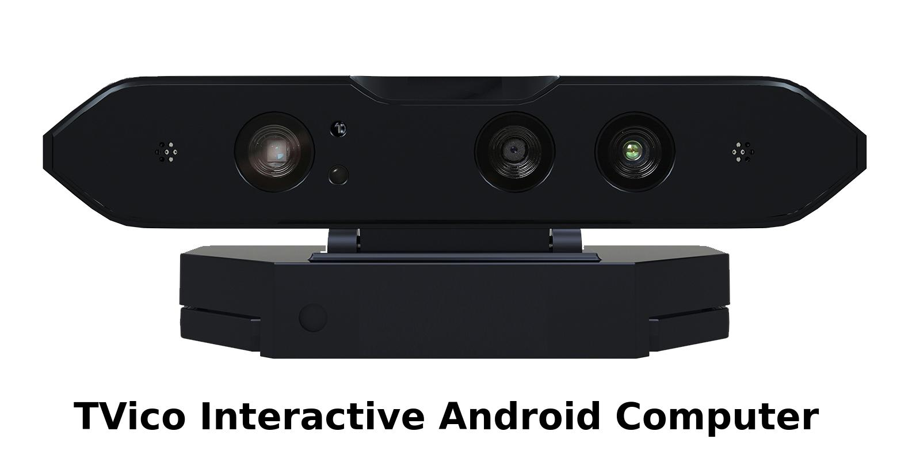
</p>

There are two options for development with TVico:

1. **TVico** as a standalone computer (see [Standalone case](#standalone-case)): apps are installed and run on TVico. TVico is connected to any TV via HDMI.

2. **TVico** as a peripheral (see [Wireless case](#wireless-case)) (network connection is used). In this case, TVico acts as a server and your Android device/PC acts as a client:
    * **Android**: can be used with Mobile AR/VR HMD. Apps are installed and run on your Android device.
    * **Windows/Linux**: apps are installed and run on your PC (only skeleton info is transferred).

_**Note**: TVico (server) and your Android device/PC (client) should be linked to the same network._

Please see the installation instructions for both cases below.

## Standalone case

1. Download [Nuitrack.apk](/Platforms/Nuitrack.apk).
2. Install *Nuitrack.apk* on TVico following the [installation instructions for Android](Install.md#android).
3. Launch the Nuitrack application.
4. Click **Compatibility test** and wait until the test is complete.
5. Enter your secret key and press **Upgrade to Pro**.
6. Your device will get license from the activation server and after that Nuitrack will be fully-functional on this device (without 3 minute time limit).
7. Press **Test/Run** to test Nuitrack middleware.

_**Note**: Check out our [free Android motion controlled games for TVico](https://tvico.io/#rec84627112) developed with **Nuitrack SDK**. You can use these demo games as a reference for development of your own Android games. Please note that **Nuitrack.apk** installed on TVico is required._

## Wireless case 

### Installation of TVico.apk on TVico 

1. Allow your device to install applications from unknown sources. To do this, go to **Settings → Security** and tick **Unknown sources**.
2. Download [TVico.apk](/Platforms/TVico.apk) (beta) and install it. To install the APK package, locate it in the file manager, open and tap **INSTALL**.
3. Launch the Nuitrack application.

<p align="center">
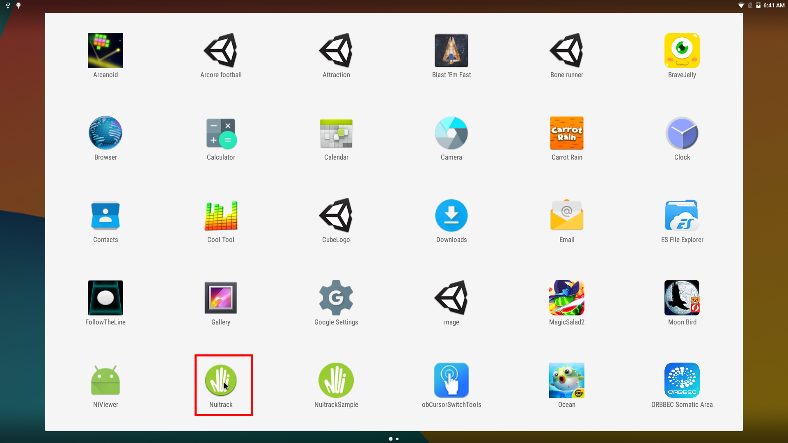
</p>

4. Wait for Nuitrack installation. If the Nuitrack installation is successful, the message will be displayed as shown in the picture below:

<p align="center">
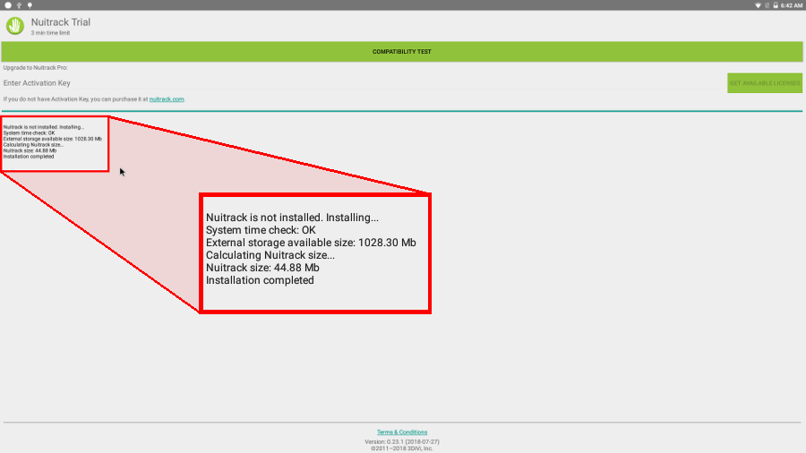
</p>

### Setting Up TVico

1. Click **Compatibility test** and wait until the test is complete.

<p align="center">
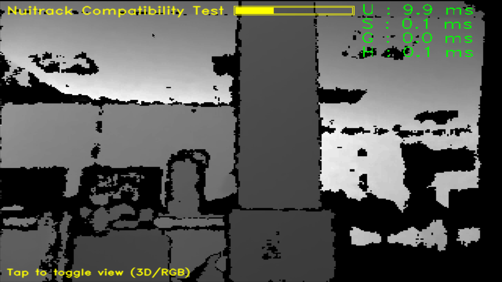
</p>

2. Enter your Activation Key and click **Get available licenses**.

<p align="center">
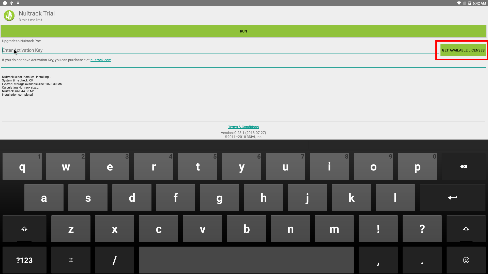
</p>

3. Choose the **TVico** license type and click **Activate**. After that, the Nuitrack app will be restarted.

<p align="center">
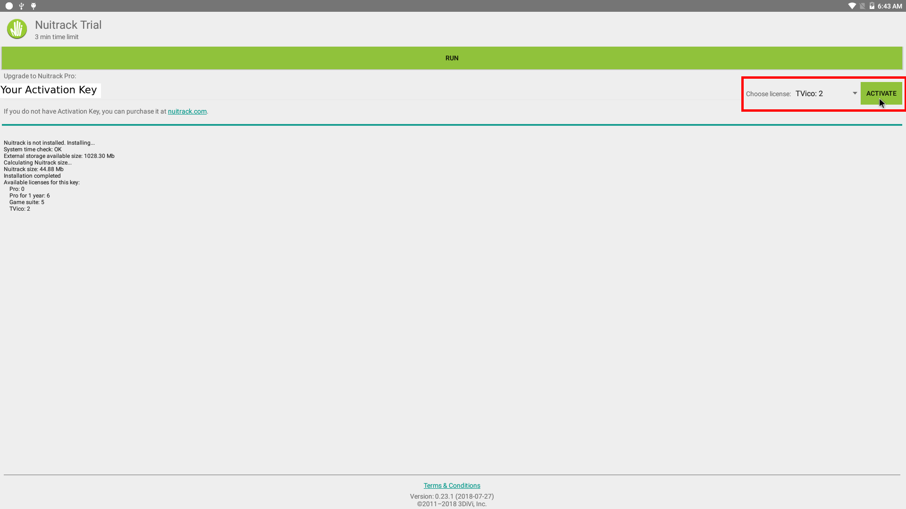
</p>

4. Connect to the network. Possible connection options are:  
* LAN connection;
* Wi-Fi connection;
* Wi-Fi hotspot.

For example, to turn on a Wi-Fi hotspot, you should go to **Android Settings → Wireless & Networks → More → Tethering & Portable hotspot** and tick the **Portable Wi-Fi hotspot**.

<p align="center">
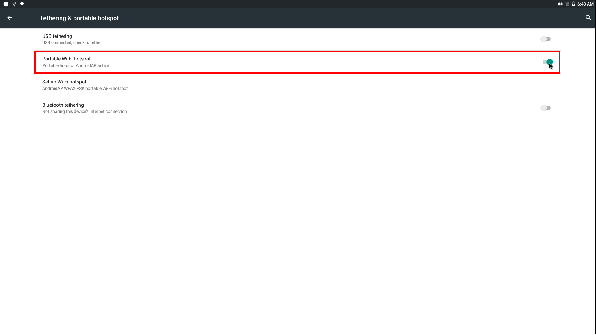
</p>

5. To turn on the server, run the Nuitrack app. When the server is running, the notification is displayed. To turn off the server, just click on the notification.

<p align="center">
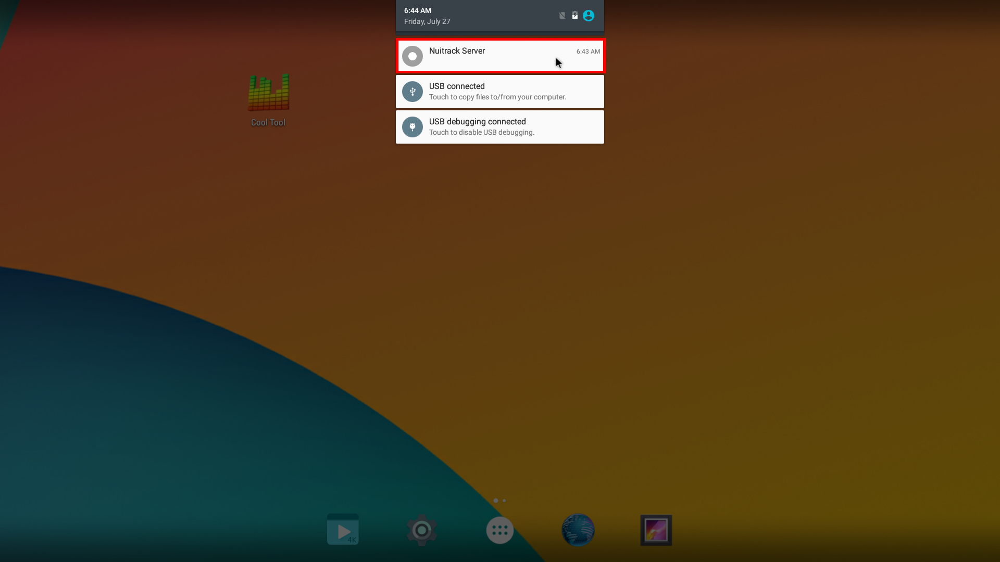
</p>

### Setting Up Your Device

#### Android 

1. Download and install [VicoVR.apk](https://play.google.com/store/apps/details?id=com.vicovr.manager) on your device.
2. Connect to the TVico Wi-Fi access point (its default name is **AndroidAP**).

<p align="center">
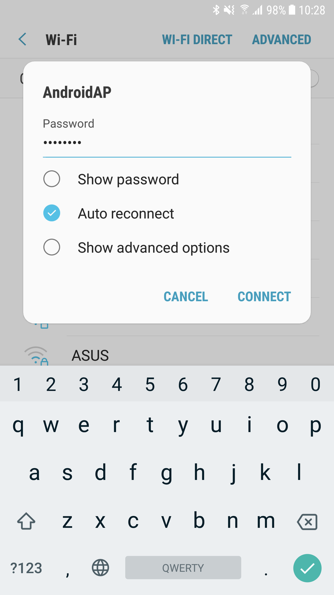
</p>

3. Run the VicoVR app.
4. Go to **Settings → Developer Options** and set the IP Address of TVico in your network (for example, the default IP address for Wi-Fi hotspot on TVico would be **192.168.43.1**).

<p align="center">
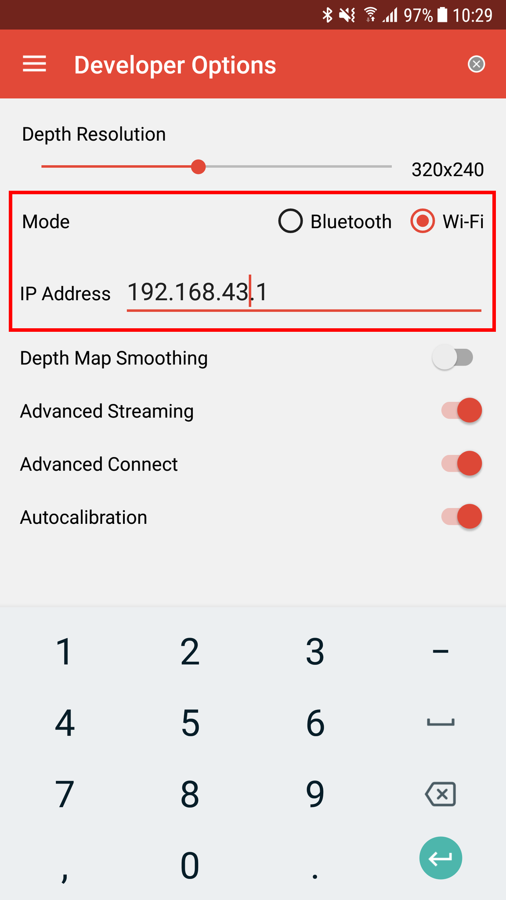
</p>

5. In Settings, click on the **Test Sensor** button. You will see the window with the depth map, user mask and skeleton.

<p align="center">
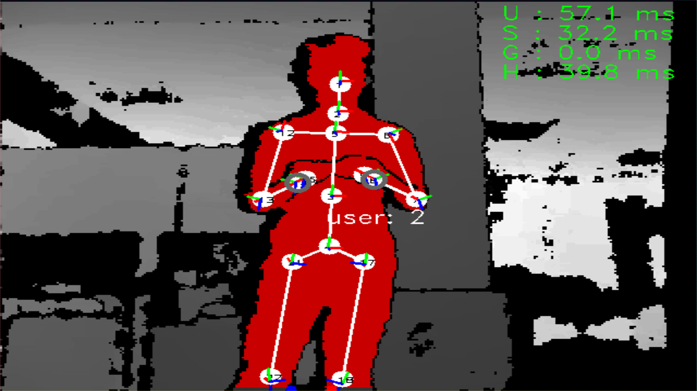
</p>

#### Windows / Linux

_**Note**: In this case, only skeleton data can be transferred._

1. Connect your PC to the Wi-Fi access point (its default name is **AndroidAP**).

2. **[Unity]**

Import **NuitrackSDK.unitypackage** to your project and drag-and-drop the **Nuitrack Scripts** prefab to the Scene. In the **Nuitrack Manager** section, select **Wifi Connect From PC → TVico**. After that, **Build and run** the project.

<p align="center">
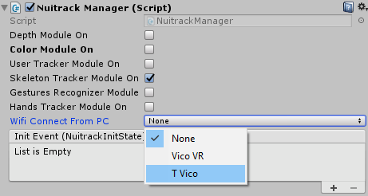
</p>

   **[С# sample with nuitrack.net.dll]**

Use the following code to initialize Nuitrack:
```cs
Nuitrack.Init("", Nuitrack.NuitrackMode.DEBUG);    
Nuitrack.SetConfigValue("Settings.IPAddress", "192.168.43.1"); // TVico IP-address
```
