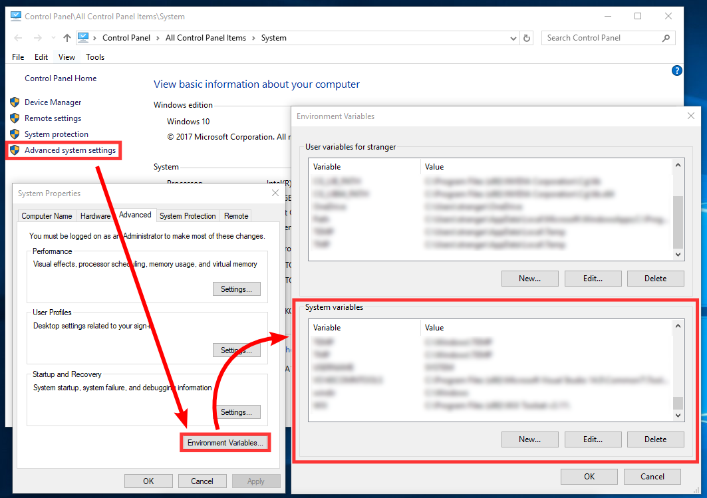

# Troubleshooting 

In this section, you can find the information about the most common errors related to Nuitrack installation and usage and possible solutions. If you cannot find your problem in this section, please take a look at the [Knowledge Base](https://community.nuitrack.com/t/nuitrack-knowledge-base/807) in the [Nuitrack community](https://community.nuitrack.com/) or contact support-nuitrack@3divi.com

## Windows

* If the installation freezes at 66%, please follow the steps below:
  1. Run `clear_sys_env.bat` as Administrator
  2. Run `maintenance_tool.exe`
  3. Install Nuitrack from scratch
* If there were any errors during the automatic setup, please check the environment variables:
  * There should be the `NUITRACK_HOME` variable with the value of `<install-folder>\nuitrack`
  * The 'PATH' variable should include the path to `<install-folder>\nuitrack\bin`

_**Note**: To add a new environment variable or change the existing environment variable manually, use the "Environment Variables" dialog. To access it, open the "System" dialog (Win + Break), then select **Advanced system settings → Environment Variables...**_

<p align="center">
<br>
<b>Editing environment variables in Windows 10</b><br>
</p>

* If the OpenNI 1.5 API doesn't work, register the Nuitrack dynamic module for OpenNI 1.5:  
  32-bit:
  ```
  "C:\Program Files (x86)\OpenNI\Bin\niReg.exe" -r <install-folder>\nuitrack\bin\libnuitrack_ni.dll <install-folder>\nuitrack\data
  ```
  64-bit:
  ```
  "C:\Program Files\OpenNI\Bin64\niReg64.exe" -r <install-folder>\nuitrack\bin\libnuitrack_ni.dll <install-folder>\nuitrack\data
  ```
* If you have any problems with your sensor, make sure that you allowed apps to access your camera: select **Settings → Privacy → Camera** and turn on **"Allow apps to access your camera"**.

## Linux

* If you see "ERROR: Couldn't open device ..." message when trying to use Nuitrack, try to set permissions for USB devices with the following command:
  ```
  sudo chmod -R 777 /dev/bus/usb/
  ```
* If you installed the .deb package and encounter the following error:
  ```
  WARNING: Can not load library module: /usr/etc/nuitrack/middleware/libNuitrackModule.so
  ERROR: Empty factory for DepthProvider
  ```
  it can indicate that the *libcurl4-openssl-dev* package is not installed to your system. Run the following command to check the presence of this package:
  ```
  ldd /usr/etc/nuitrack/middleware/libNuitrackModule.so | grep curl
  ```
  If you see the output `libcurl.so => not found`, install the package by executing the command:
  ```
  sudo apt-get install libcurl4-openssl-dev
  ```
* If you have any errors with the Nuitrack libraries, make sure the environment variables **NUITRACK_HOME** and **LD_LIBRARY_PATH** are set correctly using the following commands:
  ```
  echo $NUITRACK_HOME
  echo $LD_LIBRARY_PATH
  ```
  NUITRACK_HOME should be equal to */usr/etc/nuitrack*. LD_LIBRARY_PATH should include */usr/local/lib/nuitrack* path.  
  If the environment variables are empty, set them manually using the following commands (as root):
  ```
  echo "export NUITRACK_HOME=/usr/etc/nuitrack" > /etc/profile.d/nuitrack_env.sh
  echo "export LD_LIBRARY_PATH=/usr/local/lib/nuitrack" >> /etc/profile.d/nuitrack_env.sh
  . /etc/profile.d/nuitrack_env.sh
  ```

## Unity 

If you run your project with Nuitrack in Unity and encounter the following exception:  
```
NuitrackException (TerminateException): WARNING: Cannot load library module: C:\Program Files\Nuitrack\nuitrack\nuitrack/middleware/NuitrackModule.dll
ERROR: TBB version mismatch: runtime library version is 9102, but the application was compiled with the 11102 version!
```  
follow the steps below (refer to [the Intel® Threading Building Blocks documentation](https://www.threadingbuildingblocks.org/docs/help/reference/appendices/known_issues/interoperability.html) for more details):
* Close the Unity editor
* Replace the TBB library in your Unity editor with the library from Nuitrack:
  * *Windows*: copy the `tbb.dll` library from `%NUITRACK_HOME%/bin` to your Unity editor folder (for example, `C:\Program Files\Unity\Hub\Editor\2019.4.8f1\Editor`)
  * *Linux*: copy the `libtbb.so.2` library from `/usr/local/lib/nuitrack/` to your Unity editor folders (for example, `/home/user/2019.3.3f1/Editor` and `/home/user/2019.3.3f1/Editor/Data/Tools`)
* Run the Unity editor again

## Unreal Engine

If you run your project with Nuitrack in Unreal Engine and encounter the following exception:  
```
NuitrackException (TerminateException): WARNING: Cannot load library module: C:\Program Files\Nuitrack\nuitrack\nuitrack/middleware/NuitrackModule.dll
ERROR: TBB version mismatch: runtime library version is 9102, but the application was compiled with the 11102 version!
```  
follow the steps below (refer to [the Intel® Threading Building Blocks documentation](https://www.threadingbuildingblocks.org/docs/help/reference/appendices/known_issues/interoperability.html) for more details):
* Close the Unreal Editor
* Replace the TBB library in your Unreal Editor with the library from Nuitrack:
  * *Windows*: copy the `tbb.dll` library from `%NUITRACK_HOME%/bin` to your Unreal Editor folder (for example, `C:\Program Files\Epic Games\UE_${VERSION}\Engine\Binaries\Win64`);
* Run the Unreal Editor again

## General recommendations

* Make sure that the date and time settings on your device are correct
* To get started with a new device, you must first install the drivers for it. Contact the device vendor to get the drivers
* After the first installation is complete, **reboot the system** to let the system changes take effect

## 3D Sensor Known Issues 

### Orbbec Astra Pro 

* If your sensor is plugged in but is not detected by Nuitrack and is not displayed in the activation tool, please install the Microsoft Visual C++ 2013 redistributable package (instead of the version for Microsoft Visual C++ 2017). You can download this package on the [official Microsoft website](https://www.microsoft.com/en-us/download/details.aspx?id=40784).
* If RGB stream shows a picture from your webcam or doesn't work at all on Windows or Linux then open `nuitrack.config` and set the value of `AstraProPerseeDepthProvider.CameraID` (usually it’s `0`, but if it doesn’t work, try `1`, `2`, and so on).

### Kinect V1

To install the driver for Kinect V1, download [Kinect SDK v1.8](https://www.microsoft.com/en-us/download/details.aspx?id=40278) and follow the [Install Instructions](https://www.microsoft.com/en-us/download/confirmation.aspx?id=40278).

_**Note**: If you use Windows 10, we recommend to run *KinectSDK-v1.8-Setup.exe* in compatibility mode for Windows 8._

### Kinect V2

Starting from v0.24.0, Nuitrack supports Kinect V2 on Windows (64-bit) and Linux x64. To install the driver for Kinect V2, download [Kinect SDK v2.0](https://www.microsoft.com/en-us/download/details.aspx?id=44561) and follow the [Install Instructions](https://www.microsoft.com/en-us/download/confirmation.aspx?id=44561).

_**Warning**: Kinect SDK v2.0 does not support 32-bit version of Windows._

### Intel® RealSense™ Depth Camera D400 series

#### Windows/Linux 

* Supported OS versions: Windows 7, Windows 8.1, Windows 10 and Ubuntu 14.04 or higher
* Before using the sensor, you need to download and install Intel® RealSense™ SDK 2.0 [for Windows](https://goo.gl/hkhUdR) or [for Linux](https://goo.gl/wmFSuG)
* Supported camera firmware version: 5.12.7.100 or higher. To update the camera firmware, please, download the latest firmware from [the official Intel website](https://dev.intelrealsense.com/docs/firmware-releases)

#### Android

Support for RealSense on Android was added in Nuitrack v0.26.0.

* Recommended RealSense D415/D435 firmware version is 5.11.1.0
* Rooted and non-rooted devices can be used
* Read permission for a root folder is required. You can check the permissions using any file manager, for example, ES File Manager: if the "/" folder is empty, then read permissions for the root folder aren't granted in the current firmware version of your Android device.
* USB-OTG support is required
* RealSense D415 and D435 were tested with the following Android devices:
  * Odroid XU3 (Android 4.4.4 Kitkat) (rooted)
  * Samsung Galaxy S4 (Android 5 Lollipop) (non-rooted)
  * Samsung Galaxy S5 (Android 6 Marshmallow) (non-rooted)
  * Samsung Galaxy S6 (Android 7 Nougat) (non-rooted)
  * Samsung Galaxy S8/S8+ (Android 8 Oreo) (non-rooted)
