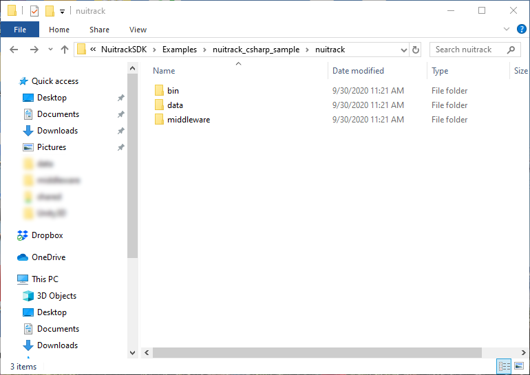
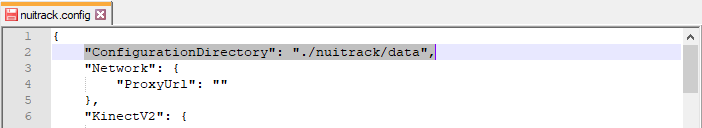
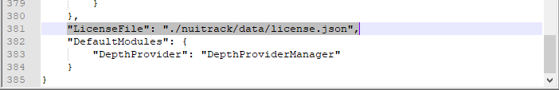
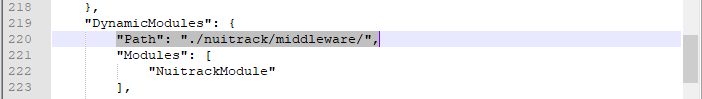

# Integrating Nuitrack with your application (Windows/Ubuntu)

In this tutorial, you'll learn how to integrate Nuitrack with your application. We're using `nuitrack_csharp_sample` from the Nuitrack SDK as an example. 

1. Install Nuitrack on your system (see the [Installation Instructions](Install.md)).

2. Create the subfolder `nuitrack` in the application directory `<app_dir>` and copy the following directories from the Nuitrack installation folder to the directory `<app_dir>/nuitrack`:
   * Windows:
     * `%NUITRACK_HOME%\nuitrack\nuitrack\bin`
     * `%NUITRACK_HOME%\nuitrack\nuitrack\data`
     * `%NUITRACK_HOME%\nuitrack\nuitrack\middleware`
   * Linux:
     * `/usr/etc/nuitrack/data`
     * `/usr/etc/nuitrack/middleware`
     * `/usr/local/lib/nuitrack`
	 
   _**Note**: sample application directory:_
     * *Windows:* `C:\Users\<username>\Downloads\NuitrackSDK\Examples\nuitrack_csharp_sample`
     * *Ubuntu:* `~/Downloads/NuitrackSDK/Examples/nuitrack_csharp_sample`
	 
<p align="center">

</p>

3. Edit the configuration file `nuitrack.config`:
   * add the parameter `"ConfigurationDirectory": "./nuitrack/data"`
   
<p align="center">

</p>
   
   * set the parameter `"LicenseFile": "./nuitrack/data/license.json"`
   
<p align="center">

</p>
   
   * set the parameter `"DynamicModules.Path"` to `./nuitrack/middleware`
   
<p align="center">

</p>
   
4. In the source code of `nuitrack_csharp_sample` (`Program.cs`):

   * use the Nuitrack initialization function and specify the path to the `nuitrack.config` file:

    ```cs
    ...
    namespace nuitrack
    {
        ...
        public class MainForm : Form
        {
            ...
            public MainForm()
            {
                try
                {
                    Nuitrack.Init("./nuitrack/data/nuitrack.config");
                }
                ...
            }
            ...
        }
        ...
    }
    ```

   * use the Nuitrack Device API to activate a license:

    ```cs
    ...

    using System.Collections.Generic;
    using nuitrack.device;

    namespace nuitrack
    {
        ...
        public class MainForm : Form
        {
            ...
            public MainForm()
            {
                try
                {
                    Nuitrack.Init("./data/nuitrack.config");

                    // get the list of devices
                    List<NuitrackDevice> devices = Nuitrack.GetDeviceList();
                    if (devices.Count == 0)
                        throw new nuitrack.Exception("No devices found.");

                    // select the first enumerated 3D sensor
                    NuitrackDevice device = devices[0];

                    // activate the selected sensor with the license key
                    bool isActivated = Convert.ToBoolean(device.GetActivationStatus());
                    if (!isActivated)
                    {
                        string activationKey = "<your_license_key>";
                        device.Activate(activationKey);
                        Console.WriteLine("Activation status: {0}", device.GetActivationStatus());
                    }
                    // set the selected 3D sensor
                    Nuitrack.SetDevice(device);
                }
                ...
            }
            ...
        }
        ...
    }
    ```

   See the full source code of `nuitrack_csharp_sample` in [Examples/nuitrack_csharp_sample/Program.cs](/Examples/nuitrack_csharp_sample/Program.cs).

5. Follow the steps in `README.txt` to build `nuitrack_csharp_sample`.

6. Uninstall Nuitrack from your system: 
   * [Windows] run the `maintenance_tool.exe` program from the Nuitrack installation folder. 
   * [Ubuntu] run the command `sudo dpkg -r nuitrack`

   Wait until the program is finished uninstalling.

7. Run `nuitrack_csharp_sample` to check that Nuitrack has been successfully integrated with the application:
   * open a *Windows PowerShell* (or *Terminal* on Ubuntu) session in the `<app_dir>` folder;
   * add the `./nuitrack/bin` path to the PATH environment variable for the current session and run `nuitrack_csharp_sample`:
     * Windows:
       ```
       > $env:Path = "./nuitrack/bin;$env:Path"
       > .\nuitrack_csharp_sample.exe
       ```
     * Ubuntu:
       ```
       $ export LD_LIBRARY_PATH=./nuitrack/nuitrack:$LD_LIBRARY_PATH
       $ ./nuitrack_csharp_sample
       ```