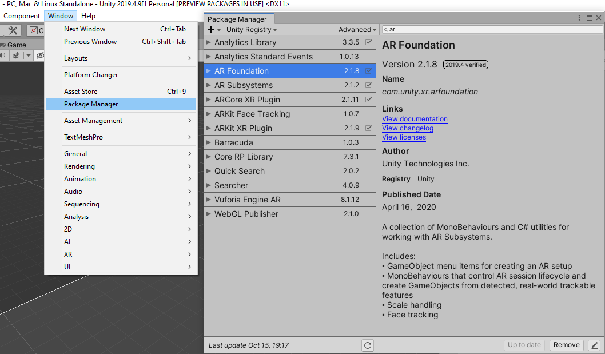
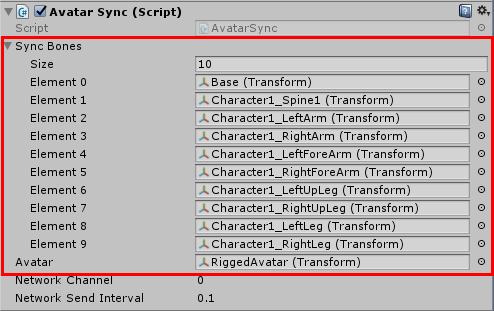

# Creating an AR Football Game using Nuitrack and ARCore/ARKit

In this tutorial you'll learn how to create an interesting multiplayer game using **ARCore** (for Android) or **ARKit** (for iOS) and **Nuitrack** - we are excited to present you **AR Football**! At least two players are needed for this game (the more the better). One player - "a striker" - points his Android device's camera at any surface and after that a grid appears on suitable surfaces that you can use to place an AR object, which is the goal with a goalkeeper. The striker's goal is to throw the ball and beat the goalkeeper. In turn, the other player - "the goalkeeper" - should catch the ball. The goalkeeper sees the goal on the TV screen or monitor. Several players can play as strikers. Nuitrack tracks the movement of players, the data is synchronized and sent via Wi-Fi network. 

You can find the finished project in **Nuitrack SDK**: **Unity 3D → NuitrackSDK.unitypackage → Tutorials → AR Football**

<p align="center">

</p>

To create this game, you'll need a couple of things: 

Hardware: 
* **TVico** (with the pre-installed Nuitrack.apk) or a desktop with a connected sensor from [the list of supported devices](https://nuitrack.com/#sensors) 
* [ARCore-](https://developers.google.com/ar/discover/supported-devices) or [ARKit-compatible device](https://developer.apple.com/documentation/arkit/verifying_device_support_and_user_permission)

Software:
* **Nuitrack SDK** (we’ve built this project with v1.3.3)
* **Unity** (2017.4 or higher)

## Setting Up the Project  

1. Create a new Unity project. 
2. Select the **Android** or **iOS** platform in **File → Build Settings**. 

<p align="center">

</p>

3. In **Player Settings**, fill in the **Company Name** and **Product Name**. 

<p align="center">

</p>

4. Go to **Window → Package Manager** and install the following plugins: 
* **AR Foundation** 
* **ARCore XR Plugin** (for Android) 
* **ARKit XR Plugin** (for iOS)
* **Multiplayer HLAPI** (for Multiplayer)

<p align="center">

</p>

5. [Android] In **Other Settings**, select **Minimum API Level 7.0** (which is required by ARCore), disable **Multithreaded Rendering** (which is an ARCore requirement as well) and fill in the **Package Name** in the **Identification** section.  
[iOS] Follow the steps from the section [Unity package for iOS](https://github.com/3DiVi/nuitrack-sdk/tree/master/iOS-beta#unity-package-for-ios).

<p align="center">

</p>

## Integrating AR Foundation to the Project

1. * Create an empty object and call it **AR Session Origin**. Add the following components to this object: **AR Session Origin**, **AR Plane Manager**, **AR Raycast Manager**. 
   * Rename the camera to **AR Camera** and make it a child to the **AR Session Origin** object. Add the following components to this object: **Tracked Pose Driver**, **AR Camera Manager**, **AR Camera Background**. 
   * Create another empty object and call it **AR Session**. Add the following components to this object: **AR Session**, **AR Input Manager**.

2. Drag-and-drop the **Environment** object from Nuitrack SDK to the scene. This object is very important because it represents a goal with a goalkeeper. 
3. Create a new C# Script `Environment.cs`, in which we'll describe the behavior of this object. This script will contain a reference to the **Target** object (target for the ball) that's already attached to our prefab. Also, the size of the Environment object will be set at start.

```cs
using UnityEngine;
using UnityEngine.Networking;

public class Environment : MonoBehaviour 
{
	public Transform aim;
	[SerializeField] Vector3 clientSize;

	void Start()
	{
		transform.localScale = clientSize;
	}
}
```

4. Drag-and-drop the **Target** object to the **aim** field. Set an appropriate size of the **Environment** object in the **Size** field, for example, (0.1,0.1,0.1).

<p align="center">

</p>

5. Rename **Example Controller** to **Football Controller**, just for the sake of convenience. Delete the `HelloARController` script. Instead, let's create our own script `FootballARController.cs`: **Add Component → C# Script → FootballARController**. In this script, we’ll describe interaction of a user with AR.
6. Add the `UnityEngine.XR.ARFoundation`, `UnityEngine.XR.ARSubsystems`, and `UnityEngine.Networking` namespaces to the script.
7. Add some necessary fields:

```cs
// After AR finds the anchor points in the real world, the camera starts to move around the scene.
public Camera mainCamera;

// A model to place when a raycast from a user touch hits a plane.
GameObject environment;

// A gameobject parenting UI for displaying the "searching for planes" snackbar.
// Message "Searching for surfaces". 
public GameObject searchingForPlaneUI;

// The rotation in degrees need to apply to model when model is placed.
private const float modelRotation = 180.0f; // Rotate the Environment to make it face the camera.

// A list to hold all planes AR is tracking in the current frame. 
TrackableCollection<ARPlane> allPlanes;

[SerializeField] ARRaycastManager raycastManager;
[SerializeField] ARPlaneManager planeManager;

[SerializeField] Transform aRCoreDevice; // Must be the parent of the camera. 
```

Then, go to the Unity editor and set the corresponding components in the fields **raycastManager**, **planeManager**.

8. Get found surfaces in `Update`. Create a variable to show / hide a surface. If at least one surface in tracked, the message "Searching for Surface" is hidden.

```cs
public void Update()
{
	// Hide snackbar when currently tracking at least one plane.
	allPlanes = planeManager.trackables;

	bool showSearchingUI = true;

	showSearchingUI = allPlanes.count == 0;

	// Hide or show the inscription "Searching for surfaces ..."
	searchingForPlaneUI.SetActive(showSearchingUI);
}
```

9. In `Update`, check whether the "striker" user touches the screen or not.

```cs
// If the player has not touched the screen, we are done with this update.
Touch touch;
if (Input.touchCount < 1 || (touch = Input.GetTouch(0)).phase != TouchPhase.Began)
{
	return;
}
```

10. In `Update`, create a variable to store the information about the ray (after the user touched the screen). It stores the coordinates of the place, from where the ray is cast. 

```cs
Ray ray = mainCamera.ScreenPointToRay(Input.mousePosition);
RaycastHit hitRay;
```

11. In `Update`, process the raycasting: we make sure that the surface is tracked and then cast the ray from the appropriate side (because it’s against the football rules to throw the ball in the back of the goalkeeper). Then we process the throwing of a ball. The goal should be placed on the way of the ball; if not, we place the goal with the goalkeeper (**Environment**) and turn it accordingly. In this project, we use two rays - one is an AR ray (detects the surfaces), and the other is a Unity ray (which detects the required Unity object, the goal). 

```cs
environment = FindObjectOfType<Environment>();

if (Physics.Raycast(ray, out hitRay, 100))
{
    if (raycastManager.Raycast(ray, hits, TrackableType.PlaneWithinPolygon) && environment)
    {
        // If the beam hits the correct (not the opposite) part of the surface, then we immediately check if there is a gate along the way. If the surface is "empty", then we put the gate on it. If there are gates on the way, then "kick the ball"
        if (hitRay.transform.name.Contains("ARPlane"))
        {
            environment.transform.position = hits[0].pose.position;
            environment.transform.rotation = hits[0].pose.rotation;
            environment.transform.Rotate(0, modelRotation, 0, Space.Self);
        }
        else
        {
            // If there are no surfaces along the path of the beam, but there is a gate, then "kick the ball"
            KickBall(hitRay.point);
        }
    }
    else
    {
        KickBall(hitRay.point);
    }
}
```

12. Check whether there is the goal on the way of the ball: if yes, kick the ball. Set up our ray, which is cast to the place defined by the user's touch. Put the target point if the ball touched anything. In the script, make the camera child to the **Environment** in order to find the local position (coordinates) of the camera in relation to the **Environment**. We need to do all that stuff to find the point from which the ball should be thrown.  Create a ball on the scene, set its position, rotation and the child object (**Environment**) (the same settings as the camera). Set the target point. Return the camera to the original position above the **AR Session Origin**. The return method returns true only if the ball hit some object (and there was the goal), otherwise false. 

```cs
// If you can kick the ball, then kick it and return true, if not, then return false
void KickBall(Vector3 targetPos)
{
    // Sending a "kick" message to the server
    mainCamera.transform.parent = environment.transform; // We temporarily make the camera a child object to our "environment". This is necessary to get its local coordinates relative to the game object "Environment" (GameObject environment)
    environment.aim.position = targetPos;
    FindObjectOfType<PlayerController>().Kick(mainCamera.transform.localPosition, environment.aim.transform.localPosition);

    mainCamera.transform.parent = aRDevice.transform; // Return the camera
}
```

13. In Unity, set the fields in **FootballController** as shown in the picture below: 

<p align="center">

</p>

14. Connect your device to the PC and run the project. When a user points the camera of the device at real surfaces (for example, a table), he will see a grid. As the user touches the grid, an AR goal with a goalkeeper are placed. By default, a user sees one goal with a goalkeeper, which is created automatically after the start of the project. 

<p align="center">

</p>

_**Note:** It's not necessary to build the project to test some AR functions - they're available from the Unity editor. You just need to connect your device via USB and run the project. If you don't need this function, you can easily disable it: untick **Edit/Project Settings/Arcore/Instant Preview enabled**._ 

## Creating a Multiplayer

Since several players can participate in our game (one goalkeeper and several strikers), we have to create a server and client for network play.  The goalkeeper will be a server and strikers will connect to it as clients. All players should be in one Wi-Fi network. To connect to the server, a client will only need to press the **Connect** button. 

1. We'll use `Network Manager.cs`, which is a standard Unity script for networking. Add a new object to the **Striker** scene: **Empty Object → Network Manager**, and add the **Network Manager(Script)** component. 
2. Save the **Environment** prefab and delete it from the scene.
3. Add the **Environment** prefab to **Network Manager** to make our system know that this object should be spawned: **Network Manager (Script) → Registered Spawnable Prefabs**.

<p align="center">

</p>

4. The `Network Discovery` script defines the searching of servers in the local network. This is a standard Unity script as well. We'll modify this script to make our game a little bit simpler for a user. By default, a user has to select the required server from the list of found servers. We'll make this project a bit more user-friendly: the connection to the server will be automatic. Create a new script `QuickConnectNetworkDiscovery.cs`. The `QuickConnectNetworkDiscovery` class must inherit from the standard `NetworkDiscovery` class.

```cs
using UnityEngine.Networking;

public class QuickConnectNetworkDiscovery : NetworkDiscovery {

	public override void OnReceivedBroadcast(string fromAddress, string data)
	{
		base.OnReceivedBroadcast(fromAddress, data);
 
		if(NetworkManager.singleton.IsClientConnected()) 
			return;
 
		NetworkManager.singleton.networkAddress = fromAddress; // Found server IP is added to Network Manager.
		NetworkManager.singleton.StartClient(); // Connection.
	}
}
```

5. Drag-and-drop the `QuickConnectNetworkDiscovery` script to **NetworkManager**.
6. In Unity, find **Network Manager**, select **QuickConnectNetworkDiscovery**, tick **Use Network Manager** and untick **Show GUI** to hide a debug menu.

<p align="center">

</p>

7. Create a new script `NetworkController.cs`. In this script, we'll create a client and a server, and describe the actions of the server when the client is connected. 
8. Add the namespaces `UnityEngine.UI` and `UnityEngine.Networking`. 
9. Add the fields for scores, client / server, text fields. Hide the scores field to prevent setting the scores from the Unity editor. 

```cs
[HideInInspector]public int score;
public bool isClient; // Select the client or server.

[Header("Server")]
[SerializeField] Text scoreText; // Scores text.
[SerializeField] Text connectionsText; // Text showing the number of connected clients.
[SerializeField]  GameObject environmentPrefab;

[Header("Client")]
[SerializeField] Text connectText; // Text showing the connection state.
```

10. If the **GoalKeeper** scene is run, the server is started. 
11. In the `StartClient` method, the client is initialized and started. Similar, in the `StartServer` method the server, as well as the host, are initialized and started. The goalkeeper (as server) will see the scores, and the strikers (the client) will see the number of connected players. The `StartClient` method is bound to the **Connect** button. 

```cs
private void Start()
{
	// If it's not a client, create a server.
	if (isClient == false)
	{
		StartServer();
	}
}

public void StartClient()
{
	FindObjectOfType<NetworkDiscovery>().Initialize();
	FindObjectOfType<NetworkDiscovery>().StartAsClient();
}

void StartServer()
{
	FindObjectOfType<NetworkDiscovery>().Initialize();
	FindObjectOfType<NetworkDiscovery>().StartAsServer();
	NetworkManager.singleton.StartHost();

	GameObject environment = (GameObject)Instantiate(environmentPrefab);
	NetworkServer.Spawn(environment);
}
```

_**Note:** You can learn more about clients and servers in Unity [here](https://docs.unity3d.com/Manual/UNetDiscovery.html)._

12. In `Update`, update the text with the scores and number of connected players. Also, we'll add the button showing the text with the connection state (**Connect** or **Connected**).

```cs
private void Update()
{
	if (isClient == false)
	{
		scoreText.text = “Scores: ” + score.ToString(); // Update the scores counter.
		connectionsText.text = "connected: " + NetworkManager.singleton.numPlayers; // 	Number of connected clients.
	}
	else
	{
		if(NetworkManager.singleton.IsClientConnected())
			connectText.text = "Connected";
		else
			connectText.text = "Connect";
	}
}
```

13. Drag-and-drop the `NetworkController.cs` script to the **Network Manager**. Tick **Is Client** (as this script describes the client's behavior). 

<p align="center">

</p>

14. Create a **Canvas** that will be used to display the **Connect** button: **Create → UI → Canvas**. Create a button on it: **UI → Button** (the **Connect** button). 
15. Select the button and add the object from the scene: **Button → OnClick + NetworkManager**, then select **Function → NetworkController → StartClient()** (when we press the button, the `StartClient` method is called). 

<p align="center">

</p>

16. Drag-and-drop the text from the **Button** to the **Connect Text** field in **Network Controller**. 

<p align="center">

</p>
 
17. Create a new scene and name it, for example, **GoalKeeper**. 
18. Set the camera position to (0, 1, -5) so that the goal with the goalkeeper are displayed correctly.

<p align="center">

</p>

19. Add the **NuitrackScripts** prefab from **NuitrackSDK.unitypackage** to the scene. Tick **Skeleton Module On** for skeleton tracking.

<p align="center">

</p>

20. Create a **Canvas** on this scene and create two text fields - **ScoreText** and **ConnectedText** - for displaying the scores and connection text. Place the text fields on the **Canvas** the way you want.

## Creating a Ball

1. Time to create a ball on the **Striker** scene! We have to create two objects for the ball: the first object **Ball** always stays in one place and becomes child to the **Environment** when a user kicks the ball; the second object **Ball Model** is child to the **Ball** and moves when a user kicks the ball. Only the **Ball Model** object is synchronized. Create **Empty → Ball** and then add a standard script **Network Transform**, which synchronizes the movement and rotation of GameObjects across the network. 
2. In **Network Transform**, set **Network Send Rate - 0** (as we don't synchronize the parent object), the other settings remain the same.

<p align="center">

</p>
 
3. Add one more component to the **Ball** - **Network Transform Child** - and set its **Network Send Rate** to **20** (20 packages / 1 sec, this will make our ball move smoothly).

<p align="center">

</p>

4. Create a child sphere on the **Ball**: **Create 3D → Object → Sphere** and call it, for example, **Ball Model**. Set up the **Ball Model**: Scale (0.3, 0.3, 0.3), Position (0, 0, 0), Rotation (0, 0, 0). 

<p align="center">

</p>

5. Add the **RigidBody** component and untick **Use Gravity**.

<p align="center">

</p>
 
6. In the **Ball** object, select **Network Transform Child → Target: Ball Model** (so that the position of the child object is synchronized between the server and client).

<p align="center">

</p>
 
7. Create a script `BallController.cs`, in which we'll describe the behaviour of our ball. Add the field `startPosition` for the initial position of our ball and `networkController` that we'll use to differentiate the client from server, set its local coordinates and position. 

```cs
[SerializeField]
GameObject ball;
Vector3 startPosition;
Vector3 endPosition;
float ballSpeed = 3;
Rigidbody rb;
bool inGame = true;
NetworkController networkController;

void Start()
{
	// Get a reference to the RigidBody component.
	rb = GetComponentInChildren<Rigidbody>();
	// Destroy the ball in 7 seconds after Start.
	Destroy(gameObject, 7.0f);
	transform.parent = FindObjectOfType<Environment>().transform;

	transform.localScale = Vector3.one;
	transform.localPosition = Vector3.zero;
	transform.localEulerAngles = Vector3.zero;

	ball.transform.localPosition = startPosition;

	networkController = FindObjectOfType<NetworkController>();
}
```

8. In `Update`, define the movement of our ball if it's in play. When the ball is in game, it moves to a specified point. The movement of the ball according to the script and Unity physics is processed on the server. The clients only receives the position of the ball.

```cs
void Update () {
	if (inGame && networkController.isClient == false) 
	{
		ball.transform.localPosition = Vector3.MoveTowards(ball.transform.localPosition, endPosition, ballSpeed * Time.deltaTime); // Current position, end position, speed.
		ball.transform.Rotate(Vector3.one * ballSpeed); // Rotating the ball when it moves (just for fun).
	}
}
```

_**Note:** You can learn more about Vector3.MoveTowards in Unity [here](https://docs.unity3d.com/ScriptReference/Vector3.MoveTowards.html)._

9. In the `Setup` method, set the start and end positions of the ball.

```cs
public void Setup(Vector3 startPos, Vector3 endPos)
{
	endPosition = endPos;
	startPosition = startPos;
}
```

10. When the ball touches other objects, the physics is enabled. If the ball touches the hand, one point is added. 

```cs
public void OnCollide(Collision collision)
{
	// If the ball touched something, the inGame variable changes its status to false so that collisions are no longer processed.
	if (inGame && networkController.isClient == false) 
	{
		Debug.Log("Ball collide");
		// If the ball touched the hand, add one point.
		if (collision.transform.tag == "Hand")
			FindObjectOfType<NetworkController>().score++;

		// Enable gravity to make our ball fall.
		rb.useGravity = true;
		inGame = false;
	}
}
```

11. The **Ball Model** object, which is a child to the **Ball**, includes colliders, unlike its parent. Let's create a new script `CollideChecker.cs`, in which we'll describe the behavior of our ball when it collides with other objects.

```cs
using UnityEngine;
 
public class CollideChecker : MonoBehaviour 
{
	private void OnCollisionEnter(Collision collision)
	{
		GetComponentInParent<BallController>().OnCollide(collision); // If the ball touched any object, send this information to BallController, which is attached to a parenting object.
	}
}
```

12. Drag-and-drop the script to the **Ball Model**.
13. Drag-and-drop the `BallController.cs` script to the **Ball** and put the **Ball Model** to the **Ball** field.

<p align="center">

</p>

14. Save the **Ball** as a prefab and delete it from the scene. After that define that the **Ball** will be automatically spawned on the server and on the client:  **Network Manager - Network Manager (Script) → Spawn Info → Registered Spawnable Prefabs → Ball - Ball**.

<p align="center">

</p>

## Creating a Striker

1. In Unity, let's create one more important player for our game - a striker: **Empty Object → Player**. 
2. Create a new script called `PlayerController.cs`, in which we'll describe the actions of the striker. Add the `Networking` namespace to the script. Inherit the class from `NetworkBehaviour` so that it can send and receive the messages from the server. Create a field for the `ballPrefab`. Create a new method `Kick`, in which we'll set the start and end positions of the ball. This method is called on the server. To call the method on the server, add the `[Command]` attribute and the `Cmd` method prefix. 

```cs
using UnityEngine;
using UnityEngine.Networking;

public class PlayerController : NetworkBehaviour {

	[SerializeField] GameObject ballPrefab;

	[Command] 
	void CmdKick(Vector3 startPos, Vector3 endPos)
	{
		GameObject ball = (GameObject)Instantiate(ballPrefab);
		ball.GetComponent<BallController>().Setup(startPos, endPos);
		NetworkServer.Spawn(ball);
	}

	public void Kick(Vector3 startPos, Vector3 endPos)
	{
		CmdKick(startPos, endPos);
	}
}
```

3. Drag-and-drop `PlayerController.cs` to the **Player Controller** object and drag-and-drop the **Ball** to the **Ball Prefab** field. Save the **Player** object as a prefab and delete it from the scene. 
4. Add the sending of a message on the ball kick to the server. 

```cs
bool KickBall()
{
...
	if (Physics.Raycast(ray, out hitRay, 100) && environment)
	{
...

		FindObjectOfType<PlayerController>().Kick(mainCamera.transform.localPosition, environment.aim.transform.localPosition);
...
		return true;
	}
}
```

5. Then select **NetworkManager → Network Manager (Script) → Spawn Info** and drag-and-drop **Player** to **Player Prefab** (please note that the **Player** prefab should have the **Network Identity** component). 

<p align="center">

</p>

6. Copy the **NetworkManager** object to the **GoalKeeper** scene. 
7. On the **GoalKeeper** scene, untick **AutoCreatePlayer** in **Network Manager** so that a new player is not created in this scene - we need only one goalkeeper.

<p align="center">

</p>
 
8. Untick **Is Client** on the server. 

<p align="center">

</p>

9. In **Network Manager**, select **Server** and set the fields for the scores and connection texts: **ScoreText - ScoreText (Text)**, **Connection Text - Connection Text (Text)**. 

<p align="center">

</p>

10. Put the **Environment** prefab to the **Environment Prefab** field.

<p align="center">

</p>

11. To keep the size of the **Environment** on the server, add the following code to the `Start` method of the `Environment.cs` script:

```cs
void Start()
{
	if(FindObjectOfType<NetworkIdentity>().isServer == false)
		transform.localScale = clientSize;
}
```

12. In **Build Settings**, untick **GoalKeeper** (as we don’t need it on the Android device)

<p align="center">

</p>

13. Select the **Android version** as on TVico: **Other Settings → Android** (our version on TVico is 5.1.1).

<p align="center">

</p>

14. Connect your TVico to your PC via USB, click **Build and Run** or just connect a compatible sensor to the desktop. 
15. Build the project in two stages: 
	* First of all, build the <b>Striker</b> scene with AR on the Android/iOS device.
	* Then, build the <b>GoalKeeper</b> scene without AR on the TVico or PC with a sensor.

Our project is almost ready: a "striker" user places the goal and goalkeeper on the grid and throws the ball. In his turn, the "goalkeeper" user tries to catch the ball using the TV screen / desktop. 

<p align="center">

</p>

However, at this stage the "striker" can notice that the goalkeeper's avatar does not move but somehow catches the ball. To eliminate this issue, we have to synchronize the server and client. 

## Synchronizing the Server and Client

1. All right, it's time to write some more code to synchronize the movement of avatars. Create a new script, let's call it `AvatarSync.cs`. 

_**Note:** As an alternative, you can synchronize the server and client without writing the script: just use 11 components (10 bones and the Avatar) of the Network Transform Child. We've synchronized the Ball using this way._

2. Add the `Networking` namespace and inherit the `AvatarSync` class from `NetworkBehaviour`. Add an array with bones and avatar transform that will be synchronized. When the rotation of bones and position of the avatar are changed, the server sends messages. 

```cs
using System.Collections.Generic;
using UnityEngine;
using UnityEngine.Networking;
 
public class AvatarSync : NetworkBehaviour 
{
	[SerializeField] Transform[] syncBones;  
	[SerializeField] Transform avatar;  
}

[ClientRpc] // Server sends a message to all clients.
public void RpcOnBonesTransformUpdate(BonesInfoMessage boneMsg)
{
	for (int i = 0; i < boneMsg.bonesRot.Length; i++)
	{
		syncBones[i].localRotation = boneMsg.bonesRot[i];
}
 
	avatar.localPosition = boneMsg.avatarPos;
}

public class BonesInfoMessage : MessageBase
{
	public Quaternion[] bonesRot;  // Rotations of bones.
	public Vector3 avatarPos;  // Avatar position.
}
```

3. Check whether it is the server or not in the `FixedUpdate` method.

```cs
private void FixedUpdate()
{
	if (isServer)
	{
		BoneUpdate(syncBones);
	}
}
```

4. Update the information about the bones and avatar and send a message. 

```cs
public void BoneUpdate(Transform[] bones)
{
	List<Quaternion> rotations = new List<Quaternion>();
 
	for (int i = 0; i < bones.Length; i++)
		rotations.Add(bones[i].localRotation);
 
	BonesInfoMessage msg = new BonesInfoMessage
	{
		bonesRot = rotations.ToArray(), // Rotations of bones.
		avatarPos = avatar.position,
	};
 
	RpcOnBonesTransformUpdate(msg); // Sending the message. 
}
```

5. Drag-and-drop the script to the **Environment** prefab.
6. Put the **RiggedAvatar** object to the **Avatar** field. Fill in the **Sync Bones** array with the bones: you can find the bones on the **Rigged Avatar** object in the **Rigged Avatar** array: **Rigged Model → Model Joints** (all in all, you have to select 10 bones).

<p align="center">

</p>
 
7. Run the project. Now everything is ready for play: the server and client are synchronized, avatars are moving and you're ready to have fun with your friends!  

<p align="center">

</p>
