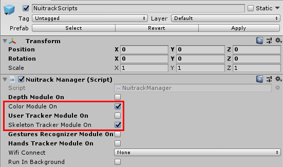
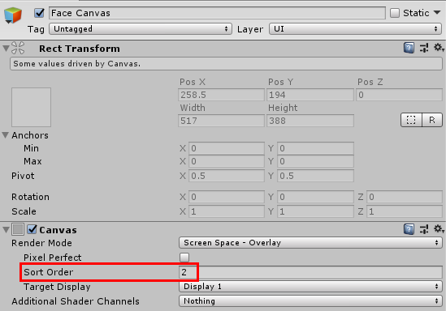
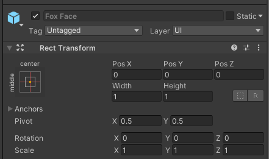
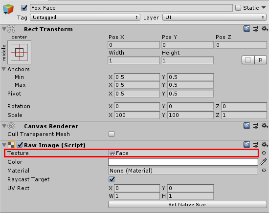
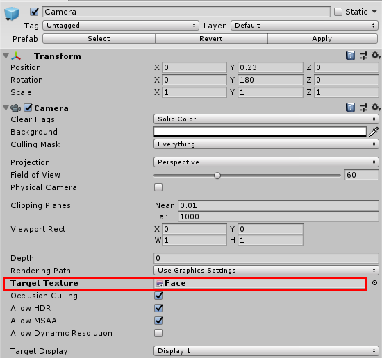
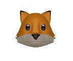
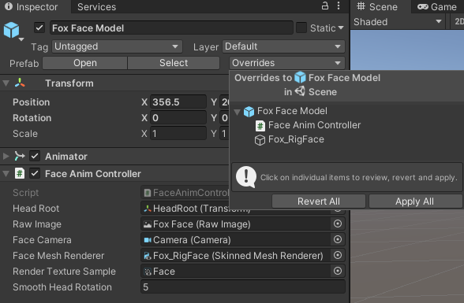
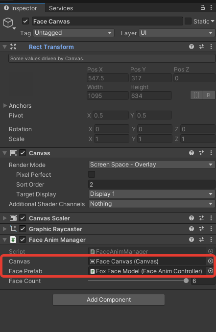
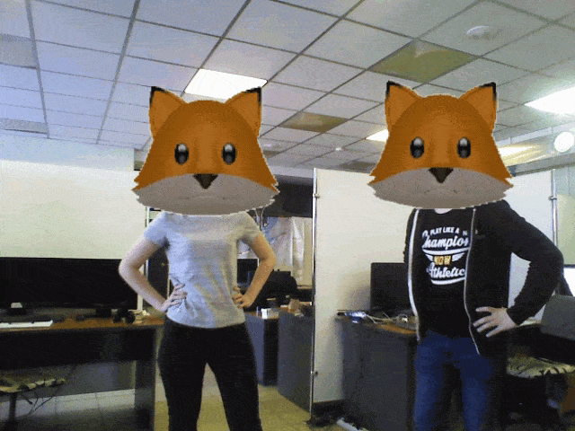

# Creating Animated Emoji with Nuitrack

In this tutorial you'll learn to create animated emoji using the face info from Nuitrack and blendshapes. You'll be able to track several skeletons (from 1 to 6) and see the fox animated emoji instead of the user's face. Fox face mimics user's facial expressions. When a user turns his/her head, the fox head is also rotated. You can notice that fox fur is slightly moving when the fox turns its face - an incredible thing to watch. The fox face is zoomed in and out, i.e. the closer the user is, the bigger the fox head is, and vice versa.  

To create this project, you'll need just a couple of things:
* [Nuitrack Runtime](/Platforms) and [Nuitrack SDK](https://github.com/3DiVi/nuitrack-sdk)
* Unity (2017.4 or higher)
* Any compatible sensor (see the complete list at [Nuitrack website](https://nuitrack.com/#sensors)) 

You can find the finished project in **Nuitrack SDK: Unity 3D → NuitrackSDK.unitypackage → Tutorials → Animated Emoji**

<p align="center">

</p>

## Setting Up the Scene

1. Download and import **NuitrackSDK.unitypackage** from **Nuitrack SDK** to your project (except for the folder **NuitrackSDK/Tutorials/Animated Emoji/Final Assets** because it includes ready-made scripts).
2. Drag-and-drop the **NuitrackScripts** prefab to the scene. Tick the required Nuitrack modules: **Color Module On** (to output an RGB image from a sensor), **Skeleton Tracker Module On** (for skeleton tracking).

<p align="center">

</p>

3. Create a new **Canvas: Create → UI → Canvas**, name it **Face Canvas**. Set its Sort Order to 2. This canvas is used to display the fox face (over the canvases for outputting RGB and displaying skeletons). 

<p align="center">

</p>

_**Note:** In this project, we display the fox face in 2D as the image in this format will be displayed correctly for all supported sensors. If we wanted to create the fox face in 3D, we would need to know which sensor is used and what is its resolution. Nuitrack doesn't provide this information at the moment._ 

4. Create a child object to the **Canvas: Create → UI → Raw Image**, name it **Fox Face**. Go to the settings of this object and set **Width = 1, Height = 1** in the **RectTransform** section. Set the appropriate **Scale**, for example: **X: 100, Y: 100, Z: 1**. This is the image size in pixels, which will soon become the fox face. It's important to keep the 1:1 aspect ratio, otherwise the fox face will be stretched vertically or horizontally. The image size shouldn't be too small, otherwise you won't even see the fox face when you run the project at this stage. 

<p align="center">

</p>

5. Drag-and-drop the **Fox Face Model** prefab to the scene (it's located in <b>NuitrackSDK/Tutorials/Animated Emoji/Prefabs</b>).
6. Create a new texture in the folder **Animated Emoji (Create → Render Texture)**, name it **Face**. This is the texture for rendering the image from the sensor. 
7. Go to the settings of the **Fox Face** object and drag-and-drop the **Face** texture to the **Texture** field. 

<p align="center">

</p>

8. Go to the settings of the **Camera** object (which can be found under the ready-made **Fox Face Model** prefab) and drag-and-drop the **Face** texture to the **Target Texture** field. 

<p align="center">

</p>

Great job! Now we have a 2D fox face that we can further use to mimic our facial expressions. 

<p align="center">

</p>

## Switch the User Face with the Fox Face

1. Save **Fox Face** as a prefab. Then, delete the **Fox Face** and **Fox Face Model** prefabs from the scene.
2. Create a new script `FaceAnimController` to manage the fox faces. Add the `UnityEngine.UI` namespace. Add the necessary fields (their names speak for themselves). The `slerpRotation` is used to smooth the head rotation (otherwise, the head would jitter when turned). The `faceRaw` field is used to display the fox face.

```cs
using UnityEngine;
using UnityEngine.UI;
 
public class FaceAnimController : MonoBehaviour
{
	[SerializeField] Transform headModel;
	[SerializeField] Transform headRoot;
 
	[SerializeField] RawImage rawImage;
	[SerializeField] Camera faceCamera;
 
	[SerializeField] SkinnedMeshRenderer faceMeshRenderer;
	[SerializeField] RenderTexture renderTextureSample;
	[SerializeField] float smoothHeadRotation = 5;

	RenderTexture renderTexture;
 
	RawImage faceRaw;
}
```

_**Note:** Learn more about [Render Texture](https://docs.unity3d.com/Manual/class-RenderTexture.html)._

3. In the `Init` method, pass the `Canvas` to make `rawImage` the child object and create `renderTexture` based on the `RenderTexture`, which we've created in the first section. Pass `renderTexture` to `Camera` and to the texture in the `rawImage` object. Set their position (far away from each other) and stretch the image (our fox face) in screen height. Don't forget to keep the aspect ratio. Spawn the `rawImage` object.

```cs
public class FaceAnimController : MonoBehaviour
{
...
	public void Init(Canvas canvas)
	{
		faceRaw = Instantiate(rawImage, canvas.transform).GetComponent<RawImage>(); // Spawn RawImage
		faceRaw.transform.localScale = Vector2.one * Screen.height;
 
		renderTexture = new RenderTexture(renderTextureSample);
		faceCamera.targetTexture = renderTexture;
		faceRaw.texture = renderTexture;
		faceRaw.gameObject.SetActive(false);
	}
}
```

4. Create the public method `UpdateFace` and specify the required parameters: the info about a user's face from JSON and head joint. Get the position of the head joint in projective coordinates received from Nuitrack  and set the head to these coordinates (multiply X and Y by the width and height of the screen). Change the `headRoot` position along the Z axis using the info from Nuitrack. This would stand for the face zoom, which depends on the distance between a user and a sensor (the closer the user to the sensor is, the bigger the fox face is).

```cs
public class FaceAnimController : MonoBehaviour
{
...
	public void UpdateFace(Instances instance, nuitrack.Joint headJoint)
	{
		Vector3 headProjPosition = headJoint.Proj.ToVector3();
		faceRaw.transform.position = new Vector2(headProjPosition.x * Screen.width, Screen.height - headProjPosition.y * Screen.height);
 
		headRoot.localPosition = new Vector3(0, 0, -headJoint.Real.Z * 0.001f);
	}
}
```

_**Note:** Keep in mind that 1 Unity unit is about 1 m, so we need to adjust the obtained data. To do that, multiply the received values by 0.001 (convert m to mm)._

5. Create the `OnEnable` and `OnDisable` methods: when a face is enabled, rawImage is also enabled to render this face, and vice versa.

```cs
public class FaceAnimController : MonoBehaviour
{
...
	void OnDisable()
	{
		if(faceRaw != null)
			faceRaw.gameObject.SetActive(false);
	}
 
	void OnEnable()
	{
		if (faceRaw != null)
			faceRaw.gameObject.SetActive(true);
	}
}
```

6. Drag-and-drop the **Fox Face Model** prefab to the scene. Then, drag-and-drop the `FaceAnimController` to this prefab. Fill in the fields as shown in the image below. After that, click **Apply** and delete **Fox Face Model** from the scene. 

<p align="center">

</p>

7. Create a new script `FaceAnimManager`. In this script, we'll describe the display of the fox face instead of the user's face. Add the `nuitrack` namespace. Add the `canvas` field for **Canvas** and the `facePrefab` field for the fox face. Set `faceCount` from 0 to 6 (faces are "linked" to skeletons, and the maximum number of tracked skeletons is 6). Add `faceInfo` (parsed JSON from Nuitrack, from which we get all the info about faces) and list of `faceAnimControllers` (list of faces).

```cs
using UnityEngine;
using System.Collections.Generic;
using nuitrack;
 
public class FaceAnimManager : MonoBehaviour
{
	[SerializeField] Canvas canvas;

	[SerializeField] FaceAnimController facePrefab;

	[Range(0, 6)]
	[SerializeField] int faceCount = 6; // Max number of skeletons tracked by Nuitrack

	FaceInfo faceInfo;
	List<FaceAnimController> faceAnimControllers = new List<FaceAnimController>();
}
```

8. In `Start`, spawn as many faces as you set in `faceCount`. Add the fox face to the scene, get `faceAnimController` from it, and call the `Init` method. Place fox faces far away from each other so that the **Camera** won't catch several fox faces at the same time, otherwise, there'll be several fox faces displayed instead of one user's face - this may look funny but it's incorrect. Add `faceAnimController` to the list of `faceAnimControllers`. Specify the necessary number of tracked skeletons (keep in mind that faces are linked to skeletons). Subscribe to `OnSkeletonUpdateEvent`.

```cs
public class FaceAnimManager : MonoBehaviour
{
...
	void Start()
	{
		for (int i = 0; i < faceCount; i++)
		{
			GameObject newFace = Instantiate(facePrefab.gameObject, new UnityEngine.Vector3(i*headsDistance,0,0), Quaternion.identity);
			newFace.SetActive(false);
			FaceAnimController faceAnimController = newFace.GetComponent<FaceAnimController>();
			faceAnimController.Init(canvas);
			faceAnimControllers.Add(faceAnimController);
		}
 
		NuitrackManager.SkeletonTracker.SetNumActiveUsers(faceCount);
		NuitrackManager.onSkeletonTrackerUpdate += OnSkeletonUpdate;
	}
}
```

9. Unsubscribe from the `OnSkeletonUpdate` event. 

```cs
...
    private void OnDestroy()
    {
        NuitrackManager.onSkeletonTrackerUpdate -= OnSkeletonUpdate;
    }
...
```

10. Create the `OnSkeletonUpdateEvent` method: create the `string json` variable and pass the info from JSON to it. Pass the parsed info from JSON to `faceInfo`: replace quotation marks with square brackets to prevent a conversion error in case an array is empty (no info about faces received). If there is no info about faces, the rest of the method is not executed.

```cs
public class FaceAnimManager : MonoBehaviour
{
...
	void OnSkeletonUpdate(SkeletonData skeletonData)
	{
		string json = Nuitrack.GetInstancesJson();
		faceInfo = JsonUtility.FromJson<FaceInfo>(json.Replace("\"\"", "[]"));
 
		if (faceInfo.Instances.Length == 0)
			return;
	}
}
```

11. If a face is received, loop over `faceAnimControllers`. Activate as many faces as many skeletons were found, the rest of the faces are deactivated. By default, 6 faces are activated at startup. Create the `skeleton` variable to store the skeleton corresponding to the face (face ID and skeleton ID are the same). If a skeleton is found, get `headJoint` from it and activate the head joint if its confidence is greater than 0.5. Call the `UpdateFace` method of `faceAnimController`, pass `Instance` (all the face parameters) from JSON and `headJoint`. If a skeleton isn't found, the face is deactivated.

```cs
public class FaceAnimManager : MonoBehaviour
{
...
	void OnSkeletonUpdate(SkeletonData skeletonData)
	...
		for (int i = 0; i < faceAnimControllers.Count; i++)
		{
			if (i < skeletonData.Skeletons.Length)
			{
				Skeleton skeleton = skeletonData.GetSkeletonByID(faceInfo.Instances[i].id);
				if(skeleton != null)
				{
					nuitrack.Joint headJoint = skeleton.GetJoint(JointType.Head);
 
					faceAnimControllers[i].gameObject.SetActive(headJoint.Confidence > 0.5f);
					faceAnimControllers[i].UpdateFace(faceInfo.Instances[i], headJoint);
				}
			}
			else
			{
				faceAnimControllers[i].gameObject.SetActive(false);
			}
		}
}
```

12. Drag-and-drop the `FaceAnimManager` script to **Face Canvas**.
13. Drag-and-drop **Face Canvas** to the **Canvas** field. Drag-and-drop the **Fox Face Model** prefab to the **Face Prefab** field.

<p align="center">

</p>

14. Drag-and-drop the **Color Frame Canvas** prefab from **NuitrackSDK.unitypackage** to the scene. 
15. Run the project. You should see the fox faces instead of the users' faces. This looks quite nice, however, they're all the same at this stage! Let's move on and add emotions to our foxes, which will give them some personality.

<p align="center">

</p>

## Make the Fox Emotional! 

1. First of all, turn on **depth-to-color registration** because a depth map doesn't accurately match an RGB image and we have to align them. To turn on depth-to-color registration, you have to open `nuitrack.config` and set `DepthProvider.Depth2ColorRegistration` to `true`.
2. By default, face tracking in Nuitrack is turned off. To turn on this function, open the `nuitrack.config` file and set `Faces.ToUse` to `true`. 
3. Add the IDs of blendshapes to `FaceAnimController`. You can see the full list of blendshapes in the **Fox_RigFace** object settings. With the help of these blendshapes, you can animate different parts of the fox face. In this project, the fox can open its mouth, blink, smile, and raise eyebrows. When the fox face is turned, its ears and fur on the cheeks are slightly moving. As you can see, we use only 7 blendshapes in this project, though there are much more of them in the list of blendshapes on **Fox_RigFace**. The point is that we can receive the limited number of anthropometric points at the moment (see [Nuitrack Instance-based API [Beta]](Instance-based_API.md) for details), therefore, there is not enough information for other blendshapes (such as cheeks). Add the fields `baseRotation` (initial rotation of `headRoot`), `blendshapeWeights` (from 0 to 100%), and `newRotation` (current head rotation).

```cs
public class FaceAnimController : MonoBehaviour
{
...
	//Face Animation
	[Header("BlendShapesIds")]
	[SerializeField] int jawOpen = 6;
	[SerializeField] int eyeBlinkLeft = 0;
	[SerializeField] int eyeBlinkRight = 2;
	[SerializeField] int mouthLeft = 10;
	[SerializeField] int mouthRight = 11;
	[SerializeField] int browUpLeft = 17;
	[SerializeField] int browUpRight = 18;

	Quaternion baseRotation; 
	BlendshapeWeights blendshapeWeights = new BlendshapeWeights();
	Quaternion newRotation;
...
}
```

_**Note:** Animation of fox ears and fur is described in the `LerpRotation` script._

4. In the `Init` method, save `baseRotation` (initial head rotation, which we use to calculate the current head rotation).

```cs
public class FaceAnimController : MonoBehaviour
{
...
	public void Init(Canvas canvas)
	{
		baseRotation = headRoot.rotation; 
	}
...
}
```

5. In `UpdateFace`, add the local variable `face` and save the face from JSON. Pass `baseRotation` to the `newRotation` variable.

```cs
public class FaceAnimController : MonoBehaviour
{
...
	public void UpdateFace(Instances instance, nuitrack.Joint headJoint)
	{
	...
		Face face = instance.face;
 
		newRotation = baseRotation;
	}
}
```

6. If anthropometric points were detected on a user's face (for this, it should be clearly visible and not overlapped by other objects), set the weights of blendshapes. They're all set in the same way with the help of the `SetBlendShapeWeight` method: pass the index and weight of a blendshape (from 0 to 100) to this method - the weight is taken from the `blendshapeWeights` class, then call the relevant method, for example, `GetJawOpen` to open the fox mouth, pass the `face` to this method, and so on. As a result, we get a weight value for each blendshape. Calculate the head rotation: pass the product of `baseRotation` (initial rotation) and head rotation from JSON to the `newRotation` variable.

```cs
public class FaceAnimController : MonoBehaviour
{
...
	public void UpdateFace(Instances instance, nuitrack.Joint headJoint)
	{
	...
		if (instance.face.landmark == null)
			return;
 
		// Mouth
		faceMeshRenderer.SetBlendShapeWeight(jawOpen, blendshapeWeights.GetJawOpen(face));
 
		// Eyes
		faceMeshRenderer.SetBlendShapeWeight(eyeBlinkLeft, blendshapeWeights.GetEyeBlinkLeft(face));
		faceMeshRenderer.SetBlendShapeWeight(eyeBlinkRight, blendshapeWeights.GetEyeBlinkRight(face));
 
		// Smile
		faceMeshRenderer.SetBlendShapeWeight(mouthLeft, blendshapeWeights.GetSmile(face));
		faceMeshRenderer.SetBlendShapeWeight(mouthRight, blendshapeWeights.GetSmile(face));
 
		// Eyebrows
		faceMeshRenderer.SetBlendShapeWeight(browUpLeft, blendshapeWeights.GetBrowUpLeft(face));
		faceMeshRenderer.SetBlendShapeWeight(browUpRight, blendshapeWeights.GetBrowUpRight(face));
 
		// Head rotation
		newRotation = baseRotation * Quaternion.Euler(face.angles.yaw, -face.angles.pitch, face.angles.roll);
	}
}
```

7. In `Update`, smoothly rotate the head. 

```cs
public class FaceAnimController : MonoBehaviour
{
...
	void Update()
	{
		headRoot.rotation = Quaternion.Slerp(headRoot.rotation, newRotation, slerpRotation * Time.deltaTime);
	}
}
```

_**Note:** Learn more about [Quaternion.Slerp](https://docs.unity3d.com/ScriptReference/Quaternion.Slerp.html)._

8. Run the project. Now our fox face looks quite lively - we can turn the head, see the emotions and moving ears and fur. You can use this sample to develop more sophisticated projects with face tracking, skeleton tracking, and animated emojis using Nuitrack. Have fun!

<p align="center">

</p>
