# Recording Animation using Nuitrack and Motion Capture

In this tutorial you'll learn how to quickly and easily record the animation of your avatar in Unity with Nuitrack. You won't need any additional tools except a depth sensor (from the [list of supported sensors](https://nuitrack.com/#sensors)) to track your skeleton and record the animation. We'll describe three different types of recording animation. You can use any one you like, depending on your needs.

**Generic animation** is used to animate any models. In general, this animation is easier to use compared to the Humanoid animation but it is tied to the hierarchy of Game Objects. This means that animation will be displayed incorrectly if you change the name or position of any animated Game Object.  

**Animation using [GameObjectRecorder](https://docs.unity3d.com/ScriptReference/Experimental.Animations.GameObjectRecorder.html)** is an experimental feature by Unity. It can be used only with Unity 2017.4 or 2018.2. This type can be called a simplified version of Generic animation. It is also used to animate models of any form. This is a convenient animation type, however, it is not optimized yet. As a result, you will face a long list of unnecessary keys due to the fact that all Game Objects are recorded (even those avatar's parts that didn't move at all).

**Humanoid animation** is used (as you can guess) to animate humanoid models. It is more versatile than Generic animation because you can record the animation for a particular model and apply it to any other humanoid model. Also you can set the range of motion for specific muscles.

<p align="center">
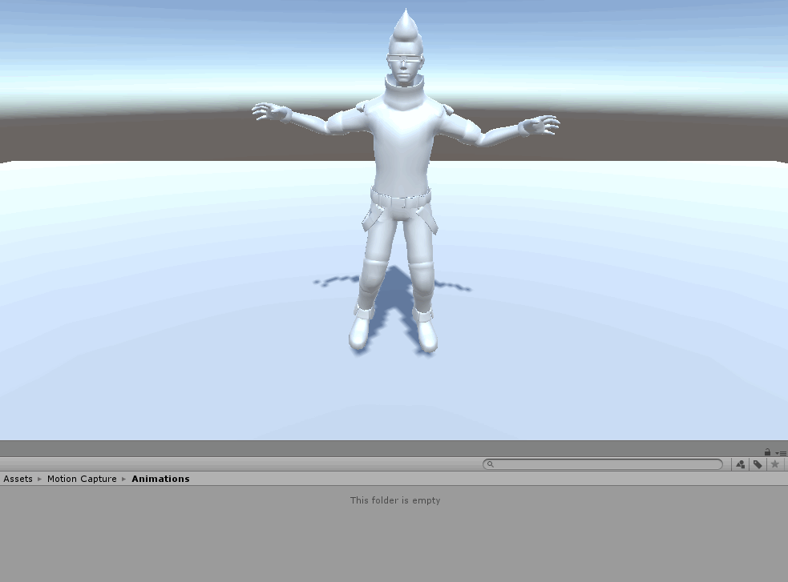<br>
<b>Animation recorded with GameObjectRecorder</b><br>
</p>

Choose the suitable animation type and let's get started! 

## Setting Up the Scene

1. Create a new project. Import [**Nuitrack Skeleton Tracking** Unity Package](/Unity3D) to your project. Drag-and-drop the **Ethan** model from the downloaded package (or any other humanoid model) to the scene. The model should be in a T-Pose so that its joints are matched correctly. To do that, select your model's hands (for example, **EthanLeftArm** and **EthanRightArm** for our model) and set Rotation parameters as in the screenshot below:

<p align="center">
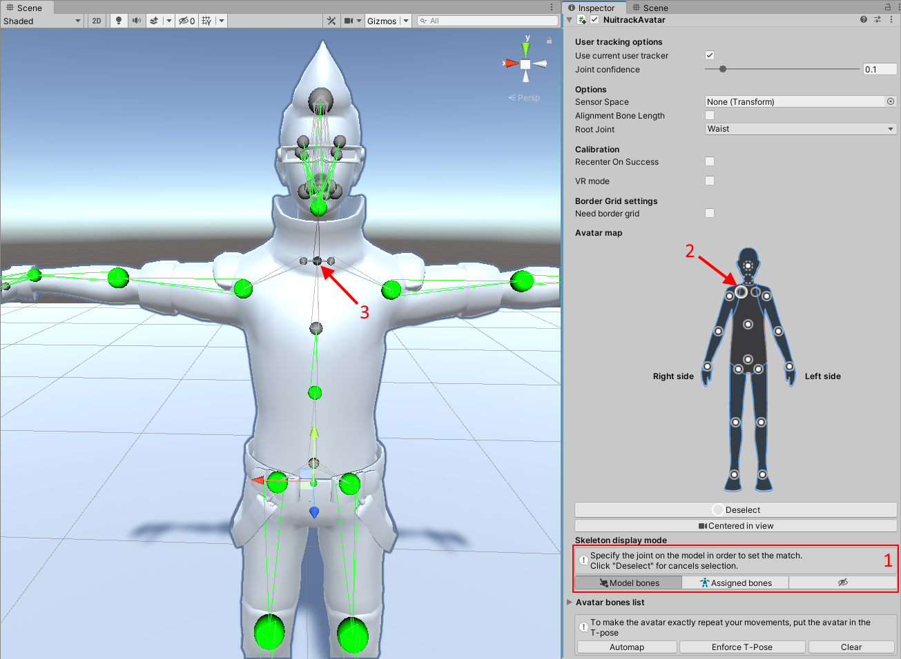<br>
<b>Settings of the "EthanLeftArm" Object</b><br>
</p>

<p align="center">
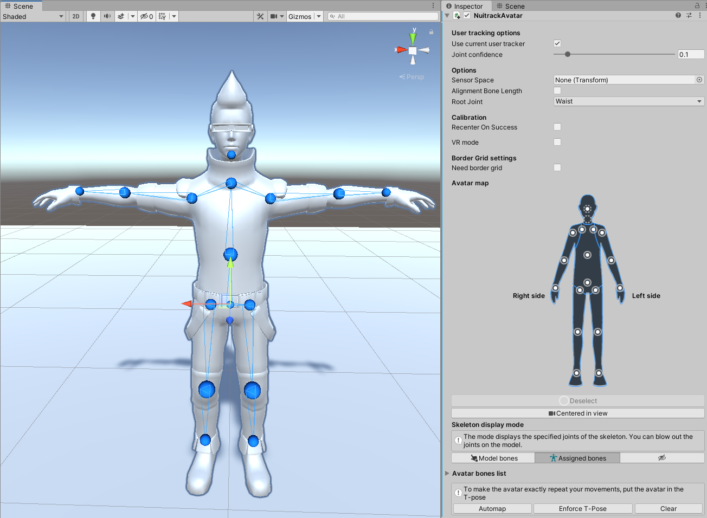<br>
<b>Settings of the "EthanRightArm" Object</b><br>
</p>

2. If you use your own model, you have to drag-and-drop the `RiggedAvatar` script from **Nuitrack Skeleton Tracking** Unity Package to the model (this script is already attached to **Ethan**). Then, select the joints you'd like to animate. All in all, Nuitrack tracks up to 20 joints, see the list [here](https://download.3divi.com/Nuitrack/doc/group__SkeletonTracker__group__csharp.html#ga659db18c8af0cb3d660930d7116709ae). Remove the **Animator** component (if any) from the model so that it doesn't block changes in the `RiggedAvatar` script. Here is an example of selected joints:

<p align="center">
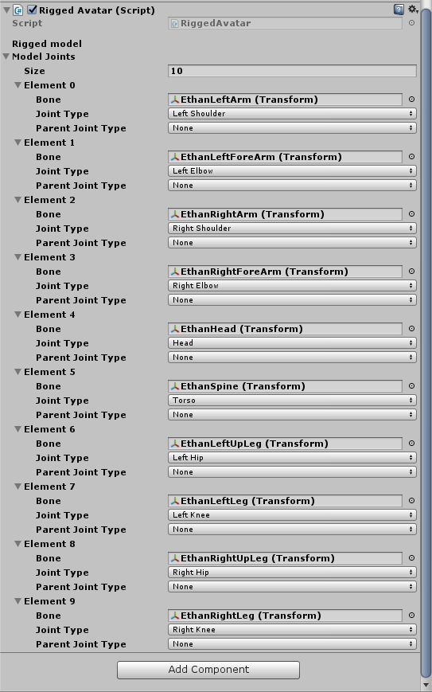
</p>

3. Place the model so that it is completely in the field of view of the camera.
4. To indicate the beginning and ending of recording the animation, we'll need a red indicator. Create a **Canvas** and an **Image** on it (make it look like a red recording indicator). Place the indicator in the top left corner.
5. Drag-and-drop the **NuitrackScripts** prefab from **Nuitrack SDK** to the scene. In settings, tick the modules required for skeleton tracking of our avatar: **Depth Module, SkeletonTracker Module, UserTracker Module**.

<p align="center">
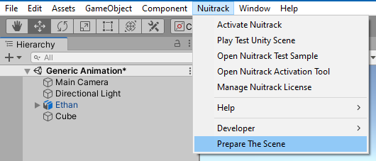
</p>

6. At this point, you can run the project and check whether the avatar is moving in accordance with the user's movements or not. 

## Creating an Interface for Animation Recorders

1. Since we'll use several implementations of the animation recorder, we have to set up a relevant interface for them. Create a new script named `IRecordable`. In this script, we'll describe the interface with the same name. In the script, create the `TakeSnapShot` method (to take pictures of Game Objects state) and `GetClip` (to get the clip with a recorded animation). 

```cs
using UnityEngine;
 
public interface IRecordable
{
	void TakeSnapshot(float deltaTime);
 
	AnimationClip GetClip { get; }
}
```

_**Note**: In this project, we use an interface to simplify the interaction with the recorder. By using interfaces, you can include behavior from several sources into one class. You can also create your own recorder and easily add it to this project thanks to the `IRecordable` interface._

2. Create a new script named `GenericRecorder` and describe how the Generic recorder works.  To begin with, let's check the operation of the recorder (without recoding the animation). Inherit the `GenericRecorder` class from the `IRecordable` interface and declare the `time` variable. 

```cs
public class GenericRecorder : IRecordable
{
	float time = 0.0f;
}
```

3. Create the `TakeSnapshot` method to take pictures of each frame of the animation.

```cs
public void TakeSnapshot(float deltaTime)
{
	time += deltaTime;
}
``` 

4. Create the [AnimationClip](https://docs.unity3d.com/ScriptReference/AnimationClip.html) method to get the recorded animation clip.

```cs
public AnimationClip GetClip
{
    get
    {
        AnimationClip clip = new AnimationClip();

        return clip;
    }
}
```

5. Create a new script named `UnityAnimationRecorder`, in which we'll describe the algorithm of interaction with the recorder (recording and receiving the clip). Add the `UnityEditor` namespace. List the types of animations we're going to use (Generic, GenericExperimental, Humanoid). Add the necessary fields: `recordMode` to store the recorder type, `savePath` for saving path of the recorded animation and `fileName` to store the file name, `poseCalibration` to manage the T-Pose calibration and `recordIcon` for a recording indicator. Create the `isRecording` boolean variable to check the recording state and add a reference to the `IRecordable` interface.

```cs
using UnityEngine;
using UnityEditor;
 
public class UnityAnimationRecorder : MonoBehaviour
{
	enum RecordMode { Generic, GenericExperimental, Humanoid };
 
	[Header("General")]
	[SerializeField] RecordMode recordMode = RecordMode.Generic;
 
	[Header("Save")]
	[SerializeField] string savePath = "Assets/Motion Capture/Animations";
	[SerializeField] string fileName = "Example";
 
	[Header("Control")]
	[SerializeField] TPoseCalibration poseCalibration;
	[SerializeField] GameObject recordIcon;
 
	bool isRecording = false;
	IRecordable recordable = null;
}
```

6. You'll be able to start and stop the recording of an animation clip using the T-Pose. In the `Start` method, subscribe to the T-Pose calibration completion event. Initialize the recorder.

```cs
void Start()
{
    poseCalibration.onSuccess += PoseCalibration_onSuccess;

    switch (recordMode)
    {
        case RecordMode.Generic:
            recordable = new GenericRecorder();
            break;
    }
}
```

7. In the `onDestroy` method, unsubscribe from the T-Pose calibration completion event. 

```cs
private void OnDestroy()
{
        poseCalibration.onSuccess -= PoseCalibration_onSuccess;
}
```

8. In the `PoseCalibration_onSuccess` method, process the beginning and ending of recording the animation. Activate the recording indicator. 

```cs
private void PoseCalibration_onSuccess(Quaternion rotation)
{
        if (!isRecording)
        {
        	Debug.Log("Start recording");
        	isRecording = true;
        }
        else
        {
        	Debug.Log("Stop recording");
        	isRecording = false;
        	SaveToFile(recordable.GetClip);
        }
 
        recordIcon.SetActive(isRecording);
}
```

9. In the `Update` method, access the recorder using the interface and take a snapshot of each frame.

```cs
void Update()
{
        if (isRecording)
            recordable.TakeSnapshot(Time.deltaTime);
}
```

10. In the `SaveToFile` method, save the file with the recorded animation (specify the file path and name).

```cs
void SaveToFile(AnimationClip clip)
{
        string path = savePath + "/" + fileName + ".anim";
        clip.name = fileName;
 
        AssetDatabase.CreateAsset(clip, path);
        Debug.Log("Save to: " + path);
}
``` 

_**Note**: The [AssetDatabase](https://docs.unity3d.com/ScriptReference/AssetDatabase.html) class is accessible only from the Editor._

11. In Unity, create an empty object and name it **Recorder**. Drag-and-drop the `UnityAnimationRecorder` script to this object. Add references to **Pose Calibration** (from **NuitrackScripts**) and **Record Icon (Image)**. 

<p align="center">
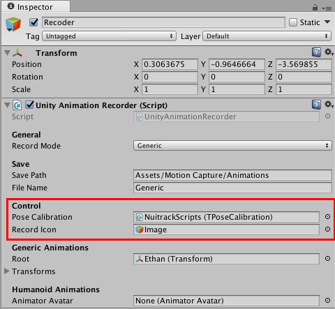
</p>

12. Run the project and check the animation recording. At this point, we check only how the recording (transferring and receiving the data) works, so, the created file will be empty for now.

<p align="center">
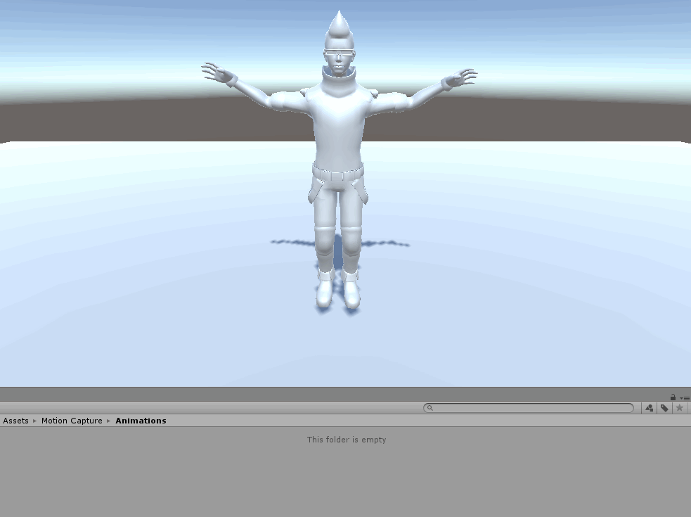
</p>

## Generic Recorder

1. Go back to the `GenericRecorder` script and whip the Generic animation into shape so that the recorded animation is actually saved in the created file. Create the `CurveContainer` class and set the property of the recorded object (for example, its position or rotation along one axis) and Curve (how the property changes over time). The `lastValue` variable is the value from the previous frame that is used to optimize the animation (keys for the objects, which don't move, won't be saved). Create a curve and name of the recorded property in the `CurveContainer` constructor. 

```cs
class CurveContainer
{
	public string Property { get; private set; }
	public AnimationCurve Curve { get; private set; }
 
	float? lastValue = null;
 
	public CurveContainer(string _propertyName)
	{
    	    Curve = new AnimationCurve();
    	    Property = _propertyName;
	}
}
```

2. In the same class, create the `addValue` method to compare the current value with the previous one (animation is recorded if it is the first frame or there was a change). [KeyFrame](https://docs.unity3d.com/ScriptReference/Keyframe.html) is the key that gets time and value and passes them to the curve. After that, `lastValue` is updated. 

```cs
class CurveContainer
{
...
	public void AddValue(float time, float value)
	{
            // If the current value is first or not equal to the previous one
    	    if (lastValue == null || !Mathf.Approximately((float)lastValue, value))
       	    {
            	Keyframe key = new Keyframe(time, value);
            	Curve.AddKey(key);
            	lastValue = value;
    	    }
	}
...
}
```

3. Create the `ObjectAnimation` class to store the object (animated joint) and its curves (changes in its position and rotation). Create the joint transform, list of curves, and path to the current transform from the root transform (which is **Ethan**). In the `ObjectAnimation` constructor, save the transform and its position in the hierarchy, fill the collection of curves (when initializing the object, pass the names of properties as a parameter).

```cs
class ObjectAnimation
{
	Transform transform;
 
	public List<CurveContainer> Curves { get; private set; }
 
	public string Path { get; private set; }
 
	public ObjectAnimation(string hierarchyPath, Transform recordableTransform)
	{
    	     Path = hierarchyPath;
    	     transform = recordableTransform;
 
    	     Curves = new List<CurveContainer>
             {
            	new CurveContainer("localPosition.x"),
            	new CurveContainer("localPosition.y"),
            	new CurveContainer("localPosition.z"),
 
            	new CurveContainer("localRotation.x"),
            	new CurveContainer("localRotation.y"),
            	new CurveContainer("localRotation.z"),
            	new CurveContainer("localRotation.w")
             };
	}
}
```

4. In the `TakeSnapShot` method, take a snapshot of the frame (pass the time and value to `CurveContainer`). 

```cs
class ObjectAnimation
{
...
	public void TakeSnapshot(float time)
	{
    	    Curves[0].AddValue(time, transform.localPosition.x);
    	    Curves[1].AddValue(time, transform.localPosition.y);
    	    Curves[2].AddValue(time, transform.localPosition.z);
 
    	    Curves[3].AddValue(time, transform.localRotation.x);
    	    Curves[4].AddValue(time, transform.localRotation.y);
    	    Curves[5].AddValue(time, transform.localRotation.z);
            Curves[6].AddValue(time, transform.localRotation.w);
	}
...
}
```

5. Create a list with the objects to be animated.

```cs
public class GenericRecorder : IRecordable
{
...
        List<ObjectAnimation> objectAnimations = new List<ObjectAnimation>();
...
}
```

6. Create the `GenericRecorder` constructor, which accepts the transforms of the object and root object. Fill in the list of objects, for which changes will be recorded. 

```cs
public GenericRecorder(Transform[] recordableTransform, Transform rootTransform)
{
    foreach (Transform transform in recordableTransform)
    {
        string path = AnimationUtility.CalculateTransformPath(transform, rootTransform);
        objectAnimations.Add(new ObjectAnimation(path, transform));
    }
}
```

7. Edit the `TakeSnapShot` method: loop over the collection of objects and take a snapshot. 

```cs
public void TakeSnapshot(float deltaTime)
{
...
    foreach (ObjectAnimation animation in objectAnimations)
        animation.TakeSnapshot(time);
}
```

8. Get the animation clip in the `GetClip` method: create an empty `AnimationClip`, loop over the collection of objects and curves of object properties. If a curve contains only 1 key, it's not recorded (as there were no changes). Save the curves and return the clip. 

```cs
public AnimationClip GetClip
{
    get
    {
        AnimationClip clip = new AnimationClip();
        foreach (ObjectAnimation animation in objectAnimations)
        {
             foreach (CurveContainer container in animation.Curves)
             {
                 if (container.Curve.keys.Length > 1)
                     clip.SetCurve(animation.Path, typeof(Transform), container.Property, container.Curve);
             }
         }
 
        return clip;
      }
}
```

9. Pass these parameters to the `Start` method.

```cs
void Start()
{
…
    switch (recordMode)
    {
        case RecordMode.Generic:
            recordable = new GenericRecorder(transforms, root);
            break;
    }
}
```

10. In Unity, set our model as a root object: **Recorder → Root → Ethan**. Set the joints:  

<p align="center">
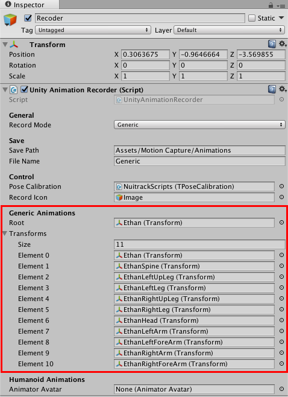
</p>

11. To check the project, copy the **Ethan** model to the scene. Now, it should have the **Animator** component. Drag-and-drop the recorded animation clip to the model. Make sure that there is no **Avatar** in the **Animation** component, otherwise the animation won't start. After that, run the project and check the recorded Generic animation. 

<p align="center">

</p>

## GameObject Recorder

1. Create the `ExperimentalRecorder` script, which acts as a shell for `GameObjectRecorder`. Add the `UnityEditor.Experimental.Animations` namespace. Inherit it from the `IRecordable` interface. Declare the `m_Recorder` object.

```cs
using UnityEngine;
using UnityEditor.Experimental.Animations;
 
public class ExperimentalRecorder : IRecordable
{
	GameObjectRecorder m_Recorder;
}
```

2. Create a constructor to accept the root object. Initialize the object in different ways depending on the Unity version used and pass the root object. After that, all objects below the root one are processed hierarchically. In case an incorrect Unity version is used, an error is displayed (see the `PrintErrorVersion` method). 

```cs
public ExperimentalRecorder(GameObject rootObject)
{
#if UNITY_2017_4
 
    m_Recorder = new GameObjectRecorder();
    m_Recorder.root = rootObject;
    m_Recorder.BindComponent<Transform>(rootObject, true);
 
#elif UNITY_2018_2
 
    m_Recorder = new GameObjectRecorder(gameObject);
    m_Recorder.BindComponentsOfType<Transform>(gameObject, true);
 
#else
    PrintErrorVersion();
#endif
 
}

void PrintErrorVersion()
{
    Debug.Log("Check your Unity version");
}
```

_**Note**: At the moment, this type of animation recording is available only in two versions of Unity. To distinguish between the code parts that run depending on the Unity version, we use the preprocessor directives `if, elif, else, endif`._

3. Create the `TakeSnapShot` method to take a snapshot of each frame. 

```cs
public void TakeSnapshot(float deltaTime)
{
#if UNITY_2017_4 || UNITY_2018_2
    m_Recorder.TakeSnapshot(deltaTime);
#else
    PrintErrorVersion();
#endif
}
```

4. In the `GetClip` method, crate an empty clip and save the recorded animation. Empty `m_Recorder` when the recording is over. Return the clip. 

```cs
public AnimationClip GetClip
{
    get
    {
#if UNITY_2017_4 || UNITY_2018_2
 
        AnimationClip clip = new AnimationClip();
        m_Recorder.SaveToClip(clip);
        m_Recorder.ResetRecording();
 
        return clip;
#else
        PrintErrorVersion();
        return null;
#endif
    }
}
```

5. Go back to the `UnityAnimationRecorder` script and add the recorder initialization using `GameObjectRecorder` to the `Start` method.

```cs
void Start()
{
…
        case RecordMode.GenericExperimental:
            recordable = new ExperimentalRecorder(root.gameObject);
            break;
}
```

6. Run the project and check the animation recording using `GameObjectRecorder`. 

<p align="center">

</p>

To play the recorded animation clip, drag-and-drop it to the model and untick the "Avatar" component in the "Animator" section. 

<p align="center">

</p>

</ol>

## Humanoid Recorder

1. In Unity, set up the model (in the **Models** folder). Select the desired animation type in avatar settings: **Rig → Animation → Type → Humanoid**. 

<p align="center">
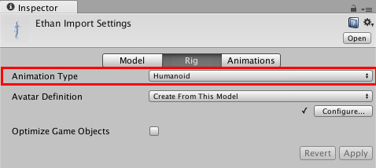
</p>

2. In Unity, a skeleton has a minimum set of joints. If the assigned joints of the model do not match the joints from this set, the corresponding body part will be highlighted in red. Click **Configure...** and check that all joints of our model are assigned correctly. After that, click **Done**. 

<p align="center">
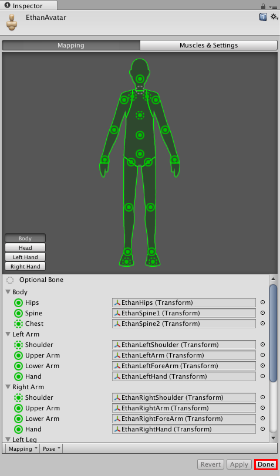
</p>

_**Note**: Now the model is animated not due to the change in the rotation and position of Game Objects but due to the change in the degree of muscle compression (from -1 to 1 in the specified range of motion)._

<p align="center">
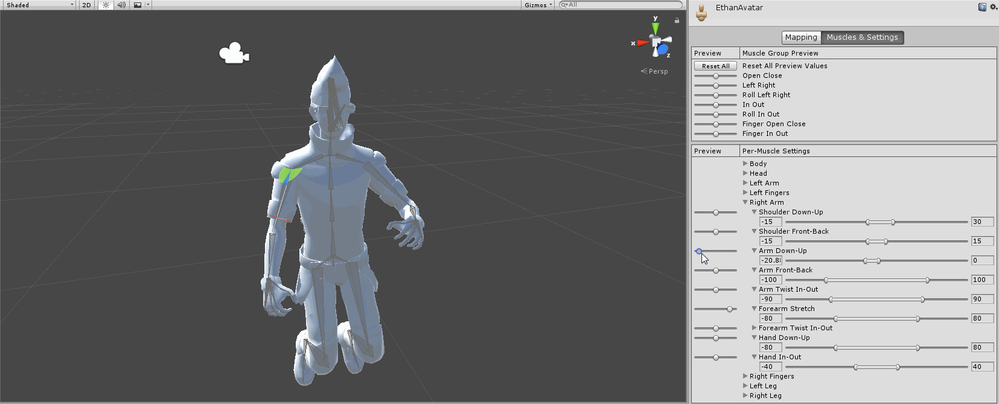
</p>

3. Remove the used model (without **Animator**) from the scene. Drag-and-drop the new model (with **Animator**) to the scene. The model should be in the T-Pose.
4. Create the `AnimatorAvatar` script to animate the model. Add fields for the animator and list of joints. Create the `SimpleJoint` class to store the `nuitrackJoint` joint type (which is received from Nuitrack), `Offset` (to compensate the skeleton offset relative to the sensor) and joint transform. 

```cs
using UnityEngine;
using System.Linq;
using System.Collections.Generic;
 
public class AnimatorAvatar : MonoBehaviour
{
	[SerializeField] Animator animator;
	[SerializeField] List<SimpleJoint> joints = new List<SimpleJoint>();
}

[System.Serializable]
class SimpleJoint
{
	public nuitrack.JointType nuitrackJoint;
 
	public Quaternion Offset { get; set; }
 
	public Transform Bone { get; set; }
}
```

5. In the `Start` method, loop over the joints. We have to match the Nuitrack joints and Unity joints. In case any Unity joint isn't assigned, an error message indicating this joint will be displayed in the console. If all joints are assigned correctly, get the model's joint transform, save it to joints and calculate `Offset`.

```cs
void Start ()
{
     foreach (SimpleJoint item in joints)
     {
            HumanBodyBones unityBoneType = item.nuitrackJoint.ToUnityBones();
        	Transform bone = animator.GetBoneTransform(unityBoneType);
 
        	if (bone == null)
        	{
            	Debug.LogError("The bone " + unityBoneType + " is not found (check configuration of the humanoid in the Rig tab)");
            	enabled = false;
        	}
        	else
        	{
            	item.Bone = bone;
            	item.Offset = bone.rotation;
        	}
     }
}
```

6. Due to the processing specificities of the animator, we use `LateUpdate` instead of `Update`. In `LateUpdate`, we process the skeleton joints (see our [Animating the Avatar](Unity_Avatar_Animation.md) tutorial).

```cs
[SerializeField] nuitrack.JointType rootJoint = nuitrack.JointType.LeftCollar;
...
void LateUpdate()
{
    if (CurrentUserTracker.CurrentSkeleton != null)
    {
        nuitrack.Skeleton skeleton = CurrentUserTracker.CurrentSkeleton;
        transform.position = Quaternion.Euler(0f, 180f, 0f) * (0.001f * skeleton.GetJoint(rootJoint).ToVector3());
 
        foreach (SimpleJoint item in joints)
        {
            nuitrack.Joint joint = skeleton.GetJoint(item.nuitrackJoint);
 
            Quaternion rotation = Quaternion.Inverse(CalibrationInfo.SensorOrientation) * joint.ToQuaternionMirrored() * item.Offset;
            item.Bone.rotation = rotation;
        }
    }
}
``` 

7. In the `GetHumanBodyBones` property, return the list of joints assigned in Unity, which are used to animate this object. 

```cs
public HumanBodyBones[] GetHumanBodyBones
{
    get
    {
        return joints.Select(x => x.nuitrackJoint.ToUnityBones()).ToArray();
    }
}
```

8. The `GetAnimator` property returns the animator.

```cs
public Animator GetAnimator
{
    get
    {
        return animator;
    }
}
```

9. Check the operation of the `HumanoidRecorder` script: drag-and-drop the script to the model and assign the animator and Nuitrack joints that you'd like to animate. At this point, the avatar should move. 
10. Create a new script named `HumanoidRecorder` and inherit it from the `IRecordable` interface. Create the `time` variable (current time). Declare the [HumanPose](https://docs.unity3d.com/ScriptReference/HumanPose.html) object, which is used to store the model position. The [humanPoseHandler](https://docs.unity3d.com/ScriptReference/HumanPoseHandler.html) is the handler of `HumanPose` (requested from the animator).  Create two dictionaries: one for muscles and one for the root object position. Create the `rootOffset` variable to correct the model position (because not a user but a sensor is located in the center). 

```cs
using UnityEngine;
using System.Collections.Generic;
 
public class HumanoidRecoder : IRecordable
{
	float time = 0;
 
	HumanPose humanPose = new HumanPose();  
	HumanPoseHandler humanPoseHandler;
	 
 
	Dictionary<int, AnimationCurve> muscleCurves = new Dictionary<int, AnimationCurve>();
	Dictionary<string, AnimationCurve> rootCurves = new Dictionary<string, AnimationCurve>();
 
	Vector3 rootOffset;
}
```

11. In the `HumanoidRecorder` constructor, specify the `rootOffset` and initialize `humanPoseHandler` (pass the parameters `animator avatar` and `root transform`). Get information about the muscles that are used to animate the avatar: loop over the joints by the `dof` (“degree of freedom”) indices, request a muscle index for a given joint for each degree of freedom. Pass the muscles with indices to the dictionary. Pass the root object position to `rootCurves`.

```cs
public HumanoidRecoder(Animator animator, HumanBodyBones[] humanBodyBones)
{
    rootOffset = animator.transform.position;
    humanPoseHandler = new HumanPoseHandler(animator.avatar, animator.transform);
 
    foreach (HumanBodyBones unityBoneType in humanBodyBones)
    {
        for (int dofIndex = 0; dofIndex < 3; dofIndex++)
        {
            int muscle = HumanTrait.MuscleFromBone((int)unityBoneType, dofIndex);
 
            if (muscle != -1)
                muscleCurves.Add(muscle, new AnimationCurve());
        }
    }
 
    rootCurves.Add("RootT.x", new AnimationCurve());
    rootCurves.Add("RootT.y", new AnimationCurve());
    rootCurves.Add("RootT.z", new AnimationCurve());
}
```

12. In the `TakeSnapShot` method, take snaphots of the avatar and save to `humanPose`. Loop over the muscles and set the values to the curve. In the same method, save all the data for an animation clip. Pass the key to the animation curve. Save the root object position to move the model in the scene. 

```cs
public void TakeSnapshot(float deltaTime)
{
    time += deltaTime;
 
    humanPoseHandler.GetHumanPose(ref humanPose);
 
    foreach (KeyValuePair<int, AnimationCurve> data in muscleCurves)
    {
        Keyframe key = new Keyframe(time, humanPose.muscles[data.Key]);
        data.Value.AddKey(key);
    }
 
    Vector3 rootPosition = humanPose.bodyPosition - rootOffset;
 
    AddRootKey("RootT.x", rootPosition.x);
    AddRootKey("RootT.y", rootPosition.y);
    AddRootKey("RootT.z", rootPosition.z);
}
```

13. In the `AddRootKey` method, get the property and values, create the `Keyframe` key and add to the `rootCurves` dictionary. Add RootKey (x, y, z). 

```cs
void AddRootKey(string property, float value)
{
    Keyframe key = new Keyframe(time, value);
    rootCurves[property].AddKey(key);
}
```

14. In the `GetClip`, create an animation clip. To do that, loop over the muscles and pass the curves to the clip. Do the same thing for `rootCurves`. Congrats, we've created a brand new clip with the humanoid animation!

```cs
public AnimationClip GetClip
{
    get
    {
        AnimationClip clip = new AnimationClip();
 
        foreach (KeyValuePair<int, AnimationCurve> data in muscleCurves)
        {
            clip.SetCurve("", typeof(Animator), HumanTrait.MuscleName[data.Key], data.Value);
        }
 
        foreach (KeyValuePair<string, AnimationCurve> data in rootCurves)
        {
            clip.SetCurve("", typeof(Animator), data.Key, data.Value);
        }
 
        return clip;
    }
}
```

15. Go back to the `UnityAnimationRecorder` script and add the fields for this animation type. Add Humanoid Animation to the `Start` method. 

```cs
[Header("Humanoid Animations")]
[SerializeField] AnimatorAvatar animatorAvatar;

void Start()
{
...
        case RecordMode.Humanoid:
            recordable = new HumanoidRecoder(animatorAvatar.GetAnimator, animatorAvatar.GetHumanBodyBones);
            break;
}
```

16. In Unity, set up the recording of avatar animation. Select the humanoid record mode (**Recorder → Record Mode → Humanoid**) and avatar (**Animator Avatar → Ethan (AnimatorAvatar)**), update the root object: **Root → Ethan** (new model).

<p align="center">
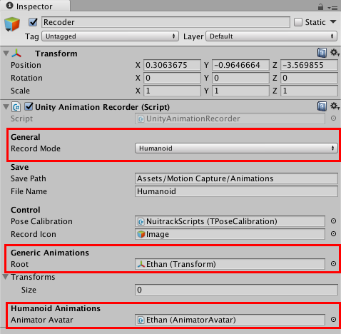
</p>

17. Run the project. Now you can check the animation from the Inspector tab without adding it to the model. 
</ol>

<p align="center">
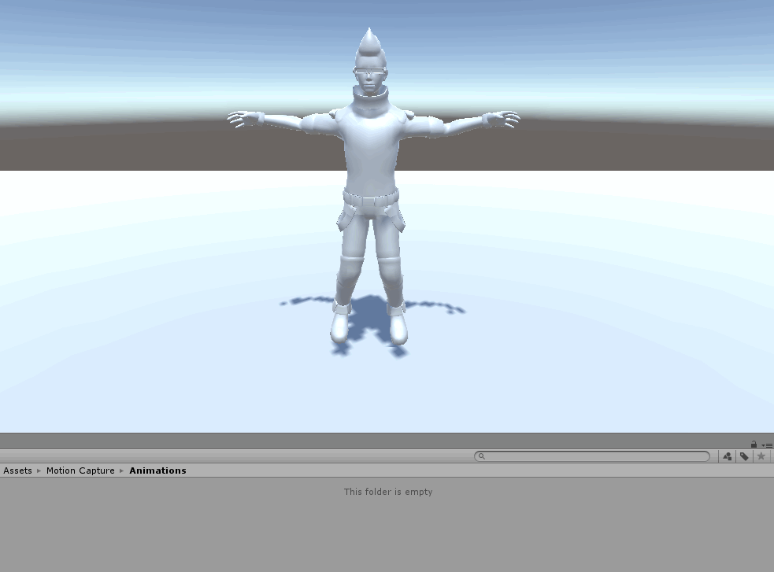
</p>

You can check the animation on any model with Humanoid animation type. Below you can see our recorded animation applied to a standard Unity model.

<p align="center">
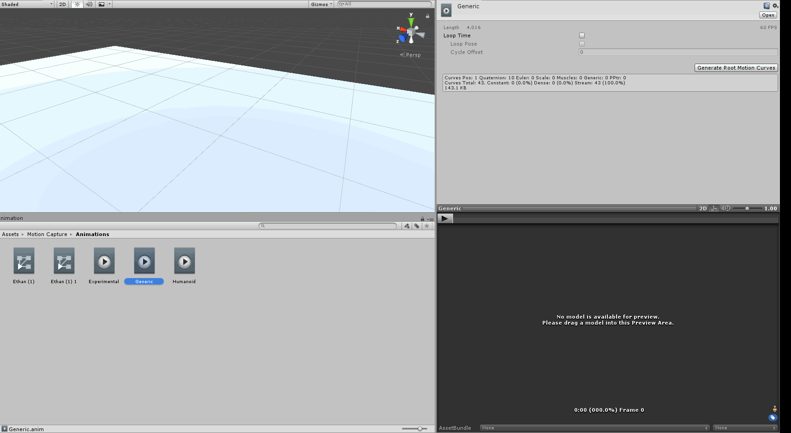
</p>