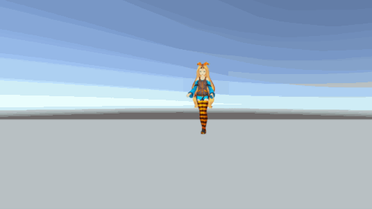
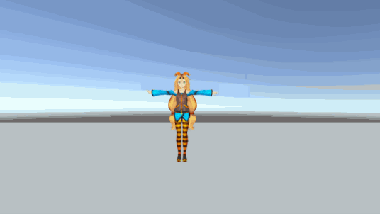
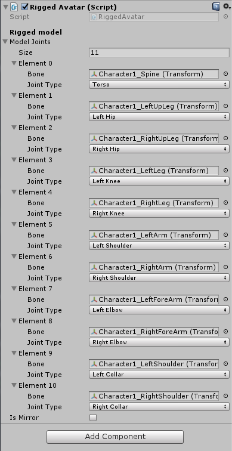
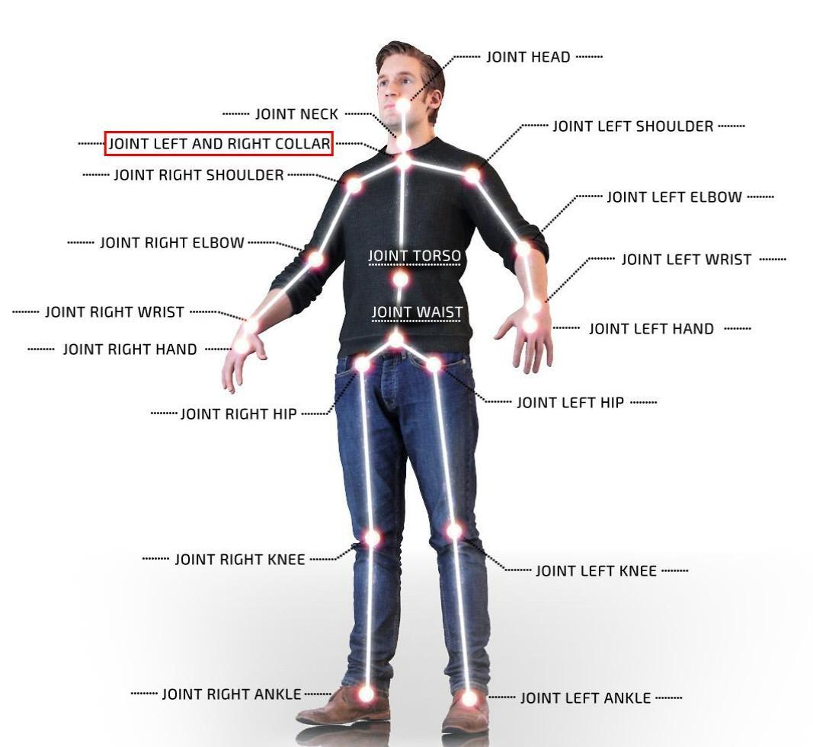
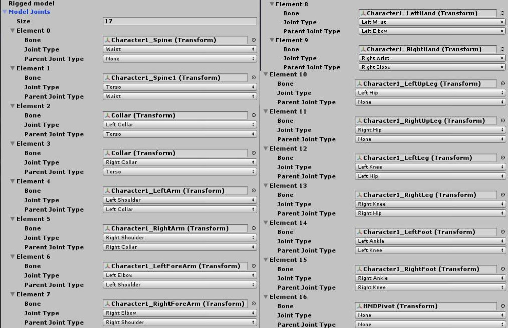
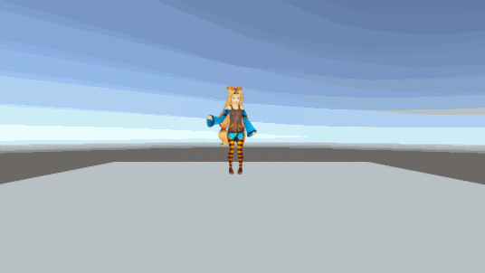

# Animating the Avatar using Skeleton

In this tutorial, you'll learn how to animate an avatar in Unity, employing the user's skeleton data. To do this, you need **Nuitrack SDK** and [any supported sensor](https://nuitrack.com/#sensors), as well as a mobile device (optional).

You can animate an avatar by mapping the user's skeleton and model skeleton. There are two mapping types: direct and indirect.

Using indirect mapping, you can animate both anthropomorphic and zoomorphic models. However, indirect mapping doesn't provide a sufficient depth of immersion in the  game, as the user doesn't get the impression that the virtual body belongs to him. It's like you're running an avatar that just repeats your movements.

Direct mapping is better suited for animating anthropomorphic models. This type of mapping ensures a greater depth of immersion in the game, since the  proportions of the model are exactly the same as the user's proportions, and hence the movements are completely identical. However, direct mapping has one significant disadvantage, which is a possible deformation of the model, in case the proportions of the model and the user are significantly different.

Let’s formulate the difference between direct and indirect mapping in a nutshell:
* indirect mapping = orientation of joints
* direct mapping = orientation of joints + position of joints + scale of joints

We’ll start with indirect mapping, as it’s a more simple way to animate your avatar, and proceed to the direct mapping, in case you want to achieve greater immersion in the game.

To create this project, you'll need just a couple of things:

* [Nuitrack Runtime](/Platforms) and [Nuitrack SDK](https://github.com/3DiVi/nuitrack-sdk)
* Any supported sensor (see the complete list at [Nuitrack website](https://nuitrack.com/#sensors))
* Unity 2017.4 and higher

You can find the finished project in **Nuitrack SDK**: **Unity 3D → NuitrackSDK.unitypackage → Tutorials → Avatar Animation**

<p align="center">

</p>

## Indirect Mapping

1. In this example,  we'll consider an anthropomorphic model, since the maximum number of joints in the Nuitrack is 19, which means that a model with a more complex skeleton would more difficult to adjust. Download the humanoid model from the Unity Asset Store (for example, [Unity Chan Model](https://assetstore.unity.com/packages/3d/characters/unity-chan-model-18705)) and import it to the project. Put the model in T-pose for the correct matching of joints. 

_**Note**: Import the Plugins and Nuitrack folders from the Nuitrack SDK to work with the  sensor and retrieve information about users that have been identified by the sensor. Drag-and-drop the NuitrackScripts prefab to the scene._

2. Create an empty C# script and drag-and-drop it to the model.
First of all, let's check the presence of the user in front of the sensor:

```cs
void Update()
{
	if (CurrentUserTracker.CurrentSkeleton != null) ProcessSkeleton(CurrentUserTracker.CurrentSkeleton);
}
```

3. If the user is identified, we move the the calculation of the model position. In indirect mapping, the position of the whole model is calculated using the torso joint position. The position is then rotated 180 degrees along the y axis, otherwise, the model will move in the opposite direction. The root joint for our model is *LeftCollar*, however, you can set a different root joint in the editor. 

```cs
[SerializeField] nuitrack.JointType rootJoint = nuitrack.JointType.LeftCollar;

void ProcessSkeleton(nuitrack.Skeleton skeleton)    
{    
	Vector3 torsoPos = Quaternion.Euler(0f, 180f, 0f) * (0.001f * skeleton.GetJoint(rootJoint).ToVector3());
	transform.position = torsoPos;
}
```

4. Build the project. (See the **Creating your First Unity Project using Nuitrack SDK (Android Only)** tutorial, **Setting up the Build** section). If everything was done correctly, the model will move according to the user's movements. At this point, the limbs of the model are not yet rotating.

<p align="center">

</p>
 
5. Create another empty C# script (`ModelJoint.cs`), in which we'll describe the `ModelJoint` class, which we'll use to process the model bones. Mark it as `[System.Serializable]` do that it is displayed in the Inspector. 

```cs
using UnityEngine;

[System.Serializable]
class ModelJoint
{
    public Transform bone;
    public nuitrack.JointType jointType;
    [HideInInspector] public Quaternion baseRotOffset;
}
```

6. In the script, create the list of joints. In the Inspector, check the required joints (to animate the model using Nuitrack and indirect mapping, we'll need 11 joints).  

```cs
using UnityEngine;
using System.Collections.Generic;
 
public class RiggedAvatar : MonoBehaviour
{
    [Header("Rigged model")]
    [SerializeField]
    ModelJoint[] modelJoints;
}
```

<p align="center">

</p>

_**Note**: The skeleton of the model usually has two collarbones, just like a human. There are also two types of collarbones in the JointType (LeftCollar, RightCollar). However, it should be noted that the skeleton retrieved from the sensor has only one "collarbone", which is located in the middle (as shown in the picture below)._

<p align="center">

</p>

7. For convenience, create a dictionary and fill in the joints: 

```cs
Dictionary<nuitrack.JointType, ModelJoint> jointsRigged = new Dictionary<nuitrack.JointType, ModelJoint>();
```

8. Then we loop over the joints from the `modelJoints` array and record the basic rotation of the model's bone. The joints of the model and their type (`jointType`) are added to the `jointsRigged` dictionary.

_**Note**: You can turn on the mirror mode, which inverts the joints of hands and legs. As a result, the 3D model will be displayed incorrectly. To avoid this, you can get the joint type using `jointType.TryGetMirrored()`. In this case, if the mirror mode is turned on and there's a mirrored equivalent for this joint, this mirrored joint will be used. In other cases, the joint specified in the component's settings will be used._

```cs
void Start()
{
	for (int i = 0; i < modelJoints.Length; i++)
	{
		modelJoints[i].baseRotOffset = modelJoints[i].bone.rotation;
		jointsRigged.Add(modelJoints[i].jointType.TryGetMirrored(), modelJoints[i]);
	}
}
```

9. Then we get information about each joint from the Nuitrack. Calculate the rotation of the model bone: take the 'mirrored' joint orientation, add the base rotation of the model bone.

```cs
foreach (var riggedJoint in jointsRigged)
{
	nuitrack.Joint joint = skeleton.GetJoint(riggedJoint.Key);
 
	ModelJoint modelJoint = riggedJoint.Value;
 
	Quaternion jointOrient = Quaternion.Inverse(CalibrationInfo.SensorOrientation) * (joint.ToQuaternionMirrored()) * 		modelJoint.baseRotOffset;
	modelJoint.bone.rotation = jointOrient;
}
```

10. Check the movement of the whole model and rotation of its joints. 

<p align="center">

</p>

_**Note**: By default, the avatar directly repeats the user's movements (for example, when the user raises the right hand, the avatar raises its right hand, too). If necessary, you can turn on the mirror mode: open `nuitrack.config` and set `DepthProvider.Mirror` to `true`._


## Direct Mapping

1. Since in direct mapping we consider the distance between the parent and the child joint, we need to change the `ModelJoint.cs` script by adding in the `ModelJoint` class the lines defining the type and transform of the parent joint and the distance between the parent and the child joint.

```cs
...
public nuitrack.JointType parentJointType;
[HideInInspector] public Transform parentBone;
[HideInInspector] public float baseDistanceToParent;
```

2. Let's add some new information to the `RiggedAvatar.cs` script as well. Check the required joints in the Inspector. To animate the model using Nuitrack and direct mapping, we'll need 17 joints.  As you can see, in direct mapping we use greater number of joints than in indirect mapping. The point is, in indirect mapping some joints were dependent on others and moved according to the hierarchy. In direct mapping, all the joints are independent, i.e. we have to specify the movement of each joint.  

_**Note**: For direct mapping, we have to specify not only the types of joints that we need but also the 'parent' - 'child' relationship between all the joints._

<p align="center">

</p>

3. Since in direct mapping we need to know not only the position of the torso but also the positions of all other joints, we have to delete the lines defining the position of the torso, namely: 

```cs
Vector3 torsoPos = Quaternion.Euler(0f, 180f, 0f) * (0.001f * skeleton.GetJoint(nuitrack.JointType.Torso).ToVector3());
transform.position = torsoPos;
```

After that, we need to add the lines, which define the position of each joint, to the `foreach (var riggedJoint in jointsRigged)` loop of the `void ProcessSkeleton(nuitrack.Skeleton skeleton)` function: 

```cs
Vector3 newPos = Quaternion.Euler(0f, 180f, 0f) * (0.001f * joint.ToVector3());
modelJoint.bone.position = newPos;
```

4. If you build the project at this point, the model's limbs may look disproportionate. To rectify this situation, let's define the basic distances between the child bone and its parent bone by using the `AddBoneScale` function, which should be located in  `Start()`. 

```cs
void AddBoneScale(nuitrack.JointType targetJoint, nuitrack.JointType parentJoint)
{
        // take the position of the model bone
        Vector3 targetBonePos = jointsRigged[targetJoint].bone.position;
        // take the position of the model parent bone
        Vector3 parentBonePos = jointsRigged[parentJoint].bone.position;
        jointsRigged[targetJoint].baseDistanceToParent = Vector3.Distance(parentBonePos, targetBonePos);
        // record the Transform of the model parent bone
        jointsRigged[targetJoint].parentBone = jointsRigged[parentJoint].bone;
        // extract the parent bone from the hierarchy to make it independent
        jointsRigged[targetJoint].parentBone.parent = transform.root;
}
```

As a result, the `Start` method should look like this:

```cs
void Start()
{
    for (int i = 0; i < modelJoints.Length; i++)
    {
        modelJoints[i].baseRotOffset = modelJoints[i].bone.rotation;
        jointsRigged.Add(modelJoints[i].jointType.TryGetMirrored(), modelJoints[i]);
        // adding base distances between the child bone and the parent bone 
        if (modelJoints[i].parentJointType != nuitrack.JointType.None)
            AddBoneScale(modelJoints[i].jointType.TryGetMirrored(), modelJoints[i].parentJointType.TryGetMirrored());
    }
}
```

5. Then, let's perform bone scaling. By default, the bone scale is equal to (1,1,1). It  changes dynamically in accordance with the user's proportions. Add the `ProcessSkeleton(nuitrack.Skeleton skeleton)` function:

```cs
if (modelJoint.parentBone != null)
{
	// take the Transform of the parent bone
	Transform parentBone = modelJoint.parentBone;
	// calculate how many times the distance between the child bone and its parent bone has changed compared to the base distance (which was recorded at the start)
	float scaleDif = modelJoint.baseDistanceToParent / Vector3.Distance(newPos, parentBone.position);
	// change the size of the bone to the resulting value
	parentBone.localScale = Vector3.one / scaleDif;
}
```

_**Note**: The deformation of the model may be greater than expected. To avoid this, make sure that the proportions of the model are close to the user's proportions._

6. Build the project. The model should look proportionally and move. 

<p align="center">

</p>

_**Note:** For testing, a mobile device is not necessary. You can test the project even if there is only a computer and a sensor. The app will run in the Unity._