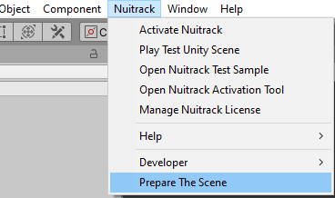

# Creating your First Unity Project using Nuitrack SDK

In this very first tutorial, you'll learn how to create a basic Unity project using Nuitrack SDK. As a result, you'll get a simple app with an option of skeleton detection and tracking, which can be modified into a full-fledged VR app.

You can find the finished project in **Nuitrack SDK**: **Unity 3D → NuitrackSDK.unitypackage → Tutorials → First Project**

<p align="center">

</p>

## Setting up the Environment

1. As a first step, download and install Nuitrack following our [installation instructions](Install.md). 
2. Download Unity [from the official website](https://unity3d.com/get-unity/download).

_**Note**: To ensure stable operation of a project, we recommend you to use Unity version from Readme https://github.com/3DiVi/nuitrack-sdk/tree/master/Unity3D._

3.  Create a new project.

<p align="center">

</p>

4.  And now, here is the most interesting part that will allow us to create projects with skeleton detection and tracking. Download [Nuitrack SDK](https://github.com/3DiVi/nuitrack-sdk) and import it to the project (except for the folder **Tutorials/First Project**). To import **Nuitrack SDK**, select **Assets → Import Package → Custom Package → NuitrackSDK.unitypackage** by right-clicking in the **Project** tab.

_**Note**:_  
**What sensors can I use with my app?**  
*You can use any of the supported sensors for your application (see the list of supported sensors at the [Nuitrack official website](https://nuitrack.com/#sensors)). For example, you can use [**TVico**](https://tvico.io/), which is an interactive Android computer with pre-installed Nuitrack. You can find the [TVico User Guide](/doc/TVico_User_Guide.md) in our documentation.*

5.  As a result, you will have a configured development environment with all the necessary components for the build.

<p align="center">

</p>

## Setting up the Build

1.  Now that we have configured the environment, we need to determine some important features of the project build. First of all, save the empty scene: **File → Save Scenes**

2.  Add the scene to the project: **File → Build Settings → Add Open Scenes** or select **{Saved Scene}** in the **Project** tab and drag-and-drop it to the **Scenes in Build** field of the **Build Settings** window.
    
3.  Do not forget to put you company name and product name in the relevant fields: **File → Build Settings → Player Settings → Company Name, Product Name**.
    
4.  In the **Identification** section, select a name for the build (**Bundle Identifier**) as follows: **com.(CompanyName).(ProductName)**. Keep in mind that you won't be able to build the project with the default name.
    
_**Note**: Do not use numbers when typing in your CompanyName and ProductName._

<p align="center">

</p>

5.  Now that everything is set up, let\'s build the project: **File → Build Settings → Build**

_**Note**_  
*Hotkeys:*  
_**Ctrl + Shift + B** - Build Settings_  
_**Ctrl + B** - Build_  

6.  If the build was successful, a new window will open with your builded App, which can be run on the device. When you run the app on your device, you will see the image as shown below:

<p align="center">

</p>

7.  During the project build, all errors and warnings (if any) are displayed in the **Console**.

_**Note**: After the first build, when you have a ready-made App, you can perform build and installation on the device in one click using **Ctrl + B**. (To do this on Android, activate **Developer Mode** in the settings of the mobile device and connect it to the computer via USB.) Then press **Ctrl + B** in Unity. As a result, the project will be built, installed and launched on your device._

## Initializing the Nuitrack SDK, Setting up the Scene and Checking the Skeleton Detection

1.  Prepare the scene for using Nuitrack in one click, to do this, click: **Main menu** -> **Nuitrack** -> **Prepare the scene**. The necessary components will be added to the scene. When you run the scene, **NuitrackScripts** automatically marked as **DontDestroyOnLoad**.

<p align="center">
<br>
</p>

2.  Create an empty C\# Script: **Create C\# Script** by right-clicking in the Project tab.
    
3.  To get information about joints, we first need to detect the user. First, let's check whether the user is in the frame or not using the ```NuitrackManager.Users.Current != null && NuitrackManager.Users.Current.Skeleton != null``` condition. The result will be displayed as a 'User found' or 'User not found' message, which is stored in the ```message``` variable and displayed by the ```OnGUI()``` method. To work with Nuitrack scripts, you need to use the NuitrackSDK namespace. See the link at the end of the document to learn more about Execution Order of Event Functions.

```cs
using UnityEngine;
using NuitrackSDK;
 
public class NativeAvatar : MonoBehaviour
{
    string message = "";
        
    void Update()
    {
        if (NuitrackManager.Users.Current != null && NuitrackManager.Users.Current.Skeleton != null)
        {
            message = "User found";
        }
        else
        {
            message = "User not found";
        }
    }
        
    // Display the message on the screen
    void OnGUI()
    {
        GUI.color = Color.red;
        GUI.skin.label.fontSize = 50;
        GUILayout.Label(message);
    }
}

```
_**Note**: Save changes in the script code so that they take effect in the Unity editor._

4.  Create an empty object on the scene so that Unity can execute **NativeAvatar.cs**: **GameObject → Create Empty** and then
drag-and-drop the script to that object.

5.  Build the project (Ctrl + B) and check the app operation on your device.

6.  If everything is done correctly, at this stage the user will be detected. Depending on the result, you will see a message 'User found' or 'User not found' in the scene in the upper right corner. Time to move onto more complex things!

<p align="center">

</p>

_**Note**_  
**How can I get the full log from the device?**  
*To get the Unity app log from your mobile device, install the Android Debug Bridge (adb) into your computer. Run the following command in the console: `adb logcat -s Unity`. When you run the application on your phone, the log will be displayed in the console.*

## Creating Objects for Skeleton Visualization

1.  Now that we initialized Nuitrack and checked the detection of the user, we can go to the next stage, which presupposes obtaining data on the skeleton and visualization of the joints.
2.  Let's determine the joints of the skeleton, which we need to get: declare the ```nuitrack.JointType``` and ```GameObject``` arrays. Each element of the ```GameObject``` array will correspond to a specific ```typeJoint```. In the app, the joint will be rendered in the form of the ```PrefabJoint``` that we selected.

```cs
public nuitrack.JointType[] typeJoint;
GameObject[] CreatedJoint;
public GameObject PrefabJoint;
```

3.  In Unity, select the required number of joints in the object characteristics: **Native Avatar → Type Joint** and specify the
joint types that you need. Drag-and-drop the prefab that will be used for displaying the user's joints (for example, a white sphere) to the **Prefab Joint**.

<p align="center">

</p>

_**Note**: To create a prefab in Unity (for example, a sphere), select **GameObject → 3D Object → {Sphere}**. Scale down the sphere that appeared on the scene so that its size is about 10 cm (1 Unity unit ~ 1 m). Create a prefab in the **Project** tab: **Right Click → Create → Prefab**. Then, drag-and-drop the created sphere to the prefab. To learn more about prefabs, see the link at the end of this tutorial._ 

4.  Let's create objects for visualization of joints using the saved prefab: create an array of the same dimension as the ```typeJoint``` array: ```CreatedJoint = new GameObject[typeJoint.Length]```. After that, we start to create their copies on the scene in the loop using the ```Instantiate``` function. Now, we define copies of the objects as children of the object that contains the script. As a result, the position of the parent object will correspond to the position of the sensor.

```cs
void Start()
{
    CreatedJoint = new GameObject[typeJoint.Length];
    for (int q = 0; q < typeJoint.Length; q++)
    {
        CreatedJoint[q] = Instantiate(PrefabJoint);
        CreatedJoint[q].transform.SetParent(transform);
    }
    message = "Skeleton created";
}
```

5.  Build the project (Ctrl + B) and check the app operation on your device. If everything is done correctly, the spheres from the prefab will be located in the position of the object with the script. Since they are yet located at one point, they will look like a single sphere.

<p align="center">

</p>

## Getting Data, Converting and Scaling the Joints

1.  As soon as we created the objects for visualization of the joints, let's match their positions with the positions of the joints of a real user's skeleton.

2.  Get data on the detected skeleton using ```NuitrackManager.Users.Current.Skeleton```. After this, we process the
information about the joints in the loop.

3.  To receive data on the required joint, call the ```GetJoint``` function from the obtained ```skeleton``` specifying the ```typeJoint[q]```.

4.  Let's get the position of this joint and set it for ```CreatedJoint[q].transform.localPosition```

```cs
void Update()
{
    if (NuitrackManager.Users.Current != null && NuitrackManager.Users.Current.Skeleton != null)
    {
        message = "Skeleton found";
        
        for (int q = 0; q < typeJoint.Length; q++)
        {
            UserData.SkeletonData.Joint joint = NuitrackManager.Users.Current.Skeleton.GetJoint(typeJoint[q]);
            CreatedJoint[q].transform.localPosition = joint.Position;
        }
    }
    else
    {
        message = "Skeleton not found";
    }
}
```

_**Note**: For correct detection of the user, it is desirable to be about two meters from the sensor.

5.  And now we are down to the final stretch! Build the project and run the app on your mobile device. Now, if everything was done properly, your skeleton will be detected, tracked and displayed in the app. Good job!

<p align="center">

</p>

Now you know how to create a Unity project using Nuitrack SDK. From now on, you can develop a plenty of apps with skeleton tracking! That's all for now. Though this is a very simple example, it covers a large set of basic subjects important to understanding how to use Unity with Nuitrack SDK. In the next tutorials, you'll learn how create more complex and
functional Unity apps with skeleton tracking.

**Useful links:**

-   [Learn more about Prefabs](https://docs.unity3d.com/560/Documentation/Manual/Prefabs.html)
-   [Learn more about Vector3 struct](https://docs.unity3d.com/ScriptReference/Vector3.html)
-   [Information on Execution Order of Event Functions](https://docs.unity3d.com/Manual/ExecutionOrder.html)
