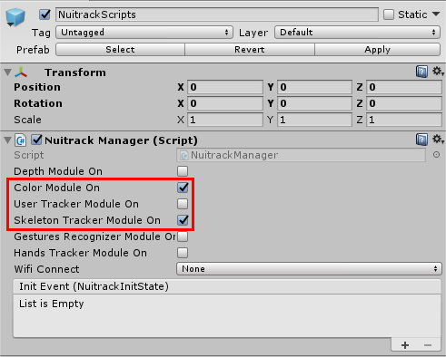
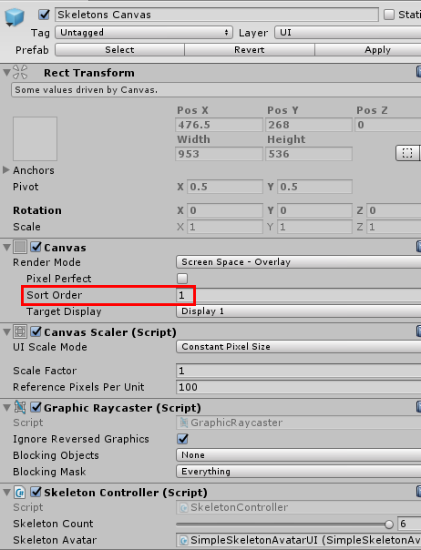
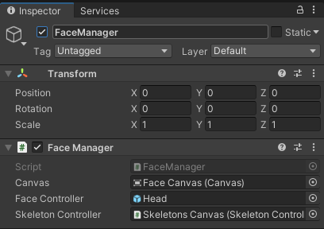
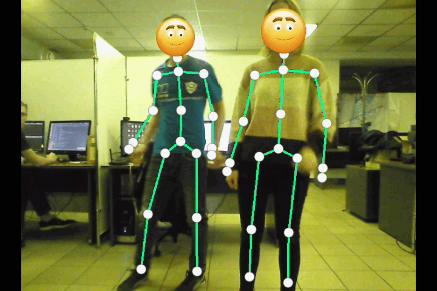
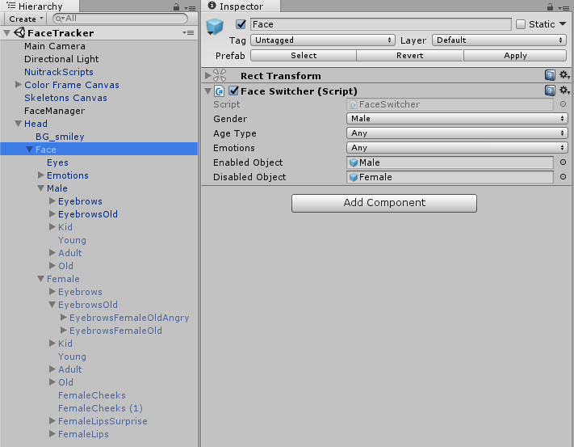
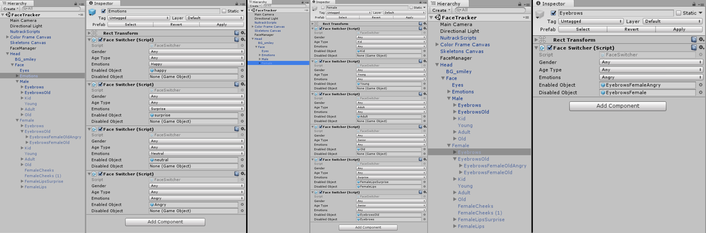

# Face Tracking with Nuitrack

In this useful tutorial you'll learn how to track and get information about faces with **Nuitrack**. This feature is available in Nuitrack since version 0.23.3 (upgrade your Nuitrack if you haven't done this yet!). In this project, an RGB image from the sensor is displayed in the background and emojis are shown instead of faces. The way an emoji looks (its gender, age type, emotion) is determined by the parameters received from Nuitrack. Also you can set the desired number of tracked skeletons in this project (up to 6), because more people is more fun! 2D skeleton is displayed on the user's body.

To create this wonderful project, only a couple of things are required: 

* [Nuitrack](https://github.com/3DiVi/nuitrack-sdk);
* Any supported sensor (see the full list [at our website](https://nuitrack.com/#sensors));
* Unity (2017.4 or higher).

You can find the finished project in **Nuitrack SDK: Unity 3D → NuitrackSDK.unitypackage → Tutorials → FaceTracker**.

<p align="center">

</p>

_**Note:** Nuitrack displays the info about a face **only after the user's skeleton is detected**. So, if only your face is visible, Nuitrack won't display the information. If you're only interested in face tracking (without any info about skeletons), you can take a look at [3DiVi Face SDK](https://facesdk.3divi.com/), which is a software for face tracking, detection, and matching. Unlike Nuitrack SDK, **3DiVi Face SDK** focuses on processing the data about faces and provides more advanced features in this field._

## Setting Up the Scene

1. Create a new Unity project. 
2. Import **NuitrackSDK.unitypackage** from **Nuitrack SDK/Unity3D** to the project (except for the folder **Tutorials/FaceTracker/FinalAssets**, because this folder contains the scripts and other files that we're going to create in this tutorial): **Assets → Import Package → Custom Package...**
3. Drag-and-drop the **NuitrackScripts** prefab for skeleton tracking to the scene. In the **NuitrackManager** section, tick the required modules: **Color Module On** (to output an RGB image from a sensor), **Skeleton Module On** (for skeleton tracking).

<p align="center">

</p>

4. Drag-and-drop the **Color Frame Canvas** prefab to the scene. Please note that in this tutorial we use ready-made prefabs and scripts to output the RGB image from the sensor and display tracked skeletons. If you want to learn how to do this in details, take a look at our [Displaying Skeletons on an RGB Image](Unity_RGB_Skeletons.md) tutorial.

_**Note:** **Color Frame Canvas** displays the RGB image from a sensor on the standard interface component **Image**. The `DrawColorFrame` script creates a Texture2d in the format of RGB24 using the `ColorFrame` data. Each time a `ColorFrame` is received, the texture is updated._

5. Drag-and-drop the **Skeletons Canvas** prefab to the scene. In the **Canvas** section, set **Sort Order = 1**, so that skeletons are always displayed over **Color Frame Canvas**. **Sort Order** determines the rendering order: **Sort Order** in **Color Frame Canvas** is set to the default value of 0, that's why it is used as a background.

<p align="center">

</p>

_**Note:** If your skeleton looks shifted, you have to turn on **depth-to-color registration** using the  `nuitrack.config` file: find the section `“DepthProvider”` and set `“Depth2ColorRegistration”` to `true`._

_**Note:** In this project, we display a 2D skeleton on the user's body because it's a simpler and more versatile implementation. To display a 3D skeleton, you have to take into account the aspect, position, and FOV of your sensor in the Unity editor._

6. Run the project. You should see an RGB image from the sensor on the scene and tracked skeletons displayed on users' bodies. Time to move on to the most interesting part of this tutorial - face tracking! 

<p align="center">

</p>

## Creating the Faces

1. Create a new script and name it `FaceInfo`. This script will contain the parameters and values from the JSON response received from Nuitrack (see a sample JSON response [in our documentation](Instance-based_API.md)). 

_**Note:** By default, face tracking in Nuitrack is turned off. To turn on this function, open the  `nuitrack.config` file and set `“Faces.ToUse”` and `“DepthProvider.Depth2ColorRegistration”` to `true`._ 

```cs
using UnityEngine;
 
[System.Serializable]
public class FaceInfo 
{
    public string Timestamp;
    public Instances[] Instances;
}
 
[System.Serializable]
public class Instances
{
    public int id;
    public string @class;
    public Face face;
}
 
[System.Serializable]
public class Face
{
    public Rectangle rectangle;
    public Vector2[] landmark;
    public Vector2 left_eye;
    public Vector2 right_eye;
    public Angles angles;
    public Emotions emotions;
    public Age age;
    public string gender;
}
 
[System.Serializable]
public class Rectangle
{
    public float left;
    public float top;
    public float width;
    public float height;
}
 
[System.Serializable]
public class Angles
{
    public float yaw;
    public float pitch;
    public float roll;
}
 
[System.Serializable]
public class Emotions
{
    public float neutral;
    public float angry;
    public float surprise;
    public float happy;
}
 
[System.Serializable]
public class Age
{
    public string type;
    public float years;
}
```

_**Note:** A keyword cannot be used as an identifier (name of variable, class, interface etc). However, they can be used with the prefix `@`. For example, `class` is a reserved keyword so it cannot be used as an identifier, but `@class` can be used._

2. Create a new script and name it `FaceManager`. Create enumerators for genders, age types, and emotions and list all possible values. 

```cs
using System.Collections.Generic;
using UnityEngine;
 
public enum Gender
{
    any,
    male,
    female
}
 
public enum AgeType
{
    any,
    kid,
    young,
    adult,
    senior
}
 
public enum Emotions
{
    any,
    happy,
    surprise,
    neutral,
    angry
}
```

3. Add the `canvas` field for the **Canvas** displaying the emojis, `faceController` field for an emoji prefab, `skeletonController` field, list of `FaceControllers`, and an array with the data about faces. 

```cs
...
public class FaceManager : MonoBehaviour 
{
    [SerializeField] Canvas canvas;
    [SerializeField] GameObject faceController;
    [SerializeField] SkeletonController skeletonController;
    List<FaceController> faceControllers = new List<FaceController>();
    Instances[] faces;
 
    FaceInfo faceInfo;    
}
```

_**Note:** Here are sample emojis for 2 genders, 4 age types, and 4 emotions (just to let you know how emojis of different ages and genders look like in this project):_
* *happy little girl*
* *surprised young man*
* *neutral adult woman*
* *angry old man*

<p align="center">

</p>

4. In `Start`, add faces to the scene and include them in the list of `FaceControllers`. 

```cs
public class FaceManager : MonoBehaviour 
{
...
     void Start()
     {
        for (int i = 0; i < skeletonController.skeletonCount; i++)
        {
                 faceControllers.Add(Instantiate(faceController, canvas.transform).GetComponent<FaceController>());
        }
     }
}
```

5. In `Update`, get a JSON response and include the data from JSON to the `faceInfo` class, which stores the received face info. Add the faces from `faceInfo` (`faceInfo.Instances`) to the `faces` array. Loop over the `FaceControllers`: if the face info is available, the emoji is displayed, otherwise, it's hidden. Create the `id` variable and `currentFace` variable that stores the info about a current face. Pass the face info to `FaceController` and display the face. Get the `id` parameter from the face info and pass it to the `id` variable. Each of the detected users has his/her own id. User id and skeleton id in Nuitrack are always the same. Create a user's skeleton. If skeleton data from Nuitrack is received, we try to get a skeleton with the same id. If a skeleton is found, create the `joint` variable and call it `head`, get the `joint head` from the skeleton and place it in the coordinates received from the skeleton. An emoji will be displayed in place of the joint head.

```cs
public class FaceManager : MonoBehaviour {
...
void Update () 
{
	// Pass the data from JSON to faceInfo
	string json = nuitrack.Nuitrack.GetInstancesJson();
	// Replace quotation marks with square brackets to prevent a conversion error 
	// in case an array is empty (no info about faces received)
	faceInfo = JsonUtility.FromJson<FaceInfo>(json.Replace("\"\"", "[]"));
 
	// Get all faces (faceInfo.Instances) from FaceInfo
	faces = faceInfo.Instances;
	for (int i = 0; i < faceControllers.Count; i++)
	{
		if(faces != null && i < faces.Length - 1)
		{
			int id = 0;
			Face currentFace = faces[i].face;
 
			// Pass face to FaceController
			faceControllers[i].SetFace(currentFace);
			faceControllers[i].gameObject.SetActive(true);
 
			// Face ids and skeleton ids are the same
			id = faces[i].id;
 
			nuitrack.Skeleton skeleton = null;
			if (NuitrackManager.SkeletonData != null)
			    skeleton = NuitrackManager.SkeletonData.GetSkeletonByID(id);
 
			if(skeleton != null)
			{
				nuitrack.Joint head = skeleton.GetJoint(nuitrack.JointType.Head);
				faceControllers[i].transform.position = new Vector2(head.Proj.X * Screen.width, Screen.height - head.Proj.Y * Screen.height);
				//stretch the face to fit the rectangle
				if(currentFace.rectangle != null) faceControllers[i].transform.localScale = new Vector2(currentFace.rectangle.width * Screen.width, currentFace.rectangle.height * Screen.height);
			}
		}
		else
		{
			faceControllers[i].gameObject.SetActive(false);
		}
	}
}
```

_**Note:** Learn more about [JsonUtility](https://docs.unity3d.com/ScriptReference/JsonUtility.html) (utility functions for working with JSON data)._

6. Create a new script and name it `FaceController`. Create public fields for gender, emotions, and age, and a text field for age. Age types and emotions are stored in the dictionaries `Dictionary<string, AgeType> age` and `Dictionary<EmotionType, float> emotionDict`. You can get "age type" by age name (string), and get "emotion value" (float) by "emotion type". 

```cs
using UnityEngine;
using System.Collections.Generic;
using System.Linq;

public class FaceController : MonoBehaviour 
{
	public Gender genderType;
	public EmotionType emotions;
	public AgeType ageType;

	Dictionary<string, AgeType> age = new Dictionary<string, AgeType>()
	{
		{ "kid", AgeType.kid },
		{ "young", AgeType.young }
		{ "adult", AgeType.adult },
		{ "senior", AgeType.senior },
	};

	Dictionary<EmotionType, float> emotionDict = new Dictionary<EmotionType, float>()
	{
		{ EmotionType.happy, 0 },
		{ EmotionType.surprise, 0 },
		{ EmotionType.neutral, 0 },
		{ EmotionType.angry, 0 },
	};
}
```

7. The `SetFace` method takes the `Face` class from the `FaceInfo` script that stores all the info about the face. In this method, all characteristics of a particular face are assigned. Assign gender (either male or female). Get the age type by its name. Emotion is defined as follows: the values stored in the dictionare are looped over, and an emotion with the highest value is selected. 

```cs
public class FaceController : MonoBehaviour 
{
...
	public void SetFace(Face newFace)
	{
		//Gender
		if (newFace.gender == "female")
			genderType = Gender.female;
		else
			genderType = Gender.male;

		//Age
		if(newFace.age != null)
			age.TryGetValue(newFace.age.type, out ageType);

		//Emotion
		if (newFace.emotions != null)
		{
			emotionDict[EmotionType.happy] = newFace.emotions.happy;
			emotionDict[EmotionType.surprise] = newFace.emotions.surprise;
			emotionDict[EmotionType.neutral] = newFace.emotions.neutral;
			emotionDict[EmotionType.angry] = newFace.emotions.angry;

			KeyValuePair<EmotionType, float> prevailingEmotion = emotionDict.First();
			foreach (KeyValuePair<EmotionType, float> emotion in emotionDict)
			if (emotion.Value > prevailingEmotion.Value) prevailingEmotion = emotion;

			emotions = prevailingEmotion.Key;
		}
	}
}
```

8. In Unity, create an **Empty Object** and name it **FaceManager**. Drag-and-drop the `FaceManager` script to this object. Create a new Canvas, name it Face Canvas, and set the Sort Order to 2. Drag-and-drop **Face Canvas** to the **Canvas** field of this object. Drag-and-drop **Head** (**FaceTracker/Prefabs**) to the **Face Controller** field and **Skeletons Canvas** (from the Scene) to the **Skeleton Controller** field of this object. 

<p align="center">

</p>

9. Drag-and-drop the **Head** prefab to the scene. Drag-and-drop the `FaceController` script to this prefab and click **Apply**. Delete the head from the scene. 
10. Run the project. You should see emojis instead of users' faces but they look exactly the same at the moment (a young happy man is a default emoji) because the received face parameters are not applied to the emojis yet. At this point, emojis  move according to users' movements.

<p align="center">

</p>

## Applying the Received Data about Faces

1. Create a new script and name it `FaceSwitcher`. It will switch the face parameters in Unity according to the info from JSON. Add the necessary fields (`gender, ageType, emotions`) and two objects: `enabledObject`, which is enabled, if all conditions are `true`, and `disabled`, if at least one is `false`, and `disabledObject`, which operates vice versa. Add the `FaceController` field and the boolean variable `display` to display/hide a face. 

```cs
using UnityEngine;
 
public class FaceSwitcher : MonoBehaviour 
{
    [SerializeField] Gender gender;
    [SerializeField] AgeType ageType;
    [SerializeField] Emotions emotions;
    [SerializeField] GameObject enabledObject;
    [SerializeField] GameObject disabledObject;
 
    FaceController faceController;
    bool display = false;
}
```

2. In `Start`, find the `FaceController` component in a parent object and pass it to the `faceController` variable. 

```cs
public class FaceSwitcher : MonoBehaviour 
{
...
     void Start () 
     {
        faceController = GetComponentInParent<FaceController>();
     }
}
```

3. In the `SwitchObjects` method, enable/disable the corresponding object to display/hide the parameters if they're `true/false`. 

```cs
public class FaceSwitcher : MonoBehaviour 
{
...
     void SwitchObjects()
     {
        if (enabledObject != null)
            enabledObject.SetActive(display);
 
        if (disabledObject != null)
            disabledObject.SetActive(!display);
     }
}
```

4. In `Update`, the value of `display` is changed according to the specified conditions. If all conditions are true (gender, age type, and emotion correspond to the ones specified in Unity), then the `enabledObject` is displayed. If at least one condition is false, the `display` becomes `false` and `enabledObject` is not displayed. 

```cs
public class FaceSwitcher : MonoBehaviour 
{
...
     void Update()
     {
        display = (gender == Gender.any ||gender == faceController.genderType) &&
                  (ageType == AgeType.any || ageType == faceController.ageType) &&
                  (emotions == EmotionType.any ||emotions==faceController.emotions);
 
        SwitchObjects();
     }
}
```

5. Drag-and-drop the **Head** prefab to the scene again. Select **Head → Face**, add the **FaceSwitcher** component, and select **Gender: Male, Age Type: Any, Emotions: Any** (they'll be assigned hierarchically). Assign the **enabledObject: Male, disabledObject: Female**.

<p align="center">

</p>

6. Assign emotions and age types in the relevant fields as shown on the screenshots (you have to add the **FaceSwitcher** component several times).

<p align="center">

</p>

7. Run the project. You should see the tracked skeletons and faces of several users with emojis instead of faces. Different emojis are displayed depending on gender, age type and emotion of a user.

<p align="center">

</p>

Congratulations, you've just learnt how to use face tracking in your project with Nuitrack! You can use the information in gaming or other fields. By the way, check out other parameters in the [JSON response from Nuitrack](Instance-based_API.md), there are far more interesting things besides the ones covered in this tutorial. Have fun!