# Creating an Interactive Multi-Touch Gallery

In this tutorial, you'll learn how to create a virtual gallery that can be controlled using gestures. The gallery will have two modes: preview (several images displayed on one page) and view (when you click on an image, it opens in full screen). The gallery can be controlled with one or two hands (multi-touch) and gestures "click", "swipe up", "swipe left", "swipe right".

To create this project, you'll need just a couple of things:

* [Nuitrack Runtime](/Platforms) and [Nuitrack SDK](https://github.com/3DiVi/nuitrack-sdk)
* Any supported sensor (see the complete list at [Nuitrack website](https://nuitrack.com/#sensors))
* Unity 2017.4 or higher

You can find the finished project in **Nuitrack SDK**: **Unity 3D → NuitrackSDK.unitypackage → Tutorials → HandTracker** 

<p align="center">

</p>

## Setting Up the Scene

1. Drag-and-drop the **NuitrackScripts** prefab from the **Nuitrack SDK** and tick the required modules in the **Nuitrack Manager** section: **Skeleton Tracker Module** (tracking of a user), **Hands Tracker Module** (detecting user's hands), **Gestures Recognizer Module** (gesture recognition).

<p align="center">
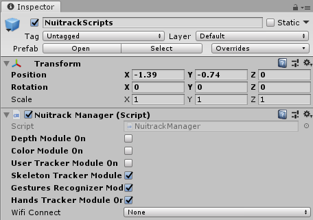<br>
<b>Required Nuitrack modules for this project</b><br>
</p>

2. Create a new script `Pointer.cs`. It will store the settings of a pointer that is used to control the gallery. In the `Start` method, subscribe to the `onHandsTrackerUpdate` event to receive data on the state of user's hands. 

```cs
private void Start()
{
    NuitrackManager.onHandsTrackerUpdate += NuitrackManager_onHandsTrackerUpdate;

    // Updating the time of the last frame (required to calculate the velocity of the pointer movement)
    lastTime = Time.time; 
}
```

3. Unsubscribe from this event in the `OnDestroy` method in order to prevent issues with null references when switching to another scene. 

```cs
private void OnDestroy()
{
	NuitrackManager.onHandsTrackerUpdate -= NuitrackManager_onHandsTrackerUpdate;
}
```

4. In the `NuitrackManager_onHandsTrackerUpdate` method, check whether the left or the right hand is used for control. Add the processing of data on user's hands to move the corresponding pointer. Define that the "click" event occurs when a user clenches his hand into a fist. If a hand is inactive, it is hidden. 

```cs
private void NuitrackManager_onHandsTrackerUpdate(nuitrack.HandTrackerData handTrackerData)
{
    active = false;

    nuitrack.UserHands userHands = handTrackerData.GetUserHandsByID(CurrentUserTracker.CurrentUser);    

    if (userHands != null)
    {
        nuitrack.HandContent? handContent = currentHand == Hands.right ? userHands.RightHand : userHands.LeftHand;

        if (handContent != null)
        {
            Vector2 pageSize = parentRectTransform.rect.size;
            Vector3 lastPosition = baseRect.position;
            baseRect.anchoredPosition = new Vector2(handContent.Value.X * pageSize.x, -handContent.Value.Y * pageSize.y);

            float velocity = (baseRect.position - lastPosition).magnitude / (Time.time - lastTime);
            
            // To avoid false positives, check the hand clenching
            // if the movement velocity is lower than the set speed
            if (velocity < minVelocityInteractivePoint) 
                Press = handContent.Value.Click;

            active = true;
        }
    }

    Press = Press && active;
    lastTime = Time.time; // Updating the time of the last frame
}
```

5. In the `Pointer.cs` script, add fields for hands and `RectTransform`, as well as for the background, default sprite and "click" sprite. The controllers are moved in the local space of `parentRectTransform`. Set the minimum speed `minVelocityInteractivePoint` for checking the hand grip (this used to avoid false positives). 

```cs
using UnityEngine.EventSystems;
using UnityEngine.UI;

public class Pointer : MonoBehaviour
{
    public enum Hands { left = 0, right = 1 };

    [SerializeField]
    Hands currentHand;

    [Header ("Visualization")]
    [SerializeField]
    RectTransform parentRectTransform;

    [SerializeField]
    RectTransform baseRect;

    [SerializeField]
    Image background;

    [SerializeField]
    Sprite defaultSprite;

    [SerializeField]
    Sprite pressSprite;

    [SerializeField]
    [Range(0, 50)]
    float minVelocityInteractivePoint = 8f;

    float lastTime = 0;
    bool active = false;
}
```

6. Depending on the state of a hand, the pointer will be either displayed or hidden. To visualize the clenched hand, let's use the "click" sprite and replace this in the **Image** component.

```cs
background.enabled = active;
background.sprite = active && press ? pressSprite : defaultSprite;
```

_**Note:** Learn more about `?:` operator at the [Microsoft website](https://docs.microsoft.com/en-us/dotnet/csharp/language-reference/operators/conditional-operator)._

7. In Unity, create a **Canvas** to display our gallery. In the **Canvas**, create the **RHand** and **LHand** Images to display the pointers: **UI → Image**. Set up the **Camera**: in the **Canvas**, select **Render Mode → Screen Space Camera**; **Render Camera → Main Camera**. 

<p align="center">
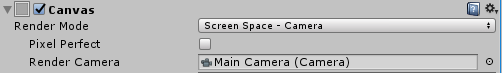<br>
<b>Canvas settings</b><br>
</p>

8. Drag-and-drop the `Pointer.cs` script to the **LHand** and **RHand** Images.
9. Drag-and-drop the **Image** (sprite used to visualize a hand) to **RHand** and **LHand**. Set the following settings: **Rect Transform → Top Left Alignment** so that that the origin of coordinates of the pointer is in the upper left corner.

<p align="center">
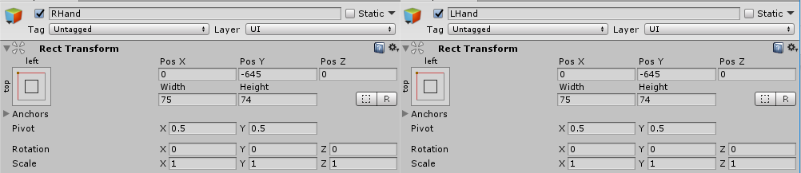<br>
<b>LHand and RHand settings</b><br>
</p>

10. In Unity, specify the settings of a right hand: **Current Hand → Right**, make a reference to **BaseRect**. For a left hand, do the same thing. Create a reference to the **Image** component: **Background → Image**. Set the sprite for the "press" pointer: **Press Sprite → HandDown**.

<p align="center">
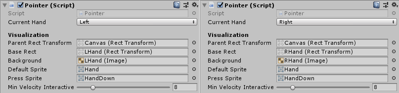<br>
<b>Pointer settings</b><br>
</p>

11. Run the project. The pointers should be displayed and move according to the user's movements. Also, the "press" sprite should appear when the user clenches his hand. 

<p align="center">
<br>
<b>Moving pointers</b><br>
</p>

## Creating a Gallery

1. In Unity, add an object for scrolling the content in our gallery to the **Canvas**: **GameObject → ScrollView**. Edit the **ScollView** settings: in the **Scroll Rect**, untick **Vertical**. For the **Scroll Rect**, set the alignment along the edges so that it's stretched up to the **Canvas** edges (even if you resize the screen, it will fill up the entire screen). 

<p align="center">
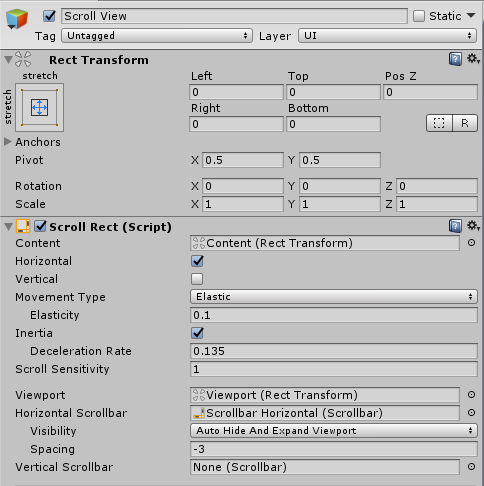<br>
<b>Scroll View settings</b><br>
</p>

2. For the **Content**, set the Top Left alignment so that it does not move to the side and the origin of coordinates is at the top left of the **ScrollRect**. 

<p align="center">
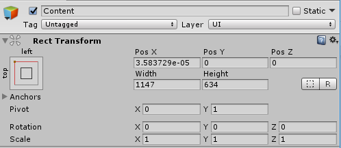<br>
<b>Content settings</b><br>
</p>

_**Note:** We disable **Vertical** in our project because we would like to scroll our gallery only horizontally. However, you can create a gallery with a vertical scroll or a vertical and horizontal scroll, if you'd like to._

3. Create a new script `GalleryControl.cs`. In this script, we'll define the settings and types of control for our gallery. Add the fields for the image display mode, control elements and additional configuration settings of our gallery. The gallery supports two modes: previewing and viewing images. 

```cs
public class GalleryControl : MonoBehaviour
{
	enum ViewMode { Preview, View };
	ViewMode currentViewMode = ViewMode.Preview;
	 
	[Header("Visualization")]
	 
	[SerializeField] ScrollRect scrollRect;
	[SerializeField] Sprite[] spriteCollection;
	[SerializeField] RectTransform content;
	[SerializeField] GameObject imageItemPrefab;
}
```

4. Set the number of columns and rows displayed on a page in the gallery view mode (you can set any positive numbers that you want). Set the variables to store a page size, number of pages and size of an image in the preview mode. 

```cs
[Range(1, 10)]
[SerializeField] int rowsNumber = 3;
[Range(1, 10)]
[SerializeField] int colsNumber = 4;

Vector2 pageSize;
int numberOfPages = 0;

Vector2 defaultSize;
```

5. In the `Start` method, fill the gallery with pictures. 

```cs
IEnumerator Start()
{
    // Skip the first frame when Unity updates the UI 
    // (otherwise scrollRect.viewport.rect. size returns an invalid value)
    yield return null; 

    pageSize = scrollRect.viewport.rect.size;
    defaultSize = new Vector2(pageSize.x / colsNumber, pageSize.y / rowsNumber);  // calculate the size of an image in the preview mode

    Vector2 halfAdd = new Vector2(defaultSize.x / 2, -defaultSize.y / 2);

    int imagesOnPage = rowsNumber * colsNumber;
    numberOfPages = (int)Mathf.Ceil((float)spriteCollection.Length / imagesOnPage);  // divide the total number of pictures by the number of pictures on one page and round it up


    int imageIndex = 0;

    for (int p = 0; p < numberOfPages; p++) // iterate over the pages
    {
        int imagesOnCurrentPage = Mathf.Min(spriteCollection.Length - p * imagesOnPage, imagesOnPage); // set the number of images on a current page

        for (int i = 0; i < imagesOnCurrentPage; i++) // fill the current page with images
        {
            // Create an image object from the prefab and make it child to the content
            GameObject currentItem = Instantiate(imageItemPrefab);
            currentItem.transform.SetParent(content.transform, false);
         
            // Calculate and specify the position on the content
            ImageItem currentImageItem = currentItem.GetComponent<ImageItem>();
            currentImageItem.Rect.sizeDelta = defaultSize;

            float X = pageSize.x * p + defaultSize.x * (i % colsNumber);
            float Y = defaultSize.y * (i / colsNumber);

            currentImageItem.Rect.anchoredPosition = new Vector2(X, -Y) + halfAdd;
        
            // Drag-and-drop to the sprite
            currentImageItem.image.sprite = spriteCollection[imageIndex];
            imageIndex++;
        }
    }

    content.sizeDelta = new Vector2(pageSize.x * numberOfPages, pageSize.y);  // set the content size        
}
```

6. In Unity, drag-and-drop the `GalleryControl.cs` script to the **Canvas**. Drag-and-drop: **Scroll Rect → Scroll View**,  **Content → Content**. Create an **Image** object for an image: **Content →  GameObject → UI → Image**. Create a prefab and drag-and-drop the **Image** object to this prefab. Drag-and-drop this prefab to **GalleryControl** (**Gallery Control → Image Item Prefab**). In the **GalleryControl** settings, set the desired number of columns and rows with images.

<p align="center">
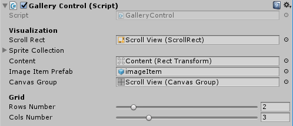<br>
<b>Gallery Control settings</b><br>
</p>

_**Note:** The gif below shows a quick way to fill your gallery with images:_

<p align="center">
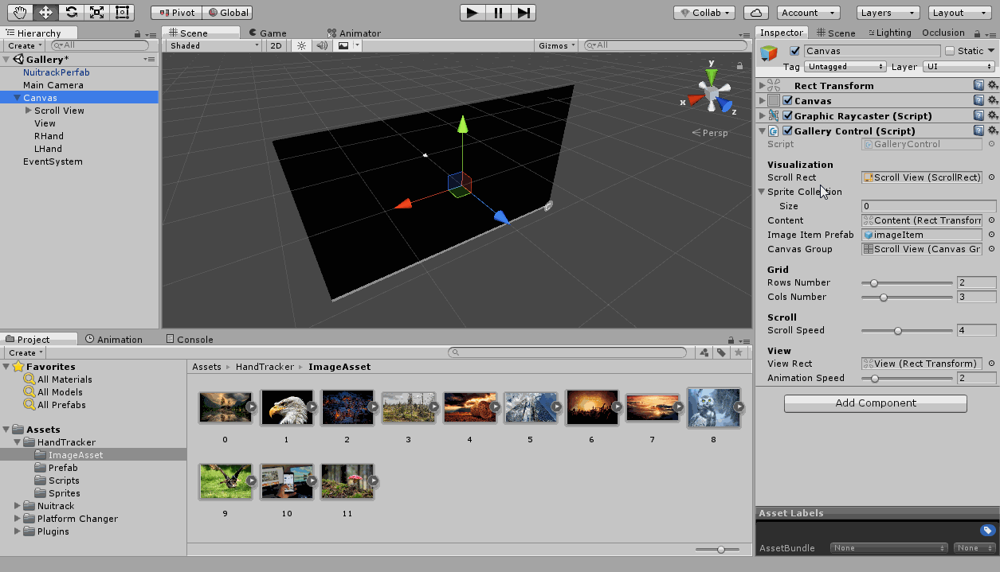<br>
<b>Fill your gallery with images in seconds!</b><br>
</p>

## Turning the Pages

1. To add the function of turning the pages to our gallery, add the fields with the values that define the speed of turning the page, offset step for the `ScrollRect` element and the current page number. We use the [AnimationCurve](https://docs.unity3d.com/2018.4/Documentation/ScriptReference/AnimationCurve.html) class in order to create an animation curve from an arbitrary number of keyframes. 

```cs
[Header("Scroll")]

[Range(0.1f, 16f)]
[SerializeField] float animationSpeed = 2;
[SerializeField] AnimationCurve animationCurve;

[Range(0.1f, 10)]
[SerializeField] float scrollSpeed = 4f;

float scrollStep = 0;
int currentPage = 0;

float startScroll = 0;
float scrollT = 0;
```

2. In the `GalleryControl.cs` script in the `Start` method, subscribe the `NuitrackManager_onNewGesture` method to the `onNewGesture` event of the **NuitrackManager** component to receive events of gestures. Unsubscribe from this event in the `OnDestroy` method.

```cs
IEnumerator Start()
{
    ...
    NuitrackManager.onNewGesture += NuitrackManager_onNewGesture;
}

private void OnDestroy()
{
    NuitrackManager.onNewGesture -= NuitrackManager_onNewGesture;
}
```

3. Calculate the scrolling step in the `Start` method.

```cs
if (numberOfPages > 1)
	scrollStep = 1f / (numberOfPages - 1); // 1/(n-1) given that the Scrollbar takes values from 0 to 1 and one page is already displayed
```

4. First, check the gallery mode (View, Preview) in the `NuitrackManager_onNewGesture` method, then define the gesture type and, depending on the result, increment or decrement the number of the current page. To ensure that the page number is not out of range, let's set the value in the range  from 0 to the total number of pages in the `Mathf.Clamp` function. Since the scrolling starts from an arbitrary position, then it is necessary to determine the current page, if we scrolled through dragging `scrollRect.horizontalScrollbar`.

```cs
private void NuitrackManager_onNewGesture(nuitrack.Gesture gesture)
{
    switch (currentViewMode)
    {
        case ViewMode.Preview:

            currentPage = Mathf.RoundToInt(scrollRect.horizontalScrollbar.value * (1 / scrollStep));

            if (gesture.Type == nuitrack.GestureType.GestureSwipeLeft)
            {
                currentPage = Mathf.Clamp(++currentPage, 0, numberOfPages - 1);
                StartScrollAnimation();
            }

            if (gesture.Type == nuitrack.GestureType.GestureSwipeRight)
            {
                currentPage = Mathf.Clamp(--currentPage, 0, numberOfPages - 1);
                StartScrollAnimation();
            }

            break;
    }
}

void StartScrollAnimation()
{
    startScroll = scrollRect.horizontalScrollbar.value;
    scrollT = 0;
    scrollRect.horizontalScrollbar.interactable = false;
}
```

_**Note:** **Nuitrack** supports the following types of gestures: Waving, Push, Swipe Up, Swipe Down, Swipe Left, Swipe Right._ 

5. In the `Update` method, add smooth turning of pages to the current page.  

```cs
private void Update()
{
    switch (currentViewMode)
    {
        case ViewMode.Preview:
	    if (scrollT < 1)
	    {
                scrollT += Time.deltaTime * scrollSpeed;
		scrollRect.horizontalScrollbar.value = Mathf.Lerp(startScroll, scrollStep * currentPage, animationCurve.Evaluate(scrollT));
	    }
	    else
		scrollRect.horizontalScrollbar.interactable = true;
        break;
    }
}
```

6. Run the project. You should see a gallery with images that can be scrolled to the left or to the right. 

<p align="center">
<br>
<b>Scrolling the gallery</b><br>
</p>

## Adding Custom InputModule

1. Let's create our own input component for our pointers, which we inherit from [StandaloneInputModule](https://docs.unity3d.com/2018.4/Documentation/ScriptReference/EventSystems.StandaloneInputModule.html). We'll expand its features by using our own pointers that will mimic the behaviour of a classic mouse pointer or a finger touch when using a touch screen. We don't have to implement all the input processing logic, we just add a simulation of the pointer, handle the behaviour of each Pointer, save the state in [MouseButtonEventData](https://docs.unity3d.com/2018.4/Documentation/ScriptReference/EventSystems.PointerInputModule.MouseButtonEventData.html), and call the methods for handling these states in the base class. From the point of view of `UnityEngine.UI`, it will look like a classic pointer and there won't be any conflict with other UI components. Let's create `HandsInputModule`. 

```cs
using UnityEngine;
using UnityEngine.EventSystems;
using System.Collections.Generic;

public class HandsInputModule : StandaloneInputModule
{
    [SerializeField] List<Pointer> pointers;

    Dictionary<Pointer, MouseButtonEventData> pointerEvents = new Dictionary<Pointer, MouseButtonEventData>();

    // Saving the state Press of the controller to track frame-by-frame changes
    Dictionary<Pointer, bool> lastPressState = new Dictionary<Pointer, bool>();

    List<RaycastResult> raycastResults = new List<RaycastResult>();

    protected override void Awake()
    {
        base.Awake();

        int pointerId = 0;
        foreach (Pointer p in pointers)
        {
            MouseButtonEventData pointerData = new MouseButtonEventData();
            pointerData.buttonData = new PointerEventData(eventSystem);
            // Set Touch id when simulating touches on a non-touch device.
            pointerData.buttonData.pointerId = kFakeTouchesId;

            m_PointerData.Add(pointerId++, pointerData.buttonData);
            pointerEvents.Add(p, pointerData);

            lastPressState.Add(p, false);
        }
    }
}
```

2. Override the [Process](https://docs.unity3d.com/2018.4/Documentation/ScriptReference/EventSystems.BaseInputModule.Process.html) method of the base class and extend its functionality. Loop through the controllers and update the screen space position and offset delta in `PointerEventData`. Delta is required so that the base class can define and implement `Drag`. 

```cs
public override void Process()
{
    foreach (KeyValuePair<Pointer, MouseButtonEventData> pe in pointerEvents)
    {
        Pointer pointer = pe.Key;
        MouseButtonEventData buttonEventData = pe.Value;
        PointerEventData pointerEventData = buttonEventData.buttonData;

        // Update position & delta pointer

        Vector2 pointOnScreenPosition = Camera.main.WorldToScreenPoint(pointer.Position);
        pointerEventData.delta = pointOnScreenPosition - pointerEventData.position;
        pointerEventData.position = pointOnScreenPosition;
    }
    base.Process(); // process the classic mouse pointer or Touch
}
```

3. To interact with elements in the UI, we need to know, which element the user points to. If you use the mouse pointer, the process is performed using the built-in Unity components `StandaloneInputModule`. In our case, we use our custom pointers, and we have to determine their logic of interaction. Similarly to the mouse pointer, to get the interface element that is located under our pointer, we use `RayCast` for the UI system that "penetrates" the Canvas and all the elements and returns a list of all the "penetrated" items.

```cs
foreach (KeyValuePair<Pointer, MouseButtonEventData> pe in pointerEvents)
{
    ...
    // Update UI Raycast data

    raycastResults.Clear();
    eventSystem.RaycastAll(pointerEventData, raycastResults);
    pointerEventData.pointerCurrentRaycast = FindFirstRaycast(raycastResults);
}
```

4. Let's define the `Press` state. Keep in mind that `StandaloneInputModule` determines whether there was a press between the frames or not. For example, if we press the mouse button or touch the screen for a few seconds, the first frame will have the `Pressed` state, and the next frames will have the `NotChanged` state. When the button is released, the last frame will take the `Released` and `NotChanged` states in subsequent frames.

```cs
foreach (KeyValuePair<Pointer, MouseButtonEventData> pe in pointerEvents)
{
    ...
    // Update the press state

    PointerEventData.FramePressState framePressState = PointerEventData.FramePressState.NotChanged;

    if (pointer.Press && !lastPressState[pointer])
        framePressState = PointerEventData.FramePressState.Pressed;
    else if (!pointer.Press && lastPressState[pointer])
        framePressState = PointerEventData.FramePressState.Released;

    lastPressState[pointer] = pointer.Press;
    buttonEventData.buttonState = framePressState;
}
```

5. After determining the position and state of the pointer, call the processing methods of the base class. `ProcessMove` and `ProcessDrag` are defined in [PointerInputModule](https://docs.unity3d.com/2018.4/Documentation/ScriptReference/EventSystems.PointerInputModule.html), from which `StandaloneInputModule` is inherited. [ProcessMousePress](https://docs.unity3d.com/2018.4/Documentation/ScriptReference/EventSystems.StandaloneInputModule.ProcessMousePress.html) is already implemented in `StandaloneInputModule`. At the end of processing each pointer, the delta must be set to zero, so that `ProcessDrag` works correctly. Since we have multiple pointers, the target UI element will receive the appropriate number of calls, which will cause the delta "overlay" for `Drag`.

```cs
foreach (KeyValuePair<Pointer, MouseButtonEventData> pe in pointerEvents)
{
    ...
    // Call the processes of a parent class

    ProcessMove(pointerEventData);
    ProcessDrag(pointerEventData);
    ProcessMousePress(buttonEventData);

    // Zero the Delta after it's used for the correct Drag event, since the number 
    // of UI event calls is equal to the number of the Pointer controllers.
    pointerEventData.delta = Vector2.zero;
}
```

6. Call the `Process` base class for the basic behavior of the mouse pointer or Touch `StandaloneInputModule`. 

```cs
foreach (KeyValuePair<Pointer, MouseButtonEventData> pe in pointerEvents)
{
    ...
}
base.Process();
```

7. Remove `StandaloneInputModule` and put the component on the scene. 

<p align="center">
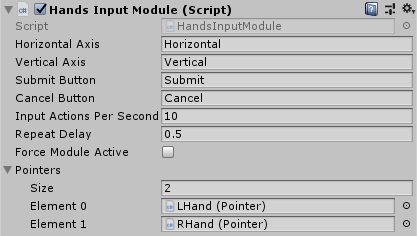<br>
<b>Hands Input Module settings</b><br>
</p>

Now our cursors will interact with the UI components. For example, you can place any button on the Canvas and try to click it either with the mouse or with your hand. The behavior should be the same (see the *UIExample* scene in the tutorial project as an example).

## Adding Interaction with Gallery Elements and the "Click" event

1. Create a new script `ImageItem`. In this script, we'll describe the interaction with images in our gallery. Inherit it not from the `MonoBehaviour` class but from the [Button](https://docs.unity3d.com/2018.4/Documentation/ScriptReference/UI.Button.html) class, so that it conforms to the general rules of interaction with the UI system in Unity.

2. In Unity, drag-and-drop this script to the `ImageItem`, set the lighting of images in the gallery depending on the pointer position.

<p align="center">
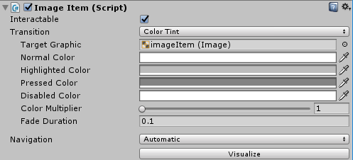<br>
<b>Lighting settings</b><br>
</p>

3. In the `GalleryControl` script, add the "click" action.

```cs
IEnumerator Start()
{
    ...
    for (int p = 0; p < numberOfPages; p++)
    {
         ... 
         for (int i = 0; i < imagesOnCurrentPage; i++)
         {
              ...     
              currentImageItem.onClick.AddListener(delegate { CurrentImageItem_OnClick(currentImageItem); });
          }
    }
}
```

4. Add the mode check: the switching to the view mode is performed from the preview mode. If a user clicks on the picture, the picture is thrown to the `viewRect`, so that it does not fade like the other pictures on the content (in *Scroll Rect*). Using the `canvasGroup.interactable` variable, disable interactivity of all pictures left from the content (the actions of the `canvasGroup` script are applied to all its children, that is, when we disable its interactivity, then interactivity is disabled for all its children, too).

```cs
private void CurrentImageItem_OnClick(ImageItem currentItem)
{
    if (currentViewMode == ViewMode.Preview && !animated)
    {
        t = 0;
        currentViewMode = ViewMode.View;
        selectedItem = currentItem;

        canvasGroup.interactable = false;
        selectedItem.transform.SetParent(viewRect, true);

        startAnchorPosition = selectedItem.Rect.anchoredPosition;
        startRectSize = selectedItem.Rect.sizeDelta;
        viewRectAnchor = startAnchorPosition;

        selectedItem.EnterViewMode();
    }
}
```

5. In the `Update` method, determine the characteristics of the animation in the gallery: when you click and switch to the view mode, the image opens in full screen.

```cs
private void Update()
{
    switch (currentViewMode)
    {
        case ViewMode.View:

            if (t < 1)
            {
                // Add the delta multiplied by the specified speed to the current animation time
                t += Time.deltaTime * animationSpeed;
                float shift = animationCurve.Evaluate(t);
                
                // Shift the transparency of the remaining pictures to 0 exponentially from t
                canvasGroup.alpha = Mathf.Lerp(1, 0, shift);

                // Stretch the picture to the full screen size exponentially from shift
                selectedItem.Rect.sizeDelta = Vector2.Lerp(startRectSize, pageSize, shift);

                // Move the picture to the center of the screen exponentially from t
                Vector2 pageAnchorPosition = new Vector2(pageSize.x / 2, -pageSize.y / 2);
                selectedItem.Rect.anchoredPosition = Vector2.Lerp(startAnchorPosition, pageAnchorPosition, shift);
            }

            break;
       ...
    }
}
```

6. Add the animation in case the "preview" mode is selected.

```cs
...
case ViewMode.Preview:

    if (animated)
    {
        if (t < 1)
        {
            // Roll back the time from 1 to 0
            t += Time.deltaTime * animationSpeed;
            float shift = animationCurve.Evaluate(t);

            canvasGroup.alpha = Mathf.Lerp(0, 1, shift);

            selectedItem.Rect.sizeDelta = Vector2.Lerp(startRectSize, defaultSize, shift);

            selectedItem.Rect.anchoredPosition = Vector2.Lerp(startAnchorPosition, viewRectAnchor, shift);
            selectedItem.Rect.localRotation = Quaternion.Lerp(startRotation, Quaternion.identity, shift);
            selectedItem.Rect.localScale = Vector3.Lerp(startScale, Vector3.one, shift);
        }
        else
        {
            // Make the image a child of the content
            selectedItem.transform.SetParent(content, true);
            // Return interactivity to all elements
            selectedItem.ExitViewMode();
            canvasGroup.interactable = true;
             // Discard the selected image and stop the animation
            selectedItem = null;
            animated = false;
        }
    }
    else
    {
        if (scrollT < 1)
        ...
    }
    break;
```

7. Add the actions to be performed when exiting the view mode.

```cs
private void NuitrackManager_onNewGesture(nuitrack.Gesture gesture)
{
    switch (currentViewMode)
    {
         ...
         case ViewMode.View:
            // If there was a swipe up, then switch to the preview mode and start the animation
            if (gesture.Type == nuitrack.GestureType.GestureSwipeUp)
            {
                currentViewMode = ViewMode.Preview;
                animated = true;
                t = 0;

                startRectSize = selectedItem.Rect.sizeDelta;

                startAnchorPosition = selectedItem.Rect.anchoredPosition;
                startRotation = selectedItem.Rect.localRotation;
                startScale = selectedItem.Rect.localScale;
            }
            break;
    }
}
```

8. Add the `viewMode` state to `ImageItem.cs` to change the behavior of the item depending on the current mode. 

```cs
public class ImageItem : Button
{
    bool viewMode = false;

    public RectTransform Rect
    {
        get
        {
            return image.rectTransform;
        }
    }

    public void EnterViewMode()
    {
        if (!viewMode)
        {
            viewMode = true;
            InstantClearState();
        }
    }

    public void ExitViewMode()
    {
        viewMode = false;
    }
}
```

9. In Unity, add the **Canvas Group** component, which we need to make the background transparent when the image opens in the view mode: **Unity → Scroll View → Add Component → Canvas Group**. In the **Canvas**, set black as the background color (to make our gallery even more beautiful). Add the **Panel** object to the **Canvas** so that we have an empty rectangle, in which we will put the picture in the view mode: **Canvas → GameObject → UI → Panel** and delete the **Image** component. To correctly display the gallery and pointers, **Canvas** should have the following hierarchy:

* Scroll View
* View
* RHand
* LHand

10. Drag-and-drop the area that will contain an image in the view mode to the **Canvas**: **Gallery Control → View Rect → View (Rect Transform)**. For **AnimationCurve**, set an arbitrary curve with X and Y values: [0, 1]. 

<p align="center">
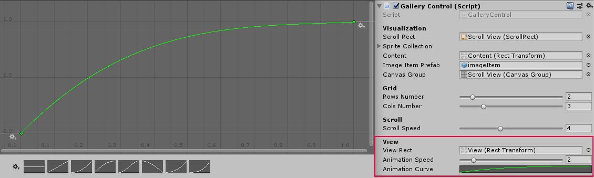<br>
<b>Setting the View Rect</b><br>
</p>

11. Run the project. Images will now change color depending on the cursor position. After the click, the image will open in the view mode. You can close the image with a swipe up. 

<p align="center">
<br>
<b>Interactive gallery</b><br>
</p>

## Dragging, zooming and rotating the Images in View Mode

1. In the `ImagItem.cs` script, add the handling for One-Touch and Multi-Touch events. Add fields for storing current touches, initial position, rotation, and the image scale.

```cs
public class ImageItem : Button, IDragHandler
{
    List<PointerEventData> touches = new List<PointerEventData>();
    ...

    bool MultiTouch
    {
        get
        {
            return touches.Count > 1;
        }
    }

    bool OneTouch
    {
        get
        {
            return touches.Count == 1;
        }
    }
}
```

2. Override the `OnPointerDown` method: if the hand is pressed, then the touch is added.

```cs
public override void OnPointerDown(PointerEventData eventData)
{
    if (!touches.Contains(eventData))
    {
        touches.Add(eventData);
        UpdateInitialState();
    }

    base.OnPointerDown(eventData);
}
```
3. Override the `OnPointerUp` method: when the hand is unclenched, the image is no longer held.

```cs
public override void OnPointerUp(PointerEventData eventData)
{
    touches.Remove(eventData);
    base.OnPointerUp(eventData);
    UpdateInitialState();
    InstantClearState();
}
```

4. Since the change in the image state will be calculated based on the changes made since the start of capturing until the current moment, determine the method for saving the initial image state. For the correct positioning of `ImageItem` relative to the controllers when moving and further when rotating, the offset between the center of the object and the center of the pointers is calculated in the local space of `ImageItem` using the [InverseTransformPoint](https://docs.unity3d.com/2018.4/Documentation/ScriptReference/Transform.InverseTransformPoint.html) method of this object's transform. In the case of interaction with two hands, the center point is calculated as the middle between the hand pointers. We will also add a helper method `GetWorldPointPosition` to calculate the world coordinates of the pointer.

_**Note**: Learn more about [ScreenToWorldPoint](https://docs.unity3d.com/2018.4/Documentation/ScriptReference/Camera.ScreenToWorldPoint.html)._

```cs
public class ImageItem : Button
{
    ...
    Vector3 deltaRectPosition;  

    void UpdateInitialState()
    {
        if (OneTouch)
        {
            Vector3 firstPosition = GetWorldPointPosition(touches[0]);
            deltaRectPosition = Rect.InverseTransformPoint(firstPosition);
        }
        else if (MultiTouch)
        {
            Vector3 firstPosition = GetWorldPointPosition(touches[0]);
            Vector3 secondPosition = GetWorldPointPosition(touches[1]);

            deltaRectPosition = Rect.InverseTransformPoint((firstPosition + secondPosition) / 2);
        }
    }

    Vector3 GetWorldPointPosition(PointerEventData pointerEventData)
    {
        return Camera.main.ScreenToWorldPoint(pointerEventData.position);
    }
}
```

5. Add support for the [IDragHandler](https://docs.unity3d.com/2018.4/Documentation/ScriptReference/EventSystems.IDragHandler.html) interface for handling drag-and-drop.

```cs
public class ImageItem : Button, IDragHandler
{
    ...
}
```

6. Define the `OnDrag` method: it will perform dragging, scaling, and rotating of an image. For one pointer, only drag-and-drop is available. For two pointers, all actions are available. First, let's implement drag-and-drop for the "one hand" and "two hands" modes. For the actions with two hands, we also check the total pointer offset to avoid the "jittering" effect. To get the world coordinates of the pointers in the last frame, we define the `GetWorldPointLastPosition` method. To transform the new position from local to global space, use the [TransformPoint](https://docs.unity3d.com/2018.4/Documentation/ScriptReference/Transform.TransformPoint.html) method on the `transform` object.

```cs
public void OnDrag(PointerEventData eventData)
{
    if (!viewMode)
        return;

    if (OneTouch)
    {
        Vector3 firstPoint = GetWorldPointPosition(touches[0]);
        Vector3 localPointPosition = Rect.InverseTransformPoint(firstPoint);
        Rect.position = Rect.TransformPoint(localPointPosition - deltaRectPosition);
    }
    else if (MultiTouch)
    {
        Vector3 firstPosition = GetWorldPointPosition(touches[0]);
        Vector3 secondPosition = GetWorldPointPosition(touches[1]);

        Vector3 lastFirstPosition = GetWorldPointLastPosition(touches[0]);
        Vector3 lastSecondPosition = GetWorldPointLastPosition(touches[1]);

        float deltaFP = (firstPosition - lastFirstPosition).magnitude;
        float deltaSP = (secondPosition - lastSecondPosition).magnitude;
        float deltaSumm = deltaFP + deltaSP;

        if (!Mathf.Approximately(deltaSumm, 0))
        {
            // Change position

            Vector3 localPointPosition = Rect.InverseTransformPoint((firstPosition + secondPosition) / 2);
            Vector3 newPosition = Rect.TransformPoint(localPointPosition - deltaRectPosition);
            newPosition.z = Rect.position.z;
            Rect.position = newPosition;
        }
    }
}

Vector3 GetWorldPointLastPosition(PointerEventData pointerEventData)
{
    return Camera.main.ScreenToWorldPoint(pointerEventData.position - pointerEventData.delta);
}
```

7. Rotate `ImageItem`. Please note that rotation is always performed before moving because [RotateAround](https://docs.unity3d.com/2018.4/Documentation/ScriptReference/Transform.RotateAround.html) rotates around a given point, which can entail additional displacement of the object.

```cs
ublic void OnDrag(PointerEventData eventData)
{
    ...
    if (!Mathf.Approximately(deltaSumm, 0))
    {
        // Change rotation

        Vector3 rotaionCenter = Vector3.Lerp(firstPosition, secondPosition, deltaFP / deltaSumm);

        float newAngle = Angle(firstPosition, secondPosition);
        float lastAngle = Angle(lastFirstPosition, lastSecondPosition);

        Rect.RotateAround(rotaionCenter, Vector3.forward, newAngle - lastAngle);

        // Change position
        ...
    }
}

float Angle(Vector3 fP, Vector3 sP)
{
    Vector3 pointRelativeToZero = fP - sP;
    return Mathf.Atan2(pointRelativeToZero.y, pointRelativeToZero.x) * Mathf.Rad2Deg;
}
```

8. Let's add the scaling feature. We'll take into account the scaling limitation in order to avoid artifacts and cases when it becomes impossible to manage `ImageItem`.

```cs
public class ImageItem : Button, IDragHandler
{
    ...
    [SerializeField]
    [Range(0.1f, 10)]
    float minScale = 0.5f;

    [SerializeField]
    [Range(0.1f, 10)]
    float maxScale = 5;

    public void OnDrag(PointerEventData eventData)
    {
        ...
        if (!Mathf.Approximately(deltaSumm, 0))
        {
            ...
            // Change scale

            float addScale = (firstPosition - secondPosition).magnitude / (lastFirstPosition - lastSecondPosition).magnitude;

            bool validateScale = true;
            for (int i = 0; i < 3 && validateScale; i++)
                validateScale = validateScale && Rect.localScale[i] * addScale > minScale && Rect.localScale[i] * addScale < maxScale;

            if (validateScale)
                Rect.localScale *= addScale;
        }
    }
}
```

_**Note**: In the inspector, the **minScale** and **maxScale** fields will not be displayed, since the Unity developers have defined a **CustomEditor** for the **Button** component that displays its properties, but this can be bypassed by writing an extension for the **OnInspectorGUI** of the GUI shell, [as described here](https://answers.unity.com/questions/1304097/subclassing-button-public-variable-wont-show-up-in.html)._

<p align="center">
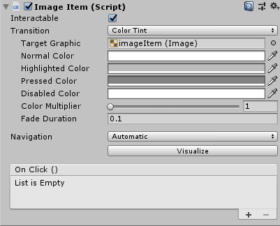<br>
<b>Image Item Settings</b><br>
</p>

9. Run the project. The image in the preview mode can be dragged with one or two hands, scaled and rotated with two hands.

<p align="center">
<br>
<b>The owl is coming!</b><br>
</p>

Congratulations, you've just created a gallery with images that you can control with gestures!
