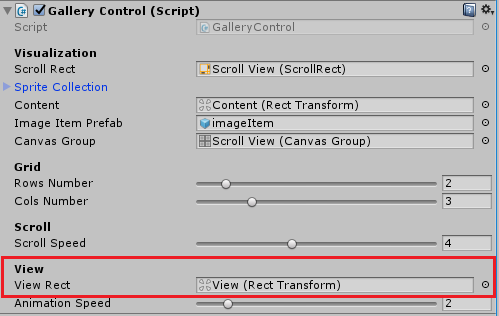

# Creating an Interactive Multi-Touch Gallery

In this tutorial, you'll learn how to create a virtual gallery that can be controlled using gestures. The gallery will have two modes: preview (several images displayed on one page) and view (when you click on an image, it opens in full screen). The gallery can be controlled with one or two hands (multi-touch) and gestures "click", "swipe up", "swipe left", "swipe right". For this project, you'll need Nuitrack and a sensor (from the list of supported sensors, see the [Nuitrack website](https://nuitrack.com/)).

To create this project, you'll need just a couple of things:

* Nuitrack Runtime and Nuitrack SDK;
* Any supported sensor (see the complete list at [Nuitrack website](https://nuitrack.com/));
* Unity 2017.4 or higher.

You can find the finished project in **Nuitrack SDK**: **Unity 3D → NuitrackSDK.unitypackage → Tutorials → HandTracker** 

<p align="center">

</p>

## Setting Up the Scene

1. Drag-and-drop the **NuitrackScripts** prefab from the **Nuitrack SDK** and tick the required modules in the **Nuitrack Manager** section: **Skeleton Tracker Module** (tracking of a user), **Hands Tracker Module** (detecting user's hands), **Gestures Recognizer Module** (gesture recognition).

<p align="center">
<br>
<b>Required Nuitrack modules for this project</b><br>
</p>

2. Create a new script `Pointer.cs`. It will store the settings of a pointer that is used to control the gallery. In the `Start` method, subscribe to the `onHandsTrackerUpdate` event to receive data on the state of user's hands. 

```cs
private void Start()
{  	 
	NuitrackManager.onHandsTrackerUpdate += NuitrackManager_onHandsTrackerUpdate;
}
```

3. Unsubscribe from this event in the `OnDestroy` method in order to prevent issues with null references when switching to another scene. 

```cs
private void OnDestroy()
{
	NuitrackManager.onHandsTrackerUpdate -= NuitrackManager_onHandsTrackerUpdate;
}
```

4. In the `NuitrackManager_onHandsTrackerUpdate` method, check whether the left or the right hand is used for control. Add the processing of data on user's hands to move the corresponding pointer. Define that the "click" event occurs when a user clenches his hand into a fist. If a hand is inactive, it is hidden. 

```cs
private void NuitrackManager_onHandsTrackerUpdate(nuitrack.HandTrackerDatahandTrackerData)
{
	bool active = false;
	bool press = false;

	foreach (nuitrack.UserHands userHands in handTrackerData.UsersHands) 
	{
		if (currentHand == Hands.right && userHands.RightHand != null)
		{
			baseRect.anchoredPosition = new Vector2(userHands.RightHand.Value.X * Screen.width, -userHands.RightHand.Value.Y * Screen.height);
			active = true;
			press = userHands.RightHand.Value.Click;
		}
		else if (currentHand == Hands.left && userHands.LeftHand != null)
		{
			baseRect.anchoredPosition = new Vector2(userHands.LeftHand.Value.X * Screen.width, -userHands.LeftHand.Value.Y * Screen.height);
			active = true;
			press = userHands.LeftHand.Value.Click;
		}
	}
}
```

5. In the `Pointer.cs` script, add fields for hands and `RectTransform`, as well as for the background, default sprite and "click" sprite. 

```cs
using UnityEngine.EventSystems;
using UnityEngine.UI;

public class Pointer : MonoBehaviour
{
	public enum Hands { left = 0, right = 1 };
	 
	[SerializeField]
	Hands currentHand;
	 
	[Header ("Visualization")]
	[SerializeField]
	RectTransform baseRect;

	[SerializeField]
	Image background;
	 
	[SerializeField]
	Sprite defaultSprite;
	 
	[SerializeField]
	Sprite pressSprite;
}
```

6. Depending on the state of a hand, the pointer will be either displayed or hidden. To visualize the clenched hand, let's use the "click" sprite and replace this in the **Image** component.

```cs
background.enabled = active;
background.sprite = active && press ? pressSprite : defaultSprite;
```

_**Note:** Learn more about `?:` operator at the [Microsoft website](https://docs.microsoft.com/en-us/dotnet/csharp/language-reference/operators/conditional-operator)._

7. In Unity, create a **Canvas** to display our gallery. In the **Canvas**, create the **RHand** and **LHand** Images to display the pointers: **UI → Image**. Set up the **Camera**: in the **Canvas**, select **Render Mode → Screen Space Camera**; **Render Camera → Main Camera**. 

<p align="center">
<br>
<b>Canvas settings</b><br>
</p>

8. Drag-and-drop the `Pointer.cs` script to the **LHand** and **RHand** Images.
9. Drag-and-drop the **Image** (sprite used to visualize a hand) to **RHand** and **LHand**. Set the following settings: **Rect Transform → Top Left Alignment** so that that the origin of coordinates of the pointer is in the upper left corner.

<p align="center">
<br>
<b>LHand and RHand settings</b><br>
</p>

10. In Unity, specify the settings of a right hand: **Current Hand → Right**, make a reference to **BaseRect**. For a left hand, do the same thing. Create a reference to the **Image** component: **Background → Image**. Set the sprite for the "press" pointer: **Press Sprite → HandDown**.

<p align="center">
<br>
<b>Pointer settings</b><br>
</p>

11. Run the project. The pointers should be displayed and move according to the user's movements. Also, the "press" sprite should appear when the user clenches his hand. 

<p align="center">
<br>
<b>Moving pointers</b><br>
</p>

## Creating a Gallery

1. In Unity, add an object for scrolling the content in our gallery to the **Canvas**: **GameObject → ScrollView**. Edit the **ScollView** settings: in the **Scroll Rect**, untick **Vertical**. For the **Scroll Rect**, set the alignment along the edges so that it's stretched up to the **Canvas** edges (even if you resize the screen, it will fill up the entire screen). 

<p align="center">
<br>
<b>Scroll View settings</b><br>
</p>

2. For the **Content**, set the Top Left alignment so that it does not move to the side and the origin of coordinates is at the top left of the **ScrollRect**. 

<p align="center">
<br>
<b>Content settings</b><br>
</p>

_**Note:** We disable **Vertical** in our project because we would like to scroll our gallery only horizontally. However, you can create a gallery with a vertical scroll or a vertical and horizontal scroll, if you'd like to._

3. Create a new script `GalleryControl.cs`. In this script, we'll define the settings and types of control for our gallery. Add the fields for the image display mode, control elements and additional configuration settings of our gallery. The gallery supports two modes: previewing and viewing images. 

```cs
public class GalleryControl : MonoBehaviour
{
	enum ViewMode { Preview, View };
	ViewMode currentViewMode = ViewMode.Preview;
	 
	[Header("Visualization")]
	 
	[SerializeField] ScrollRect scrollRect;
	[SerializeField] Sprite[] spriteCollection;
	[SerializeField] RectTransform content;
	[SerializeField] GameObject imageItemPrefab;
}
```

4. Set the number of columns and rows displayed on a page in the gallery view mode (you can set any positive numbers that you want). Set the variables to store a page size, number of pages and size of an image in the preview mode. 

```cs
[Range(1, 10)]
[SerializeField] int rowsNumber = 3;
[Range(1, 10)]
[SerializeField] int colsNumber = 4;

Vector2 pageSize;
int numberOfPages = 0;

Vector2 defaultSize;
```

5. In the `Start` method, fill the gallery with pictures. 

```cs
void Start()
{
	pageSize = new Vector2(Screen.width, Screen.height);
	defaultSize = new Vector2(Screen.width / colsNumber, Screen.height / rowsNumber); // calculate the size of an image in the preview mode

	Vector2 halfAdd = new Vector2(defaultSize.x / 2, -defaultSize.y / 2); 

	int imagesOnPage = rowsNumber * colsNumber;
	numberOfPages = (int)Mathf.Ceil((float)spriteCollection.Length / imagesOnPage); // divide the total number of pictures by the number of pictures on one page and round it up

	int imageIndex = 0;

	for (int p = 0; p < numberOfPages; p++) // iterate over the pages
	{
		int imagesOnCurrentPage = Mathf.Min(spriteCollection.Length - p * imagesOnPage, imagesOnPage); // set the number of images on a current page

		for (int i = 0; i < imagesOnCurrentPage; i++) // fill the current page with images
		{
			// Create an image object from the prefab and make it child to the content
			GameObject currentItem = Instantiate(imageItemPrefab);
			currentItem.transform.SetParent(content.transform, false);

			// Calculate and specify the position on the content
			RectTransform currentRect = currentItem.GetComponent<RectTransform>();
			currentRect.sizeDelta = defaultSize;

			float X = pageSize.x * p + defaultSize.x * (i % colsNumber);
			float Y = defaultSize.y * (i / colsNumber);

			currentRect.anchoredPosition = new Vector2(X, -Y) + halfAdd;

			// Drag-and-drop to the sprite
			Image currentImage = currentItem.GetComponent<Image>();
			currentImage.sprite = spriteCollection[imageIndex];
			imageIndex++;
		}
	}

	content.sizeDelta = new Vector2(Screen.width * numberOfPages, Screen.height); // set the content size
}
```

6. In Unity, drag-and-drop the `GalleryControl.cs` script to the **Canvas**. Drag-and-drop: **Scroll Rect → Scroll View**,  **Content → Content**. Create an **Image** object for an image: **Content →  GameObject → UI → Image**. Create a prefab and drag-and-drop the **Image** object to this prefab. Drag-and-drop this prefab to **GalleryControl** (**Gallery Control → Image Item Prefab**). In the **GalleryControl** settings, set the desired number of columns and rows with images.

<p align="center">
<br>
<b>Gallery Control settings</b><br>
</p>

_**Note:** The gif below shows a quick way to fill your gallery with images:_

<p align="center">
<br>
<b>Fill your gallery with images in seconds!</b><br>
</p>

## Turning the Pages

1. To add the function of turning the pages to our gallery, add the fields with the values that define the speed of turning the page, offset step for the `ScrollRect` element and the current page number. 

```cs
[Header("Scroll")]
 
[Range(0.1f, 10)]
[SerializeField] float scrollSpeed = 4f;
 
float scrollStep = 0;

int currentPage = 0;
```

2. In the `GalleryControl.cs` script in the `Start` method, subscribe the `NuitrackManager_onNewGesture` method to the `onNewGesture` event of the **NuitrackManager** component to receive events of gestures. Unsubscribe from this event in the `OnDestroy` method.

```cs
void Start()
{
	NuitrackManager.onNewGesture += NuitrackManager_onNewGesture;
}

	private void OnDestroy()
	{
		NuitrackManager.onNewGesture -= NuitrackManager_onNewGesture;
	}
```

3. Calculate the scrolling step in the `Start` method.

```cs
if (numberOfPages > 1)
	scrollStep = 1f / (numberOfPages - 1); // 1/(n-1) given that the Scrollbar takes values from 0 to 1 and one page is already displayed
```

4. First, check the gallery mode (View, Preview) in the `NuitrackManager_onNewGesture` method, then define the gesture type and, depending on the result, increment or decrement the number of the current page. To ensure that the page number is not out of range, let's set the value in the range  from 0 to the total number of pages in the `Mathf.Clamp` function.

```cs
private void NuitrackManager_onNewGesture(nuitrack.Gesture gesture)
{
	switch (currentViewMode)
	{
		case ViewMode.Preview:
 
			if (gesture.Type == nuitrack.GestureType.GestureSwipeLeft)
			currentPage = Mathf.Clamp(++currentPage, 0, numberOfPages);

			if (gesture.Type == nuitrack.GestureType.GestureSwipeRight)
			currentPage = Mathf.Clamp(--currentPage, 0, numberOfPages);

		break;
	}
}
```

_**Note:** **Nuitrack** supports the following types of gestures: Waving, Push, Swipe Up, Swipe Down, Swipe Left, Swipe Right._ 

5. In the `Update` method, add smooth turning of pages to the current page.  

```cs
private void Update()
{
	case ViewMode.Preview:
		scrollRect.horizontalScrollbar.value = Mathf.Lerp(scrollRect.horizontalScrollbar.value, scrollStep * currentPage, Time.deltaTime * scrollSpeed); // move the content until the current page is displayed 
	break;
}
```

6. Run the project. You should see a gallery with images that can be scrolled to the left or to the right. 

<p align="center">
<br>
<b>Scrolling the gallery</b><br>
</p>

## Adding Interaction with Gallery Elements and the "Click" event

1. Create a new script `ImageItem.cs`. In this script, we'll describe the interaction with images in our gallery. Inherit it not from the `MonoBehaviour` class but from the [`Selectable`](https://docs.unity3d.com/ScriptReference/UI.Selectable.html) class so that it conforms to the general rules of interaction with the UI system in Unity. 
2. In Unity, drag-and-drop this script to the **ImageItem**, set the lighting of images in the gallery depending on the pointer position. 

<p align="center">
<br>
<b>Lighting settings</b><br>
</p>

3. To interact with elements in the UI, we need to know, which element the user points to. If you use the  mouse pointer, the process is performed using the built-in Unity  components [`StandaloneInputModule`](https://docs.unity3d.com/Manual/script-StandaloneInputModule.html), [`EventSystem`](https://docs.unity3d.com/ScriptReference/EventSystems.EventSystem.html) and [`GraphicRaycaster`](https://docs.unity3d.com/Manual/script-GraphicRaycaster.html). In our case, we use our custom pointers, and we have to determine their logic of interaction. Similarly to the mouse pointer, to get the interface element that is located under our  pointer, we use `RayCast` for the UI system that "penetrates" the **Canvas** and all the elements and returns a list of all the "penetrated" items. 

To implement `RayCast`, we need a camera from which we will throw a beam, a variable storing the current element, a variable storing the data on the point ([`PointerEventData`](https://docs.unity3d.com/ScriptReference/EventSystems.PointerEventData.html)) selected by the user, and a list of elements acting as a temporary results storage `RayCast`. 

```cs
[Header("Raycasting")]
 
[SerializeField]
Camera cam;
 
ImageItem selectedButton;
 
PointerEventData eventData = new PointerEventData(null);
List<RaycastResult> raycastResults = new List<RaycastResult>();
```

4. If the pointer is active, we can determine which element the user is pointing to. First, define the point at which the ray will be thrown. Then project the position of the pointer relative to the screen: to do this, call  the `WorldToScreenPoint` camera method. Also, define the pointer offset, which we will need later. Clear the `RayCast` list of elements from the previous frame and perform raycasting using `RaycastAll`. Then iterate the list in a loop to find the element with the `ImageItem` component for interaction.

```cs
if (!active)
    return;

Vector2 pointOnScreenPosition = cam.WorldToScreenPoint(transform.position);
eventData.delta = pointOnScreenPosition - eventData.position;
eventData.position = pointOnScreenPosition;
 
raycastResults.Clear(); // clear the raycasting results from the previous frame 

EventSystem.current.RaycastAll(eventData, raycastResults);
 
ImageItem newButton = null;
 
for (int q = 0; q < raycastResults.Count && newButton == null; q++)
      newButton = raycastResults[q].gameObject.GetComponent<ImageItem>();
 
if (newButton != selectedButton)
{
	if (selectedButton != null)
		selectedButton.OnPointerExit(eventData);
 
		selectedButton= newButton;
 
	if (selectedButton != null)
		selectedButton.OnPointerEnter(eventData);
}
```

5. In Unity, set the camera that will be used in **Pointer** for raycasting: **RHand и LHand → Pointer → Raycasting → Cam → Main Cam**.

<p align="center">
<br>
<b>Raycasting settings</b><br>
</p>
 
6. In the `Pointer.cs` script, add the "press / release" event handling. The "click" event will be performed if the user's hand moves at a speed lower than the one specified in `dragSensitivity`. This is necessary to get rid of "phantom" clicks when the user actively moves his hand. 

```cs
else if (selectedButton != null)
{
	if (press)
	{
		if (eventData.delta.sqrMagnitude < dragSensitivity)
		{
			eventData.dragging = true;
			selectedButton.OnPointerDown(eventData);
		}
	}
	else if (eventData.dragging)
	{
		eventData.dragging = false;
		selectedButton.OnPointerUp(eventData);
	}
}
```

7. In the `ImageItem.cs` script, define the "click" event. 

```cs
public class ImageItem : Selectable
{
	public delegate void Click(ImageItem currentItem);
	public event Click OnClick;
}
```

8. Override the `OnPointerUp` method: when the hand is released, the click will be counted. 

```cs
public override void OnPointerUp(PointerEventData eventData)
{
	OnClick(this);
	InstantClearState();
 
	base.OnPointerUp(eventData);
}
```

9. In the `GalleryControl.cs` script in the `Start` method, add a field for `canvasGroup`, and also define the parameters for full-screen image view. 

```cs
[SerializeField] CanvasGroup canvasGroup;

[Header("View")]
[SerializeField] RectTransform viewRect;

Vector2 defaultPosition;
 
[Range(0.1f, 16f)]
[SerializeField] float animationSpeed = 2;
 
ImageItem selectedItem = null;

bool animated = false;
float t = 0; // current animation time
```

10. Subscribe to the "click" event. 

```cs
for (int i = 0; i < imagesOnCurrentPage.Length; i++)
{
...
	currentImage.sprite = spriteCollection[imageIndex];
	imageIndex++;

	ImageItem currentImageItem = currentItem.GetComponent<ImageItem>();
	currentImageItem.OnClick += CurrentImageItem_OnClick;
}
```

11. Add the mode check: from the preview mode, the switching to the view mode is performed. If a user clicks on the picture, the picture is thrown to the `viewRect`, so that it does not fade like the other pictures on the content (in **Scroll Rect**). Using the [`canvasGroup.interactable`](https://docs.unity3d.com/Manual/class-CanvasGroup.html) variable, disable interactivity of all  pictures left from the content (the actions of the `canvasGroup` script are applied to all its children, that is, when we disable its interactivity, then interactivity is disabled for all its children, too).

```cs
private void CurrentImageItem_OnClick(ImageItem currentItem)
{
	if (currentViewMode == ViewMode.Preview)
	{
		t = 0;
		currentViewMode = ViewMode.View;
		selectedItem = currentItem;

		canvasGroup.interactable = false;
		selectedItem.interactable = false;

		selectedItem.transform.SetParent(viewRect, true);
		defaultPosition = selectedItem.transform.localPosition;
	}
}
```

12. In the `Update` method, determine the characteristics of the animation in the gallery: when you click and switch to the view mode, the image opens in full screen. 

```cs
private void Update()
{
	switch (currentViewMode)
	{
		case ViewMode.View:
 
			if (t < 1)
			{
				// Add the delta multiplied by the specified speed to the current animation time
				t += Time.deltaTime * animationSpeed;

				// Shift the transparency of the remaining pictures to 0 exponentially from t
				canvasGroup.alpha = Mathf.Lerp(canvasGroup.alpha, 0, t);

				// Stretch the picture to the full screen size exponentially from t
				selectedItem.image.rectTransform.sizeDelta = Vector2.Lerp(selectedItem.image.rectTransform.sizeDelta, pageSize, t);
				// Move the picture to the center of the screen exponentially from t
				selectedItem.transform.localPosition = Vector2.Lerp(selectedItem.transform.localPosition, Vector2.zero, t);
			}
 
		break;
	...
	}
}
```

13. Add the animation in case the "preview" mode is selected. 

```cs
...
case ViewMode.Preview:
 
	if (animated)
	{
		if (t > 0)
		{
			// Roll back the time from 1 to 0
			t -= Time.deltaTime * animationSpeed;

			canvasGroup.alpha = Mathf.Lerp(1, canvasGroup.alpha, t);

			selectedItem.image.rectTransform.sizeDelta = Vector2.Lerp(defaultSize, selectedItem.image.rectTransform.sizeDelta, t);

			selectedItem.transform.localPosition = Vector2.Lerp(defaultPosition, selectedItem.transform.localPosition, t);
			selectedItem.transform.localRotation = Quaternion.Lerp(Quaternion.identity, selectedItem.transform.localRotation, t);
			selectedItem.transform.localScale = Vector3.Lerp(Vector3.one, selectedItem.transform.localScale, t);
		}
		else
		{
			// Make the image a child of the content
			selectedItem.transform.SetParent(content, true);
			// Return interactivity to all elements
			selectedItem.interactable = true;
			canvasGroup.interactable = true;
			// Discard the selected image and stop the animation
			selectedItem = null;
			animated = false;
		}
	}
	else
		scrollRect.horizontalScrollbar.value = Mathf.Lerp(scrollRect.horizontalScrollbar.value, scrollStep * currentPage, Time.deltaTime * scrollSpeed);

break;
```

14. Add the actions to be performed when exiting the view mode.

```cs
private void NuitrackManager_onNewGesture(nuitrack.Gesture gesture)
{
	case ViewMode.View:
 
		// If there was a swipe up, then switch to the preview mode and start the animation
		if (gesture.Type == nuitrack.GestureType.GestureSwipeUp)
		{
			currentViewMode = ViewMode.Preview;
			animated = true;
		}

	break;
}
```

15. In Unity, add the <b>Canvas Group</b> component, which we need to make the background transparent when the image opens in the view mode: **Unity → Scroll View → Add Component → Canvas Group**. In the **Canvas**, set black as the background color (to make our gallery even more beautiful). Add the **Panel** object to the Canvas so that we have an empty rectangle, in which we will put the picture in the view mode: **Canvas → GameObject → UI → Panel** and delete the **Image** component. To correctly display the gallery and pointers, **Canvas** should have the following hierarchy: 
	* Scroll View
	* View
	* RHand
	* LHand
16. Drag-and-drop the area that will contain an image in the view mode to the Canvas: **Gallery Control → View Rect → View (Rect Transform)**.

<p align="center">
<br>
<b>Setting the View Rect</b><br>
</p>

17. Run the project. Images will now change color depending on the cursor position. After the click, the image will open in the view mode. You can close the image with a swipe up. 

<p align="center">
<br>
<b>Interactive gallery</b><br>
</p>

## Dragging, zooming and rotating the Images in View Mode

1. In the `ImagItem.cs` script, add the handling for One-Touch and Multi-Touch events. Add fields for storing current touches, initial position, rotation, and the image scale.

```cs
List<PointerEventData> touches = new List<PointerEventData>();

Vector3 startCenter;
Vector3 startPosition;

Vector3 startScale;
float startHandDistance;

float startAngle;
Quaternion startRotation;
```

2. Override the `OnPointerExit` method: if the hand is outside the picture, then the touch is canceled. 

```cs
public override void OnPointerExit(PointerEventData eventData)
{
	touches.Remove(eventData);
	base.OnPointerExit(eventData);
}
```
3. Since the change in the image state will be calculated based on the changes made since the start of capture until the current moment, determine the method for saving the initial image state.

```cs
void UpdateInitialState()
{
	if (OneTouch)
	{
		startCenter = touches[0].position;  
	}
	else if (MultiTouch)
	{
		startCenter = (touches[0].position + touches[1].position) / 2;
		startHandDistance = (touches[0].position - touches[1].position).magnitude;

		Vector3 pointRelativeToZero = touches[1].position - touches[0].position;
		startAngle = Mathf.Atan2(pointRelativeToZero.x, pointRelativeToZero.y) * Mathf.Rad2Deg;
	}

	startScale = transform.localScale;
	startPosition = transform.localPosition;
	startRotation = transform.localRotation;
}
```

4. Override the `OnPointerDown` method: if the hand is pressed, then the touch is added.

```cs
public override void OnPointerDown(PointerEventData eventData)
{
	if (!touches.Contains(eventData))
	{
		touches.Add(eventData);
		UpdateInitialState();
	}

	base.OnPointerDown(eventData);
}
```

5. Override the `OnPointerUp` method: when the hand is unclenched, the image is no longer held.

```cs
public override void OnPointerUp(PointerEventData eventData)
{
	touches.Remove(eventData);
	UpdateInitialState();
	...
}
```

6. Add support for the [`IDragHandler`](https://docs.unity3d.com/ScriptReference/EventSystems.IDragHandler.html) interface for handling drag-and-drop.

_**Note:** In this project, you can move images not only with hands, but also with the mouse pointer._

7. Define the `OnDrag` method: it will perform dragging, scaling and rotating of an image. For one pointer, only drag-and-drop is available. For two pointers, all actions are available.

```cs
public void OnDrag(PointerEventData eventData)
{
	if (interactable || !eventData.dragging)
		return;
 
	if(OneTouch)
	{
		// Take the initial saved position and add the offset from that moment
		Vector3 currentCenter = touches[0].position;
		transform.localPosition = startPosition + (currentCenter - startCenter);
	}
	else if(MultiTouch)
	{
		// Calculate the center between two hands and add the center offset from start of capture
		Vector3 currentCenter = (touches[0].position + touches[1].position) / 2;
		transform.localPosition = startPosition + (currentCenter - startCenter);

		// Calculate the change in distance between two hands
		float currentHandDistance = (touches[0].position - touches[1].position).magnitude;
		transform.localScale = startScale * Mathf.Abs(currentHandDistance / startHandDistance);

		// Calculate the angle of one hand relative to the other
		Vector3 pointRelativeToZero = touches[1].position - touches[0].position;
		float angle = Mathf.Atan2(pointRelativeToZero.x, pointRelativeToZero.y) * Mathf.Rad2Deg;

		// Apply rotation 
		transform.localRotation = startRotation * Quaternion.Euler(0, 0, startAngle - angle);
	}
}
```

8. In the `Pointer.cs` script, add calling the `OnDrag` method of the current element to perform drag-and-drop. 

```cs
if (press)
	selectedButton.OnDrag(eventData);
```

9. Run the project. The image in the preview mode can be dragged with one or two hands, scaled and rotated with two hands. 

<p align="center">
<br>
<b>The owl is coming!</b><br>
</p>

Congratulations, you've just created a gallery with images that you can control with gestures!
