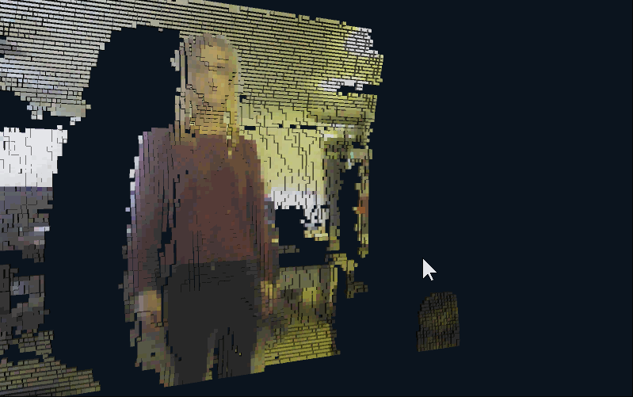
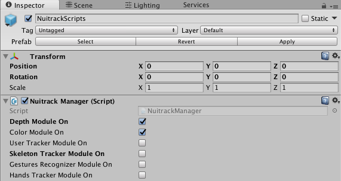
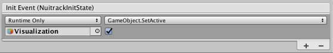
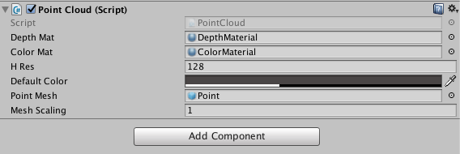
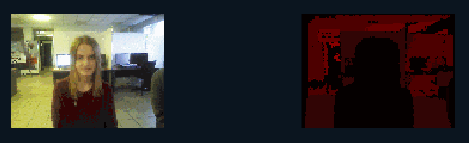
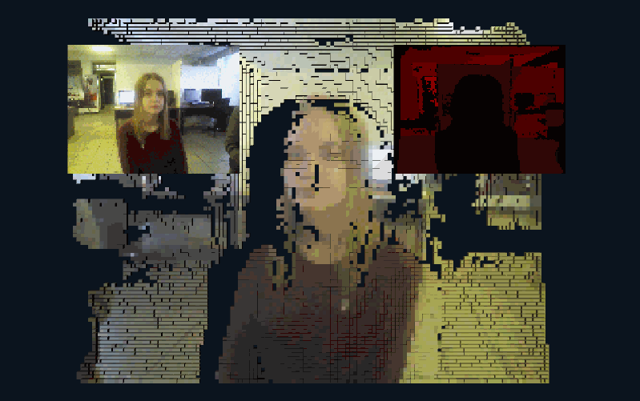
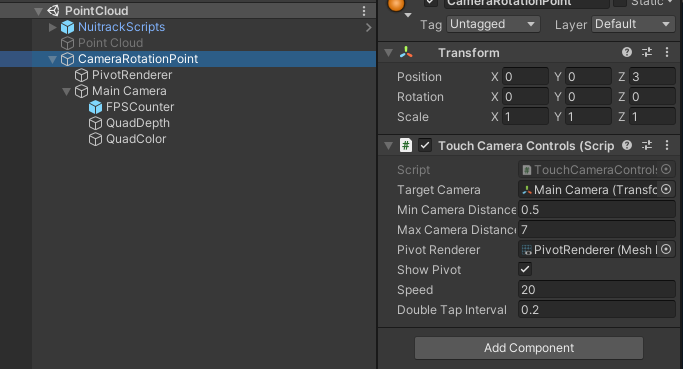

# Creating a 3D Point Cloud

In this tutorial, you'll learn how to create a point cloud in the Unity editor. To do this, you'll need a sensor (ideally, with an RGB camera) and **Nuitrack SDK**, as well as a mobile device (optional). The point cloud may be used in many fields, such as 3D modeling, 3D gaming, VR apps, etc.  The point cloud is created using the color and depth data received from the sensor.

To create this project, you'll need just a couple of things:

* [Nuitrack Runtime](/Platforms) and [Nuitrack SDK](https://github.com/3DiVi/nuitrack-sdk)
* Any supported sensor (see the complete list at [Nuitrack website](https://nuitrack.com/#sensors))
* Unity 2017.4 or higher

You can find the finished project in **Nuitrack SDK**: **Unity 3D → NuitrackSDK.unitypackage → Tutorials → Point Cloud**

<p align="center">

</p>

## Setting Up the Environment

1. Create a new Scene in Unity: **File → New Scene**
2. In the scene, create 2 squares: **GameObject → 3D Object → Quad** (x2). We will use them as planes to display the color and depth received from the sensor. For convenience, let's name them **QuadDepth** (for depth) and **QuadColor** (for color).
3. Then, create 2 materials for depth and color respectively: create the **Materials** folder in the **Assets** folder, then, in the **Project** tab: **RC → Create → Material**. For convenience, let's name the materials  **ColorMaterial** and **DepthMaterial**.
4. Download  [Nuitrack SDK](/Platforms). Import the **Nuitrack** and  **Plugins** folders from the  **Nuitrack.unitypackage** to the project. Drag-and-drop the **NuitrackScripts** prefab from the **Nuitrack/Prefabs** folder to the scene. In Unity, select the **Inspector** tab → **Nuitrack Manager** and tick two modules: **Color Module On** and **Depth Module On**. As you can see, these Nuitrack modules provide access to the sensor depth and color data. Other Nuitrack modules are not required for this project.

<p align="center">
<br>
<b>Tick the required modules in the Nuitrack Manager</b><br>
</p>

5. Create an empty object and name it **Visualization**. We'll use this object to visualize depth and color.
6. Untick this object. In the **NuitrackManager**, select ' + ' in the **Init Event (NuitrackInitState)**. Drag-and-drop the **Visualization** object to the created field. Select **GameObject/SetActive** from the drop-down list and tick. This ensures that the visualization starts only after Nuitrack initialization. Now, when our scene is set up, we are ready to move on to some more interesting things, such as actual work with depth and color.

<p align="center">
<br>
<b>Ticked Visualization Object</b><br>
</p>

## Depth and Color Visualization

1. Create a new script and name it *PointCloud.cs*. Drag-and-drop it to the **Visualization** object. In Unity, let's add some features of our object in the **Inspector** tab (in the **Point Cloud (Script)** section). We need to:

* specify the two materials that we've just created, 
* specify the resolution of the window, in which the point cloud will be displayed, 
* set the default color that will be used for coloring the point cloud if the sensor doesn't have an RGB camera.

<p align="center">
<br>
<b>Characteristics of the Point Cloud object</b><br>
</p>

2. In the `PointCloud` class, create the fields for displaying depth and color. Then, create the variables that will store the depth and color values:

```cs
public class PointCloud : MonoBehaviour
{
	[SerializeField] Material depthMat, colorMat;
 
	nuitrack.DepthFrame depthFrame = null;
	nuitrack.ColorFrame colorFrame = null;
}
```

3. Create a field for resolution (which is determined by height; the width is determined automatically). Also, define the pixel size (`frameStep`):

```cs
...
[SerializeField] int hRes;
int frameStep;
...
```

_**Note:** Recommended image resolution: 128х96. You can set a higher resolution if you want. However, in this case Unity may run slower if your computer is not so powerful._

4. Set the default color (that will be used for coloring the cubes if the sensor doesn't have an RGB camera).

```cs
...
[SerializeField] Color defaultColor;
...
```

5. Set the texture for two created planes. Then, create an array with depths and an array with colors to store the data received from the sensor.

```cs
...	
Texture2D depthTexture, rgbTexture;
Color[] depthColors; // Array with depths
Color[] rgbColors; // Array with colors
...
```

6. Create a variable that defines initialization (after initialization, the value is changed to `true`):

```cs
...          
bool initialized = false;
...
```

7. Initialize visualization:

```cs
void Start()
{
	if (!initialized) Initialize();
}
```

8. In the `Initialize()` method, use the `nuitrack.OutputMode mode = NuitrackManager.DepthSensor.GetOutputMode()` method to get the struct with resolution, FPS and FOV of the sensor. Check that `frameStep` > 0. The greater the `frameStep` value, the better the image quality but slower performance. Then, create mesh (cube) instances:

```cs
void Initialize()
{
	initialized = true;
 
	nuitrack.OutputMode mode = NuitrackManager.DepthSensor.GetOutputMode(); // Return the struct with resolution, FPS and FOV of the sensor
	frameStep = mode.XRes / hRes;
	if (frameStep <= 0) frameStep = 1; // frameStep must be > 0
	hRes = mode.XRes / frameStep;
	// Define height and width, create mesh (cube) instances
	InitMeshes(
	((mode.XRes / frameStep) ), // Width
	((mode.YRes / frameStep) ),  // Height
	mode.HFOV);
}
```

You may wonder why do we have to set the `if (frameStep <= 0) frameStep = 1` condition. The point is that when `frameStep` is a fractional number less than one, the value is rounded to zero (since `frameStep` is integer). In this case, Unity or a mobile device crashes because there are expressions in the script with division by `frameStep` - so, an attempt of division by zero may may happen. You may get a fractional number less than zero in case your sensor resolution is less than the resolution set in Unity (for example, the sensor resolution is 80x60 and the resolution in Unity is 128x96).

9. Using the `InitMeshes` method, create textures, apply them to the materials and set the size of the arrays:

```cs
void InitMeshes(int cols, int rows, float hfov)
{
	// Set the size of the arrays
	depthColors = new Color[cols * rows];
	rgbColors = new Color[cols * rows];
 
	// Create a depth texture
	depthTexture = new Texture2D(cols, rows, TextureFormat.RFloat, false);
	depthTexture.filterMode = FilterMode.Point;
	depthTexture.wrapMode = TextureWrapMode.Clamp;
	depthTexture.Apply();

	// Create an RGB texture
	rgbTexture = new Texture2D(cols, rows, TextureFormat.ARGB32, false);
	rgbTexture.filterMode = FilterMode.Point;
	rgbTexture.wrapMode = TextureWrapMode.Clamp;
	rgbTexture.Apply();
 
	//Applying textures to the materials
	depthMat.mainTexture = depthTexture;
	colorMat.mainTexture = rgbTexture;
}
```

_**Note:** We recommend you to use the following sensors for better quality of your point cloud: TVico, VicoVR, Asus Xtion Pro, Orbbec Persee, Intel RealSense D415/D435._

10. In the `Update` method, check for new frames:

```cs
void Update()
{
	bool haveNewFrame = false;
 
	if ((NuitrackManager.DepthFrame != null))
	{
		if (depthFrame != null)
		{
			haveNewFrame = (depthFrame != NuitrackManager.DepthFrame);
		}
		depthFrame = NuitrackManager.DepthFrame;
		colorFrame = NuitrackManager.ColorFrame;
		if (haveNewFrame) ProcessFrame(depthFrame, colorFrame);
	}
}
```

_**Note:** You can also request new depth and color frames by subscribing to events `NuitrackManager.onColorUpdate` (to receive color frames) and `NuitrackManager.onDepthUpdate` (to receive depth frames)._

11. If new frames are received, process them:

```cs
void ProcessFrame(nuitrack.DepthFrame depthFrame, nuitrack.ColorFrame colorFrame)
{
	int pointIndex = 0;
 
	for (int i = 0; i < depthFrame.Rows; i += frameStep)
	{
		for (int j = 0; j < depthFrame.Cols; j += frameStep)
		{
			// Take the frame depths and include it in the depthColors array
			depthColors[pointIndex].r = depthFrame[i, j] / 16384f;
 
			// Take the frame RGB colors and include it in the rgbColors array
			// If the camera colors are not received, the default color is applied
			Color rgbCol = defaultColor;
			if (colorFrame != null)
			rgbCol = new Color32(colorFrame[i, j].Red, colorFrame[i, j].Green, colorFrame[i, j].Blue, 255);
			rgbColors[pointIndex] = rgbCol;

			++pointIndex;
		}
	}
}
```

The `depthColors[pointIndex].r = depthFrame[i, j] / 16384f` string is responsible for rendering of the depth map. The `r` parameter can have a value in the range of 0 to 1, in turn, the depth can have a value in the range of 0 to 65536. The lower the coefficient, the brighter the depth map is.

12. Color the pixels in the depth and color textures:

```cs
...	
depthTexture.SetPixels(depthColors);
rgbTexture.SetPixels(rgbColors);
...
```

13. Apply the pixels in the depth and color textures to the <b>Visualization</b> object:

```cs
...	
depthTexture.Apply();
rgbTexture.Apply();
...
```

14. As a result, you will see two windows: color pixel image on the left and depth map on the right. We'll use them to create our point cloud.

<p align="center">
<br>
<b>Color and depth planes in Unity</b><br>
</p>

## Creating a Point Cloud

Now we have all the necessary data to create a point cloud. 

1. In the **Hierarchy** tab, create a prefab **Point: Create → 3DObject → Cube**. It will be displayed as a cube. Our point cloud will be formed from these cubes.
2. Create a material for the prefab: **Project → Create → Material → PointMat**. Drag-and-drop the **PointMat** material to the **Point** prefab.
3. The point cloud will be made of a huge number of cubes that will be in contact and collide with each other. If Unity calculated the collision of all these objects, it would significantly reduce the project performance. To avoid this, let's delete the **Box Collider** component by clicking on the Gear and selecting **Remove Component**.
4. Drag-and-drop the **Point** folder to the project folder and remove it from the scene.
5. Okay, time to move back to our script. In the *PointCloud* class, create a field for our created **Point** prefab:

```cs
...        
[SerializeField] GameObject pointMesh;
...
```

6. Drag-and-drop the **Point** prefab from this folder to the **Point Mesh** field in the **Point Cloud** component.

7. In the script, create an array with the **Points** prefabs (cubes):

```cs
...          
GameObject[] points;
...
```

8. In the `InitMeshes` method, set the size of the array with the **Points** prefabs (multiply the number of rows by the number of columns with points):

```cs
...	
points = new GameObject[cols * rows];
...
```

9. In the `InitMeshes` method, create instances of the **Points** (cubes) and include them to the `Points` array. Set the **Visualization** as a parent object and the **Points** prefabs as its children.

```cs
int pointId = 0;
 
for (int i = 0; i < rgbTexture.height; i++)
{
	for (int j = 0; j < rgbTexture.width; j++)
	{
		points[pointId++] = Instantiate(pointMesh, transform);
	}
}
```
10. In the `ProcessFrame` method, change the position of the **Point** (cube) along the Z (depth) axis. In some cases, the sensor can't identify the depth of the point. As a result, the Z coordinate has the value of 0. Let's hide the points with Z=0 for correct display of the image. After that, we change the position and size of the **Point** (cube).

```cs
points[pointIndex].GetComponent<Renderer>().material.color = rgbCol;
 
// Change the position of the Point (cube) along the Z axis
Vector3 newPos = NuitrackManager.DepthSensor.ConvertProjToRealCoords(j, i, depthFrame[i, j]).ToVector3();
 
// Hide the Prefabs with the depth = 0
if (depthFrame[i, j] == 0)
points[pointIndex].SetActive(false);
else
{
	points[pointIndex].SetActive(true);
	points[pointIndex].transform.position = newPos; // Change the Point position          	         
}
```

11. If we want our point cloud look realistic when changing the distance in Unity, we need to scale the mesh size, so that the sized of the cubes changes according to the distance. In the `PointCloud` class, add the following strings:

```cs
...	
[SerializeField] float meshScaling = 1f;
float depthToScale;
...
```

12. In the `ProcessFrame`, calculate the size of the cubes according to the depth by adding the following strings to the `if (depthFrame[i, j] == 0)... else...` condition:

```cs
else             
...	
float distancePoints = Vector3.Distance(newPos, NuitrackManager.DepthSensor.ConvertProjToRealCoords(j + 1, i, depthFrame[i, j]).ToVector3()); //Distance between the Points
depthToScale = distancePoints * depthFrame.Cols / hRes; //Calculate the size of the cubes depending on the depth
...
```

13. In the `ProcessFrame` method, change the cube size:

```cs
...
points[pointIndex].transform.localScale = Vector3.one * meshScaling * depthToScale;
...
```

14. So, after your project is built, you should see a color point cloud like the animation below. Keep in mind, that the image may me slightly different, depending on the sensor used: colours may be brighter or paler, the deptha map may be more or less detailed. However, in any case, the created point cloud will be accorate enough to be used in your projects.

<p align="center">
<br>
<b>Created point cloud</b><br>
</p>

15. All right, now that we created the point cloud, it seems kind of flat. To see the actual volume of our point cloud and position of objects in the room, we need to apply the [MouseOrbitImproved](http://wiki.unity3d.com/index.php?title=MouseOrbitImproved#Code_C.23) script. Drag-and-drop the script to the camera in Unity. Create an empty object and name it, for example, rotation point. Move the object to x:0 y:0 z:600 (the camera will rotate around this object). In the script settings, specify the object around which the camera (**rotation point**) will rotate. The settings must be as shown in the picture below.

<p align="center">
<br>
<b>Characteristics of the MouseOrbitImproved Script</b><br>
</p>

16. In order to improve the resulting point cloud, we recommend you to turn on depth-to-color registration because a depth map doesn't accurately match an RGB image, therefore, they should be aligned. To turn on depth-to-color registration, open *nuitrack.config* from the folder `<nuitrack_home>\data` and set `DepthProvider.Depth2ColorRegistration` to `true`.

17. When the script is applied, you can see the volume of the objects displayed as a point cloud. Well done!

<p align="center">
<br>
<b>3D Point Cloud after the MouseOrbitImproved script is applied</b><br>
</p>

Useful links:

* [Learn more about Texture2D](https://docs.unity3d.com/ScriptReference/Texture2D.html)
* [Learn more about  Color32](https://docs.unity3d.com/ScriptReference/Color32.html)
