# Displaying Skeletons on an RGB Image 

In this tutorial, you'll learn how to display a color image from your sensor in a Unity project and display the skeletons of users received from Nuitrack.

You can find the finished project in **Nuitrack SDK: Unity 3D → NuitrackSDK.unitypackage → Tutorials → RGB and Skeletons** 

To create this project, you'll need just a couple of things:
* [Nuitrack Runtime](/Platforms) and [Nuitrack SDK](https://github.com/3DiVi/nuitrack-sdk)
* Any supported sensor (see the complete list at [Nuitrack website](https://nuitrack.com/#sensors))
* Unity 2017.4 or higher

<p align="center">

</p>

## Setting Up the Scene and Getting RGB Output from a Sensor 

1. Create a new project.
2. Download **Nuitrack SDK** and import **NuitrackSDK.unitypackage** to your project (**Assets → Import Package → Custom Package...**) except **Tutorials/RGBandSkeletons/FinalAssets** and **Tutorials/FaceTracker/Final Assets**. 
3. Drag-and-drop the **NuitrackScripts** prefab to the scene (this prefab allows you to use Nuitrack modules in your project). 
4. In the **Nuitrack Manager** section of the **NuitrackScripts** prefab, tick the necessary modules: **Color Module On** (to display the RGB image), **Skeleton Tracker Module On** (for skeleton tracking, as you can guess).

<p align="center">
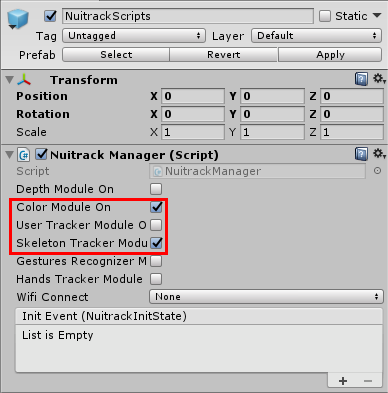
</p>

5. Create a new script and name it `DrawColorFrame`. In this script, determine the output of an RGB image to the scene. 
6. Create a public field `RawImage background` to display the image. In `Start`, subscribe to update each color frame. 

```cs
using UnityEngine;
using UnityEngine.UI;
 
public class DrawColorFrame : MonoBehaviour
{
	[SerializeField] RawImage background;
 
	void Start()
	{
		NuitrackManager.onColorUpdate += DrawColor;
	}
}
```

_**Note:** Why do we use `RawImage` instead of `Image` in this project? `Image` is used for displaying Sprites only. `RawImage` is used for displaying any type of texture. Sprites are easier to work with, but `Sprite.Create` is an expensive operation. It takes a comparatively long time and uses a lot of memory. By using a `RawImage` you can skip the step of creating a sprite. `RawImage` accepts the texture, which we've created with `ToTexture2D()` from the data received from Nuitrack (frame)._

7. Unsubscribe from the `onColorUpdate` event.

```cs
...
    void Destroy()
    {
        NuitrackManager.onColorUpdate -= DrawColor;
    }
...
```

8. In the `DrawColor` method, get the texture of `ColorFrame` and pass it to the `background` texture.

```cs
public class DrawColorFrame : MonoBehaviour
{
...
	void DrawColor(nuitrack.ColorFrame frame)
	{ 
		background.texture = frame.ToTexture2D();
	}
}
```

_**Note**: If you observe memory leak, try to delete the old texture (for example, using `Destroy(oldTexture)`) before you display the new texture._

9. Create a new **Canvas** on the scene (**Create → UI → Canvas**). After this, create a child object to the **Canvas**: **Create → UI → Raw Image**. The received texture (the image from a sensor) is stretched across the **Raw Image**.  
10. In the **Raw Image** settings, select **Anchor Presets**, press **Alt** and stretch the object across the width and height of the **Canvas**.

<p align="center">
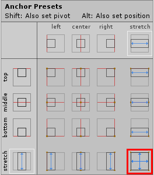
</p>

11. Rotate **RawImage** by 180 degrees along X (otherwise, the output image will be inverted).

<p align="center">
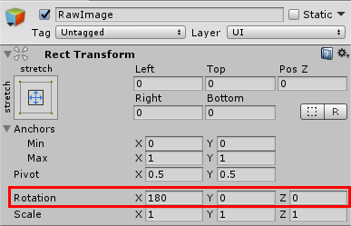
</p>

12. Rename **Canvas** to **ColorFrameCanvas** and add the `DrawColorFrame` script to it. 
13. Drag-and-drop the **Raw Image** to the **Background** field of the script. 

<p align="center">
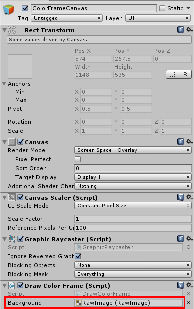
</p>

14. Run the project. You should see a color image from the sensor displayed on the screen. 

<p align="center">
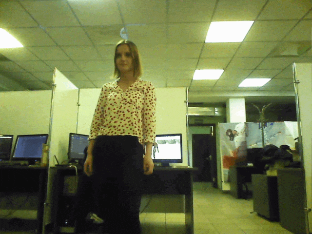
</p>

## Displaying the Skeleton

1. All right, color image from the sensor is fun, but we're interested in the skeletons of users (otherwise, what do we need Nuitrack for?) Let's start tracking and displaying skeletons. First of all, turn on **depth-to-color registration** because a depth map doesn't accurately match an RGB image and we have to align them. To turn on depth-to-color registration, you have to open `nuitrack.config` and set `DepthProvider.Depth2ColorRegistration` to `true`. 
2. Create two prefabs to display a user's skeleton (a ball for a joint and a line for a connection). As an option, you can use the prefabs from **NuitrackSDK.unitypackage** (**Assets/NuitrackSDK/Tutorials/RGBandSkeletons/Prefabs (JointUI and ConnectionUI)**). 
3. Create a new script and name it `SimpleSkeletonAvatar`. In this script, determine tracking and displaying of a single skeleton. 
4. Create a new bool variable `autoProcessing`. If we need to process only one skeleton, we set the value of this variable to `true` and Nuitrack passes all data about this skeleton. At this stage, this is quite sufficient because we want to display only one skeleton. However, when it comes to displaying several skeletons, we'll need additional components, because multiple skeletons cannot be processed automatically. 
5. Create two fields for the joint and connection prefabs: `jointPrefab` and `connectionPrefab`. And field `parentRect` where the avatar RectTransform will be stored

```cs
using System.Collections.Generic;
using UnityEngine;
 
public class SimpleSkeletonAvatar : MonoBehaviour
{
	public bool autoProcessing = true;
	[SerializeField] GameObject jointPrefab = null, connectionPrefab = null;
	RectTransform parentRect;
}
```

6. Create the `jointsInfo` array with the list of all joints that are needed to display the skeleton. All in all, there are 19 joints tracked by Nuitrack. 

```cs
public class SimpleSkeletonAvatar : MonoBehaviour
{
...
	nuitrack.JointType[] jointsInfo = new nuitrack.JointType[]
	{
		nuitrack.JointType.Head,
		nuitrack.JointType.Neck,
		nuitrack.JointType.LeftCollar,
		nuitrack.JointType.Torso,
		nuitrack.JointType.Waist,
		nuitrack.JointType.LeftShoulder,
		nuitrack.JointType.RightShoulder,
		nuitrack.JointType.LeftElbow,
		nuitrack.JointType.RightElbow,
		nuitrack.JointType.LeftWrist,
		nuitrack.JointType.RightWrist,
		nuitrack.JointType.LeftHand,
		nuitrack.JointType.RightHand,
		nuitrack.JointType.LeftHip,
		nuitrack.JointType.RightHip,
		nuitrack.JointType.LeftKnee,
		nuitrack.JointType.RightKnee,
		nuitrack.JointType.LeftAnkle,
		nuitrack.JointType.RightAnkle
	};
}
```

7. Create a 2D array containing all the connections. Specify the initial and end joints (a connection is created between these two joints).  

```cs
public class SimpleSkeletonAvatar : MonoBehaviour
{
...
	nuitrack.JointType[,] connectionsInfo = new nuitrack.JointType[,]
	{ 
		{nuitrack.JointType.Neck,		nuitrack.JointType.Head},
		{nuitrack.JointType.LeftCollar,		nuitrack.JointType.Neck},
		{nuitrack.JointType.LeftCollar, 	nuitrack.JointType.LeftShoulder},
		{nuitrack.JointType.LeftCollar, 	nuitrack.JointType.RightShoulder},
		{nuitrack.JointType.LeftCollar, 	nuitrack.JointType.Torso},
		{nuitrack.JointType.Waist,		nuitrack.JointType.Torso},
		{nuitrack.JointType.Waist,		nuitrack.JointType.LeftHip},
		{nuitrack.JointType.Waist,		nuitrack.JointType.RightHip},
		{nuitrack.JointType.LeftShoulder, 	nuitrack.JointType.LeftElbow},
		{nuitrack.JointType.LeftElbow, 		nuitrack.JointType.LeftWrist},
		{nuitrack.JointType.LeftWrist, 		nuitrack.JointType.LeftHand},
		{nuitrack.JointType.RightShoulder, 	nuitrack.JointType.RightElbow},
		{nuitrack.JointType.RightElbow, 	nuitrack.JointType.RightWrist},
		{nuitrack.JointType.RightWrist, 	nuitrack.JointType.RightHand},
		{nuitrack.JointType.LeftHip, 		nuitrack.JointType.LeftKnee},
		{nuitrack.JointType.LeftKnee, 		nuitrack.JointType.LeftAnkle},
		{nuitrack.JointType.RightHip, 		nuitrack.JointType.RightKnee},
		{nuitrack.JointType.RightKnee, 		nuitrack.JointType.RightAnkle}
	};
}
```

8. Create an list containing ready-made connections and a dictionary with ready-made joints (the key is a joint type and the value is a spawned object). 

```cs
public class SimpleSkeletonAvatar : MonoBehaviour
{
...
	List<RectTransform> connections;
	Dictionary<nuitrack.JointType, RectTransform> joints;
}
```

9. In `Start`, call the `CreateSkeletonParts` method. And get avatar's RectTransform

```cs
public class SimpleSkeletonAvatar : MonoBehaviour
{
...
	void Start()
	{
		CreateSkeletonParts();
		parentRect = GetComponent<RectTransform>();
	}
}
```

10. In the `CreateSkeletonParts` method, create all joints and connections. Joints are spawned, turned off and added to the list of joints. Do the same thing with all connections. Joints and connections are "turned on" as soon as a skeleton is detected. 

```cs
public class SimpleSkeletonAvatar : MonoBehaviour
{
...
	void CreateSkeletonParts()
	{
		joints = new Dictionary<nuitrack.JointType, RectTransform>();
 
		for (int i = 0; i < jointsInfo.Length; i++)
		{
			if (jointPrefab != null)
			{
				GameObject joint = Instantiate(jointPrefab, transform);
				joint.SetActive(false);
				RectTransform jointRectTransform = joint.GetComponent<RectTransform>();
				joints.Add(jointsInfo[i], jointRectTransform);
			}
		}
 
		connections = new List<RectTransform>();
 
		for (int i = 0; i < connectionsInfo.GetLength(0); i++)
		{
			if (connectionPrefab != null)
			{
				GameObject connection = Instantiate(connectionPrefab, transform);
				connection.SetActive(false);
				RectTransform connectionRectTransform = connection.GetComponent<RectTransform>();
				connections.Add(connectionRectTransform);
			}
		}
	}
}
```

11. Create a new method `ProcessSkeleton` for processing the skeleton received from Nuitrack. Check for null values (if a skeleton isn't detected, the other part of the method won't be executed). 

```cs
public class SimpleSkeletonAvatar : MonoBehaviour
{
...
	public void ProcessSkeleton(nuitrack.Skeleton skeleton)
	{
		if (skeleton == null)
			return;
	}
}
```

12. Loop over the joints. If a specific joint is detected (confidence > 0.01), it's displayed and its position is set in 2D (projective coordinates received from Nuitrack are used). Otherwise, the joint is not displayed. 

```cs
public class SimpleSkeletonAvatar : MonoBehaviour
{
...
	public void ProcessSkeleton(nuitrack.Skeleton skeleton)
	{
		for (int i = 0; i < jointsInfo.Length; i++)
		{
			nuitrack.Joint j = skeleton.GetJoint(jointsInfo[i]);
			if (j.Confidence > 0.01f)
			{
				joints[jointsInfo[i]].gameObject.SetActive(true);
				// Bring proj coordinates from Nuitrack into accordance with screen coordinates
				Vector2 newPosition = new Vector2(parentRect.rect.width * (Mathf.Clamp01(j.Proj.X) - 0.5f), parentRect.rect.height * (0.5f - Mathf.Clamp01(j.Proj.Y)));
				joints[jointsInfo[i]].anchoredPosition = newPosition;
			}
			else
			{
				joints[jointsInfo[i]].gameObject.SetActive(false);
			}
		}
	}
}
```

_**Note:** Currently, in default Nuitrack skeletonization, there are only two values of confidence: 0 (Nuitrack thinks that this isn't a joint) and 0.75 (a joint)._

13. Loop over the connections. If both joint models required to create the connection are displayed (the initial and end joint), activate the connection. Set the connection position based on the positions of corresponding joint models. To rotate the connection, use the difference between the positions of the initial and end joints. Calculate the connection size: 
* find the distance between the initial and end joints;
* set the size: Vector3 (distance, 1, 1)

If any joint required to create the connection is not displayed, the connection is not displayed, too. 

```cs
public class SimpleSkeletonAvatar : MonoBehaviour
{
...
	public void ProcessSkeleton(nuitrack.Skeleton skeleton)
	{
		for (int i = 0; i < connectionsInfo.GetLength(0); i++)
		{
			RectTransform startJoint = joints[connectionsInfo[i, 0]];
			RectTransform endJoint = joints[connectionsInfo[i, 1]];

			if (startJoint.gameObject.activeSelf && endJoint.gameObject.activeSelf)
			{
				connections[i].gameObject.SetActive(true);

				connections[i].anchoredPosition = startJoint.anchoredPosition;
				connections[i].transform.right = endJoint.anchoredPosition - startJoint.anchoredPosition;
				float distance = Vector3.Distance(endJoint.anchoredPosition, startJoint.anchoredPosition);
				connections[i].transform.localScale = new Vector3(distance, 1f, 1f);
			}
			else
			{
				connections[i].gameObject.SetActive(false);
			}
		}
	}
}
```

14. In `Update`, if `autoProcessing` is set to `true`, call the `ProcessSkeleton` and pass the parameters `CurrentUserTracker.CurrentSkeleton`. 

```cs
public class SimpleSkeletonAvatar : MonoBehaviour
{
…    
	void Update()
	{
		if (autoProcessing)
			ProcessSkeleton(CurrentUserTracker.CurrentSkeleton);
	}
}
```

15. Create a new **Canvas** named **SkeletonsCanvas**. Set its **Sort Order** to **1**, so that skeletons are displayed over the **ColorFrameCanvas**. 

<p align="center">
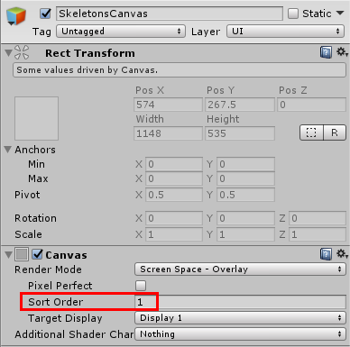
</p>

16. Create a child object to the **SkeletonsCanvas** (**Create Empty**) and name it **Simple Skeleton Avatar**. We'll use this object to display the skeleton. Drag-and-drop the `SimpleSkeletonAvatar` script to this object. 
17. Drag-and-drop the **jointUI** prefab (**Tutorials/RGBandSkeletons/Prefabs**) to the **Joint Prefab** field.  Drag-and-drop the **ConnectionUI** prefab (from the same folder) to the **Connection Prefab** field. 

<p align="center">
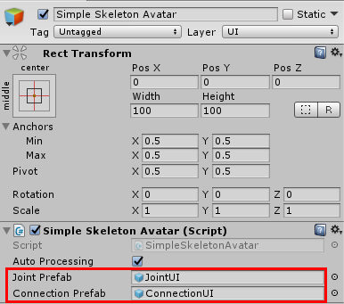
</p>

Adjust the alignment of the **RectTransform** as shown in the image

<p align="center">
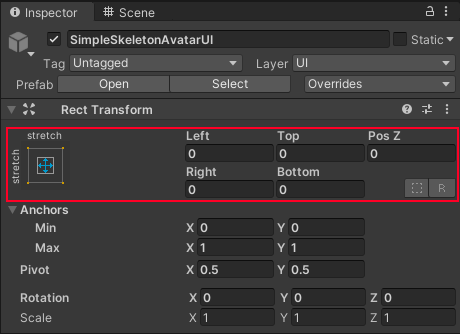
</p>

18. Run the project. At this point, you should see a 2D skeleton displayed over the RGB image from the sensor. However, if there are several users, their skeletons won't be displayed. Let's move on to the next point so as not to upset them. 

<p align="center">

</p>

## Displaying Multiple Skeletons 

1. Create a new script and name it `SkeletonController`. In this script, we'll define how to track and display multiple skeletons. 
2. Add the `nuitrack` namespace. Create the `SkeletonCount` public variable and set the range from 0 to 6 (the number of tracked skeletons). Create the `SimpleSkeletonAvatar` field (for the **SkeletonAvatar** model that we've created). Create a list of `SkeletonAvatars` (displayed skeletons).

```cs
using nuitrack;
using UnityEngine;
using System.Collections.Generic;
 
public class SkeletonController : MonoBehaviour
{
	[Range(0, 6)]
	public int skeletonCount = 6;         
	[SerializeField] SimpleSkeletonAvatar skeletonAvatar;
 
	List<SimpleSkeletonAvatar> avatars = new List<SimpleSkeletonAvatar>();
}
```

_**Note:** We set the range from 0 to 6 because Nuitrack tracks up to 6 skeletons._

3. In `Start`, spawn skeletons on the scene, get the `SimpleSkeletonAvatar` component from each skeleton, and set `autoProcessing` to `false` (because we want to process several skeletons). Add a skeleton to the list of avatars `avatars.Add(simpleSkeleton)`. Pass the desired number of tracked skeletons to Nuitrack. You can set the desired number of skeletons in the Unity editor. 

```cs
public class SkeletonController : MonoBehaviour
{    
...
	void Start()
	{
		for (int i = 0; i < skeletonCount; i++)
		{
			GameObject newAvatar = Instantiate(skeletonAvatar.gameObject, transform, true);
			SimpleSkeletonAvatar simpleSkeleton = 	newAvatar.GetComponent<SimpleSkeletonAvatar>();
			simpleSkeleton.autoProcessing = false;
			avatars.Add(simpleSkeleton);
		}
		NuitrackManager.SkeletonTracker.SetNumActiveUsers(skeletonCount);
	}
}
```

4. Create the `OnSkeletonUpdate` method, which accepts all the info about the received skeletons (`skeletonData`). Loop over all the spawned skeletons depending on the number of tracked skeletons specified in Unity. If there is a skeleton received from Nuitrack for a skeleton avatar, it's processed and displayed, otherwise, it's hidden. 

```cs
public class SkeletonController : MonoBehaviour
{    
...
	void OnSkeletonUpdate(SkeletonData skeletonData)
	{
		for (int i = 0; i < avatars.Count; i++)
		{
			if (i < skeletonData.Skeletons.Length)
			{
				avatars[i].gameObject.SetActive(true);
				avatars[i].ProcessSkeleton(skeletonData.Skeletons[i]);
			}
			else
			{
				avatars[i].gameObject.SetActive(false);
			}
		}
	}
}
```

5. In the `Start` method, subscribe to `OnSkeletonUpdateEvent`, which is called each time (each frame) the skeleton is updated. Update the skeleton info. In the `OnDestroy` method, unsubscribe from `OnSkeletonUpdateEvent`. 

```cs
public class SkeletonController : MonoBehaviour
{    
    ...    
    void Start()
    {
        ...
        NuitrackManager.onSkeletonTrackerUpdate += OnSkeletonUpdate;
    }
    ...
    private void OnDestroy()
    {
        NuitrackManager.onSkeletonTrackerUpdate -= OnSkeletonUpdate;
    }
    ...
}
```

6. Save the **SimpleSkeletonAvatar** prefab and delete it from the scene. 
7. Add the `SkeletonController` script to `SkeletonsCanvas`. 
8. Set the desired number of tracked skeletons with a slider. 

<p align="center">
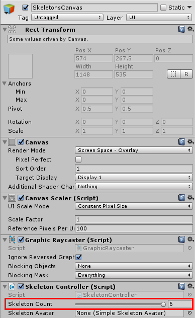
</p>

9. Drag-and-drop the **SimpleSkeletonAvatar** prefab to the **Skeleton Avatar** field of the `SkeletonController` script.

<p align="center">
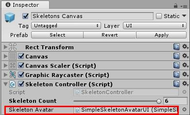
</p>

10. Enable *asynchronous initialization* of Nuitrack. This is necessary to avoid short-term freezing when you run your Unity project with Nuitrack. If asynchronous initialization is turned on, the scene and Nuitrack are initialized in different threads. As a result, the project starts without any lags. To do this, go to the **Nuitrack Manager** component and tick **Async Init**. Disable the **Color Frame Canvas** and **Skeletons Canvas** prefabs and set them active only after Nuitrack is initialized (see the image below). 

<p align="center">
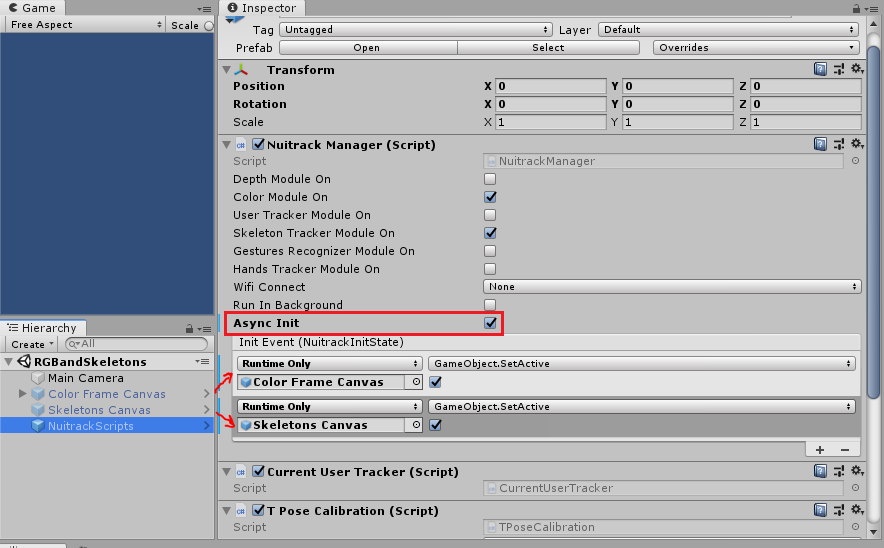
</p>

11. Run the project. Now the skeletons of several users are tracked and displayed on the RGB image. Congratulations! 

<p align="center">

</p>
