# User Segment Visualization

In this tutorial, you'll learn how to visualize a user segment using **Nuitrack SDK**. As a result, the user will be displayed as a colored 2D silhouette. And if there are several people in front of the camera, they will be displayed as several silhouettes of different colors. You can use the user segment for various purposes, for example, to create apps and games. 

To create this project, you'll need just a couple of things:

* [Nuitrack Runtime](/Platforms) and [Nuitrack SDK](https://github.com/3DiVi/nuitrack-sdk)
* Any supported sensor (see the complete list at [Nuitrack website](https://nuitrack.com/#sensors))
* Unity 2017.4 or higher

You can find the finished project in **Nuitrack SDK**: **Unity 3D → NuitrackSDK.unitypackage → Tutorials → SegmentExample**

<p align="center">
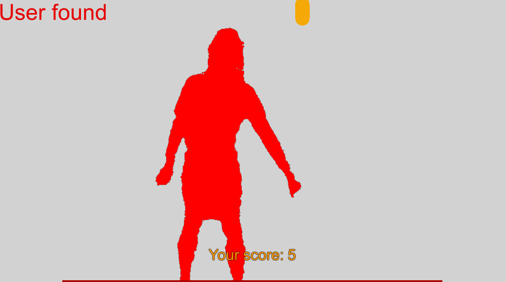
</p>

## Visualizing a User Segment

In this part of our tutorial, we'll describe the process of segment visualization. To create a user segment, you'll only need **Nuitrack SDK** and compatible sensor (for example, [TVico](https://tvico.io/))).

### Checking User Presence 

1. Before we begin to visualize the user segment, we first need to check whether the user is detected by the camera or not. First of all, import the **NuitrackScripts Prefab** from the **Nuitrack SDK** to your Unity project. Tick the Nuitrack modules required for this project (**Depth Module, User Tracker Module, Skeleton Tracker Module**). We'll need these very modules, because in our sample we'll use the depth data of the sensor, as well as the data about the users standing in front of the sensor.

<p align="center">
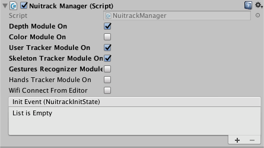<br>
<b>Nuitrack Modules Required for this Project</b><br>
</p>

2. Let's create a script and name it `SegmentPaint.cs`. This script will contain all the information about our user segment. In the `Start` method, subscribe to updating the frame with the user.

```cs
void Start()
{
	NuitrackManager.onUserTrackerUpdate += ColorizeUser;
}
```

3. Create the `onDestroy` method, which occurs when a scene or game ends. Unsubscribe from the user frame update event to make sure that when you move to another Scene, no null reference will be created. You can learn more about Execution Order of Event Functions [here](https://docs.unity3d.com/Manual/ExecutionOrder.html).

```cs
void OnDestroy()
{
	NuitrackManager.onUserTrackerUpdate -= ColorizeUser;
}
```

4. Process the received frames and check the presence of the user in front of the sensor. First of all, declare the `msg` variable for displaying either 'User found' (if there is at least one user in front of the camera) or 'User not found' message. The condition is processed in the `ColorizeUser` method. Also, don't forget to set the characteristics of the 'User found / User not found' message (color and size) in the `OnGUI` method.

```cs
string msg = "";

void ColorizeUser(nuitrack.UserFrame frame)
{
	if (frame.Users.Length > 0)
		msg = "User found";
	else
		msg = "User not found";
}
 
private void OnGUI()
{
	GUI.color = Color.red;
	GUI.skin.label.fontSize = 50;
	GUILayout.Label(msg);
}
```

5. Drag-and-drop the `SegmentPaint.cs` script to the **Main Camera**.
6. Run the project and check the presence of the user. If everything is okay, you will see the 'User found' message on the screen when you are standing in front of the camera. Once you have checked that everything works just fine, let's proceed to the next stage.  

<p align="center">
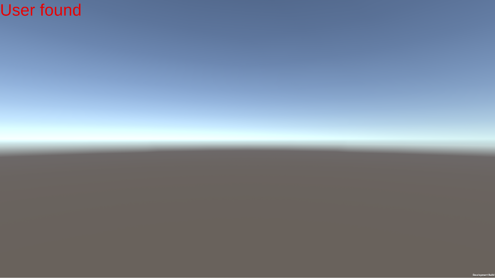<br>
<b>'User found' message displayed</b><br>
</p>

### Creating and Rendering the User Segment

1. On the Scene, create a **Canvas** that will be used for displaying the user segment: **GameObject → UI → Canvas**.
2. The **Main Camera** settings remain default.

_**Note**: You can select either **Orthographic** or **Perspective** camera projection because the canvas size will in any case be automatically adjusted._

3. Add a game object for displaying the user segment to the **Canvas**: **Game Object → UI → Image** and name it **Segment**. The size of this object should coincide with the **Canvas** size. Stretch the width of this object so that it coincides with the **Canvas**. Make sure that **Rect Transform** settings are set as shown in the picture below.

<p align="center">
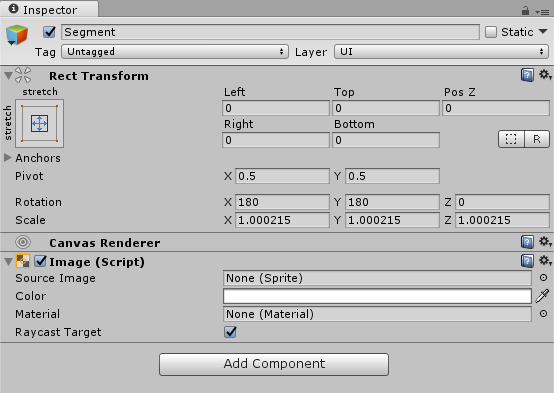<br>
<b>Segment Settings</b><br>
</p>
 
4. In the `GameSegment.cs` script, create the `Color32` array, which stands for the colors used for colorizing the users, the `Rect` field, which stands for a rectangular used for framing the sprite in the image, the `Image` field, which stands for the image displayed on the canvas, the `Texture2D`, which is a texture used for displaying the segment, the `Sprite` for a sprite, the `byte` array for processing the sensor input data, as well as `cols` and `rows` for displaying the matrix of segments. 

```cs
public class SegmentPaint : MonoBehaviour
{
	[SerializeField]
	Color32[] colorsList;
	 
	Rect imageRect;
	 
	[SerializeField]
	Image segmentOut;
	 
	Texture2D segmentTexture;
	Sprite segmentSprite;
	byte[] outSegment;
	 
	int cols = 0;
	int rows = 0;
}
```

5. Mirror the image received from the sensor using the `SetMirror` method in the `Start` method.

```cs
void Start()
{
	NuitrackManager.DepthSensor.SetMirror(true);
}
```

6. Request the output image parameters from the depth sensor.

```cs
...
nuitrack.OutputMode mode = NuitrackManager.DepthSensor.GetOutputMode();
cols = mode.XRes;
rows = mode.YRes;
...
```

7. Create the `Rect` rectangle to define the texture boundaries.

```cs
...	
imageRect = new Rect(0, 0, cols, rows);
...
```

8. Create a segment texture and specify its width and height. Set **ARGB32** format for the texture because this format supports an Alpha channel, 1 byte (8 bits) per each channel (all in all, there are 4 channels). We need the Alpha channel so we can make the areas without a user transparent. You can learn more about the ARGB32 format [here](https://docs.unity3d.com/ScriptReference/TextureFormat.ARGB32.html). 

```cs
...
segmentTexture = new Texture2D(cols, rows, TextureFormat.ARGB32, false);
...
```

9. Create an output segment and specify its size in bytes. Multiply the image size by 4 because there are 4 channels (ARGB32) in every pixel.

```cs
...
outSegment = new byte[cols * rows * 4];
...
```

10. Set the `Image` type to `Simple` as our image should be displayed in regular mode (no stretching, etc.), and set the `preserveAspect = true` flag so that the image retains the aspect ratio.

```cs
...	
segmentOut.type = Image.Type.Simple;
segmentOut.preserveAspect = true;
...
```

11. In the `ColorizeUser` method, process the input data in the `for (int i = 0; i < (cols * rows); i++)` loop. Take the i-th user, his/her id (0, 1, 2, 3...), and paint the pixels in color, which corresponds to the user id. As a result, we get an array with colors, which correspond to users (from 1 to 6) represented in a form of bytes. 

```cs
void ColorizeUser(nuitrack.UserFrame frame)
...	
	for (int i = 0; i < (cols * rows); i++)
	{
		Color32 currentColor = colorsList[frame[i]];
	 
		int ptr = i * 4;
		outSegment[ptr] = currentColor.a;
		outSegment[ptr + 1] = currentColor.r;
		outSegment[ptr + 2] = currentColor.g;
		outSegment[ptr + 3] = currentColor.b;
	}
```

12. Pass an array for texture filling and apply it.

```cs
...	
segmentTexture.LoadRawTextureData(outSegment);
segmentTexture.Apply();
...
```

13. Apply the texture to the sprite. As arguments, specify the texture, rectangle, offset (multiply `Vector3` by 0.5 to set the image center), texture detail, extrude (amount by which the sprite mesh should be expanded outwards), mesh type. As we use the **FullRect** mesh type, the size of the sprite would increase, but the processing time is significantly reduced. You can learn more about the `Sprite.Create` parameters [here](https://docs.unity3d.com/ScriptReference/Sprite.Create.html).

```cs
...
segmentSprite = Sprite.Create(segmentTexture, imageRect, Vector3.one * 0.5f, 100f, 0, SpriteMeshType.FullRect);
...
```

14. Apply the `Sprite` to the `Image`. A new sprite will be created in each frame, however, it won't affect the performance. So, it does not matter whether you use texture for a sprite or for a material. 

```cs
...
segmentOut.sprite = segmentSprite;
...
```

15. In Unity, configure the **Segment Paint (Script)**. Set the colors for coloring the segments. The first color should be transparent (Alpha = 0) as it is used when the user is not found. As for the other 6 colors, you can select any colors you want. All in all, you should select 7 colors. In the **Segment Out** settings, make a reference to the **Segment Image** from the **Canvas**. 

<p align="center">
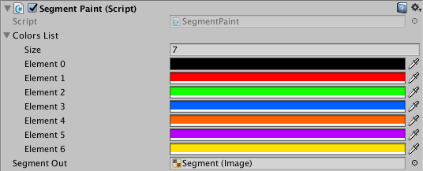<br>
<b>Selected Colors</b><br>
</p>

16. Run the project. At this stage, you should see a colored user segment on the screen.

<p align="center">
<br>
<b>User Segment</b><br>
</p>

Congratulations, you've just visualized a user segment using **Nuitrack SDK**! Now you can use it to create various apps and games. If you want to learn how to create a game in Unity using this segment, check out the second part of this tutorial. 

## Creating a Game with a User Segment

In this section of our tutorial, we are going to make a simple game, in which the user is displayed as a segment and your goal is to destroy as much objects falling from the top as you can. You get points for each falling object that you destroyed. If you miss the object and it touches the bottom line, you lose points. You can create this game even if you don't have much experience with Unity.

### Modifying a Segment for Interacting with Game Objects

1. Let's change the **Canvas** settings. Change its position so that the **Canvas** is located not over the screen but in front of the camera: **Main Camera → Camera → Screen Space**. Now the **Canvas** moves in accordance with the camera movement. Set the distance so that the **Canvas** is in the scope of the camera.

<p align="center">
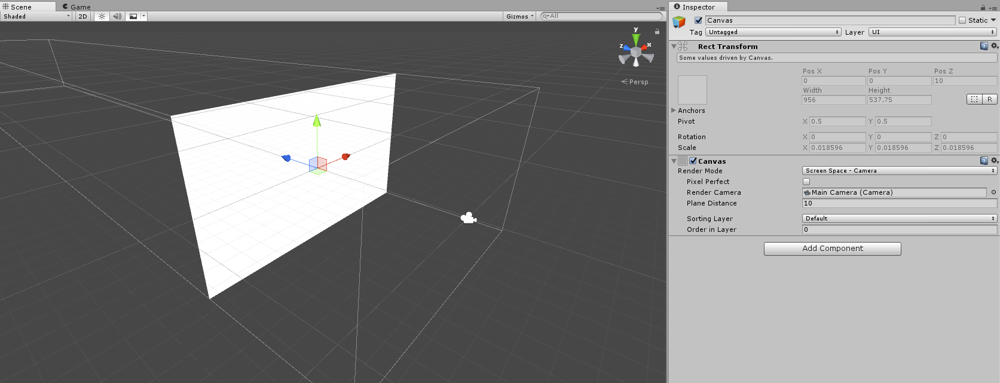<br>
<b>Canvas Settings</b><br>
</p>

2. Now we have to attach colliders to our segment, which will interact with other game objects. Let's describe the colliders behavior in a new script named `GameColliders.cs`.
3. In the `GameColliders` class, create the necessary fields:

```cs
public class GameColliders : MonoBehaviour
{
	[SerializeField]
	Transform parentObject; // parent object for colliders
	 
	[SerializeField]
	GameObject userPixelPrefab; // object that acts as a user pixel
	[SerializeField]
	GameObject bottomLinePrefab; // bottom line object 
	 
	GameObject[,] colliderObjects; // matrix of colliders (game objects)
	 
	int cols = 0; // columns to display the matrix 
	int rows = 0; // rows to display the matrix 
	 
	[Range (0.1f, 1)]
	[SerializeField]
	float colliderDetails = 1f; // set the detail of colliders
}
```

4. Create the `CreateColliders` public method, which takes the input data (number of columns and rows) from the sensor. In this method, calculate the new size of colliders in accordance with the level of detail of colliders, that we've set (`colliderDetails`) by multiplying the number of columns and rows to the level of detail. 

```cs
public void CreateColliders(int imageCols, int imageRows)
{
	cols = (int)(colliderDetails * imageCols);
	rows = (int)(colliderDetails * imageRows);
}
```

5. Create an array of objects and set its size.

```cs
...	
colliderObjects = new GameObject[cols, rows];
...
```

6. Using the `imageScale` variable, scale the size of the matrix of colliders and the image. The image will be aligned either by width or by height, depending on the image received from the sensor. You can learn more about properties of the `Screen` class [here](https://docs.unity3d.com/ScriptReference/Screen.html).

```cs
...
float imageScale = Mathf.Min((float)Screen.width / cols, (float)Screen.height / rows);
...
```

7. Fill the array with objects in a loop.  

```cs
for (int c = 0; c < cols; c++)
{
	for (int r = 0; r < rows; r++)
	{
		GameObject currentCollider = Instantiate(userPixelPrefab); // create an object from UserPixel
		 
		currentCollider.transform.SetParent(parentObject, false); // set a parent
		currentCollider.transform.localPosition = new Vector3((cols / 2 - c) * imageScale, (rows / 2 - r) * imageScale, 0); // update the local position, arrange pixel objects relative to the Image center
		currentCollider.transform.localScale = Vector3.one * imageScale; // set the scale to make it larger 
		 
		colliderObjects[c, r] = currentCollider; // put a collider into the matrix of colliders  
	}
}
```

8. Create a bottom line and set up its characteristics just like with the `UserPixel`: set its parent, define its position and scale. 

```cs
...
GameObject bottomLine = Instantiate(bottomLinePrefab);
bottomLine.transform.SetParent(parentObject, false);
bottomLine.transform.localPosition = new Vector3(0, -(rows / 2) * imageScale, 0);
bottomLine.transform.localScale = new Vector3(imageScale * cols, imageScale, imageScale); // stretch by the image width 
...
```

9. In the `SegmentPaint` script, add the `gameColliders` field for passing the image width and height.

```cs
...	
[SerializeField]
GameColliders gameColliders;
...
```

10. In this script, call the `gameColliders` method (pass the columns and rows) in the `Start` method to create colliders.

```cs
...
gameColliders.CreateColliders(cols, rows);
...
```

11. In Unity, create two prefabs for displaying the bottom line (we named it 'BottomLine') and pixels for creating the user's silhouette (we named it 'UserPixel'). They should be in the form of a cube. For convenience, make them in different colors (for example, red for the bottom line and yellow for the pixel). Add the **Rigidbody** component for the user pixel object and tick **Is Kinematic** so that physics does not affect it during collision with other objects. 
12. Drag-and-drop the **GameColliders** script to the camera. In Unity, specify the **userPixelPrefab** and **bottomLinePrefab** for the script. Drag-and-drop the **Canvas** to the **parentObject**. Specify the level of details in **colliderDetails** by selecting a number in the range from 0 to 1 (the lower it is, the higher the performance is).

<p align="center">
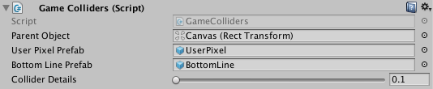<br>
<b>Game Colliders (Script) Settings</b><br>
</p>

13. In the **SegmentPaint**, make a reference to the **GameColliders**.

<p align="center">
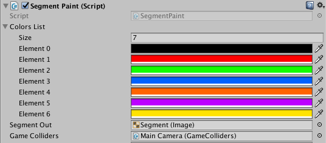<br>
<b>Reference to GameColliders</b><br>
</p>

14. Run the project and check that game objects are created correctly. At this stage, you won't see the segment because the **Canvas** is yet completely covered by colliders. The bottom line is displayed. 

<p align="center">
<br>
<b>Canvas covered by created Colliders</b><br>
</p>

### Creating a Segment with Game Objects

1. In the `GameColliders.cs` script, create the `UpdateFrame` method. If a user is in the frame, the game objects for displaying the silhouette are activated, otherwise, they are hidden. 

```cs
public void UpdateFrame(nuitrack.UserFrame frame) // update the frame
{
	for (int c = 0; c < cols; c++) // loop over the columns
	{
		for (int r = 0; r < rows; r++) // loop over the rows 
		{
			ushort userId = frame[(int)(r / colliderDetails), (int)(c / colliderDetails)]; // request a user id according to colliderDetails 
 
			if (userId == 0)
				colliderObjects[c, r].SetActive(false);
			else
				colliderObjects[c, r].SetActive(true);
		}
	}
}
```

2. Call this method in the `ColorizeUser` method of the `SegmentPaint` script.

```cs
void ColorizeUser(nuitrack.UserFrame frame)
{
...
	gameColliders.UpdateFrame(frame);
}
...
```

3. If you run the project at this stage, the user silhouette is displayed as a texture. You can see game objects that overlap the texture.

<p align="center">
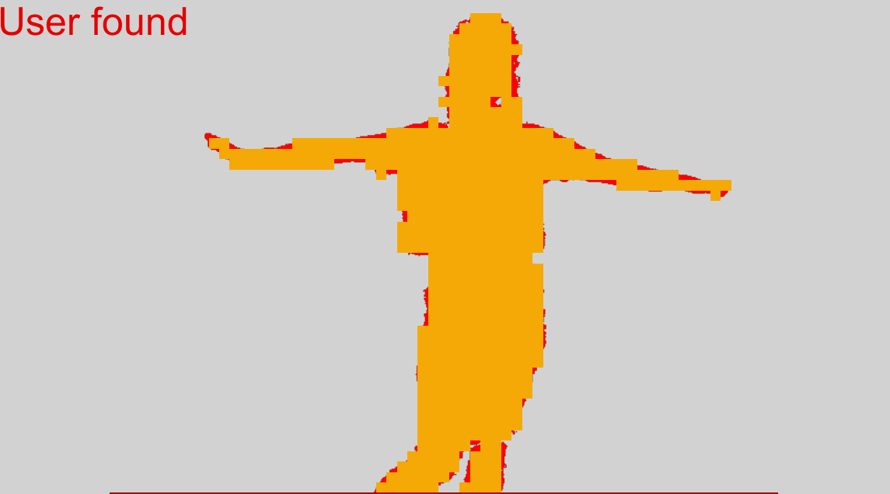<br>
<b>User Segment overlapped by Game Objects</b><br>
</p>

4. In Unity, untick the **Mesh Renderer** component from the **UserPixel** prefab so that the cube mesh is not rendered (the cube will be transparent).

<p align="center">
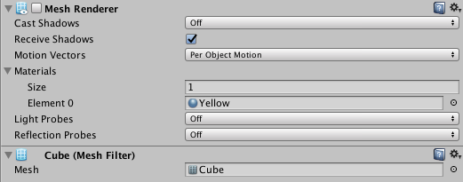<br>
<b>Unticked Mesh Renderer Component</b><br>
</p>
 
5. Run the project and check that the segment is displayed without colliders (as a texture).

<p align="center">
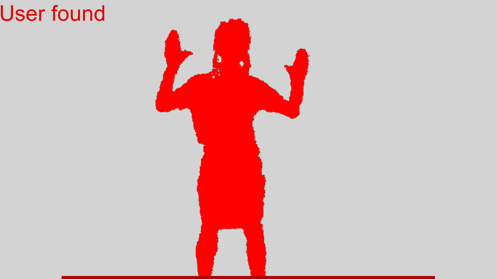<br>
<b>User Segment without Colliders</b><br>
</p>

### Creating Falling Objects

1. Create a new script named `ObjectSpawner.cs`. In this script, create an array with objects: `GameObject[] fallingObjects`. Specify the minimum (1 sec) and maximum (2 sec) time interval between falling of objects. The `halfWidth` variable defines the distance from the center of the image to one of its edges in width.

```cs
public class ObjectSpawner : MonoBehaviour
{
	[SerializeField]
	GameObject[] fallingObjects;
	 
	[Range(0.5f, 2f)]
	[SerializeField]
	float minTimeInterval = 1;
	 
	[Range(2f, 4f)]
	[SerializeField]
	float maxTimeInterval = 2;
	 
	float halfWidth;
}
```

2. Create the `StartSpawn` method. Get original image width and start a coroutine.

```cs
public void StartSpawn(float widthImage)
{
	halfWidth = widthImage / 2;
	StartCoroutine(SpawnObject(0f));
}
```

3. Let's describe the coroutine contents. 

```cs
IEnumerator SpawnObject(float waitingTime)
{
	yield return new WaitForSeconds(waitingTime); // delay 
	 
	float randX = Random.Range(-halfWidth, halfWidth); // random X position
	Vector3 localSpawnPosition = new Vector3(randX, 0, 0); // position for object spawning 
	 
	GameObject currentObject = Instantiate(fallingObjects[Random.Range(0, fallingObjects.Length)]); // create a random object from the array
	 
	currentObject.transform.SetParent(gameObject.transform, true); // set a parent 
	currentObject.transform.localPosition = localSpawnPosition; // set a local position
	 
	StartCoroutine(SpawnObject(Random.Range(minTimeInterval, maxTimeInterval))); // restart the coroutine for the next object
} 
```

Objects will fall from the top in a random number of seconds in the range of [minimum time interval ... maximum time interval]. You can learn more about the `Random` class [here](https://docs.unity3d.com/ScriptReference/Random.html).

4.  In Unity, create an empty object, drag-and-drop it to the **Canvas**, add the **Rectangle Transform** component so that this object is always located at the top of the **Canvas**. Perform top center alignment. After that, drag-and-drop **ObjectSpawner** to this object. This object will determine the point, which is used to calculate the start position of object falling. 

<p align="center">
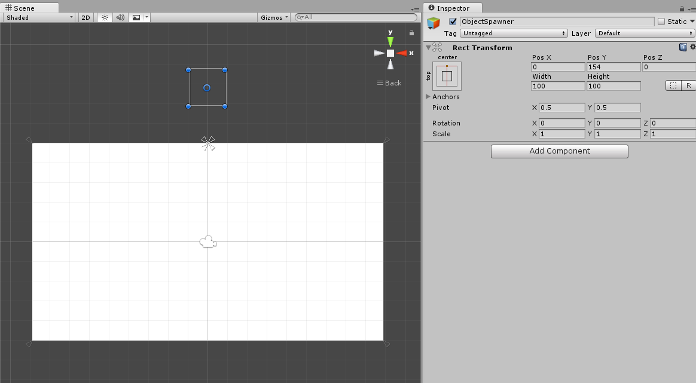<br>
<b>ObjectSpawner Settings</b><br>
</p>

5. In Unity, create two prefabs: **Capsule** and **Cube**, which will be used for displaying the game objects falling from the top. The user has to 'destroy' these objects. Add the **RigidBody** component to these prefabs. Drag-and-drop the objects to the **ObjectSpawner** section of the **MainCamera**. Fill in the `fallingObjects` array with the created prefabs.

<p align="center">
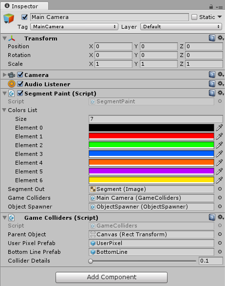<br>
<b>Specified Capsule and Cube</b><br>
</p>

_**Note:** The speed of falling objects is regulated by adjusting the air resistance of prefabs: **gidBody → Drag**. The lower the value, the lower the air resistance (0 - no resistance)._

6. Drag-and-drop the prefabs to the **Canvas → ObjectSpawner**.

<p align="center">
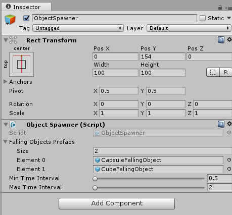<br>
<b>Falling Objects specified for Object Spawner</b><br>
</p>

7. In the `SegmentPaint` script, add the `ObjectSpawner` field to pass the parameters and run.

```cs
...
[SerializeField]
ObjectSpawner objectSpawner;
...
```

8. In the `Start` method, pass the parameters to `GameObjectSpawner`.

```cs
void Start()
{
...
	gameColliders.CreateColliders(cols, rows);
	objectSpawner.StartSpawn(cols);
}
...
```

9. Create a script named `FallingObjects.cs`, in which we'll define the condition for destruction our falling objects in a collision with other objects. Create the `OnCollisionEnter` method and call the `Destroy` method. We use this method because in our game the falling objects are destroyed in a collision with any object.

```cs
private void OnCollisionEnter(Collision collision)
{
	Destroy(gameObject);
}
```

10. In Unity, drag-and-drop this script to the falling objects (**Capsule, Cube**).
11. Make a reference to the **ObjectSpawner** and to **MainCamera** in **SegmentPaint**.

<p align="center">
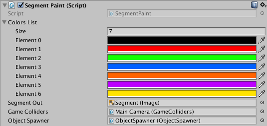<br>
<b>Segment Paint (Script) Settings</b><br>
</p>

12. Run the project. You should see the objects falling from the top and destroyed in a collision with the user segment or bottom line. 

<p align="center">
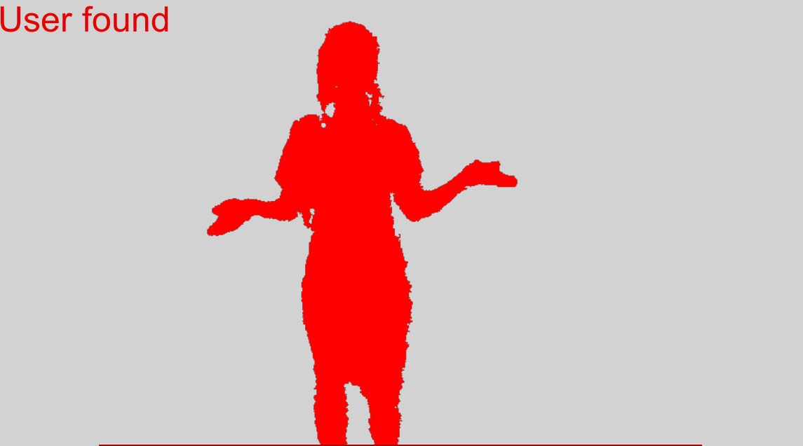<br>
<b>User Segment and Falling Objects</b><br>
</p>

### Adding Scoring 

1. So, we added a game element to our project but it still doesn't really look like a game. To make our simple game a little bit more interesting, let's introduce scoring for missed / caught objects. To do that, create a new script named `GameProgress.cs`. This script will contain all the settings connected to scoring in our game.
2. In this script, create the fields that define a singleton (creates a reference to itself) so that the falling objects can call the methods of this class  without having a direct reference to it, as well as the fields for the output text and the number of points added / subtracted when colliding with objects. You can learn more about `Singleton` [here](https://msdn.microsoft.com/en-us/library/ff650316.aspx). 

```cs
public class GameProgress : MonoBehaviour
{
	public static GameProgress instance = null;
	 
	[SerializeField]
	Text scoreText;
	 
	int currentScore = 0;
}

void Awake()
{
	if (instance == null)
		instance = this;
	else if (instance != this)
		Destroy(gameObject);
}
```

3. Create the ```UpdateScoreText``` method, which stands for updating the text.

```cs
void UpdateScoreText()
{
	scoreText.text = "Your score: " + currentScore;
}
```

4. Add the `AddScore` and `RemoveScore` static methods, which define the addition and subtraction of points, respectively. 

```cs
public void AddScore(int val)
{
	currentScore += val;
	UpdateScoreText();
}

public void RemoveScore(int val)
{
	currentScore -= val;
	UpdateScoreText();
}
```

5. In the `FallingObject.cs` script, add the `ScoreValue` field that defines the amount of points to be added / subtracted. 

```cs
...
[SerializeField]
int scoreValue = 5;
...
```

6. In the `OnCollisionEnter` method, we add a tag check to define that points should be added when the user has 'caught' the falling object, and decreased when the object was 'missed' and fell onto the bottom line. Besides, you have to set the `active` flag to avoid multiple registration when the user's silhouette touches the falling object. Learn more about the `Destroy` method [here](https://docs.unity3d.com/ScriptReference/Object.Destroy.html). 

```cs
bool active = true;

private void OnCollisionEnter(Collision collision)
{
	if (!active)
		return;

	active = false; 

	Destroy(gameObject);
 
	if (collision.transform.tag == "UserPixel")
		GameProgress.AddScore(scoreValue);
	else if (collision.transform.tag == "BottomLine")
		GameProgress.RemoveScore(scoreValue);
}
```

7. In Unity, set the relevant tags for the **UserPixel** and **BottomLine** prefabs: **Add Tag → UserPixel / BottomLine**. 

<p align="center">
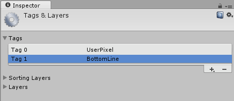<br>
<b>Tags required for Prefabs</b><br>
</p>

8. Create a text field on the canvas: **Game Object → UI → Text** (place the text field wherever you want).

<p align="center">
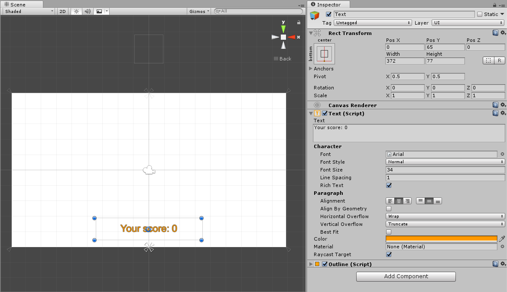<br>
<b>New Text Field</b><br>
</p>

9. Drag-and-drop the **GameProgress (Script)** to the **Main Camera**. Drag-and-drop the **Text** that we've just created to the **ScoreText** for displaying the text on the screen. 

<p align="center">
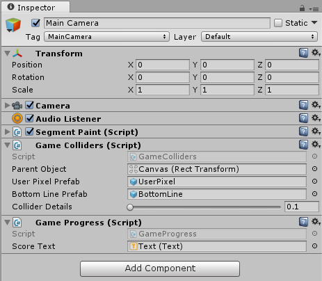<br>
<b>Specified Text Field</b><br>
</p>

10. Run the project. You should see that now points are added when you destroy the falling objects. If the objects fall on the bottom line, the points are subtracted. 

<p align="center">
<br>
<b>Final Game with a User Segment and Scoring</b><br>
</p>
