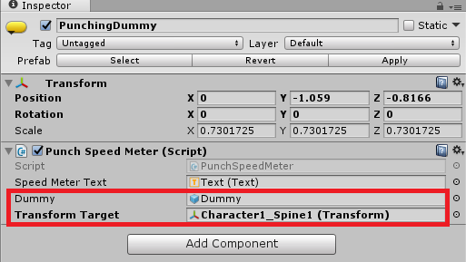

# Creating a VR Boxing Game

So, you've decided to create a VR game with skeleton tracking but don't know what to start with? Well, you're at the right page because in this tutorial you'll learn how to create a VR game using **Nuitrack**. To plunge into the subject and to understand how to animate your avatar's skeleton in a VR game, we recommend you to take a look at our tutorial [Animating the Avatar using Skeleton](Unity_Avatar_Animation.md).

In this tutorial, we'll create a simple VR game, in which your avatar is a boxer and you have to punch a dummy as hard as you can. The maximum punch speed will be measured and displayed at the top of the screen. To make this game, you'll need the **Nuitrack SDK**, a sensor (from the list of supported sensors, see the [Nuitrack website](https://nuitrack.com/#sensors)) and a VR headset (any Mobile VR headset or Gear VR headset). Recommended Unity version: 2017.4 or higher.

You can find the finished project in **Nuitrack SDK**: **Unity 3D → NuitrackSDK.unitypackage → Tutorials → Box** 

<p align="center">

</p>

## Creating VR Environment and animating the Avatar 

1. Create a new Unity project. 
2. Import **NuitrackSDK.unitypackage** from the **Nuitrack SDK: Assets → Import Package → Custom Package**. Tick the following folders that we'll need for work:
	* **Nuitrack** (includes all Nuitrack modules and is responsible for skeleton detection, tracking, etc. Also, this folder includes a Head prefab that is used in VR games, and a file with settings for Nuitrack automatic calibration); 
	* **Platform Changer** (changes the Unity settings (**PlayerSettings**) according to the selected platform); 
	* **Plugins** (includes **Android Manifest** that specifies permissions and other settings of your app);
	* **Resources** (stores the **Platform Changer** settings);
	* **Tutorials → Box** (we need this folder for our project because it includes the Dummy prefab. Also, you can find here a finished VR Boxing Game for reference);
	* **Tutorials → Avatar Animation** (includes the Unitychan prefab that we'll use to display our Boxer (quite an interesting choice, huh?);
	* **VicoVRCalibrationRGB** (includes all the necessary components for calibration in the T-Pose. Calibration is required for any VR game).

_**Note:** **Nuitrack** provides improved automatic calibration for Android and Gear VR. Any gyroscope has one unpleasant feature: when you turn the head during a game, its position may become slightly distorted and rotation is not aligned back, which may affect your gaming experience. Fortunately, **Nuitrack automatic calibration** helps to eliminate this nuisance. By default, automatic calibration is enabled, however, if you'd like to disable it for some reason, you can do it using the **VicoVR app: Settings → Developer Options → Autocalibration (Off)**._

3. Create a new Scene: **File → New Scene**. Drag-and-drop the following prefabs to the Scene:
	* **NuitrackScripts** (includes the **Nuitrack Manager** components (initiates Nuitrack  and its modules), **Current User Tracker** (responsible for tracking of a current user), **T-Pose Calibration** (determines the calibration settings), **Calibration Info** (stores the calibration settings);
	* **RiggedAvatar2** (includes all the components for direct skeleton mapping. In this game, we'll animate the avatar using direct mapping to make its moves more accurate and smooth. Learn more about the difference between direct and indirect mapping in our tutorial [Animating the Avatar using Skeleton](Unity_Avatar_Animation.md);
	* **HeadParent** (head of our avatar; contains the camera and scripts that define the rotation of the head). 

4. Hide the head of the Unitychan prefab so that you won't see it from the inside during our VR game: **Character1_Neck → Transform → Scale (0; 0; 0)**

<p align="center">
<br>
<b>Hiding the Head</b><br>
</p>

5. In the **NuitrackAvatar** settings, drag-and-drop the **HeadParent** to **Element 16**,  so that our avatar will be able to move her head.

<p align="center">
<br>
<b>Setting Up the Head</b><br>
</p>

_**Note:** The default platform in a project is **Android**. Before building the project, you can select the appropriate platform: **iOS, Android (default) or GearVR**. To do that, select **Windows → Platform Changer → TargetPlatform → Change Platform**._

6. Build and run the project. Calibration should run and reach 100%. After that, check that your avatar is displayed correctly and her movements correspond to yours. 

<p align="center">
<br>
<b>Calibration in the T-Pose</b><br>
</p>

## Setting Up the punching Dummy

1. Now, when we've created our avatar, it's time to introduce our victim - a punching dummy (or, alternatively, you can use the avatar of a person who pisses you off - just kidding).  Drag-and-drop the **PunchingDummy** prefab to the Scene. 
2. Create a new script `PunchSpeedMeter.cs`. In this script, we'll determine when the dummy appears and also define all the settings associated with the speed of our punch. In the script, create fields for the dummy and transformTarget (which is a spine joint; we use this very joint because this is the first moving joint in the hierarchy and it defines the moves of other body joints). 

```cs
[SerializeField] GameObject dummy;
[SerializeField] Transform transformTarget;
```

3. Create the `Awake` method that will be executed at startup: deactivate the dummy so that it isn't displayed during calibration.  

```cs
private void Awake()
{
	dummy.SetActive(false);
}
```

4. Create the `OnEnable` method. Subscribe to the `onSuccess` event from the `TPoseCalibration` script. It's called if calibration is successful. 

```cs
private void OnEnable()
{    
	TPoseCalibration.Instance.onSuccess += OnSuccessCalibration;
}
```

5. Create the `OnSuccessCalibration` method and specify the required argument `(Quaternion rotation)`. In this method, we define the initial position of the dummy in front of our avatar. The dummy is activated after successful calibration and stands at a distance of 1m from the user and 1m below the target joint set in the editor (you can specify any distance that you want). 

```cs
void OnSuccessCalibration(Quaternion rotation)
{
	dummy.SetActive(true);
	transform.position = transformTarget.position + new Vector3(0, -1, 1);
}
```

6. Don't forget to unsubscribe from the `OnSuccessCalibration` event.

```cs
private void OnDisable()
{
	TPoseCalibration.Instance.onSuccess -= OnSuccessCalibration;
}
```

7. Drag-and-drop the script to the dummy. In Unity, drag-and-drop the **Dummy** to **Dummy** and **Character1_Spine** to **Transform Target** (the dummy will be set in relation to this joint). 

<p align="center">
<br>
<b>Setting Up the Punching Dummy</b><br>
</p>

8. Run the project and check that the dummy is displayed correctly. At this stage, you won't be able to punch him because we haven't set up the hands of our character yet, so, the hand will just move through the dummy.

<p align="center">
<br>
<b>You should see the dummy after calibration</b><br>
</p>

## Punching the Dummy and displaying the Punch Speed

1. Have you ever played on the 'Punching Bag' game machine that measures the force of your punch? In this project, you'll have the opportunity to break your record several times: the maximum speed of your punch will be displayed above the dummy and will be updated every time the record is broken. In the `PunchSpeedMeter.cs` script, add the `UI` namespace, which we need to display text with information about the speed of our punch. Also, create the `Text` field.

```cs
using UnityEngine.UI;

public class PunchSpeedMeter : MonoBehaviour {
	...
	[SerializeField] Text speedMeterText;
	...
}
```

2. In the `PunchSpeedMeter` class, add the `maximumPunchSpeed` variable to store the information about the maximum speed of a punch. 

```cs
float maximumPunchSpeed = 0;
```

3. Create the `CalculateMaxPunchSpeed` method (which takes the punch speed). If the new speed is greater than the current speed, the counter will be updated, otherwise the result will not change. 

```cs
public void CalculateMaxHitSpeed(float speed)
{
	if (maximumPunchSpeed < speed)
	    maximumPunchSpeed = speed;
	speedMeterText.text = maximumPunchSpeed + " m/s ";
}
```

4. Create a new script `PunchSpeedSender.cs`. We need a handler for punches, since we can punch the dummy in several body parts (**TorsoBone** and **NeckBone**). When you punch the dummy in one of these parts, the **PunchSpeedSender** sends the info about that event to the **PunchSpeedMeter**. In this script, make a reference to the **PunchSpeedMeter** and create the  `OnCollisionEnter` method. When two objects collide, we'll get the relative punch speed. 

```cs
public class HitSpeedSender : MonoBehaviour {
 
	[SerializeField] HitSpeedMeter hitSpeedMeter;
 
	private void OnCollisionEnter(Collision collision)
	{
		hitSpeedMeter.CalculateMaxHitSpeed(collision.relativeVelocity.magnitude);
	}
}
```

_**Note:** The `relativeVelocity` property allows to determine the correct collision speed of two objects (in our case, these are the Unitychan's fist and the dummy). In case we only determined the speed of the fist, we'd get an incorrect value. To learn more about `relativeVelocity`, click [here](https://docs.unity3d.com/ScriptReference/Collision-relativeVelocity.html)._

5. In Unity, drag-and-drop this script to the **TorsoBone** and **NeckBone**. In the **Punch Speed Meter** field, specify **PunchSpeedMeter**. 

<p align="center">
<br>
<b>Punch Speed Sender Settings</b><br>
</p>

6. In Unity, create two objects for the 'boxing gloves' of our avatar: **Create → Empty Object → Left Glove, Right Glove**. Actually, our avatar will punch the dummy with her bare hands, but we need to attach imaginary 'boxing gloves' to her hands in order to calculate the punch speed. Let's add the necessary components: **Add Component → Capsule Collider, RigidBody** to handle the collisions correctly. Select the direction for glove movement along the arm: **Capsule Collider → Direction → X-Axis**. Set the position and size of the 'gloves': **Height → 0.2** (optimum), **Radius → 0.05**. If you want to display the boxing gloves, then create the appropriate prefab and apply the above settings to it. 

<p align="center">
<br>
<b>Setting Up the Gloves</b><br>
</p>

7. Create the script `RigidbodyFollower.cs` and describe the behavior of our 'gloves'. Create the `target` field  so that our 'gloves' will follow these target objects (in our case, these are the avatar's hands). Also, create the `rigidbody` field. 

```cs
public class RigidbodyFollower : MonoBehaviour
{
	[SerializeField] Transform target;
 
	Rigidbody rigidbody;
}
```

8. At the start of the game, a reference to the Rigidbody that's attached to the capsule will be received. 

```cs
void Start()
{
	rigidbody = GetComponent<Rigidbody>();
}
```

9. Create the `FixedUpdate` method. In this method, we'll describe the behavior of the capsule: it will move (position, rotation) according to the target transform. In this project we use `MovePosition` instead of `transform.position` because the gloves of our avatar should move using the RigidBody Physics. A simple change of position may be processed incorrectly because every time the transform would 'teleport' ignoring the physics.  

```cs
void FixedUpdate()
{
	rigidbody.MovePosition(target.position);
	rigidbody.MoveRotation(target.rotation);
}
```

_**Note:** We use `FixedUpdate` instead of `Update` in case we are dealing with `Rigidbody`._

10. Drag-and-drop the script to the right and left glove and specify the **Target (Character1_LeftHand, Character1_RightHand)**.

<p align="center">
<br>
<b>Setting Up the Rigidbody Follower</b><br>
</p>

11. Run the project and punch the dummy. Check the displayed speed of your punch: it should be displayed above the dummy. Try to break your record several times! 

<p align="center">
<br>
<b>Beat him up!</b><br>
</p>

Congratulations! You've just created a VR Boxing Game with skeleton tracking! 
