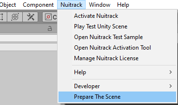

# Zombie Nightmare (VR) 

In this tutorial you'll learn how to create a super duper cool project using Oculus Meta Quest 2 (or Rift, Rift S, VALVE INDEX, or another 6DOF VR Headset) and Nuitrack. We'll create a VR game called "Zombie Nightmare". The player's goal is to kill all zombies that randomly appear from everywhere. The player has a limited number of lives. If a zombie takes a bite of a player, the player's health slightly decreases and eventually he can die :( So what is that bewitching little detail of that seemingly trivial project? The point is that the player has to destroy zombies not with his hands... but with his **LEGS**! Have you ever used your legs when playing with VR? We haven't! And now your wildest dreams come true thanks to Nuitrack! 

<p align="center">

</p>

You'll need just a couple of things for this project: 

Hardware: 
* Powerful PC
* VR Headset. For example Oculus Meta Quest 2 (or Rift, Rift S, VALVE INDEX, or another 6DOF VR Headset)
* Depth sensor (see the list of supported cameras at [our website](https://nuitrack.com/#sensors))

Software:
* [Nuitrack Runtime](/Platforms)
* Windows (we used Windows 10)
* [Nuitrack Skeleton Tracking package](/Unity3D)
* Unity version from Readme https://github.com/3DiVi/nuitrack-sdk/tree/master/Unity3D

You can find the finished project in Nuitrack SDK: **Unity 3D → NuitrackSDK.unitypackage → Tutorials → Zombie Nightmare (VR)**.

## Setting Up the Project

1. Create a new project and name it as you wish (for example, “Incredible Zombie Game with Nuitrack”).
2. Import NuitrackSDK.unitypackage
3. Unzip **Tutorial Assets.zip** in tutorial folder. (If you want to see what happens right away, you can unpack the archive **FinalAssets.zip** to the Final Assets folder). Open the scene **"City" (Nuitrack SDK → Tutorials → Zombie Nightmare (VR) → City)**. Our zombie apocalypse begins in a developed megalopolis (New York? Who knows...).

<p align="center">

</p>

4. Enable **Open XR** support in XR Plug-in Management settings. 

<p align="center">

</p>

5. Creating an empty object, rename it to "VR Head". This is gonna be the player's head. Set its Position and Rotation to (0, 0, 0) so that the player is standing in the center of the scene (as he is the new hope of mankind in our game). Creating a camera as a child object. Then you need to add the component **Tracked Pose Driver** so that the camera can move and rotate after the player's head.

<p align="center">

</p>

6. To visualize calibration drag the **CalibrationVisualization** prefab to the scene: **Assets → NuitrackSDK → NuitrackCalibrationRGB**. And make it a child of the "Camera" object. 
7. Prepare the scene for using Nuitrack in one click, to do this, click: **Main menu** -> **Nuitrack** -> **Prepare the scene**. The necessary components will be added to the scene. When you run the scene, **NuitrackScripts** automatically marked as **DontDestroyOnLoad**.

<p align="center">
<br>
</p>

## Creating the Player's Legs

1. Create a new script and name it `NuitrackLegs.cs`. In this script, we'll define the   skeleton tracking and create the player's legs. 
Inherit the `NuitrackLegs` class from `TrackedUser`, this will allow you to easily get the data of the **Current User** or user by the specified **ID**.

2. Add the necessary fields. An `offset` is a skeleton offset that is calculated based on the data received from VR Camera and Nuitrack (the rest of the skeleton joints). 

```cs
...
using NuitrackSDK;
using NuitrackSDK.Calibration;

public class NuitrackLegs : TrackedUser 
{
    [SerializeField] Transform VRCamera;
    [SerializeField] Transform headBase;
    [SerializeField] Rigidbody leftLeg, rightLeg, body;
    Vector3 offset;
    Quaternion q180 = Quaternion.Euler(0f, 180f, 0f); // mirror the joint position
}
```

3. In `FixedUpdate`, process the user's skeleton if it is found. 

```cs
void FixedUpdate()
{
    //If a skeleton is detected, process the model
    if (ControllerUser != null && ControllerUser.Skeleton != null)
    {

    }
}
```

4. For the convenience of calculating the position of the necessary joints (Left Ankle, Right Ankle, Waist), we will create the GetPos method. For the convenience of calculating the position of the necessary joints (Left Ankle, Right Ankle, Waist), we will create the GetPos method. In it, we get the position of the joint, make an adjustment for the tilt of the sensor (calculated after calibration) and turn it 180 degrees.

```cs
Vector3 GetPos(nuitrack.JointType jointType)
{
    return q180 * (Vector3.up * CalibrationInfo.FloorHeight + CalibrationInfo.SensorOrientation * ControllerUser.Skeleton.GetJoint(jointType).Position);
}
```

5. Calculate the offset for the whole skeleton (head joint position detected by Nuitrack is subtracted from head position detected by Meta Quest 2).

```cs
void FixedUpdate()
{
    //If a skeleton is detected, process the model
    if (ControllerUser != null && ControllerUser.Skeleton != null)
    {
        offset = GetPos(nuitrack.JointType.Head) - VRCamera.position;
    }
}
```

6. In `FixedUpdate`, apply the coordinates to the user's legs. We use `FixedUpdate` instead of `Update` for that purpose because Unity physics is only processed in this method.

```cs
void FixedUpdate()
{
    if (ControllerUser != null && ControllerUser.Skeleton != null)
    {
        offset = GetPos(nuitrack.JointType.Head) - VRCamera.position;

        leftLeg.MovePosition(GetPos(nuitrack.JointType.LeftAnkle) - offset);
        rightLeg.MovePosition(GetPos(nuitrack.JointType.RightAnkle) - offset);
        body.MovePosition(GetPos(nuitrack.JointType.Waist) - offset);
    }
}
```

_**Note:** Learn more about the `MovePosition` method at [Unity website](https://docs.unity3d.com/ScriptReference/Rigidbody.MovePosition.html)._  

7. In order to combine the turns of the head and the skeleton, after calibration, we will rotate the base of our vr-head (the static part of the prefab) by the angle of rotation of the camera (the camera is the dynamic part of the vr-head prefab, which turns after the turns of the head in the real world. It is a child object relative to the base of the head).

```cs
void OnEnable()
{
    if (CalibrationHandler.Instance != null)
        CalibrationHandler.Instance.onSuccess += OnSuccessCalib;
}

private void OnSuccessCalib(Quaternion rotation)
{
    headBase.eulerAngles = new Vector3(0, headBase.eulerAngles.y - VRCamera.eulerAngles.y, 0);
    Vector3 newPos = headBase.position - VRCamera.position;
    headBase.position = new Vector3(newPos.x, headBase.position.y, newPos.z);
}

void OnDisable()
{
    if (CalibrationHandler.Instance != null)
        CalibrationHandler.Instance.onSuccess -= OnSuccessCalib;
}
```

8. Drag-and-drop the script to the **Player** game object.
9. Set the fields in the prefab settings:

<p align="center">

</p>

10. Run the project. You should see your feet displayed as nice blue sneakers. Movement is tracked by Nuitrack. You will also see the "screen" with the user's segment that helps to check FPS and understand whether the user's legs are in the frame or not.

<p align="center">

</p>

_**Note:** You can use not only leg joints but also all other skeleton joints detected by Nuitrack (21 joints all in all) (see the complete list at  [Nuitrack official website](https://download.3divi.com/Nuitrack/doc/group__SkeletonTracker__group.html#gabc259a32c94594974dd3325b7c72d28a)). Don't forget to add the offset!_

## Determining the Game Logic 

1. Create a new script and name it `GameManager.cs`. In this script, we'll describe the end and restart of our game and when the zombies appear.
2. Add the necessary fields: maximum number of spawned zombies, an array with enemies, an array with spawn points for zombies, restart time after the player's death and counter for spawned zombies. 

```cs

using NuitrackSDK.Calibration;

public class GameManager: MonoBehaviour 
{
    [SerializeField] int maxEnemies = 100;

    [SerializeField] GameObject[] enemies;
    [SerializeField] Transform[] spawnPoints;

    float restartTime = 5;
    int enemiesCount = 0;

    bool gameStarted = false;
}
```

3. After calibration the constantly repeated method `SpawnEnemy` defines that the zombies spawn in 3 seconds after start every 0.2 seconds. If maximum number of spawned zombies is reached, the method is not executed anymore. Before spawning, the size of each zombie is a bit changed (so they don't look like a uniform bunch).

```cs
private void OnEnable()
{
    if (CalibrationHandler.Instance != null)
        CalibrationHandler.Instance.onSuccess += OnSuccessCalib;
}

private void OnSuccessCalib(Quaternion rotation)
{
    if (!gameStarted)
    {
        gameStarted = true;
        InvokeRepeating("SpawnEnemy", 3, 0.2f);
    }
}

void SpawnEnemy()
{
    if (enemiesCount >= maxEnemies)
        return;

    float randomSize = Random.Range(0.2f, 0.3f); // zombie size

    enemies[Random.Range(0, enemies.Length)].transform.localScale = Vector3.one * randomSize; // set the zombie size
    Instantiate(enemies[Random.Range(0, enemies.Length)], spawnPoints[Random.Range(0, spawnPoints.Length)].position, Quaternion.identity); // spawn zombies

    enemiesCount++;
}

private void OnDisable()
{
    if (CalibrationHandler.Instance != null)
        CalibrationHandler.Instance.onSuccess -= OnSuccessCalib;
}
```

_**Note:** The [InvokeRepeating](https://docs.unity3d.com/ScriptReference/MonoBehaviour.InvokeRepeating.html) method cyclically calls the required method at regular time intervals._

4. The `GameOver` method initiates the execution of the `Restart` method, which restarts the game after a certain time and starts a new level.

```cs
public void GameOver()
{
    StartCoroutine(Restart());
}
 
IEnumerator Restart()
{
    yield return new WaitForSeconds(restartTime);
    Application.LoadLevel(Application.loadedLevel);
}
```

5. In Unity, create an **Empty Object** (**GameObject → Create Empty**) and name it **GameManager**. Drag-and-drop the script to this object. 
6. In settings of the **GameManager** object, fill in the enemies field with zombies: **Tutorials → Zombie Nightmare (VR) → Prefabs** (**Parasite, Hulk, Zombie Police**). 

<p align="center">

</p>

7. Set the spawn points for zombies as well: **Spawn Points → SpawnPoint(1)(Transform), SpawnPoint(2)(Transform)** (from hierarchy).

<p align="center">

</p>

8. Run the project. The zombies will randomly appear on the scene (this looks pretty funny).

<p align="center">

</p>

## Creating the Player and Zombies 

1. Time to create a savior of our little world! Create a new script and name it `Player.cs`.
2. Add the necessary fields: health score and healthbar.

```cs
public class Player : MonoBehaviour 
{
    float health = 100;
    [SerializeField] UnityEngine.UI.Image healthBar;
}
```

3. In the `GetDamage` method, set the damage from a zombie to the player. If the player has 0 lives, the remaining code is not executed. If the player has enough lives, he loses health when a zombie bites him (healthbar turns red) or, otherwise, dies (obviously). After the player's death (the `Death` method) the level restarts in 3 seconds. 

```cs
public void GetDamage(float damage)
{
    if (health <= 0)
        return;

    health -= damage;

    if(health <= 0)
    {
        health = 0;
        FindObjectOfType<GameManager>().GameOver();
    }

    healthBar.fillAmount = health / 100;
}
```

4. Drag-and-drop the script to **Player - Body**, add **healthbar** from **Canvas**. This body will mesmerize our zombies and they will run towards it.

<p align="center">

</p>

5. Body is an object that has a capsule collider and a rigidbody component with isKinematic enabled (so that the capsule doesn't fall). So zombies will encircle the player.

<p align="center">

</p>

6. And now it's time to create a devil's brat, an evil itself – a zombie. Create a new script and name it `ZombieController.cs`. In this script, we'll describe the behavior of zombies in our game. 
7. Add the necessary fields.

```cs
public class ZombieController : MonoBehaviour
{
    [SerializeField] int hp = 100; // health of a zombie
    [SerializeField] float damage = 0.01f; // damage from a zombie
    [SerializeField] float speed = 1; // speed of a zombie
    [SerializeField] Transform floorChecker; // used to switch Ragdoll
    [SerializeField] Animator animator; // used to control the animation of zombies
    [SerializeField] float attackDistance = 0.7f; // attacking distance of a zombie
    [SerializeField] Transform modelTransform; // used to process Ragdoll
    float standTime = 0, flyTime = 0; // time on the ground and in flight
    bool isOnGround = false; // check whether the zombie is on the ground or not
    bool isFly = false; // check whether the zombie is in flight or not
    bool isRagdoll = true; // is Ragdoll on?
    bool canAttack = false, prevCanAttack = false; // can a zombie attack?

    Player target; // target for a zombie attack (player)
    Rigidbody rb;

    Rigidbody[] rigidbodyRagdoll;
    Collider[] colliderRagdoll;

    Vector3 localPosition; // modelTransform position of a zombie
}
```

8. In the `Awake` method, get `localPosition` and `modelTransform` from a zombie, save the start local coordinates of the zombie's child object, which will be ragdolled, so that we can return this child object to its original position when Ragdoll is finished. 

```cs
void Awake()
{
    localPosition = modelTransform.localPosition;
}
```

9. In `Start`, get the references to `Rigidbody` and `Colliders` of zombie's body parts and zombie's main Rigidbody for later use in `Ragdoll` processing. Disable `Ragdoll` and find the target (player) for a zombie.

```cs
void Start()
{
    rigidbodyRagdoll = GetComponentsInChildren<Rigidbody>();
    colliderRagdoll = GetComponentsInChildren<Collider>();
    rb = GetComponent<Rigidbody>();

    SwitchRagdoll(false); // disable ragdoll
}
```

10. Process the zombie Ragdoll switching in the `switchRagdoll` method. Ragdoll is enabled when we just gave a zombie a good kick and he flew away like a bird. We need to use Ragdoll so our zombies flies nice and good, otherwise he will just “walk on skies”. Ragdoll is disabled when the zombie has landed and lay on the ground for like 2 seconds.

```cs
void SwitchRagdoll(bool ragdoll)
{
    if (ragdoll != isRagdoll)
    {
        if (ragdoll) // If ragdoll is off
        {
            for (int i = 0; i < rigidbodyRagdoll.Length; i++)
            {
                rigidbodyRagdoll[i].isKinematic = false; // Physics is turned on
                rigidbodyRagdoll[i].velocity = rb.velocity; // When ragdoll is on, the speed of the main Rigidbody component is passed to the child Rigidbody components so they continue to fly according to physics
            }
        }
        else // If ragdoll is off
        {
            // Return position and rotation to original state when Ragdoll is over
            modelTransform.localRotation = Quaternion.identity;
            transform.position = modelTransform.position; // When Ragdoll is over, the model base object is brought back to Ragdoll coordinates
            modelTransform.localPosition = localPosition; // Move the child model to its original local coordinates

            for (int i = 0; i < rigidbodyRagdoll.Length; i++)
            {
                rigidbodyRagdoll[i].isKinematic = true;
            }
        }

        rb.isKinematic = ragdoll; // Switch the basic Ragdoll kinematics

        for (int i = 0; i < colliderRagdoll.Length; i++)
        {
            colliderRagdoll[i].enabled = ragdoll; // Switch the Ragdoll colliders
        }

        GetComponent<Collider>().enabled = !ragdoll; // Switch the base collider

        animator.enabled = !ragdoll; // Switch the animator. When Ragdoll is turned on, еру animator is switched off.
    }

    isRagdoll = ragdoll;
}
```

11. In the `IsOnGround` method, we check whether the zombie is on the ground or not. Each zombie has the `FloorChecker` object that helps to check zombie's position. This object is always downwards and can be treated as a point for casting the ray to check the floor position. Create a ray and set it up. 

```cs
bool IsOnGround() // Is the zombie on the ground?
{
    floorChecker.rotation = Quaternion.identity; // Fix the object rotation
    Vector3 direction = -floorChecker.up; // Downward direction
    float maxDistance = 0.5f;
    Ray ray = new Ray(floorChecker.position, direction); // Create a ray

    return Physics.Raycast(ray, maxDistance); // Return value from the ray
}
```
12. In `Update`, determine the conditions when the zombie can attack and when the attack starts. Also, define the zombie's behavior depending on his state (on the ground, flew and fell on ground, flying). Fortunately, our zombies can fly only after our good kick.

```cs
void Update()
{
    if (hp <= 0)
        return; // If the zombie is dead, the code below is not executed

    isOnGround = IsOnGround();

    if(target == null)
    {
        target = FindObjectOfType<Player>(); // find the target for zombies
        return;
    }

    Vector3 targetPos = new Vector3(target.transform.position.x, 0, target.transform.position.z);

    canAttack = isOnGround && Vector3.Distance(transform.position, targetPos) <= attackDistance && hp > 0; // If the zombie is on the ground, the distance to the player is sufficient and he has enough lives, it's time to attack 

    if (canAttack != prevCanAttack) // Called just once
    {
        prevCanAttack = canAttack;
        StartCoroutine(Attacking());
    }

    animator.SetBool("Attacking", canAttack); // Start "attacking" animation

    if (isOnGround)
    {
        if (standTime > 2.0f) // Zombie gets up in 2 seconds
        {
            if(isRagdoll) // If Ragdoll was off, turn it on
                SwitchRagdoll(false);

            transform.LookAt(targetPos); // Zombie turns to the player
            rb.AddForce(transform.forward * speed); // And runs!
        }

        standTime += Time.deltaTime;

        if (isFly) // If the zombie has flown and fallen
        {
            isFly = false;

            GetDamage((int)(flyTime * 10)); // When the zombie falls, he gets damaged depending on the "flight time"

            flyTime = 0;
        }
    }
    else
    {
        standTime = 0;
        isFly = true; // If the zombie is flying

        flyTime += Time.deltaTime;

        if (flyTime >= .3f && !isRagdoll) // If the zombie flies for more than 0.3 sec, turn the ragdoll on
            SwitchRagdoll(true);
    }
}
```

13. In `IEnumerator Attacking` wait for 1 sec and attack (zombie bites every second).

```cs
IEnumerator Attacking()
{
    yield return new WaitForSeconds(1.0f);

    if (hp > 0)
    {
        target.GetDamage(damage);

        if (canAttack)
            StartCoroutine(Attacking());
    }
}
```

14. In the `GetDamage` method define the damage from the player and from the flight.

```cs
void GetDamage(int damage)
{
    hp -= damage;
    if (hp <= 0)
        Death();
}
```

15. In the `Death` method, define the events after the zombie's death. Each zombie has an array with `SkinnedMeshRenderers` (they're used to display the model).  Loop over the array elements and paint the body parts red. Turn the `Ragdoll` on (so the zombie falls after his death). Destroy the zombie after 5 seconds. 

```cs
void Death()
{
    SkinnedMeshRenderer[] bodyParts = GetComponentsInChildren<SkinnedMeshRenderer>(); // Search for zombie parts in the array

    for (int i = 0; i < bodyParts.Length; i++)
    {
        bodyParts[i].material.color = Color.red; // Paint the body red
    }

    SwitchRagdoll(true);

    Destroy(gameObject, 5);
}
```

16. In the `OnCollisionEnter` method, define the damage to zombies when the player crushes them with his feet (the player has a collider tagged as **Player** attached to the bottom of his sneakers - you can use this to smash the zombies). 

```cs
void OnCollisionEnter(Collision collision)
{
    if (collision.transform.GetComponent<Player>())
    {
        GetDamage(10);
    }
}
```

17. Select the prefabs **Hulk, Zombie Police, Parasite** from the **Prefabs** folder and add a component: **Add Component → Zombie Controller**. 

<p align="center">

</p>

_**Note:**_
    *You can easily create your own zombie if you'd like to:*
    *1. Download a zombie model, for example, from [this website](https://www.mixamo.com).
    *2. Drag-and-drop it to the scene. Set the size to 0.2 along all axes.
    *3. Add **Rigidbody** and **Capsule Collider**. Set the size of **Capsule Collider** and apply the physical material “Bounce Phys Material”.
    *4. Open **GameObject/3D Object/Ragdoll...** In the popup window, fill in the necessary fields and click **Create**. The body and limbs of a zombie should now have colliders. Perhaps, you'll need to adjust their size manually. Also, we recommend you to tick **Enable Projection** on **CharacterJoint** components to prevent excessive movement of skeleton joints.
    *5. Select **Animator > Controller** and apply **Controller “Zombie Anim”**.
    *6. Create an empty object, make it child to Hips (or any similar one) and name it **FloorChecker**.
    *7. Add **ZombieController**. Fill in the fields.
    *8. Save the prefab and delete it from the scene.

18. In Unity, select the **ZombieController(Script)** object and set it up: add **Floor Checker** to **Floor Checker**, **Animator** to **Animator**, and a child object of a zombie to **Model Transform** (there is only one child object for each zombie). Drag-and-drop the zombie (prefab) to the scene and click **Apply** so that the settings take effect. If you want, you can set the damage from a zombie, his speed and lives in settings.

<p align="center">

</p>

19. Run the project. Watch out, a bunch of zombies run toward you and bite you! Kick them off and crush them with your feet!

<p align="center">

</p>

You can use this project as a strong base and develop more sophisticated games with VR and Nuitrack Skeleton Tracking middleware (though it will be hard to beat such a fascinating game as our “Zombie Nightmare”... just kidding). Have fun! 
