# Using Nuitrack in Unreal Engine 4.25 (Android) 

In this tutorial, you'll learn [how to create a new Unreal Engine project with Nuitrack](#creating-a-new-project-with-nuitrack) and [how to integrate Nuitrack with your own Unreal Engine project](#integrating-nuitrack-with-an-existing-unreal-engine-project) if you already have one. As a result, you'll get a simple project with an option of skeleton detection and tracking that can be further modified into a full-fledged Android application. 

Before you begin, make sure that you've downloaded and installed the Nuitrack runtime following our [installation instructions](/doc/Install.md). 

## Creating a New Project with Nuitrack

1. Download and install Unreal Engine 4.25. Install the [software required for your Unreal Engine version](https://docs.unrealengine.com/en-US/Platforms/Mobile/Android/AndroidSDKRequirements/index.html).
2. Run Unreal Engine. Create a New Project: **Blank → Next**. Select the following settings for your project:
      * Project Type: C++;
      * Class of Hardware: Mobile / Tablet;
      * Graphical Level: Maximum Quality;
      * Additional Content: No Starter Content.
	  
Set the project name: **NuiSample**

<p align="center">
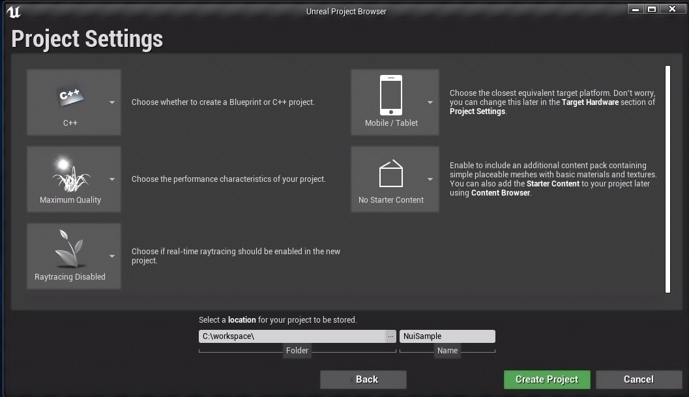<br>
</p>

3. Delete all the Labels except **Player Start** from the World.

<p align="center">
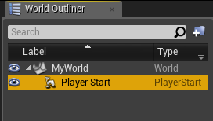<br>
</p>

4. Set **Player Location**, **Rotation** and **Scale** values as in the screenshot below.

<p align="center">
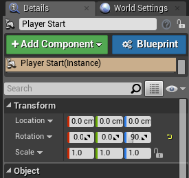<br>
</p>

5. Save the current World.

<p align="center">
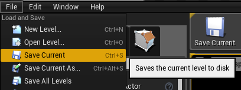<br>
</p>

6. Select **Edit → Project Settings → Maps & Modes:**

    6.1. Set your World as **Editor Startup Map** and **Game Default Map**.

	<p align="center">
	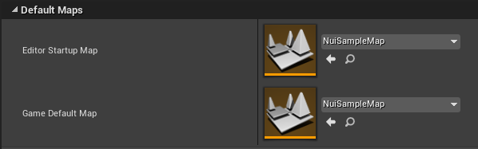<br>
	</p>

    6.2. Set **Default GameMode**.

	<p align="center">
	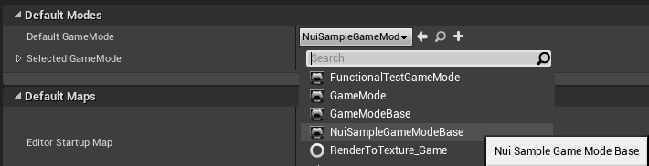<br>
	</p>

7. Select **Edit → Project Settings → Platforms → Android**, press **Configure Now** and **Accept SDK License**,  fill the **Android Package Name** field.

<p align="center">
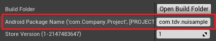<br>
</p>

8. Set up your project (as it described in [Setting up your project](#setting-up-your-project)).

9. Follow the steps below to make your application process the **Go Back** event:

    9.1. Open **Level Blueprint** for the current **Level** (**Blueprints → Open Level Blueprint**).

	<p align="center">
	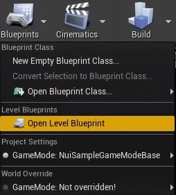<br>
	</p>

    9.2 Add the following **Blueprint nodes** (click the right mouse button to open the collection):

    * **Android Back**

	<p align="center">
	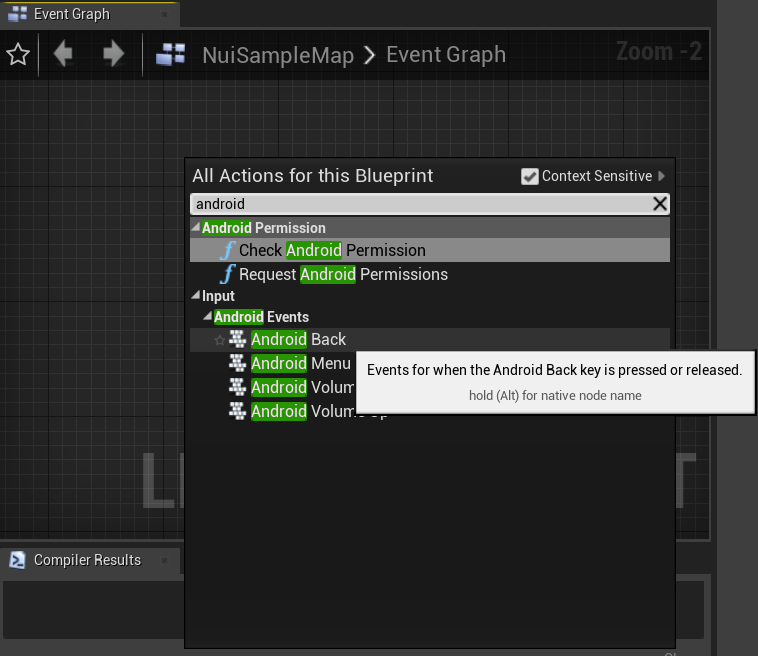<br>
	</p>

    * **Quit Game**

	<p align="center">
	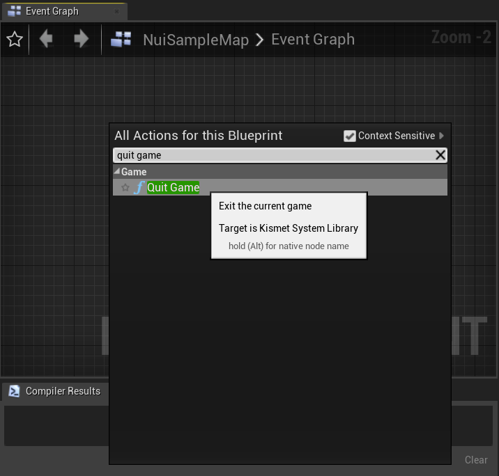<br>
	</p>

    9.3. Add connections and select **Quit Game** → **Quit Preference** (**Quit** to quit or **Background** to hide an application).

	<p align="center">
	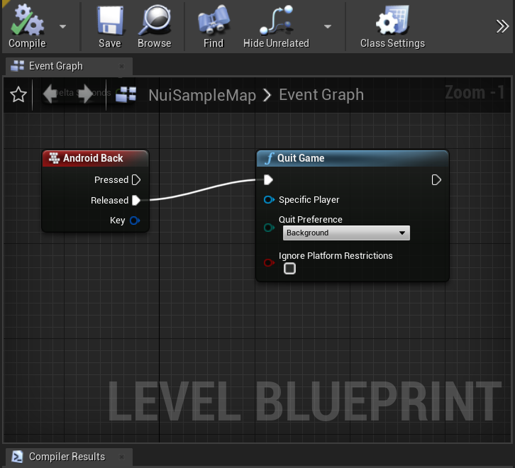<br>
	</p>

    9.4. Click the **Compile** button.

10. Open **Visual Studio** for writing C++ code.

<p align="center">
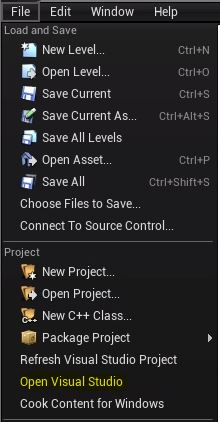<br>
</p>

11. Files in the **Unreal Projects/{ProjectName}/Source/{ProjectName}** directory should have the following content:

   11.1. `NuiSample.Build.cs`:

```cpp
using UnrealBuildTool;

public class NuiSample : ModuleRules
{
	public NuiSample(ReadOnlyTargetRules Target) : base(Target)
	{
		PCHUsage = PCHUsageMode.UseExplicitOrSharedPCHs;
	
		PublicDependencyModuleNames.AddRange(new string[] { "Core", "CoreUObject", "Engine", "InputCore" });

		PrivateDependencyModuleNames.AddRange(new string[] { "NuitrackModule" });
	}
}
```


   11.2. `NuiSample.h`:

```cpp
#pragma once

#include <iostream>
#include <vector>

#include "nuitrack/Nuitrack.h"
#include "nuitrack/modules/SkeletonTracker.h"
#include "nuitrack/types/Skeleton.h"
#include "nuitrack/types/SkeletonData.h"
```


   11.3. `NuiSample.cpp`:

```cpp
#include "NuiSample.h"
#include "Modules/ModuleManager.h"

IMPLEMENT_PRIMARY_GAME_MODULE( FDefaultGameModuleImpl, NuiSample, "NuiSample" );
```


   11.4. `NuiSampleGameModeBase.h`:

```cpp
#pragma once

#include "NuiSample.h"
#include "GameFramework/GameModeBase.h"
#include "NuiSampleGameModeBase.generated.h"

using tdv::nuitrack::SkeletonTracker;
using tdv::nuitrack::SkeletonData;
using tdv::nuitrack::Joint;
using tdv::nuitrack::Vector3;

UCLASS()
class NUISAMPLE_API ANuiSampleGameModeBase : public AGameModeBase
{
	GENERATED_BODY()

	UWorld* World;

	ANuiSampleGameModeBase();

	void Tick(float dt) override;
	void BeginPlay() override;
	void BeginDestroy() override;

	SkeletonTracker::Ptr skeletonTracker;

	void OnSkeletonUpdate(SkeletonData::Ptr userSkeletons);
	void DrawSkeleton(int skeleton_index, std::vector<Joint> joints);
	void DrawBone(Joint j1, Joint j2);

	static FVector RealToPosition(Vector3 real);
};
```


   11.5. `NuiSampleGameModeBase.cpp`:

```cpp
#include "NuiSampleGameModeBase.h"
#include "DrawDebugHelpers.h"

using tdv::nuitrack::Nuitrack;
using tdv::nuitrack::JointType;

ANuiSampleGameModeBase::ANuiSampleGameModeBase()
{
	this->PrimaryActorTick.bCanEverTick = true;
}

void ANuiSampleGameModeBase::Tick(float dt)
{
	Nuitrack::update();
}

void ANuiSampleGameModeBase::BeginPlay()
{
	Super::BeginPlay();

	UE_LOG(LogTemp, Warning, TEXT("ANuiSampleGameModeBase::BeginPlay()"));

	World = GetWorld();

	if (World)
	{
		UE_LOG(LogTemp, Warning, TEXT("Nuitrack::init() CALLING..."));
		Nuitrack::init();

		UE_LOG(LogTemp, Warning, TEXT("SkeletonTracker::create() CALLING..."));
		skeletonTracker = SkeletonTracker::create();

		UE_LOG(LogTemp, Warning, TEXT(
			"skeletonTracker->connectOnUpdate() CALLING..."));
		skeletonTracker->connectOnUpdate(
			std::bind(&ANuiSampleGameModeBase::OnSkeletonUpdate,
				this, std::placeholders::_1));

		UE_LOG(LogTemp, Warning, TEXT("Nuitrack::run() CALLING..."));
		Nuitrack::run();
	}
	else
	{
		UE_LOG(LogTemp, Error, TEXT("NULL WORLD"));
	}
}

void ANuiSampleGameModeBase::BeginDestroy()
{
	Super::BeginDestroy();
	Nuitrack::release();
}

void ANuiSampleGameModeBase::OnSkeletonUpdate(SkeletonData::Ptr userSkeletons)
{
	auto skeletons = userSkeletons->getSkeletons();

	FlushPersistentDebugLines(World);

	if (!skeletons.empty())
	{
		for (auto skeleton : skeletons)
		{
			DrawSkeleton(skeleton.id, skeleton.joints);
		}
	}
}

void ANuiSampleGameModeBase::DrawSkeleton(int skeleton_index, std::vector<Joint> joints)
{
	if (joints.empty())
		return;

	DrawBone(joints[JointType::JOINT_HEAD], joints[JointType::JOINT_NECK]);
	DrawBone(joints[JointType::JOINT_NECK], joints[JointType::JOINT_TORSO]);
	DrawBone(joints[JointType::JOINT_RIGHT_SHOULDER], joints[JointType::JOINT_LEFT_SHOULDER]);
	DrawBone(joints[JointType::JOINT_WAIST], joints[JointType::JOINT_LEFT_HIP]);
	DrawBone(joints[JointType::JOINT_WAIST], joints[JointType::JOINT_RIGHT_HIP]);
	DrawBone(joints[JointType::JOINT_TORSO], joints[JointType::JOINT_WAIST]);
	DrawBone(joints[JointType::JOINT_LEFT_SHOULDER], joints[JointType::JOINT_LEFT_ELBOW]);
	DrawBone(joints[JointType::JOINT_LEFT_ELBOW], joints[JointType::JOINT_LEFT_WRIST]);
	DrawBone(joints[JointType::JOINT_RIGHT_SHOULDER], joints[JointType::JOINT_RIGHT_ELBOW]);
	DrawBone(joints[JointType::JOINT_RIGHT_ELBOW], joints[JointType::JOINT_RIGHT_WRIST]);
	DrawBone(joints[JointType::JOINT_RIGHT_HIP], joints[JointType::JOINT_RIGHT_KNEE]);
	DrawBone(joints[JointType::JOINT_LEFT_HIP], joints[JointType::JOINT_LEFT_KNEE]);
	DrawBone(joints[JointType::JOINT_RIGHT_KNEE], joints[JointType::JOINT_RIGHT_ANKLE]);
	DrawBone(joints[JointType::JOINT_LEFT_KNEE], joints[JointType::JOINT_LEFT_ANKLE]);
}

void ANuiSampleGameModeBase::DrawBone(Joint j1, Joint j2)
{
	DrawDebugLine(World, RealToPosition(j1.real), RealToPosition(j2.real),
		FColor::MakeRedToGreenColorFromScalar((j1.confidence + j2.confidence) * 0.5),
		true, -1, 0, 4);
}

FVector ANuiSampleGameModeBase::RealToPosition(Vector3 real)
{
	return FVector(-real.x, real.z, real.y) * 0.1f;
}
```

12. To build your project, select **File → Package Project → Android**. 

## Integrating Nuitrack with an Existing Unreal Engine Project

### Setting up your Project

1. Copy the **NuitrackPlugin** folder from **{SDK Root}/UnrealEngine** to the **Plugins** folder of a project (create the **Plugins** folder if does not exist). After that, restart Unreal Editor.

    1.1. If the target architecture of your app is *arm64-v8a*, you need to change the path to the Nuitrack libraries in `Plugins/NuitrackPlugin/Source/NuitrackModule/NuitrackModule.Build.cs`:

```cpp
else if (Target.Platform == UnrealTargetPlatform.Android)
{
	 ...
	 LibraryPath += "android-arm64/";
	 ...
}
```

2. Generate Visual Studio project files by right-clicking an **.uproject file**.

<p align="center">
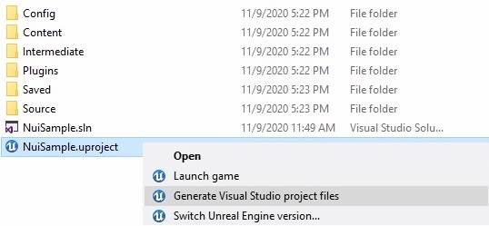<br>
</p>

3. Add Extra Permissions in **Edit → Project Settings → Platforms → Android → Advanced APK Packaging**:

```cpp
android.permission.BLUETOOTH
android.permission.BLUETOOTH_ADMIN
android.permission.READ_EXTERNAL_STORAGE
android.permission.WRITE_EXTERNAL_STORAGE
android.permission.INTERNET
android.permission.CAMERA
```

<p align="center">
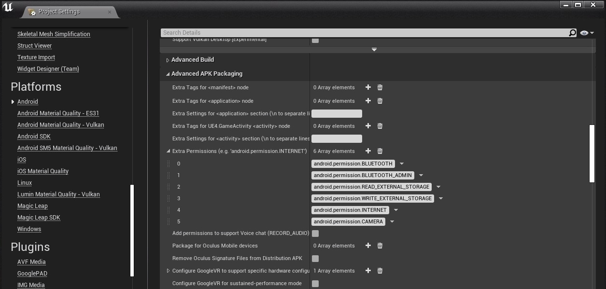<br>
</p>

4. Add **NuitrackModule** to the file with project dependencies `Build.cs` (`Unreal Projects/{ProjectName}/Source/{ProjectName}/{ProjectName}.Build.cs`):

```cpp
PrivateDependencyModuleNames.AddRange(new string[] { "NuitrackModule" });
```

### Linking Nuitrack

You can see an example of using the methods described in `Unreal Projects/{ProjectName}/Source/{ProjectName}/NuiSampleGameModeBase.cpp` (see the section [Creating a New Project with Nuitrack](#creating-a-new-project-with-nuitrack), p. 11.5). 

1. To initialize Nuitrack, create a skeleton tracker and subscribe to an event, you need to add the following code, for example, to the `BeginPlay` method of the `GameMode` class:

```cpp
Nuitrack::init();
SkeletonTracker::Ptr skeletonTracker = SkeletonTracker::create();
skeletonTracker->connectOnUpdate(std::bind(&ANuiSampleGameModeBase::OnSkeletonUpdate, this, std::placeholders::_1));
Nuitrack::run();
```

2. To terminate Nuitrack, call the `release` method. You can add it to the `BeginDestroy` method of the `GameMode` class:

```cpp
Nuitrack::release();
```

3. To raise events with new data from modules, call the `update` method. You can add it to the `Tick` method of the `GameMode` class:

```cpp
Nuitrack::update();
```

4. Skeleton tracking data will be available inside the `OnSkeletonUpdate` method that was subscribed to the `OnUpdate` event from `SkeletonTracker`:

```cpp
void ANuiSampleGameModeBase::OnSkeletonUpdate(SkeletonData::Ptr userSkeletons)
{
  auto skeletons = userSkeletons->getSkeletons();
  ...
}
```