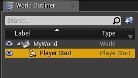
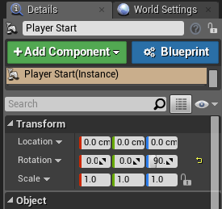
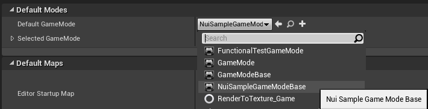
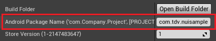

# Nuitrack Usage in UE 4.18 Project (Android Only)
## Setting up your Project

1. Copy the **<Nuitrack>** folder from **{SDK Root}/UnrealEngine** to a project **Source** folder.
2. Copy the **<Nuitrack>** folder from **{SDK Root}** to a project **Source/Nuitrack** folder.
3. Generate Visual Studio project files by right-clicking an **.uproject file**.

<p align="center">
<br>
</p>

4. Add Extra Permissions in **Edit → Project Settings → Platforms → Android → Advanced APKPackaging**:

```cpp
android.permission.BLUETOOTH
android.permission.BLUETOOTH_ADMIN
android.permission.READ_EXTERNAL_STORAGE
android.permission.WRITE_EXTERNAL_STORAGE
android.permission.INTERNET
```

<p align="center">
<br>
</p>

5. Add Nuitrack libraries and headers to the `Build.cs` project dependencies file **(Games/{ProjectName}/Source/{ProjectName}/{ProjectName}.Build.cs)**:

```cpp
PrivateDependencyModuleNames.AddRange(new string[] { "Nuitrack" });
PrivateIncludePaths.AddRange(new string[] { ModuleDirectory + "Nuitrack/Nuitrack/include" });
```

## Nuitrack Usage

1. To initialize Nuitrack, create a skeleton tracker and subscribe to an event, you need to add the following code (for example, to the `BeginPlay` method of the `GameMode` class):

```cpp
Nuitrack::init();
SkeletonTracker::Ptr skeletonTracker = SkeletonTracker::create();
skeletonTracker->connectOnUpdate(std::bind(&ANuiSampleGameModeBase::OnSkeletonUpdate,
this, std::placeholders::_1));
Nuitrack::run();
```

2. To terminate Nuitrack, call the `release` method (you can add it to the `BeginDestroy` method of the `GameMode` class):

```cpp
Nuitrack::release();
```

3. To raise events with new data from modules, call the `update` method (you can add it to the `Tick` method of the `GameMode` class):

```cpp
Nuitrack::update();
```

4. Skeleton tracking data will be available inside the `OnSkeletonUpdate` method (that was subscribed to the `OnUpdate` event from `SkeletonTracker`):

```cpp
void ANuiSampleGameModeBase::OnSkeletonUpdate(SkeletonData::Ptr userSkeletons)
{
  auto skeletons = userSkeletons->getSkeletons();
  ...
}
```

## Creating Nuitrack Sample Project in Unreal Engine 4.18 (Android Only)

1. Download Unreal Engine 4.18, run it and install CodeWorks for Android.
2. Create a New Project: **C++ → Basic Code**. Select the following settings for your project:
      * Class of Hardware: Mobile / Tablet;
      * Graphical Level: Maximum Quality;
      * Additional Content: No Starter Content.

<p align="center">
<br>
</p>

3. Delete all the Labels except **Player Start** from the World.

<p align="center">
<br>
</p>

4. Set **Player Location**, **Rotation** and **Scale** values as in the screenshot below.

<p align="center">
<br>
</p>

5. Save the current World.

<p align="center">
<br>
</p>

6. Select **Edit → Project Settings → Maps & Modes:**

6.1. Set your World as **Editor Startup Map** and **Game Default Map**.

<p align="center">
<br>
</p>

6.2. Set **Default GameMode**.

<p align="center">
<br>
</p>

7. Select **Edit → Project Settings → Platforms → Android**, press **Configure Now** and **Accept SDK License**,  fill the **Android Package Name** field.

<p align="center">
<br>
</p>

8. Set up your project (as it was described in **Integrating Nuitrack with Unreal Engine 4.18 Project (Android Only)**).

9. Open **Visual Studio** for writing C++ code.

<p align="center">
<br>
</p>

10. Files in the **Unreal Projects\{ProjectName}\Source\{ProjectName}** directory should have the following content:

10.1. `NuiSample.Build.cs`:

```cpp
using UnrealBuildTool;

public class NuiSample : ModuleRules
{
	public NuiSample(ReadOnlyTargetRules Target) : base(Target)
	{
		PCHUsage = PCHUsageMode.UseExplicitOrSharedPCHs;

		PublicDependencyModuleNames.AddRange(new string[] { "Core", "CoreUObject", "Engine", "InputCore" });

		PrivateDependencyModuleNames.AddRange(new string[] { "Nuitrack" });

		PrivateIncludePaths.AddRange(new string[] { ModuleDirectory +
		"Nuitrack/Nuitrack/include" });
	}
}
```


10.2. `NuiSample.h`:

```cpp
#pragma once

#include "Engine.h"

#include <iostream>
#include <vector>

using namespace std;

#include "nuitrack/Nuitrack.h"
#include "nuitrack/modules/SkeletonTracker.h"
#include "nuitrack/types/Skeleton.h"
#include "nuitrack/types/SkeletonData.h"

using namespace tdv::nuitrack;
```


10.3. `NuiSample.cpp`:

```cpp
#include "NuiSample.h"

IMPLEMENT_PRIMARY_GAME_MODULE( FDefaultGameModuleImpl, NuiSample, "NuiSample" );
```


10.4. `NuiSampleGameModeBase.h`:

```cpp
#pragma once

#include "NuiSample.h"
#include "GameFramework/GameModeBase.h"
#include "NuiSampleGameModeBase.generated.h"

UCLASS()
class NUISAMPLE_API ANuiSampleGameModeBase : public AGameModeBase
{
    GENERATED_BODY()

    UWorld* World;

    ANuiSampleGameModeBase();

    void Tick(float dt) override;
    void BeginPlay() override;
    void BeginDestroy() override;

    SkeletonTracker::Ptr skeletonTracker;

    void OnSkeletonUpdate(SkeletonData::Ptr userSkeletons);
    void DrawSkeleton(int skeleton_index, vector<Joint> joints);
    void DrawBone(Joint j1, Joint j2);

    static FVector RealToPosition(Vector3 real);
};
```


10.5. `NuiSampleGameModeBase.cpp`:

```cpp
#include "NuiSampleGameModeBase.h"

ANuiSampleGameModeBase::ANuiSampleGameModeBase()
{
	this->PrimaryActorTick.bCanEverTick = true;
}

void ANuiSampleGameModeBase::Tick(float dt)
{
	Nuitrack::update();
}

void ANuiSampleGameModeBase::BeginPlay()
{
	Super::BeginPlay();

	UE_LOG(LogTemp, Warning, TEXT("ANuiSampleGameModeBase::BeginPlay()"));

	World = GetWorld();

	if (World)
	{
		UE_LOG(LogTemp, Warning, TEXT("Nuitrack::init() CALLING..."));
		Nuitrack::init();

		UE_LOG(LogTemp, Warning, TEXT("SkeletonTracker::create() CALLING..."));
		skeletonTracker = SkeletonTracker::create();

		UE_LOG(LogTemp, Warning, TEXT(
					"skeletonTracker->connectOnUpdate() CALLING..."));
		skeletonTracker->connectOnUpdate(
					std::bind(&ANuiSampleGameModeBase::OnSkeletonUpdate,
					this, std::placeholders::_1));

		UE_LOG(LogTemp, Warning, TEXT("Nuitrack::run() CALLING..."));
		Nuitrack::run();
	}
	else
	{
        UE_LOG(LogTemp, Error, TEXT("NULL WORLD"));
	}
}

void ANuiSampleGameModeBase::BeginDestroy()
{
	Super::BeginDestroy();
	Nuitrack::release();
}

void ANuiSampleGameModeBase::OnSkeletonUpdate(SkeletonData::Ptr userSkeletons)
{
	auto skeletons = userSkeletons->getSkeletons();

	FlushPersistentDebugLines(World);

	if (!skeletons.empty())
	{
        for (auto skeleton : skeletons)
        {
		DrawSkeleton(skeleton.id, skeleton.joints);
        }
    }
}

void ANuiSampleGameModeBase::DrawSkeleton(int skeleton_index, vector<Joint> joints)
{
	if (joints.empty())
        	return;

	DrawBone(joints[JOINT_HEAD], joints[JOINT_NECK]);
	DrawBone(joints[JOINT_NECK], joints[JOINT_TORSO]);
	DrawBone(joints[JOINT_RIGHT_SHOULDER], joints[JOINT_LEFT_SHOULDER]);
	DrawBone(joints[JOINT_WAIST], joints[JOINT_LEFT_HIP]);
	DrawBone(joints[JOINT_WAIST], joints[JOINT_RIGHT_HIP]);
	DrawBone(joints[JOINT_TORSO], joints[JOINT_WAIST]);
	DrawBone(joints[JOINT_LEFT_SHOULDER], joints[JOINT_LEFT_ELBOW]);
	DrawBone(joints[JOINT_LEFT_ELBOW], joints[JOINT_LEFT_WRIST]);
	DrawBone(joints[JOINT_RIGHT_SHOULDER], joints[JOINT_RIGHT_ELBOW]);
	DrawBone(joints[JOINT_RIGHT_ELBOW], joints[JOINT_RIGHT_WRIST]);
	DrawBone(joints[JOINT_RIGHT_HIP], joints[JOINT_RIGHT_KNEE]);
	DrawBone(joints[JOINT_LEFT_HIP], joints[JOINT_LEFT_KNEE]);
	DrawBone(joints[JOINT_RIGHT_KNEE], joints[JOINT_RIGHT_ANKLE]);
	DrawBone(joints[JOINT_LEFT_KNEE], joints[JOINT_LEFT_ANKLE]);
}

void ANuiSampleGameModeBase::DrawBone(Joint j1, Joint j2)
{
	DrawDebugLine(World, RealToPosition(j1.real), RealToPosition(j2.real),
		FColor::MakeRedToGreenColorFromScalar((j1.confidence + j2.confidence)*0.5),
		true, -1, 0, 4);
}

FVector ANuiSampleGameModeBase::RealToPosition(Vector3 real)
{
	return FVector(-real.x, real.z, real.y)*0.1f;
}
```

11. To build your project, select **File → Package Project → Android**. 
