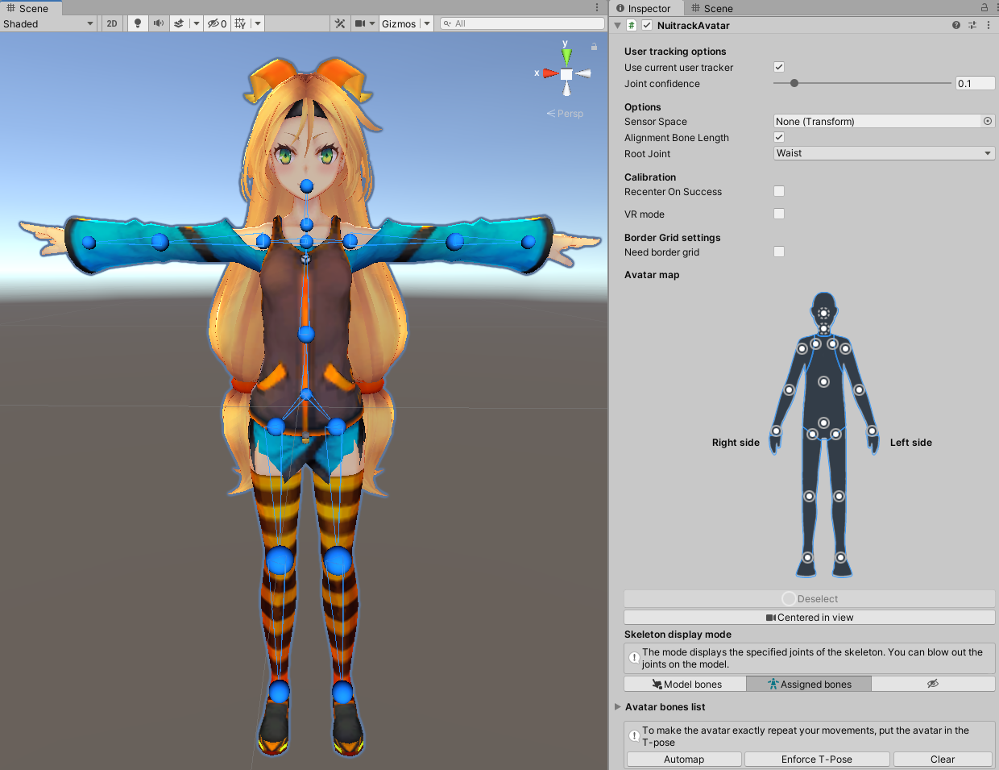
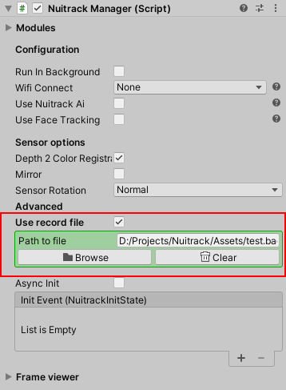

# How to make a VR App with Nuitrack

So, my friend, now that you visited this page means that you're interested in developing a mobile VR app with full body tracking. You think that it's too complicated and takes a long time? Not really! We'll share with you the essentials you need to know in order to become a real master in mobile VR development.

## What do we need?

First of all, the hardware, which is:  

* [**TVico**](https://tvico.io/);
* a rather powerful **Android smartphone** with at least 5" screen for comfortable perception;
* a suitable **VR headset**. To make it perfect, you can use the Gear VR or Google Cardboard set.

_**Note:** If you use TVico, you have to connect your Android smartphone to TVico via Wi-Fi. See the detailed information in our [TVico User Guide](TVico_User_Guide.md#wireless-case). You can also use other Android device (with one of supported USB sensors for Android platform (see the full list at [Nuitrack website](https://nuitrack.com/#sensors)) provided that you installed [TVico.apk](/Platforms/TVico.apk) on this device and connected your Android smartphone to this device via Wi-Fi._

Secondly, the software, which is:  

* **Unity** (2020.3.1 or higher)
* **Development environment** (out-of-the-box Visual Studio would be enough)
* [**VicoVR**](https://play.google.com/store/apps/details?id=com.vicovr.manager) app installed on your smartphone (VicoVR app is a client app, which allows you to connect to TVico wirelessly)
* [**TVico**](/Platforms/TVico.apk) app installed on TVico device (in case of using the TVico sensor)
* **Nuitrack SDK**, which is the most interesting thing here

## How does it work?

With the help of a color camera and a depth module, the sensor generates data in the form of a regular RGB image and a depth matrix, that is, the distances to each point of the sensor view. The depth matrix can be represented as an image, where the colors from red to blue show the conditional transition of depth layers from near to far.

<p align="center">
<br>
</p>

_**Cheat Sheet:** Place the sensor so that your full body is in the frame (preferably with your hands up). Clear the area around you so that you won't hit or hurt anyone (including yourself)._ [Learn more about how to prepare a workspace](https://github.com/3DiVi/nuitrack-sdk/blob/master/doc/General_preparations.md).

Then, this data is transmitted wirelessly to the smartphone, where Nuitrack comes into play. With the help of exclusive algorithms, Nuitrack determines the key points of your body and displays a graphic skeleton in the form of a set of 3-component vectors with 0 at the sensor point. Nuitrack can recognize up to 19 skeleton joints! As a bonus, you'll get a lot of additional data that can be used at your own discretion, namely:    

* Color Image – `nuitrack.ColorSensor`;
* Depth Matrix – `nuitrack.DepthSensor`;
* Users – `nuitrack.UserTracker`;

For **Color**, **Depth** and **Users** frames, methods are available-extensions of the conversion to Unity textures (`.ToTexture()`, `.ToRenderTexture()`, `.ToTexture2D()` from `NuitrackSDK.Frame` namespace)

The data of all recognized users is available in `NuitrackManager.Users` and contains the following data set (`UserData` from `NuitrackSDK` namespace):

* Skeleton – `UserData.SkeletonData`;
  * Joint – `UserData.SkeletonData.Joint`;
* Left Hand & Right Hand – `UserData.SkeletonData.Hand`;
* GestureType – `nuitrack.GestureType`;
* Face – `nuitrack.Face`;
* Methods for getting a Unity texture with this user's segment – `SegmentTexture2D` / `SegmentRenderTexture` / `SegmentTexture`

Don't worry, all these operations are performed automatically, just take it and use it.

## There's all kinds of pitfalls...

First of all, we should note one important thing about VR apps in particular. Many people think that it's possible to achieve a full immersion with the help of VR and a developer can create incredibly epic scenes to surprise the user. However, there are some pitfalls. Many features familiar to the developers of PC games should be avoided in VR, namely:     

* don't shake the camera in the game, for example, to create a high speed or explosion effect because this will immediately cause nausea;
* don't move the camera in a world at different speed and direction, it will also make a user dizzy;
* make sure that direction of rotation of the camera and the user's head are the same, otherwise, you'll drive the user's vestibular system crazy (after all, a VR game is not an astronaut training);
* keep in mind that the control is quite unusual to a user since he/she has to use his/her hands, feet and eyes for movements. Create an interface and gameplay based on this fact;
* place active elements of the interface and game world in accessible area around the user;
* make sure that buttons are big enough, otherwise, it'll be difficult to reach them;
* pay attention to interactive elements – user's hands and feet should not sink into the geometry of other objects;
* remember that the sensor viewing angle is limited. Don't force the user to leave the scope in the game;
* since the field of view is much narrower than the surrounding area, take care of the hints, which will help the user to pay attention to key moments in your game;
* when developing the applications with body tracking, make sure that the user is facing the sensor so that all body parts are within the field of view.

## Let's get to the point!    

First of all, we need to integrate Nuitrack into the Unity project, which is quite easy. In Unity, select: **Assets → Import package → Custom Package... → NuitrackSDK.unitypackage → Import**.

_**Note:** Nuitrack does not track the rotation of the head joint due to hardware restrictions, so you have to use the **GoogleVR** plugin for regular headsets or **OculusVR** for the GearVR platform._

**NuitrackSDK** already has blanks for implementing user handlers.
1. `TrackerUser`, if you need to make a component that will be controlled by the current user (determined by the queue rule) or by a given **ID**. Inherit your class from `TrackedUser` and override the `Process(UserData user)` method to implement a handler for this user.

```cs
public class CustomAvatar : TrackedUser
{
    protected override void Process(UserData user)
    {
        Debug.Log("User ID: " + user.ID);
        ...
    }
}
```

2. Get the position, orientation and screen position of the Torso joint. All values are converted to the metric system of calculation.

```cs
public class CustomAvatar : TrackedUser
{
    protected override void Process(UserData user)
    {
        UserData.SkeletonData.Joint joint = user.Skeleton.GetJoint(nuitrack.JointType.Torso);

        Vector3 position = joint.Position;
        Quaternion rotation = joint.Rotation;

        Vector2 screenPosition = joint.RelativePosition(Screen.width, Screen.height);
    }
}
```  

3. There is the `NuitrackUtils` helper class, which helps to convert the data retrieved from Nuitrack nice and easy. It contains a description of extension methods, for example, to get a parent joint `GetParent`, a list of child joints `GetChilds`, and much more.

## Not a role model

A few words about today's hero and example considered in this article – the game **THEFT** (you can download it in [Google Play](https://play.google.com/store/apps/details?id=com.vicovr.THEFT)). THEFT is a first-person runner with elements of an action. In the story, a player runs from police on a hoverboard (a levitating board) after robbery along the narrow streets of the city. The player has the following game features:

1. move to the left or to the right by tilting his/her body;
2. overturn objects in the game world with his/her hands;
3. speed up by pressing the foot;
4. shoot from the wrist gadget to scatter different objects (this will detain the police) 

We can single out a couple of cases of skeleton usage, namely, direct interaction with the world at points 1 and 2 and intermedium interaction at points 3 and 4. By direct interaction we mean the case when, for example, a character can touch the game object with his/her hand.

<p align="center">
<br>
</p>

**Interactivity or Beauty?**  
*We can use either direct or indirect mapping. In the first case, the user's movement is completely mapped to the game character, and in the second case, it only starts the animation, which looks like the required movement. The latter option may be useful if you want to prevent incorrect behavior of a character or keep a user from pushing certain boundaries.*

## Here's Johnny! 

Let's start with the scene settings. Prepare the scene for using Nuitrack in one click, to do this, click: **Main menu** -> **Nuitrack** -> **Prepare the scene**. The necessary components will be added to the scene. When you run the scene, **NuitrackScripts** automatically marked as **DontDestroyOnLoad**, so you don't have to worry about it when moving to another scene in your game.

<p align="center">
<br>
</p>

Pay attention to the settings of the `NuitrackManager` script – you can activate or deactivate the specific Nuitrack components in your project.

<p align="center">
<br>
</p>

There is a special class called `NuitrackAvatar` in Nuitrack SDK, which is used to manage skeleton behaviour. The `NuitrackAvatar` component has the functions of automapping the model and tools for editing the binding of joints to Transform, as well as has the function of equalizing the length of bones, support for VR and safe grid scenarios. This component is suitable for most tasks, and is easy to configure.

<p align="center">
<br>
</p>

**Spoiler alert:** Nuitrack detects 19 joints, however, you'll find 25 joint types in `nuitrack.JointType`.

We need to take into account the initial rotation offset in order to align your skeleton and Nuitrack skeleton, because in the same position your character's joints and Nuitrack joints can have different rotation relative to the parent object, which can cause incidents as shown in the first picture.

<p align="center">
<br>
</p>

_**Cheat Sheet:** **T-pose** is a default stance, in which joint rotation angle relative to a parent object equals 0. Put your character in a T-pose to align the skeletons._

<p align="center">
<br>
</p>

The scripts `CalibrationHandler` and `CalibrationInfo` are used for calibration and attached to the **NuitrackScripts** object. We recommend to perform calibration at the start of the game so that you know that a user is standing in a specified position. 
Note that any pose can be used for calibration (the default assignment is T-Pose). You can create your own custom pose through the constructor or save the Runtime pose through the `PoseDetector` component. 

<p align="center">
<br>
</p>

## Hey, look at me! Do as I do!

Let's start with an easy one and animate our character's hands. Remember that we use direct mapping for hands. Let's modify the `RiggedAvatar` class and sort it all out. 

**Piece of advice**  
*Specify the `System.Serializable` attribute to display the class as a field and make it editable in Unity.*

```cs
[System.Serializable]
public class JointGameObject
{
	public nuitrack.JointType jointType; // Joint type
	public Transform transform; // Character's joint transform 
 
	public Quaternion offset; // Initial rotation offset 
}
```


```cs
public class RiggedAvatar : TrackedUser
{
    public JointGameObject[] jointPers;

    void Start()
    {
        foreach (JointGameObject jointGO in jointPers)
            jointGO.offset = jointGO.transform.rotation;
    }

    protected override void Process(UserData user)
    {
        if (user.Skeleton != null)
        {
            foreach (JointGameObject jointGO in jointPers)
            {
                UserData.SkeletonData.Joint joint = user.Skeleton.GetJoint(jointGO.jointType);
                jointGO.transform.rotation= CalibrationInfo.SensorOrientation * jointGO.offset * joint.Rotation;
            }
        }
    }
}
```

The `Start` method is called when loading the scene (learn more about execution order of event functions [here](https://docs.unity3d.com/Manual/ExecutionOrder.html)). Here, we calculate the initial rotation offset for the character's joints. 

In `Process`, we check the data of the detected user and implement character management. 
Nuitrack recognizes **up to 6 users**, and `NuitrackManager.Users.Current` returns `null`, if a user in front of the sensor wasn't recognized, or the user, who entered the frame first in order of priority (i.e., when one user leaves the frame, the second user, who entered the frame, becomes the current user, no matter when he/she came).

_**Cheat Sheet:** `CalibrationInfo.SensorOrientation` corrects the vertical tilt of your sensor, which allows to get the correct location of a skeleton, no matter what height you place your sensor at._

## Real heroes always go around

There have always been urban legends about indirect mapping and each developer came up with his own... Implementing this skeleton behavior is quite a specific task, as well as its primary cause.  In some cases, you may only need the position or speed of a certain joint, and in THEFT, a user should perform a certain gesture to activate the animation (push). 

In this scenario, you can take the easiest but not smartest way and add an interlayer in the form of a gesture analyzer. To do this, you have to create a separate half of an imaginary skeleton, which accepts the movements of user's legs by direct mapping. 

<p align="center">
<br>
</p>

**SphereCollider** and **RigidBody** are attached to the knee joint (marked as a red circle in the image), as well as several **BoxColliders** flagged as **isTrigger**, which are used to process the event of entering of the specific point to the specified area (marked as green rectangles in the image). 

<p align="center">
<br>
</p>

From this point, it'll get easier – the objects flagged as **isTrigger** have the `ObjectRegistration` script attached, which passes the information about presence of a certain joint in a specified area and its own identifier to the `ActionManager` script. The managing script writes a message chain and compares it with a template to activate the animation. There are several patterns, for example, when a user pushes himself forward with a leg swing, then a `strong push` event occurs. We won't dwell on the implementation as each case is individual. 

## Sleight of hand and no fraud 

Nothing is perfect, and Nuitrack is not an exception... Position of detected joints is very precise, however, the depth matrix resolution is restricted due to the limitations of wireless data transfer, which may cause problems with a small range of motion. It can cause much inconvenience when it comes to the implementation of aiming in your game, when objects are far away from the player. You can help the user by implementing auto aiming, when an object comes into the target sight automatically. 

<p align="center">
<br>
</p>

In practice, three versions of the aiming system were developed:

1. **With a look** – the most accurate one, but not intuitive.
2. **By hand using only the current skeleton** – the most inaccurate one, but intuitive.
3. **Mixed** – the mean point between the direction of user's sight and the position of the hand is determined.

The latter approach is based on the fact that a user usually looks at the object at which he is aiming, so the offset from the sight is imperceptible and the aiming looks natural.

To improve the accuracy, you can use the real position of the joints instead of joint positions of the game character. Think about modifying the `RiggedAvatar` script, which we discussed earlier – you can easily add another array of joints, which will be used for aiming.

_**Note:** Unify the control so that you can test your app from the editor. For Nuitrack methods, you can use the stubs, which simulate the skeleton behavior by pressing, for example, some key._ You can use pre - recorded files for testing _*.bag_ or _*.one_ by specifying the path to them in `NuitrackManager`. This can greatly simplify the development of some of the mechanics of your game or application.

<p align="center">
<br>
</p>

This is a basic example of a game created with Nuitrack. We can say that body control is a whole new field in development and implementation of a gameplay. There's content optimization and modification of settings ahead of us, but that's a different story.
